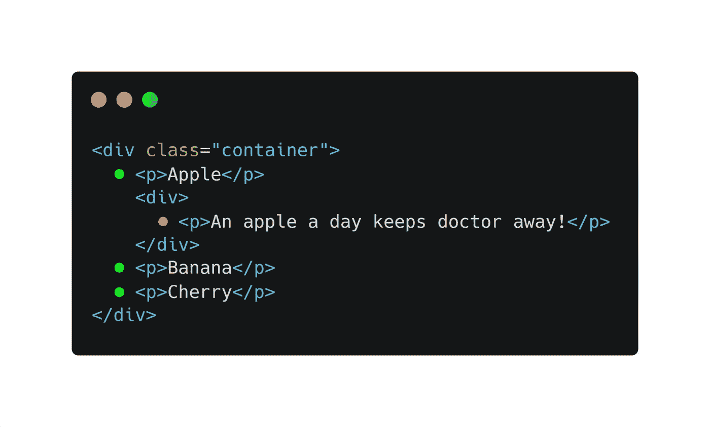
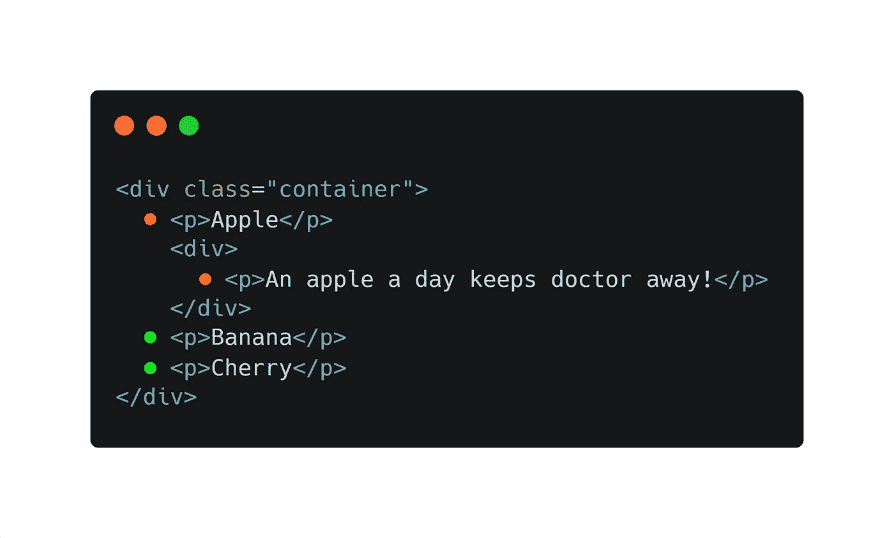

# 理解在 CSS 选择器中使用+、>和~符号

> 原文：<https://levelup.gitconnected.com/understanding-use-of-the-and-symbols-in-css-selectors-95552eb436f5>


马克斯·尼尔森在 [Unsplash](https://unsplash.com?utm_source=medium&utm_medium=referral) 上拍摄的照片

一个 CSS 选择器可以包含多个简单的选择器。在简单的选择器之间，我们可以包含一个组合子。

> 组合子解释了选择器之间的关系。

CSS 中有四种不同的组合子:

*   后代选择器(空格)
*   子选择器(>)
*   相邻兄弟选择器(+)
*   通用同级选择器(~)

让我们看看如何在 CSS 选择器中使用不同的符号(+、>和~)以及它们的区别。

让我们从一个 HTML 例子开始。

```
<div class="container">
  <p>Apple</p>
  <div>
    <p>An apple a day keeps doctor away!</p>
  </div>
  <p>Banana</p>
  <p>Cherry</p>
</div>
```

## **1。空间**

这是 CSS 中最常用的选择器之一。

```
div.container p {
 **font-size**: 20px;
}
```

在上面的代码中可以看到，div.container 和 p 之间有一个空格，它被称为**后代**选择器。它将针对容器 div 中的所有< p >标签。也就是说，所有的< p >元素都是任何深度的#container 的子元素。

## **2。>符号**

这被称为子选择器。CSS 规则将应用于特定元素的**直接**子元素。

```
div.container > p {
  **border-bottom**: 1px dashed black;
}
```



它将定位(在 HTML 图像中用绿点表示)所有的

标签，这些标签是容器

的直接子标签，但是子标签的子标签不会被选中(用红点表示)。

## **3。“+”符号**

这是**相邻兄弟选择器。**它选择指定元素的所有相邻兄弟元素。

兄弟元素必须有相同的父元素，**“相邻”**表示**“紧跟在”**之后”。

```
div + p {
  **background-color**: yellow;
}
```


在我们的例子中，它的目标是 Banana，因为

标签紧跟在

标签之后。

## 4.**“~”符号**

它是**通用兄弟选择器**，类似于相邻兄弟选择器。它选择所有与指定元素同级的下一个元素。

以下示例选择所有与< div >元素同级的**下一个**p>元素。

```
div ~ p {
  **background-color**: yellow;
}
```



它将针对香蕉和樱桃

标签。

我希望你喜欢这篇关于 CSS 组合子的复习。

喜欢我的文章吗？咖啡让我保持动力，给我买一杯吧！ :P

—阿尼基特·库代尔