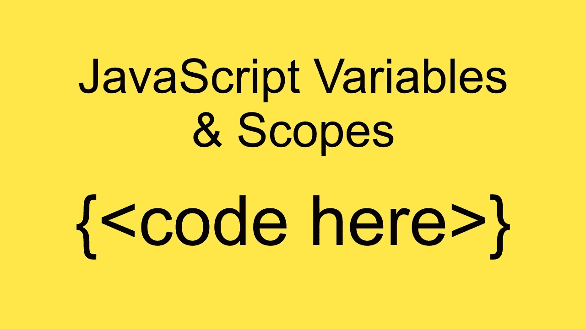
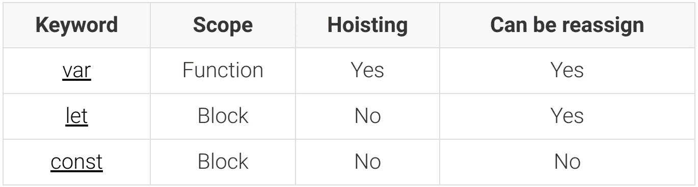

# 理解 JavaScript 中的变量、范围和提升

> 原文：<https://levelup.gitconnected.com/understanding-variables-scope-and-hoisting-in-javascript-93018bf29190>

## 更好的编程

## 我们来详细看看 var，Let 和 const。它们是如何工作的？他们的不同？以及为什么了解它们如此重要



变量是任何编程语言的基本块之一，每种语言定义我们如何声明变量并与变量交互的方式可以成就或毁灭一种编程语言。因此，任何开发人员都需要了解如何有效地处理变量、它们的规则和特性。在今天的教程中，我们将学习如何在 JavaScript 中声明、交互和作用域变量。我们将介绍新概念和重要的 JavaScript 关键字，如`var`、`let`和`const`。

# 声明变量

现在 JavaScript 有三个不同的关键字来声明一个变量，`var`、`let`和`const`。每一种都有自己的属性和特点。让我们先做一个三者的简单对比表，然后进入细节。



如果现在您不确定我们所说的范围、提升或任何其他属性是什么意思，请不要担心。接下来我们将详细介绍它们。

# 变量作用域

JavaScript 中的作用域指的是代码的上下文(或部分)，它决定了变量的可访问性(可见性)。在 JavaScript 中，我们有两种类型的作用域，**局部**和**全局**。尽管局部范围可能有不同的含义。

让我们通过给出一些作用域如何工作的例子来完成定义。假设您定义了一个变量`message`:

```
const message = 'Hello World'
console.log(message) // 'Hello World'
```

正如您所料，在`console.log`中使用的变量`message`将会存在，并具有值`Hello World`。毫无疑问，但是如果我稍微改变一下声明变量的地方，会发生什么呢？

```
if (true) {
    const message = 'Hello World'
}
console.log(message) // ReferenceError: message is not defined
```

Ups…看起来我们把它弄坏了，但是为什么？事情是这样的，`if`语句创建了一个本地**块作用域**，由于我们使用了`const`，该变量只为那个**块作用域**声明，不能从外部访问。

让我们再多谈谈块和函数作用域。

# 块范围

一个块基本上是一段代码(零个或多个语句),由一对花括号分隔，可以选择标记。

正如我们已经讨论过的，使用`let`和`const`允许我们定义存在于块范围内的变量。接下来，我们将通过使用不同的关键字生成新的范围来构建非常相似的示例:

```
const x1 = 1
{
    const x1 = 2
    console.log(x1) // 2
}
console.log(x1) // 1
```

让我们解释一下这个，因为它乍一看可能有点奇怪。在我们的外部作用域中，我们用值`1`定义变量`x1`。然后我们通过简单地使用花括号创建一个新的块范围，这很奇怪，但是在 JavaScript 中完全合法，在这个新的范围中，我们创建了一个新的变量(与外部范围中的变量分开)，也命名为`x1`。但是不要搞混了，这是一个全新的变量，只会在那个范围内可用。

同样的例子现在有一个命名的作用域:

```
const x2 = 1
myNewScope: { // Named scope
    const x2 = 2
    console.log(x2) // 2
}
console.log(x2) // 1
```

While 示例(**不运行下面的代码！！！！！！！！！！！！！！！！**)

```
const x3 = 1
while(x3 === 1) {
    const x3 = 2
    console.log(x3) // 2
}
console.log(x3) // Never executed
```

你能猜出那个代码有什么问题吗？如果你运行它会发生什么？…让我解释一下，外部作用域中声明的`x3`用于 while 比较`x3 === 1`，通常在 while 语句中，我可以给`x3`重新分配一个新值并退出循环，但是由于我们在块作用域中声明了一个新的`x3`，我们不能再从外部作用域中更改`x3`，因此 while 条件将始终计算为`true`，产生一个无限循环，这将挂起您的浏览器，或者如果您使用终端在 NodeJS 上运行它，将打印大量的`2`。

修复这段特殊的代码可能会很棘手，除非您实际重命名这两个变量中的任何一个。

到目前为止，在我们的例子中，我们使用了`const`，但是完全相同的行为会发生在`let`中。然而，我们在我们的对照表中看到，关键字`var`实际上是函数作用域，那么它对我们的例子意味着什么呢？嗯……让我们来看看:

```
var x4 = 1
{
    var x4 = 2
    console.log(x4) // 2
}
console.log(x4) // 2
```

太神奇了！即使我们在作用域内重新声明了`x4`,它也在内部作用域和外部作用域上将值更改为`2`。这是`let`、`const`和`var`之间最重要的区别之一，通常是面试问题的主题(以这样或那样的方式)。

# 功能范围

函数作用域在某种程度上也是块作用域，所以`let`和`const`的行为方式与我们之前的例子中的相同。然而，函数作用域也封装了用`var`声明的变量。但是让我们继续看我们的`xn`例子:

`const`或`let`示例:

```
const x5 = 1
function myFunction() {
    const x5 = 2
    console.log(x5) // 2
}
myFunction()
console.log(x5) // 1
```

正如我们所料，现在有了`var`

```
var x6 = 1
function myFunction() {
    var x6 = 2
    console.log(x6) // 2
}
myFunction()
console.log(x6) // 1
```

在这种情况下，var 的工作方式与`let`和`const`相同。此外:

```
function myFunction() {
    var x7 = 1
}
console.log(x7) // ReferenceError: x7 is not defined
```

正如我们所见，`var`声明只存在于创建它们的函数中，不能从外部访问。

但是还有更多，因为 JS 一直在发展，新类型的作用域已经被创建。

# 模块范围

随着 ES6 中模块的引入，模块中的变量不直接影响其他模块中的变量变得非常重要。你能想象从一个库中导入模块会与你的变量发生冲突吗？连 JS 都没那么乱！因此根据定义，模块创建自己的作用域，它封装了所有用`var`、`let`或`const`创建的变量，类似于函数作用域。

尽管模块提供了导出变量的方法，因此可以从模块外部访问它们，我已经在文章[JavaScript 模块简介](/an-intro-to-javascript-modules-36c07c5d4c9c)中介绍过了。

到目前为止，我们已经讨论了不同类型的**局部**作用域，现在让我们深入到**全局**作用域。

# 全球范围

在任何函数、块或模块范围之外定义的变量都具有全局范围。可以从应用程序的任何地方访问全局范围内的变量。

全局作用域有时会与模块作用域混淆，但事实并非如此，全局作用域变量可以跨模块使用，尽管这被认为是一种不好的做法，而且理由很充分。

你将如何声明一个全局变量？这取决于上下文，它在浏览器和 NodeJS 应用程序上是不同的。在浏览器的上下文中，您可以做一些简单的事情，如:

```
<script>
    let MESSAGE = 'Hello World'
    console.log(MESSAGE)
</script>
```

或者使用窗口对象:

```
<script>
    window.MESSAGE = 'Hello World'
    console.log(MESSAGE)
</script>
```

你想做这样的事情是有原因的，但是，做的时候要小心。

# 嵌套范围

您可能已经猜到了，嵌套作用域是可能的，这意味着在另一个作用域中创建一个作用域，这是一种非常常见的做法。简单地通过在函数中添加一个`if`语句，我们就可以做到这一点。让我们看一个例子:

```
function nextedScopes() {
    const message = 'Hello World!' if (true) {
        const fromIf = 'Hello If Block!'
        console.log(message) // Hello World!
    } console.log(fromIf) // ReferenceError: fromIf is not defined
}nextedScopes()
```

# 词汇范围

在某种程度上，我们已经利用了词法范围，尽管我们并不知道它。词法范围仅仅意味着子范围可以访问外部范围中定义的变量。

我们来看一个例子:

```
function outerScope() {
    var name = 'Juan'
    function innerScope() {
        console.log(name) // 'Juan'
    } return innerScope
}const inner = outerScope()
inner()
```

那看起来比实际情况更奇怪，所以我们来解释一下。函数`outerScope`声明了一个值为`Juan`的变量`name`和一个名为`innerScope`的函数。后者没有为自己的作用域声明任何变量，而是使用了在外部函数作用域中声明的变量`name`。

当`outerScope()`被调用时，它返回对`innerScope`函数的引用，稍后从最外层的作用域调用该函数。当第一次阅读这段代码时，你可能会感到困惑，为什么`innerScope`将`console.log`的值`Juan`作为我们从全局作用域或模块作用域调用它，而`name`并未声明。

这之所以有效是因为 JavaScript 闭包。闭包是一个独立的主题，你可以在 MDN 文档中读到更多。我正计划写一篇文章，用简单的术语解释闭包，但在撰写本文时还没有准备好。

# 提升

就 JavaScript 而言，提升意味着在编译阶段会在内存中创建一个变量，因此在实际声明之前就可以使用它们。听起来超级混乱，我们最好在代码中看到它。

这是正常流程的样子:

```
function displayName(name) {
    console.log(name)
}displayName('Juan')//***********************
// Outputs
//***********************
// 'Juan'
```

厉害！正如所料，这是可行的，但您对以下内容有什么看法:

```
hoistedDisplayName('Juan')function hoistedDisplayName(name) {
    console.log(name)
}//***********************
// Outputs
//***********************
// 'Juan'
```

等等等等。什么？听起来很疯狂，因为函数是在代码实际运行之前分配给内存的，所以函数`hoistedDisplayName`在它的实际定义之前是可用的，至少在代码行方面是如此。

函数有这个特殊的属性，但是用`var`声明的变量也有。让我们看一个例子:

```
console.log(x8) // undefined
var x8 = 'Hello World!'
```

不是你猜的那样？变量在代码中实际定义之前被“创建”的事实并不意味着它的值已经被赋值，这就是为什么当我们执行`console.log(x8)`时，我们没有得到一个错误说变量没有被声明，而是变量有值`undefined`。非常有趣，但是如果我们使用`let`或`const`会发生什么？请记住，在我们的表中，他们不共享此属性。

```
console.log(x9) // Cannot access 'x9' before initialization
const x9 = 'Hello World!'
```

它抛出了一个错误。

提升是 JavaScript 变量的一个鲜为人知的属性，但也是一个重要的属性。确保你理解了不同之处，这对你的代码很重要，它可能是一个面试问题的主题。

# 变量的重新分配

本主题专门介绍用关键字`const`声明的变量。用`const`声明的变量不能被重新赋值，这意味着我们不能为一个新的变量改变它的值，但是有一个技巧。让我们看一些例子:

```
const c1 = 'hello world!'
c1 = 'Hello World' // TypeError: Assignment to constant variable.
```

正如我们所料，我们不能改变一个常量的值，是吗？

```
const c2 = { name: 'Juan' }
console.log(c2.name) // 'Juan'
c2.name = 'Gera'
console.log(c2.name) // 'Gera'
```

我们刚刚改变了一个`const`值的值吗？简短的回答是**不**。我们的常量`c2`引用了一个具有属性`name`的对象。`c2`是对那个对象的引用，那是它的值。当我们执行`c2.name`时，我们实际上是将指针指向`c2`对象，并从那里访问属性。当我们做`c2.name`时，我们改变的是对象中属性`name`的值，而不是存储在`c2`中的引用，因此`c2`保持不变，尽管属性值现在不同了。

看看当我们实际尝试不同地更新值时会发生什么:

```
const c3 = { name: 'Juan' }
console.log(c3.name) // 'Juan'
c3 = { name: 'Gera' } // TypeError: Assignment to constant variable.
console.log(c3.name)
```

尽管这个对象看起来是一样的，我们实际上是在创建一个新的对象`{ name: 'Gera' }`并试图将这个新对象赋给`c3`，但是我们不能这样做，因为它被声明为常量。

# 结论

今天我讨论了 JavaScript 中变量声明和作用域的主题。这是一个非常重要的主题，可以解释我们的代码可能会出现的许多奇怪的情况。这是一个常见的面试问题。这是所有 JavaScript 开发人员必须学习和理解的。

不久前，我发布了一篇关于测试你技能的 5 个 JavaScript 问题和答案的文章，其中 2 个问题(#4 和#5)是真实的面试问题。整篇文章都很有趣，但是这两个问题是很好的例子，说明了作用域和闭包如何对代码的结果产生很大的影响。

非常感谢你的阅读！