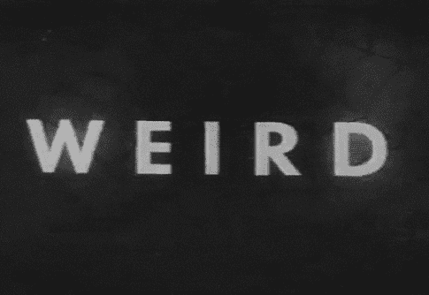

# 理解“！”的怪异之处 JavaScript 中的 bang 运算符

> 原文：<https://levelup.gitconnected.com/understanding-weirdness-of-operator-in-javascript-b7609fcab810>

关于 Javascript 中的`!`操作符是如何工作的，有些事情我们还不知道。



## 基础

`!`是一个逻辑运算符，它将一个值转换成它的相反布尔值。由于 JavaScript 将[强制值](https://www.freecodecamp.org/news/js-type-coercion-explained-27ba3d9a2839/)，它将把一个值“转换”成它的真/假形式，并返回相反的布尔值。

当我们对一个不是 0 的数执行`!`操作时，返回`false`。这是因为除了 0 以外的所有数字都是真实的。

```
// evaluates to **false**
!1 
!-10
!1.2
```

`0, null, undefined, NaN`上的`!`操作返回`true`，因为它们是假的。

```
//evaluates to **true**
!0
!NaN
!null
!undefined
```

如果我们对`undefined`变量执行`!`，那么它将返回`true`。

```
var a ;!a // true
```

类似地，如果我们对一个有值或指向某个引用的变量执行`!`，那么它返回`false`。

```
var a = [];!a; // false
```

## 奇怪的是

当我们这样做时:

```
! + [] // then it is evaluated to **true** 
```

原因是，`+`操作符只对字符串和数字起作用，所以如果我们对一个数组执行二进制操作，那么这个数组就被转换成一个字符串。所以详细的观点是:

```
! + [] 
is converted internally into ! + String([])! + "" //it evaluates true because ! on empty string returns true
```

所以现在让我们尝试另一个大问题(我在推特上找到的)，那里也有解决方案😃)

```
(**! + [] + [] + [] + ![]**) ! + [] --> true true + [] --> "true""true" +[] --> "true""true" + ![] -- >"truefalse"
```

如果您想了解更多关于这些概念的知识，您应该学习 JavaScript 类型强制以及真/假值在 JS 中是如何工作的。

如果你发现这个有用的惊喜🎁我这里的[](https://www.paypal.me/jagathishSaravanan)****。****

****觉得开心就分享。****

****跟随** [**Javascript Jeep🚙**](https://medium.com/u/f9ffc26e7e69) **如果你觉得值得。****

**[](https://gitconnected.com/learn/javascript) [## 学习 JavaScript -最佳 JavaScript 教程(2019) | gitconnected

### JavaScript 是世界上最流行的编程语言之一——它随处可见。JavaScript 是一种…

gitconnected.com](https://gitconnected.com/learn/javascript)**