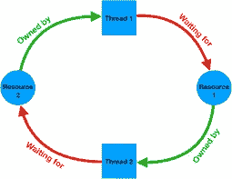

# 了解数据库死锁发生的原因

> 原文：<https://levelup.gitconnected.com/understanding-why-a-database-deadlock-occurs-8bbd32be8026>


照片由[何塞·丰塔诺](https://unsplash.com/@josenothose?utm_source=medium&utm_medium=referral)在 [Unsplash](https://unsplash.com?utm_source=medium&utm_medium=referral) 拍摄



数据库死锁

# 议程

这篇文章试图解释什么是数据库死锁以及为什么会发生死锁。

我们将编写 SQL 语句，故意造成死锁，并讨论如何缓解死锁。

我们将使用 PostgreSQL 作为我们的数据库。

# 设置

让我们启动一个 PostgreSQL shell 并创建一个名为 accounts 的表。

```
akshar=# create table accounts (acct_id integer, amount integer); CREATE TABLE
```

让我们在这个表中插入两行。

```
akshar=# insert into accounts values (1, 500);
INSERT 0 1
akshar=# insert into accounts values (2, 300);
INSERT 0 1
```

让我们验证是否插入了行。

```
akshar=# select * from accounts;
acct_id | amount
---------+--------
1 | 500
2 | 300
(2 rows)
```

# 交易

要正确理解死锁，对事务有一个基本的了解是很重要的。

事务是 DBMS 的一个特性，它使数据库保持一致和可靠的状态。维基百科将交易定义为:

```
A database transaction symbolizes a unit of work performed within a database management system against a database, and treated in a coherent and reliable way independent of other transactions.
```

交易保证 ACID 合规性。阅读[以了解 ACID](https://en.wikipedia.org/wiki/ACID) 。

银行转帐是理解数据库事务的经典案例。假设我们的应用程序提供了从账户 A 向账户 b 转账的功能。

在转账过程中，账户 A 应被借记，账户 B 应被贷记。借方和贷方形成一个单一的工作单元。要么两个操作都应该发生，要么都不应该发生。这就是为什么这两个语句应该是单个事务的一部分。

让我们启动一个`psql` shell，进行一个交易，将钱从一个帐户转移到另一个帐户。

```
akshar=# begin transaction;
BEGIN
akshar=# update accounts set amount=amount-10 where acct_id=1; UPDATE 1
akshar=# update accounts set amount=amount+10 where acct_id=2; UPDATE 1
akshar=# commit;
COMMIT
```

让我们核对一下两个账户的金额。

```
akshar=# select * from accounts;
acct_id | amount
---------+--------
1 | 490
2 | 310
(2 rows)
```

这表明转账成功完成，我们的交易代码是正确的。

# 导致死锁

我们现在就故意制造僵局。

任何生产就绪的 DBMS 都能够同时服务于多个进程。我们将通过运行两个`psql`shell 来模拟两个同时发生的传输量。

首先，shell 将模拟一个从帐户 1 向帐户 2 转账的过程。第二个 shell 将模拟一个从帐户 2 到帐户 1 的转帐过程。

账户 1 想要将金额 10 转移到账户 2。我们将在第一个 shell 上这样做。

```
akshar=# begin transaction;
BEGIN
akshar=# update accounts set amount=amount-10 where acct_id=1; UPDATE 1
```

同时，即在第一笔交易完成之前，账户 2 决定将金额 20 转移到账户 1。我们将在第二个 shell 上这样做

```
akshar=# begin transaction;
BEGIN
akshar=# update accounts set amount=amount-20 where acct_id=2; UPDATE 1
```

让我们假设 DBMS 给了第一个进程下一次运行的机会。因此，让我们通过在第一个 shell 上贷记 account 2 来模拟一下。

```
akshar=# update accounts set amount=amount+10 where acct_id=2;
```

您应该注意到，数据库不会返回成功消息，而是被阻塞，您不会得到任何响应。

这是因为 acct_id=2 的行当前是`locked`，因为进程 2 对该行进行了更新。在进程 2 释放该锁之前，进程 1 无法获得它。

数据库现在会给进程 2 一个运行的机会。因此，让我们通过在第二个 shell 上贷记帐户 1 来模拟这种情况。

```
akshar=# update accounts set amount=amount+20 where acct_id=1;
```

数据库会返回一个`ERROR: deadlock detected`。

```
ERROR: deadlock detected
DETAIL: Process 77716 waits for ShareLock on transaction 173312; blocked by process 76034.
Process 76034 waits for ShareLock on transaction 173313; blocked by process 77716.
HINT: See server log for query details. CONTEXT: while updating tuple (0,3) in relation "accounts"
```

当进程 1 从帐户 1 中借记金额 10 时，它已经锁定了 acct_id=1 的 db 行。现在进程 2 试图对同一行进行更新，这一步需要锁。只有当进程 1 释放锁时，进程 2 才能获得锁。但是进程 1 被阻塞，等待进程 2 释放 acct_id=2 上的锁。实际上，进程 1 正在等待进程 2 释放锁，而进程 2 正在等待进程 1 释放锁。这是一个僵局。

数据库足够智能，可以检测到死锁。

数据库将在进程 2 外壳中引发此死锁错误。一旦出现死锁错误，该进程持有的所有锁都将被释放。这也给了进程 1 一个获得所需锁的机会。

检查进程 1 外壳，被阻止的命令将返回，金额 10 将被记入帐户 2。

```
akshar=# update accounts set amount=amount+10 where acct_id=2; UPDATE 1
```

尝试在进程 2 shell 上发出一个`commit`。

```
akshar=# commit;
ROLLBACK
```

由于检测到死锁，这意味着命令不会成功，因此提交会导致数据库进入不一致和不可靠的状态。DBMS 很聪明地意识到这一点，因此即使发出一个`commit`也会导致一个`rollback`。

但是既然进程 1 的命令执行成功，那么`commit`就可以在进程 1 上发出 shell。

```
akshar=# commit;
COMMIT
```

您应该能够验证账户 1 的借方金额为 10，账户 2 的贷方金额为 10。

```
akshar=# select * from accounts;
acct_id | amount
---------+--------
1 | 480
2 | 320
(2 rows)
```

# 处理死锁

并发是一个现实，是不可避免的。很有可能多个进程同时尝试更新同一组行，却被彼此阻塞。在这种情况下，僵局是不可避免的。

在这种情况下，应该在应用程序级别处理死锁。必须有异常处理代码来捕捉死锁错误并重试失败的事务。

请继续关注我们下一篇关于在 Django web 应用程序中处理死锁的文章。