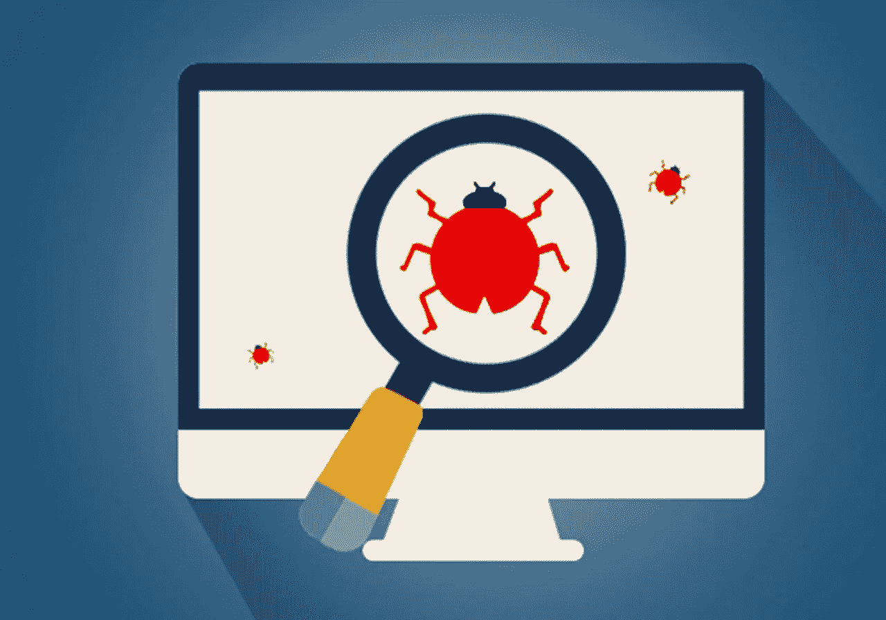
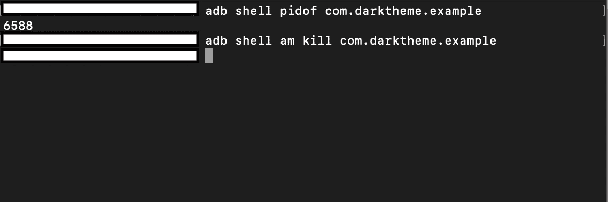

# Android 上意外的应用崩溃以及如何应对

> 原文：<https://levelup.gitconnected.com/unexpected-app-crashes-on-android-and-how-to-deal-with-them-c5d07512d99f>



图片由来自 [Pixabay](https://pixabay.com/?utm_source=link-attribution&amp;utm_medium=referral&amp;utm_campaign=image&amp;utm_content=762486) 的 [testbytes](https://pixabay.com/users/testbytes-1013799/?utm_source=link-attribution&amp;utm_medium=referral&amp;utm_campaign=image&amp;utm_content=762486)

如果说所有开发人员有什么共同点的话，不管是前端、后端，甚至是游戏开发人员，那就是我们讨厌产品 bug。尤其是当这些错误导致应用程序崩溃的时候。当您最近开始生产时，在您的应用程序中监控这些不断增加的崩溃是一种不愉快的经历。

遇到一些崩溃是因为它运行的系统/平台，而不管应用程序的业务逻辑。在 Android 中，当你从后台状态恢复应用程序时，你可能会遇到崩溃。这种崩溃是意料之外的，仅通过查看崩溃日志很难理解或处理。

本文就谈谈这样的问题以及解决的方法。

# 问题是

在监视生产中的崩溃日志时，我注意到一些问题日益增多。这款应用在正常测试条件下似乎运行良好，崩溃日志也不可复制。直到应用程序从后台任务中恢复。

每个 android 应用程序都在自己的进程中运行，这个进程已经被操作系统分配了一些内存。当用户与其他应用程序交互时，如果你的应用程序被放在后台，如果没有足够的内存可供你的应用程序使用，操作系统可以终止你的应用程序进程。这通常发生在另一个应用程序正在前台运行，需要更大的手机内存(RAM)时。

当 app 进程被终止时，所有的单例对象和临时数据也会丢失。现在，当您返回到您的应用程序时，系统将创建一个新的进程，您的应用程序将从堆栈顶部的活动恢复。

因为此时所有的单例对象都丢失了，所以当活动试图访问相同的对象时，应用程序会崩溃，导致 NullPointerException。

这是一个问题，在我们进入解决方案之前，让我们复制这个场景。

# 复制撞车事故

1.  继续在模拟器或通过 USB 电缆连接的实际设备中运行 Android Studio 中的任何应用程序。
2.  导航到一个随机屏幕，然后按下“主页”按钮
3.  打开终端并键入以下命令来获取应用程序的进程 ID (PID)

```
adb shell pidof com.darktheme.example
```

该命令的语法是‘ADB shell pidof*** APP _ BUNDLE _ ID *’**

请注意您在终端窗口上看到的 PID。(这可用于验证当我们恢复应用程序时，现有的应用程序进程是否被终止，以及是否启动了新的进程)

4.键入以下终端命令终止您的应用程序进程

```
adb shell am kill com.darktheme.example
```

此时，您的终端窗口应该如下所示:



处理终端中输入的删除命令

现在从后台任务打开你的应用，检查应用是否崩溃。如果是，请不要担心，我们将在下一节讨论如何处理这个问题。如果没有，给自己一个鼓励，因为这是你应得的:)

注意:从后台打开 app 后，检查新进程的 PID。如果您在步骤 3 中记下的 PID 和新的 PID 相等，则该进程从未被终止。

# 拟议解决方案

处理这个问题有两种方法。根据您所处的情况，您可以决定采用哪一种方法:

## 解决方案 1:

一个简单方便的解决方案是，当用户从后台恢复应用程序时，检查我们现有的应用程序进程是否被终止并重新创建。如果是，您可以导航回启动屏幕，这样它就像一个新的应用程序启动场景。

您可以将以下代码放在 BaseActivity 中:

*   通过覆盖“onSaveInstanceState”函数将您的 PID 保存在包中。
*   在“onCreate”方法中，比较当前 PID 和来自包的 PID。
*   如果重新创建了流程，则重定向到 Splash 活动。

当用户从后台导航回应用程序时，如果应用程序进程被终止，应用程序将从 SplashActivity 重新启动，就像它是一个新的应用程序启动一样。

这将防止应用程序访问任何可能在进程重建期间丢失的资源，从而防止应用程序崩溃。

虽然这种解决方案可以防止崩溃，但这种方法会重新启动应用程序，而不是从停止的地方恢复应用程序。如果你在一个生产应用中遇到这个问题，并且迫切地想要一个快速的解决方案，这个解决方案应该很适合你。

然而，如果你最近刚开始从头开始开发，解决方案 2 将是你的理想选择，因为它将从应用程序停止的地方恢复应用程序

## 解决方案 2:

到目前为止，您一定已经注意到，您可以从“Bundle”对象中保存和访问数据。保存每个活动/片段中的所有必要信息，就像我们在前面的例子中所做的那样。

因为我们正在访问保存在包中的数据，所以应该防止应用程序崩溃，并且应用程序应该从停止的地方恢复。所有其他活动/片段也将被重新创建。

对于片段中的 RecyclerView，它看起来像这样:

*   通过覆盖“onSaveInstanceState”函数，将所需信息保存在 Bundle 对象中。
*   检查束中的数据是否在“onViewCreated”函数中可用，否则，通过 ViewModel 从源中获取数据。

# 结论

在 Android 平台上，由于进程终止导致的应用崩溃是非常常见的。在较新的 Android 版本中，可以观察到后台应用程序被大量删除以节省手机电池。

解决方案 1 可以快速修复您现有的生产崩溃。

然而，如果你正在从头开始开发一个应用程序，我会推荐解决方案 2，因为它可以确保应用程序从之前停止的地方继续运行。因此导致更好的用户体验。

调查这种崩溃的根本原因可能会变得很困难，所以我希望这篇文章能以任何可能的方式帮助你。让我知道你们对我们讨论的解决方案有什么想法。

本文到此为止。编码快乐！