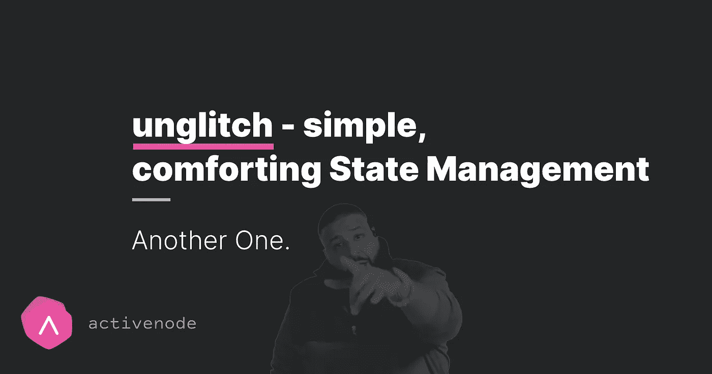
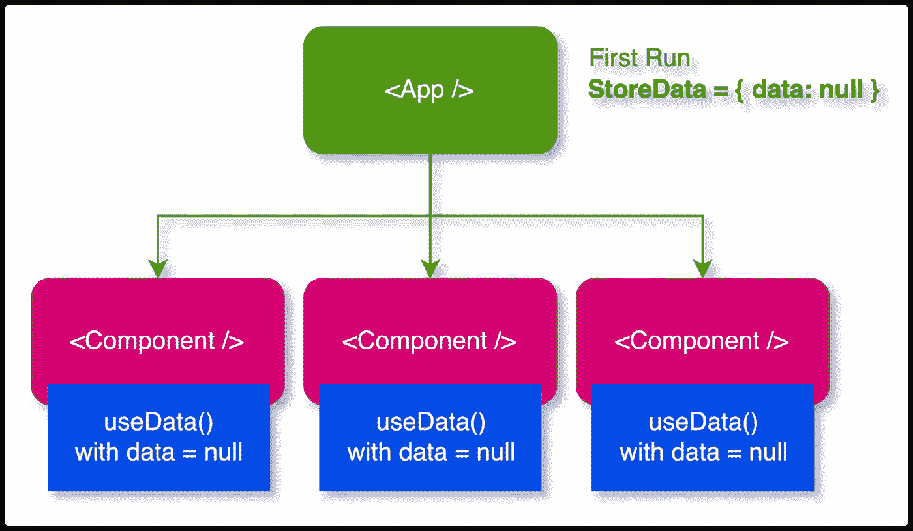

# un glitch——React 的超简单状态管理

> 原文：<https://levelup.gitconnected.com/unglitch-ultra-simple-react-state-management-11470282b6f5>

停止考虑副作用，用锁定功能解决它们



# 想象一下:

您创建了 React 或 Next.js 设置，并且需要一个存储来跨组件无缝共享您的数据。这很可能包括一些向存储提供数据的数据获取逻辑。

在过去，每个人都会尖叫`Redux`,你会用某种状态属性检查获取数据是否已经完成或者当前正在完成。如今，我们有了`Redux` +一堆其他选择——相同的目标，不同的架构。

现有的商店是可怕的，部分该死的容易(如`zustand`)和工作很好。

# 但是(！)商店不解决副作用问题

问题是，在 React 生命周期中，您可能会遇到以下情况:3 个组件需要数据，因此 3 个组件使用您的定制钩子`useData`，钩子检查存储中的数据是否已经可用，例如

```
// my custom hook
function useData() {
 const data = useZustand(state => state.data);

 useEffect(() => {
   if (!data) {
    fetchData().then(/** some fetching logic **/);
   }
 }, [data]); return data;
}
```

但这很麻烦——不幸的是，我在网站上越来越多地看到这种情况:数据被多次提取，多个请求被发送。通过在下图中提供一些视觉帮助，可以更容易地解释原因:



所有组件都使用了`useData()`钩子。和`useData`将具有空的状态数据。`useData()`的`useEffect()`仍然会被调用 3 次，因为我们有 3 个组件在使用它——提醒:重用的钩子不是【单线】([https://en.wikipedia.org/wiki/Singleton_pattern](https://en.wikipedia.org/wiki/Singleton_pattern))。问题还在继续:你不能真正检查*提供的*状态数据，因为你得到了**这个**生命周期的状态，所以另一个组件可能已经调用了获取函数，但是其他组件将在下一个生命周期运行时得到通知，因此也触发获取数据。

# 这不是一个反应问题

现在听起来可能像是“按照架构来说，这不是很糟糕吗？”。不，你在你的组件的每个生命周期都有一个状态，这样所有的组件都有相同的同步状态，这是你的组件行为正常的必要条件。

# 这是你的问题:你需要协调

最终，您必须避免在 React 生命周期之外运行的函数(比如数据获取方法)被多次运行。这对于所有主要的状态管理库都是可能的，因为它们在组件得到通知之前更新状态。

例如，在 Redux(带`redux-thunk`)中，您会看到这样的内容:

```
dispatch((dispatch, getState) => {
 if (getState().isFetchingData === false) {
   fetchData().then(data => dispatch({
    action: ‘UPDATE_DATA’, payload: data
   }));
 }
});
```

或者在`zustand`中，你可以这样构建它:

```
const store = create((set, get) => ({
 isFetchingData: false,
 fetchData: () => {
  if (get().isFetchingData === false) {
   fetchData().then(data => set({data}));
  }
 }
}));
```

工作，但也是额外的开销，你必须记住这样做。

# `unglitch`提供锁定或离开呼叫

我想要一个简单的状态管理来解决这个问题。我本可以改编`zustand`，但之后我继续挖掘构建一个更简单的系统:`unglitch`。

[](https://github.com/activenode/unglitch) [## GitHub - activenode/unglitch:一个简单的、避免副作用的 React 存储库

### 是的。只对 18+作出反应，不打算移植到其他任何东西。更新你的简历。不需要上下文提供者…

github.com](https://github.com/activenode/unglitch) 

`unglitch`和`zustand`非常相似，它*和*使用相同的技术。然而，内置的状态管理确实会带来锁定调用。

最简单的解释就是下面的代码片段:

```
import { useStore, update } from ‘./my-store’;const fetchData(releaseLock: () => void, realtimeData) {
 // we can check the live data outside of the lifecycle 
 if (realtimeData === null) {
   // ..fetch some data…
   // …then update it:
   update({ data: [/** your data here */]});

   // release the lock so it can be called again
   releaseLock();
 }
}
fetchData.LOCK_TOKEN = “FETCH_DATA”;const useData = () => {
 const [data, lockedCall] = useStore(state => state.data);  useEffect(() => {
  lockedCall(fetchData);
 }, []); return data;
}
```

运行`lockedCall`时会自动抓取`LOCK_TOKEN`。如果`LOCK_TOKEN`不存在，你将面临一个错误，所以不要担心忘记它。当然，你仍然可以手动调用这个函数，但是只要你运行`lockedCall`，它将只运行一次。

被调用的函数总是接收一个函数作为第一个参数，这将再次释放锁，第二个参数正是在`useStore`中提供的状态数据，所以这里是`state.data`。
不同之处在于:被调用的函数接收的是`realtimeData`，而不是生命周期中当前可用的数据。这允许您检查是否需要获取数据。

除了这个锁机制，商店的工作方式与`zustand`非常相似。看看这个。

# 分级编码

感谢您成为我们社区的一员！在你离开之前:

*   👏为故事鼓掌，跟着作者走👉
*   📰查看[升级编码出版物](https://levelup.gitconnected.com/?utm_source=pub&utm_medium=post)中的更多内容
*   🔔关注我们:[Twitter](https://twitter.com/gitconnected)|[LinkedIn](https://www.linkedin.com/company/gitconnected)|[时事通讯](https://newsletter.levelup.dev)

🚀👉 [**加入升级人才集体，找到一份惊艳的工作**](https://jobs.levelup.dev/talent/welcome?referral=true)