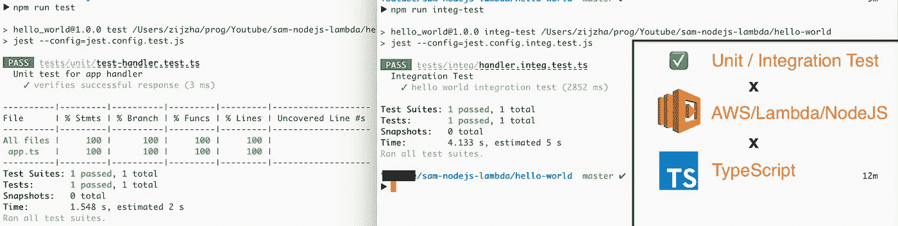

# TypeScript 中 AWS Lambda/NodeJS 的单元测试和集成测试

> 原文：<https://levelup.gitconnected.com/unit-test-and-integration-test-for-aws-lambda-nodejs-in-typescript-2235a0f69f5>



# AWS Lambda/NodeJS(类型脚本)系列

1.  [如何在 3 个步骤中为 AWS Lambda 使用 TypeScript](/how-to-use-typescript-for-aws-lambda-in-3-steps-1996243547eb)
2.  [TypeScript 中 AWS Lambda/NodeJS 的单元测试和集成测试](https://medium.com/@zijing/unit-test-and-integration-test-for-aws-lambda-nodejs-in-typescript-2235a0f69f5)

# 准备

我们将使用`jest`来管理所有的测试。为了在 TypeScript 中使用`jest`，我们必须安装一些`babel`依赖项。请检查下面的安装命令:

```
*// install jest and types* **$ npm i -D jest @types/jest***// install babel support to use jest with typescript* **$ npm i -D babel-jest @babel/core @babel/preset-env @babel/preset-typescript**
```

我们将它们安装在`dev-dependencies`中，因为它们只在测试期间使用，而不在最终构建的包中使用。安装之后，我们需要在中创建`babel.config.js`来让 babel 工作。文件内容:

```
**module**.**exports** = {
    **presets**: [
        ['@babel/preset-env', {targets: {node: 'current'}}],
        '@babel/preset-typescript',
    ],
};
```

文件结构现在看起来像这样:

```
.
├── README.md
├── hello-world
│   ├── **babel.config.js**
│   ├── package-lock.json
│   ├── package.json
│   ├── src-ts
│   └── tsconfig.json
├── samconfig.toml
└── template.yaml
```

# 单元测试

要使用`jest`，最好有一个配置文件，我们可以用`jest cli`生成文件:

```
*// pwd: $ROOT/hello-world***$** **./node_modules/.bin/jest** **init** *// generate jest.config.js*
**$** **mv** **jest.config.js jest.config.test.js** *// rename*
```

在生成的`jest.config.test.js`中，我们需要以下选项:

```
module.exports = {
clearMocks: false,
collectCoverage: true,
coverageDirectory: "coverage",
coverageProvider: "v8",

testEnvironment: "node",
testMatch: [
 **"**/unit/**/*.test.ts"**  ],
};
```

然后让我们创建我们的第一个单元测试文件`hello-world/tests/unit/test-handler.test.ts`。接下来，我们可以用在上一篇文章中创建的 app handler 的单元测试来填充文件。

```
**import** { **APIGatewayProxyEvent** } from "aws-lambda";
**import** { **lambdaHandler** } from "../../src-ts/app";

**describe**('Unit test for app handler', function () {
    **it**('verifies successful response', **async** () => {
        **const** event: **APIGatewayProxyEvent** = {
            queryStringParameters: {
                a: "1"
            }
        } as any
        **const** result = **await** lambdaHandler(event)

        **expect**(result.statusCode).**toEqual**(200);
        **expect**(result.body).**toEqual**(`Queries: ${**JSON**.**stringify**(event.queryStringParameters)}`);
    });
});
```

在`package.json`中添加一个新的命令，这样我们可以很容易地运行单元测试:

```
"scripts": {
  **"test": "jest --config=jest.config.test.js",**
  "compile": "tsc"
}
```

现在，我们应该能够运行单元测试并查看覆盖率报告了:


单元测试运行结果

看起来棒极了！文件结构现在看起来像这样:

```
.
├── README.md
├── hello-world
│   ├── babel.config.js
**│   ├── jest.config.test.js**
│   ├── package-lock.json
│   ├── package.json
│   ├── src-ts
**│   ├── tests
│   │   └── unit
│   │       └── test-handler.test.ts**
├── samconfig.toml
└── template.yaml
```

> 如果你觉得这篇文章有用，请关注这个帐户，以便将来更新。感谢支持！

# 整合测试

为了区分集成测试和单元测试，我们需要一个不同的 jest 配置文件，即带有内容的`jest.confg.integ.test.js`:

```
*// no need for coverage here*
module.exports = {testEnvironment: "node",testMatch: [
 **"**/integ/**/*.integ.test.ts"**  ],};
```

要运行集成测试，我们还需要以下两样东西:

*   运行我们 lambda 的本地服务器
*   向本地服务器发送请求的 HTTP SDK 包

## 在本地服务器上运行 lambda

幸运的是，AWS SAM CLI 提供了使用以下命令在本地运行堆栈的能力:

```
*// pwd: $ROOT/hello-world* **$ sam local start-api -t ../template.yaml**
```

该命令需要安装`Docker`，更多信息可以参考[本文档](https://docs.aws.amazon.com/serverless-application-model/latest/developerguide/sam-cli-command-reference-sam-local-start-api.html)。在执行之后，它将在`127.0.0.1:3000`打开一个服务器监听。

最好也将上面的命令添加到 NPM 脚本中:

```
"scripts": {
  "test": "jest --config=jest.config.test.js",
  **"start-local": "sam local start-api -t ../template.yaml",**
  "compile": "tsc"
},
```

## 将 HTTP SDK 添加到项目中

我们将选择`Axios`向上面启动的服务器发送请求:

```
**$ npm i -D axios @types/axios**
```

创建一个集成测试文件`hello-world/tests/integ/handler.integ.test.ts`，内容为:

```
**import** **axios** from "axios";

**describe**("Integration Test", () => {
    **it**("hello world integration test", **async** () => {
        **const** query = { a: "hi" };
        **const** response = **await** axios.get("http://localhost:3000/hello", {
            params: query
        });

        **expect**(response.status).***toEqual***(200);
        **expect**(response.data).***toEqual***(`Queries: ${**JSON**.**stringify**(query)}`);
    });
});
```

在这个集成测试中，我们使用`axios`向上面启动的服务器发送一个`GET`消息。更重要的是，我们使用`async`和`await`来保持测试代码的简单性和可读性。

同样，在`package.json`中为集成测试添加一个执行命令:

```
"scripts": {
  "test": "jest --config=jest.config.test.js",
  "integ-test": "jest --config=jest.config.integ.test.js",
 **"start-local": "sam local start-api -t ../template.yaml",**  "compile": "tsc"
}
```

## 运行集成测试

我们需要两个控制台进行集成测试，一个用于服务器，另一个用于运行集成测试。看一下运行结果:


集成测试执行

最终文件结构:

```
.
├── README.md
├── hello-world
│   ├── babel.config.js
**│   ├── jest.config.integ.test.js**
│   ├── jest.config.test.js
│   ├── package-lock.json
│   ├── package.json
│   ├── src-ts
│   │   └── app.ts
│   ├── tests
**│   │   ├── integ
│   │   │   └── handler.integ.test.ts**
│   │   └── unit
│   │       └── test-handler.test.ts
│   └── tsconfig.json
├── samconfig.toml
└── template.yaml
```

# 结论

厉害！我们现在不仅可以用 TypeScript 编写 lambda 处理程序，还可以用 TypeScript 编写单元/集成测试。完整的代码可以在[https://github.com/zijing07/aws-lambda-nodejs-ts](https://github.com/zijing07/aws-lambda-nodejs-ts)找到。

在下一篇文章中，我将分享如何在 AWS Lambda 中用 DDB 创建单元/集成测试。

> 如果你觉得这篇文章有用，请关注这个帐户，以便将来更新。感谢支持！