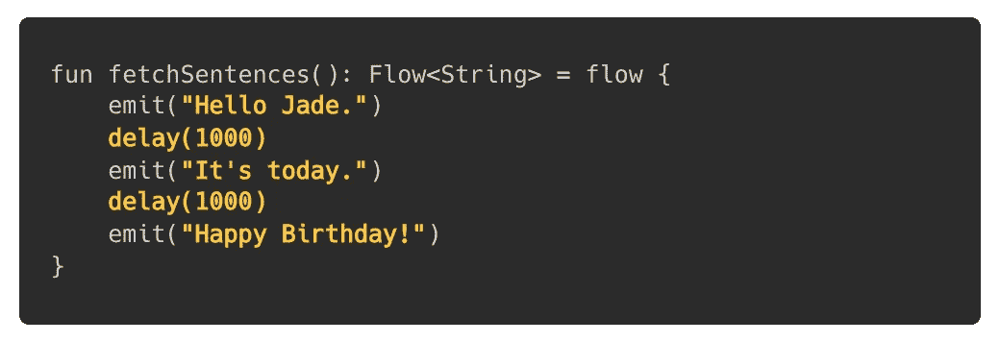
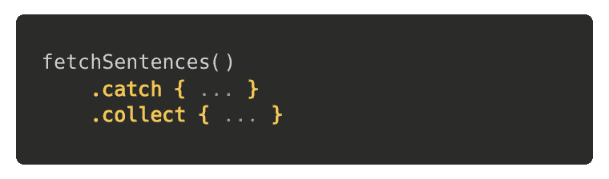
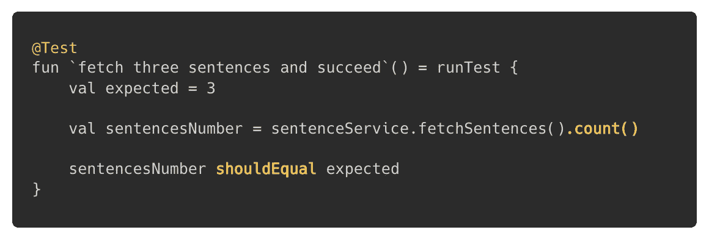
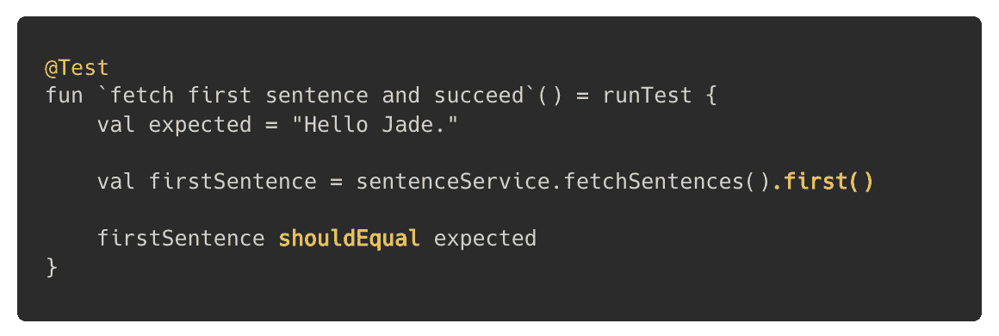
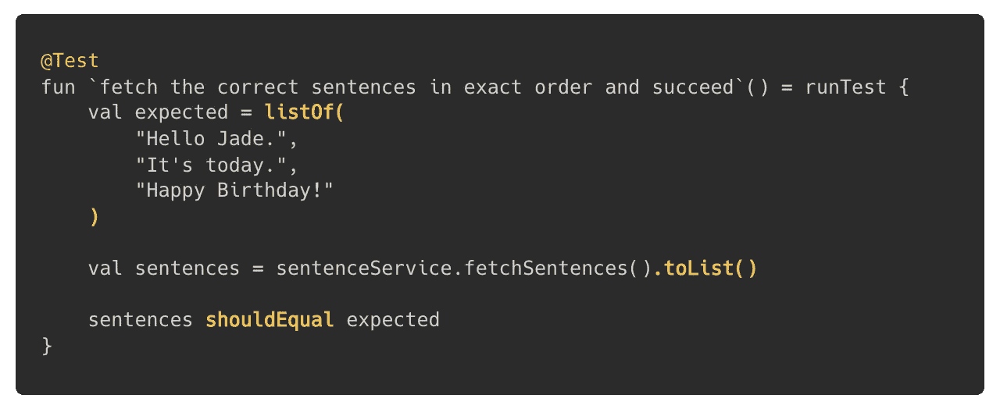
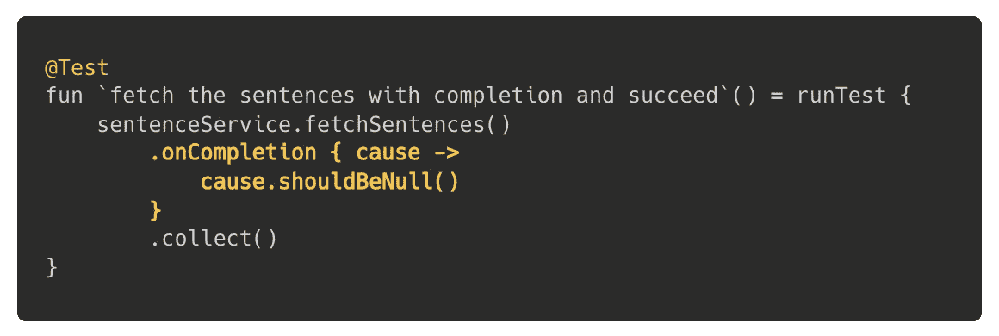
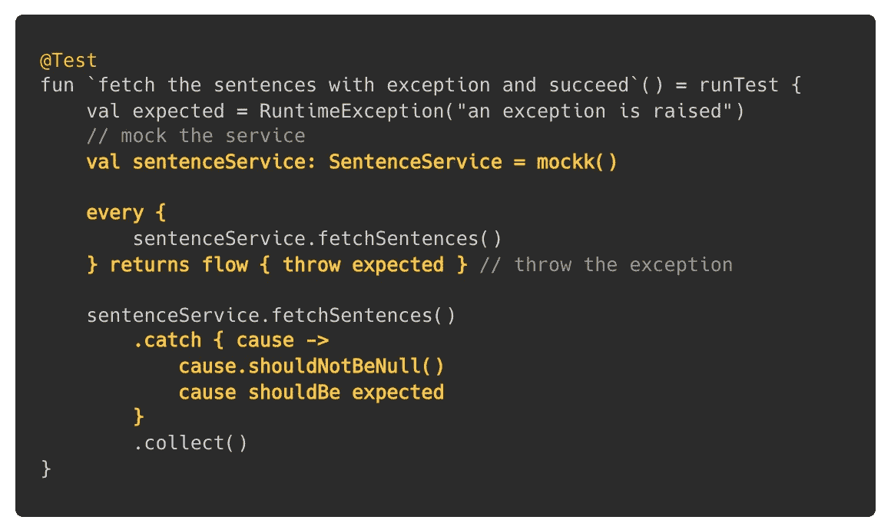
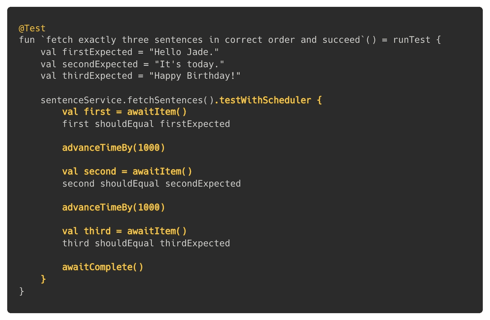
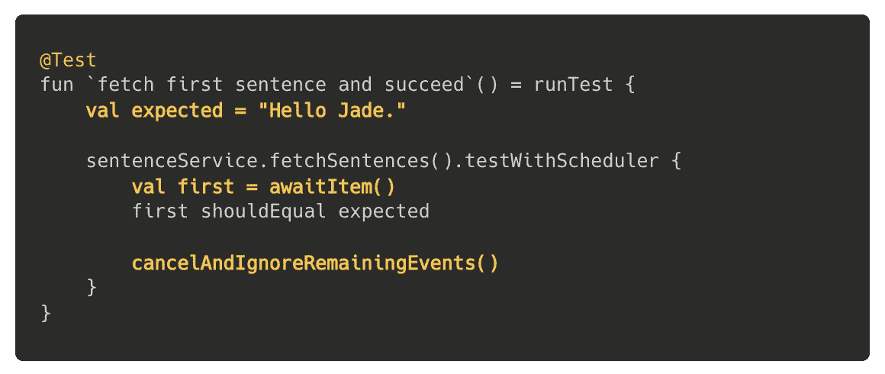
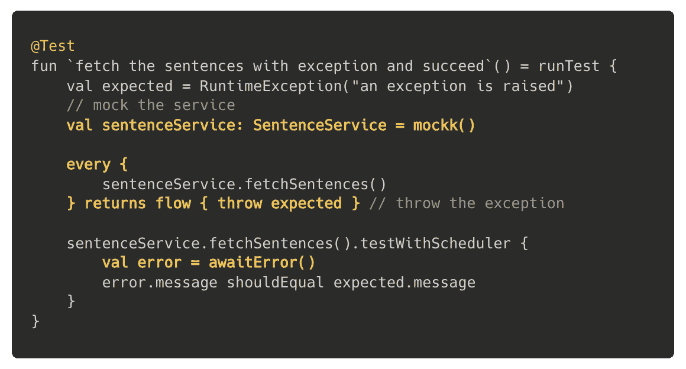

# 使用 Kotlin 流的单元测试

> 原文：<https://levelup.gitconnected.com/unit-test-with-kotlin-flow-7e6f675e5b14>


照片由[迈克尔·泽兹奇](https://unsplash.com/@lazycreekimages?utm_source=unsplash&utm_medium=referral&utm_content=creditCopyText)在 [Unsplash](https://unsplash.com/?utm_source=unsplash&utm_medium=referral&utm_content=creditCopyText) 上拍摄

当我们开发一个特性时，我们需要为功能的每个部分编写单元测试。这是发展的一个巨大而必要的部分。这保证了代码在未来的更改/重构中的正确运行。

科特林流也不例外。在我们的 Android 应用程序中，我们使用了 Kotlin Flow，我们必须测试这些流的功能。**虽然这个主题总结了它的应用，但是我们真的很高兴编写流的单元测试是如此简单。**

## 一个测试案例🛠

假设我们有一个获取三个延迟字符串的流程:



在收集时，我们可以假设使用`[collect](https://kotlin.github.io/kotlinx.coroutines/kotlinx-coroutines-core/kotlinx.coroutines.flow/collect.html)`和`[catch](https://kotlin.github.io/kotlinx.coroutines/kotlinx-coroutines-core/kotlinx.coroutines.flow/catch.html)`运算符:



所以现在，我们需要测试这个流程的正确功能。我所说的正常运行是指测试以下情况:

*   我们应该收集三样东西。
*   *你好玉。*“应该是第一项。
*   我们应该收藏"*你好玉。*“，”*就今天。*、*生日快乐！*”，准确地说。
*   该流程应该无一例外地完成。
*   该流应该处理意外的异常。

当然，还有其他案例，但这些案例足以展示如何对 Kotlin 流进行单元测试。

## 工具📚

我们将提供三个依赖关系的例子，使测试变得轻松、简洁和可读:

*   为了运行我们的测试，我们将使用[kot linx-coroutines-test](https://kotlin.github.io/kotlinx.coroutines/kotlinx-coroutines-test/index.html)，专门针对`[delays](https://kotlin.github.io/kotlinx.coroutines/kotlinx-coroutines-core/kotlinx.coroutines/delay.html)`。`runTest`将允许我们运行测试，自动跳过延迟并处理未捕获的异常。
*   断言将通过 [Kluent](https://github.com/MarkusAmshove/Kluent) 来完成。这是一个在经典 JUnit 断言之上专门为 Kotlin 编写的“流畅断言”库。我们将称之为`shouldEqual`、`shouldNotBeNull`和`shouldBeNull`，它们的名字很明显。
*   [mock](https://github.com/mockk/mockk)将被应用于模拟类并定义函数的行为。此处仅用于模拟流收集中的异常。

我们将会看到如何为 Kotlin 流创建单元测试。我们不会查看嘲讽行为或断言的细节，以保持这篇文章的基本性，并提供一个简单明了的解释。

因此，让我们看看如何统一测试我们的流程`fetchSentences()`。

## 测试流量🥊

根据[谷歌 Android 的文档](https://developer.android.com/kotlin/flow/test):

> 如果被测试的主体公开了一个流，那么测试需要对数据流的元素做出断言。

为此，我们只需使用已经可用的操作符(如`[drop](https://kotlin.github.io/kotlinx.coroutines/kotlinx-coroutines-core/kotlinx.coroutines.flow/drop.html)`、`[take](https://kotlin.github.io/kotlinx.coroutines/kotlinx-coroutines-core/kotlinx.coroutines.flow/take.html)`、`[map](https://kotlin.github.io/kotlinx.coroutines/kotlinx-coroutines-core/kotlinx.coroutines.flow/map.html)`)来使用`Flow` API，并收集流，以使用`[single](https://kotlin.github.io/kotlinx.coroutines/kotlinx-coroutines-core/kotlinx.coroutines.flow/single.html)`、`[toList](https://kotlin.github.io/kotlinx.coroutines/kotlinx-coroutines-core/kotlinx.coroutines.flow/to-list.html)`等终端操作符来检查收到的项目。它使写作变得简单和直观，因为它就像真正的执行。

假设`fetchSentences()`在一个名为`SentenceService`的类下，第一个测试是用`[count](https://kotlin.github.io/kotlinx.coroutines/kotlinx-coroutines-core/kotlinx.coroutines.flow/count.html)`操作符进行的，它应该正好返回三个项目:



验证第一项的下一个测试由`[first](https://kotlin.github.io/kotlinx.coroutines/kotlinx-coroutines-core/kotlinx.coroutines.flow/first.html)`操作员完成:



通过与`[toList](https://kotlin.github.io/kotlinx.coroutines/kotlinx-coroutines-core/kotlinx.coroutines.flow/to-list.html)`的列表比较，检查项目排序和相等性；



如何测试正确完成没有任何异常？通过确认`cause`到`[onCompletion](https://kotlin.github.io/kotlinx.coroutines/kotlinx-coroutines-core/kotlinx.coroutines.flow/on-completion.html)`操作符的可空性:



最后，当我们模拟和修改流的响应时，可以测试意外的异常。所以我们必须创建一个新的流，并在其中抛出一个异常。然后用`catch`操作员检查:



很简单，不是吗？

当我们第一次实现这些案例时，我们惊讶地发现用`Flow` API 进行测试是如此容易。然而，我们不太习惯在测试中直接调用像`onCompletion`或`catch`这样的“真正的”操作符。

这就是[涡轮](https://github.com/cashapp/turbine)就位的地方。

## 进入涡轮👀

我们决定重写我们的测试并使用 Turbine——一个小而强大的 Kotlin 流测试库。

它允许我们编写简洁的测试，不需要像前一章那样的操作符。我们只需要调用流的扩展`test`并查看其中的条目或错误。这个光库让我们很好地处理流量接收、完成或取消。 [@Geev](https://www.geev.com) ，我们发现这个库比官方的方式要好。

但是延迟使用它似乎很痛苦。由于 Turbine 忽略了当前的调度程序，`delay()`实际上延迟了流程，`test`的块实际上在测试调度程序中运行，这意味着超时不起作用。( [#42](https://github.com/cashapp/turbine/issues/42#issuecomment-868681072) )

为了正确运行测试，我们可以:

*   用`runBlocking`代替`runTest`。但是，我们将不得不等待两个真正的秒来完成完整的测试！想象一下更高的延迟…
*   多亏了`[withContext](https://kotlin.github.io/kotlinx.coroutines/kotlinx-coroutines-core/kotlinx.coroutines/with-context.html)`，将执行测试包在一个特定的调度程序中。
*   创建[一个](https://github.com/cashapp/turbine/issues/42#issuecomment-1000317026)T5 的同级扩展，用`[flowOn](https://kotlin.github.io/kotlinx.coroutines/kotlinx-coroutines-core/kotlinx.coroutines.flow/flow-on.html)`操作符改变流的上下文。

我们用了最后的感谢 [PaulWoitaschek](https://github.com/PaulWoitaschek) :

```
suspend fun <T> Flow<T>.**testWithScheduler**(
    timeoutMs: Long = 1000,
    validate: suspend FlowTurbine<T>.() -> Unit
  ) {
    val testScheduler = coroutineContext[**TestCoroutineScheduler**]
    return if (testScheduler == null) {
      test(timeoutMs, validate)
    } else {
      **flowOn(UnconfinedTestDispatcher(testScheduler))
        .test(timeoutMs, validate)**
    }
  }
```

## 启动涡轮🦾

实际上，涡轮试验可以用三种方法恢复。

为了检查收到的句子数量，我们会用`awaitItem`捕捉流中的项，并在最后调用`awaitComplete`来验证流是在三项之后完成的。这也将测试流的正确完成，没有任何异常。



正如你所看到的，我们使用`runTest`来触发`[advanceTimeBy](https://kotlin.github.io/kotlinx.coroutines/kotlinx-coroutines-test/kotlinx.coroutines.test/-delay-controller/advance-time-by.html)`并控制测试的虚拟时钟，传递流延迟。我们应用`testWithScheduler`来正确处理它。

接下来，代替`[first](https://kotlin.github.io/kotlinx.coroutines/kotlinx-coroutines-core/kotlinx.coroutines.flow/first.html)`操作符，我们等待带有`awaitItem`的第一项，并通过忽略其他事件来取消流程:



最后，我们可以通过使用`awaitError`比较如下收到的异常，来验证流在模拟服务时可以处理意外的异常:



就是这样！不需要更多的测试。我们认为 Turbine 确实简化了我们的测试用例。

## 使用科特林流量🧞‍♂️进行单元测试

正如我们所看到的，编写流单元测试非常简单。**我们使用** `**Flow**` **API 本身或者依赖于轻量级的库 Turbine——两者都提供了一种简单而直观的方式来创建单元测试。**使用很少的操作符(`first`、`toList`)或者很少的暂停函数(`awaitItem`、`awaitComplete`)，我们能够很容易地创建我们的测试。

如果你觉得这篇文章有帮助，请鼓掌！👏感谢阅读。