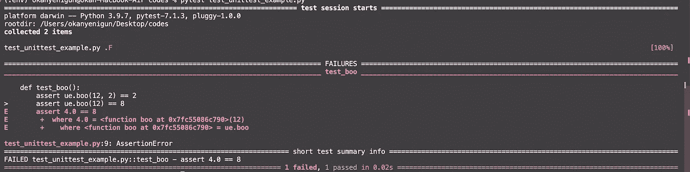
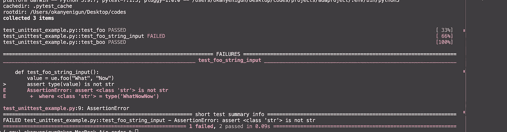
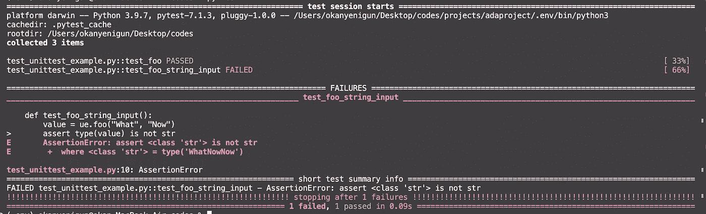
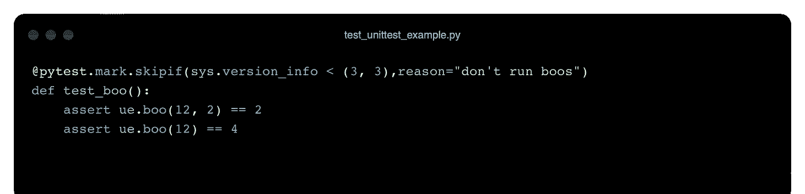

# 使用 PyTest 的单元测试

> 原文：<https://levelup.gitconnected.com/unit-test-with-pytest-d6f53919a19a>

## 使用 PyTest 介绍 Python 中的单元测试


Pytest 徽标。[来源](https://en.wikipedia.org/wiki/Pytest)

我们可以通过测试来检查代码是否工作正常。单元测试是一种软件测试方法，它检查一段代码(系统中的一个单元)是否正常工作。理想情况下，即使是最小的一段代码也应该被测试，没有测试的代码是不会被发布的。

一个程序的测试过程包括不同的层次。每个级别都有自己的动态。


测试金字塔。[来源](https://anymindgroup.com/news/tech-blog/15053/)

在底部，最基本的层次是单元测试。如上所述，每个单元都经过测试。这个单元可以是一个方法，也可以是一个类等等。更高的层次是一起测试多个组件。它正在测试这些单元的集成互操作性。顶部是 UI 测试(也称为系统测试，或端到端测试)。现在，在这一层，整个建筑被测试用例。这里测试的是用例是否被满足。在这些阶段之后，是用户验收测试阶段。这部分是用户完成的。

较低层次的测试越详细、越多，较高层次所需的测试强度就越小。也就是说，较低层次的成功有助于上述任务。

同样，较低级别的测试更快(应该更快)。由于较低层次的测试数量太大，如果这些测试很慢，就会出现积压。随着你的上升，测试的数量会减少，但是持续时间会增加。与此同时，更高级别的考试费用也更高。

较低级别的测试旨在防止错误。以上测试检测 bug。

**是什么单位？**就面向对象编程而言，单位是类。对于函数式编程，它是一个函数。一个类也由多个方法组成。在面向对象的情况下，我们是接受类作为一个单元，还是接受它们的每个方法，实际上取决于我们的观点。两个都可以。

一个写得好的测试清楚地展示了一个结构的解剖。

> “编写单元测试的行为与其说是验证，不如说是设计。这与其说是核实，不如说是记录。编写单元测试的行为关闭了大量的反馈回路，其中最少的是与功能验证相关的回路。”罗伯特·马丁。


罗伯特·马丁。来源:[维基百科](https://en.wikipedia.org/wiki/Robert_C._Martin)

*   **测试覆盖率**表示一个程序被测试的程度。当然，我们希望这个比例很高。低表示质量差，高不直接表示一切都很棒。
*   **SUT** :被测系统。我们测试的任何类都是 SUT。
*   **文档**:对组件的依赖。我们测试的组件所依赖的其他组件(依赖关系)。
*   **嘲讽**:我们必须将被测试的组件与其依赖项隔离开来。我们必须删除 SUT 中的文档。这样，bug 将只属于 SUT。


嘲讽。[来源](https://www.accenture.com/us-en/blogs/software-engineering-blog/to-mock-or-not-to-mock-is-that-even-a-question)

代替依赖，我们放入模拟它们的构造。

*   **测试用例**:测试一个用例。
*   **测试套件**:许多测试用例组合在一起。
*   **测试方法&类**:测试用例经常需要测试方法，测试套件经常需要测试类。
*   AAA: 安排，行动，断言。单元测试的阶段。安排:准备考试，准备考试，设置。Act:练习测试。断言:验证结果。


AAA。[来源](http://xunitpatterns.com/Test%20Stub.html)

*   **白盒&黑盒:**一个单元测试就是一个白盒测试。内部结构可见。相反，系统测试是黑盒测试。系统的内部结构是不可见的，系统通过 API 进行测试。
*   回归:这些测试揭示了当一个单元发生变化时，系统是否会出现中断。


DALLE:一种在每一个软件上执行完整单元测试的 python。(奥托·迪克斯风格)

# PyTest

Pytest 是一个单元测试框架。Python 有许多不同的单元测试库，例如，unittest 是一个内置库。然而，PyTest 是最受欢迎的单元测试库之一，因为它有许多特性。

```
pip install pytest
```

在命令行中键入 *pytest -h* 以列出您可以使用的所有方法:


救命啊。图片由作者提供。

让我们从简单的开始。我有一个 *foo* 和一个 *boo* 要测试。


foo 和 boo 函数。图片由作者提供。

为了测试这些，我创建了一个名为***test****_ unittest _ example . py*的文件。我在命名时使用了' *test_* '前缀，因为 Pytest 会自动检测带有' *test* '前缀的文件。当我命名测试方法时，我会这样做。

让我们为 *foo* 和 *boo* 编写两个测试函数。这些函数也将以' *test_'* 前缀开始。我将在测试中使用断言构造。嘿，等一下，不管断言是什么，你都可以在继续之前记住它们。

[](https://python.plainenglish.io/defensive-programming-in-python-af0266e65dfd) [## Python 中的防御性编程

### 断言和异常处理

python .平原英语. io](https://python.plainenglish.io/defensive-programming-in-python-af0266e65dfd) 

试验

为了运行测试，我们将在测试脚本所在的 shell 中运行一个命令。

```
xxx-MacBook-Air codes % **pytest test_unittest_example.py**ORxxx-MacBook-Air codes % **py.test** #this will detect the test py files automatically in the folder, that's why I named the test py files and functions with the 'test' prefix.
```

当两个测试都通过时，输出显示在 shell 中。您还可以在打印输出中看到测试的覆盖率(100%)以及完成它们需要多长时间。


让我们犯一个错误，看看输出会发生什么。

```
#instead of
#assert ue.boo(12) == 4assert ue.boo(12) == 8
```

现在，我们有一个失败的测试和一个通过的测试。它给出了关于断言失败的信息(在我的 VScode 中用红色表示)。



## 选择

我们可以在运行 shell 命令时使用标志来使用 PyTest 的其他属性。

**v : Verbose，**显示附加信息。

```
xxx-MacBook-Air codes % pytest test_unittest_example.py **-v**OR xxx-MacBook-Air codes % py.test **-v**
```


我们还可以看到哪些测试通过了，哪些没有通过的细节。

我为运行求和的 *foo* 函数添加了另一个测试。因此，根据 Python 的本质，它可以将两个字符串连接在一起，我不希望这种情况发生。那么让我写一个单独的测试来检查这一点。


失败了。



**-q** 获取简短信息。

```
py.test **-q**
```


**::** 只运行测试文件中声明的测试。

```
pytest test_unittest_example.py**::test_foo**
```


**-k " "** 仅运行名称中包含您给出的短语的测试。

```
pytest test_unittest_example.py -v **-k "foo"**
```


我们甚至可以添加逻辑运算( *add，或者*):

```
pytest test_unittest_example.py -v **-k "boo or input"**
```


**-m** 标记表达式。类似地，我们可以用 pytest 装饰器标记任何测试，并且只运行它们。


```
py.test -v **-m num**
```


**-x** 提前停止。每当第一次失败发生时，pytest 将终止该进程。



**—-max fail = 2**；n 次失败后，pytest 将终止该进程。

```
py.test -v --maxfail=1
```


**———TB =否**故障详情不会显示。

```
py.test -v -x **--tb=no**
```


我们可以定义跳过特定测试的理由。因此，我们可以为不同的目的组织测试过程。


```
pytest -v -rsx
```


mark.skipif 我们可以添加跳过的条件。下面，它检查 Python 版本，如果满足条件，就运行测试。



**-s** 或 **— -capture=no** 显示测试功能中的打印语句。

```
py.test -v **-s**orpy.test -v --capture=no
```


## 参数化

我们可以使用 Pytest 的 parametrize decorator 来参数化测试用例。这样，我们不需要为同一个测试编写多个断言或函数。


## 固定装置

假设您有一个连接到数据库的测试用例。连接和提取数据总是很耗时。让下面的简单类结构代表数据库:


让我们相应地编写两个不同的测试用例。


如你所见，这里有重复的过程。在这两个测试中，我们从一开始就连接到数据库。相反，我们可以通过在测试过程的开始和结束时识别公共操作来消除重复。


*setup_module* 功能在测试模块第一次启动时运行。 *teardown_module* 函数在测试模块结束时运行。Pytest 会自动检测到它们。


这样，我们连接数据库，并且只关闭一次连接。


另一种处理方法是使用 Pytest 的 *fixture* decorator。我们定义了一个包含安装和拆卸部分的函数。我们用关键字 *yield* 返回 *db* 对象。*屈服*之后，剩下的就是拆机部分。


让我们来看另一个例子。在下面的例子中，有一个飞机类( *Flight* )和一个客户数据库类( *CustomerDb* )。我们可以将乘客添加到*航班*班，得到乘客名单，得到乘客总数，计算总收入。*客户数据库*根据客户的会员身份确定折扣率。

班级

让我们测试以这种方式设计的应用程序的各种情况。

*   能不能无缝加乘客？
*   我们添加的乘客是否包含在乘客列表中？
*   当飞机满员时，我们不能增加新的乘客，这是必要的，有什么措施来应对这种情况吗？
*   我们能正确计算总收入吗？

让我们一个一个地做这些测试。

测试

开始时，我们在某种程度上设置测试，防止我们在夹具的帮助下陷入重复。


因为我们在 fixture 中返回了两个变量，所以我们得到了一个 tuple。因此，为了访问 *Flight* 对象，我们需要获取第 0 个索引。我们已经增加了 3 名乘客。卢克&布鲁诺成为第四名乘客。

## **捕捉抛出的错误**

如果容量已满，我们想要添加另一个乘客，请记住我们引发了一个 *OverflowError。*

```
if booked == *self*.capacity:
     raise *OverflowError*("Flight is fully booked!")
```

我们可以捕捉测试中发送的错误，并做出相应的调整。例如，在下面的测试中，由于 *OverflowError* 是我预期的错误，所以我确保如果遇到这种情况，它不会给出错误。在带有关键字的*行之后，我可以发出任何我想要的命令。
但是，如果我尝试添加 3 个新乘客而不是 2 个新乘客，测试将不会通过，因为这个过程将在带有*表达式的*之上。*


## 嘲弄的

您可能还记得，模仿过程是在消除依赖性。第一个测试不是嘲笑。在这个测试中，处理直接在数据库上完成。如果我们希望测试独立于数据库(我们不希望数据库的变化影响测试)，我们可以应用 mocking。

```
from unittest.mock import Mock
```


每当调用数据库对象的*get _ customer _ membership*方法时，返回值将是一个常量(在我们的例子中是 1)。

除此之外，我们还可以用一个使用副作用的函数来定义模拟操作。


让我们在 shell 中运行 pytest 命令来检查测试结果:

```
pytest -v
```


## 集成测试(REST API)

最后，让我们对 REST API 做一个集成测试案例研究。为此，我们将使用[https://todo.pixegami.io/](https://todo.pixegami.io/docs)站点。一个简单的应用程序，我们可以满足 REST API 请求。

你可以在这里找到来自[的文档。](https://todo.pixegami.io/docs)

*TaskUtility* 类包含端点方法。我们在这里用静态方法执行 API 操作。 *new_task_payload* :为新记录创建数据。由于有了 *uuid* 库， *user_id* 和 *content* 被随机化。

因此，让我们检查测试用例:


如果请求成功，我们需要获得 200 状态代码。

在第二个测试中，首先，我们创建一个新的任务记录，并根据响应的状态代码检查它是否成功。然后，我们使用带有任务 id 号的 *get* 方法提取新创建的数据，并检查它是否与我们最初创建新记录时使用的内容相同。


更新过程的类似步骤…


我们创造了 n 个新记录。然后我们根据 *user_id* 拉取所有记录。我们比较数字。


类似的操作…注意我们用 404 代码检查我们删除的记录是否真的被删除了。


测试过程对于质量代码和质量系统非常重要。在快速开发环境、时间限制和资源缺乏的情况下，它可能会被忽略或得不到必要的关注。然而，不应该跳过测试过程，尤其是当与 TDD 一起考虑时。

有很多为 Python 编写的测试库(包括内置的 unittest 库)。Pytest 是业内广泛使用并得到广泛认可的库。它有许多特点。在这篇简短的博文中，我试图谈论一些关键问题。谢谢你读到这里。

## 阅读更多内容…

[](https://medium.com/@okanyenigun/test-driven-development-in-python-49fa22cb95d4) [## Python 中的测试驱动开发

### 关于 TDD 和 Python 实现的细节

medium.com](https://medium.com/@okanyenigun/test-driven-development-in-python-49fa22cb95d4) [](/restful-django-django-rest-framework-8b62bed31dd8) [## RESTful Django — Django REST 框架

### 让我们开发一个 RESTful Django 项目

levelup.gitconnected.com](/restful-django-django-rest-framework-8b62bed31dd8) [](https://python.plainenglish.io/defensive-programming-in-python-af0266e65dfd) [## Python 中的防御性编程

### 断言和异常处理

python .平原英语. io](https://python.plainenglish.io/defensive-programming-in-python-af0266e65dfd) [](https://towardsdev.com/software-developing-requirements-35c91413c088) [## 软件开发需求

### 开发需求概念的介绍

towardsdev.com](https://towardsdev.com/software-developing-requirements-35c91413c088) [](https://towardsdev.com/functional-programming-characteristics-8a75c38dbf1f) [## 函数式编程特征

### Scala 函数式编程简介

towardsdev.com](https://towardsdev.com/functional-programming-characteristics-8a75c38dbf1f) 

## 参考

[https://pytest.org/](https://pytest.org/)

[https://docs.python.org/3/library/unittest.html](https://docs.python.org/3/library/unittest.html)

[https://realpython.com/pytest-python-testing/](https://realpython.com/pytest-python-testing/)

[https://www.youtube.com/watch?v=YbpKMIUjvK8&t = 1055s](https://www.youtube.com/watch?v=YbpKMIUjvK8&t=1055s)

https://www.youtube.com/watch?v=_QtM7QGuj1A&list = pls 1 qulwo 1 rianfuz 4 zrztwlcjgkpxht-H

https://www.youtube.com/watch?v=7dgQRVqF1N0&t = 1558s