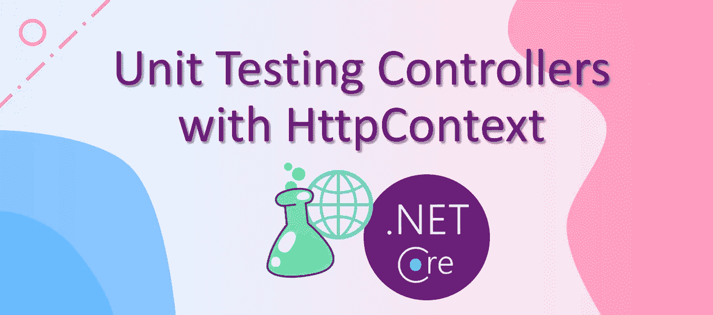

# 单元测试控制器

> 原文：<https://levelup.gitconnected.com/unit-testing-controllers-9e832bca1bae>

## 如何用 HttpContext、Request、ModelState 对操作方法进行单元测试

我们针对控制器进行不同级别的测试。当单元测试控制器逻辑时，测试只执行动作方法本身，而不通过框架的请求/响应管道。换句话说，过滤器属性(例如，`Authorize`属性)、模型绑定和中间件不影响控制器的单元测试。因此，单元测试控制器逻辑非常类似于测试一个常规的类，我们可以模拟依赖关系，存放输入值并验证输出。

然而，有一点很特别，控制器有一个隐式的依赖关系，`ControllerContext`，它是从`ControllerBase`继承来的。`ControllerContext`包括`HttpContext`、`ModelState`、`Request`、`Response`等常用特性。

在本文中，我们将回顾一些单元测试涉及`HttpContext`的动作方法时的用例。例如，一个动作方法基于`ClaimIdentity`检查当前用户的角色，一个动作方法检查 HttpRequest 头值。我们将看到如何上演`HttpContext`和`Request`。按照类似的方式，我们也应该知道如何在单元测试中放置`Response`和`ModelState`。

源代码在[我的 GitHub 库](https://github.com/dotnet-labs/ControllerUnitTests)里。现在让我们开始吧。

# 要求

声明通常用于检查权限和/或区分结果。例如，在一个 action 方法中，我们可以首先使用`User.FindFirstValue(ClaimTypes.Role)`获得一个用户的角色，然后根据角色的权限级别确定下一步。

当单元测试一个动作方法时，我们想要检查不同用户角色的行为，因此我们需要模拟不同的用户访问 API 端点。在这种情况下，我们可以配置控制器的`ControllerContext`并为期望的用户设置`HttpContext`。让我们来看看下面的测试。

在上面的代码片段中，第 1 行到第 5 行向用户展示了一个`Admin`角色。然后，第 6 行到第 9 行实例化一个控制器实例，并将一个`HttpContext`附加到控制器上，其中的`HttpContext`包括登台用户。这样，第 11 行执行测试中的 action 方法，其余的被断言。

同样，我们可以安排不同种类的声明，并将它们绑定到控制器上进行测试。

# 请求标题

知道了如何将`HttpContext`连接到控制器，我们可以尝试配置 HTTP 请求。

让我们以一个人为的动作方法为例，它具有基于请求头中语言的逻辑，其中语言值可以通过使用`var lang = Request.Headers["lang"].ToString();`获得。为了准备一个请求头键值对，我们可以首先将一个`HttpContext`附加到控制器，然后设置所需的请求头。

下面的代码片段显示了一个单元测试示例。

第 5 行在请求头集合中设置了一个键值对。注意，第 3 行是必需的，因为`Request`对象位于`HttpContext`中。

# 模型状态

由于单元测试不通过模型绑定过程运行，因此如果单元测试需要检查依赖于`ModelState`的一些逻辑，那么`ModelState`应该被分阶段。

类似于`HttpContext`和`Request`，我们可以根据自己的需要来操纵`ModelState`对象。`ModelState`对象存在于控制器中，因此暂存`ModelState`可以很简单。让我们看看下面的示例测试。

在上面的代码中，第 3 行和第 4 行演示了如何改变`ModelState`对象。这段代码让我们能够验证动作方法中的验证逻辑。

今天到此为止。同样，源代码可以在[我的 GitHub 库](https://github.com/dotnet-labs/ControllerUnitTests)中找到。感谢阅读。