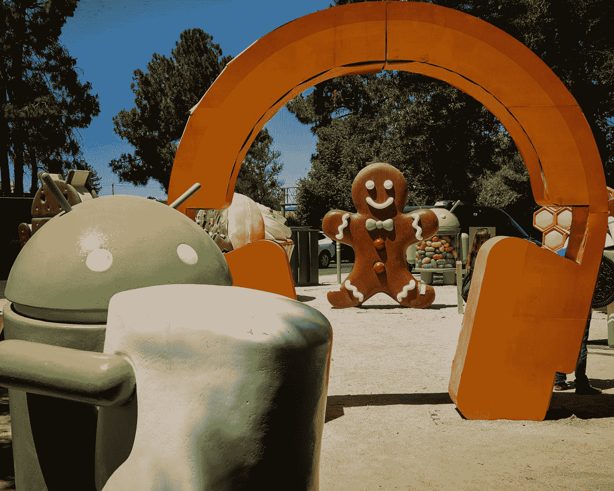

# Android 中的单元测试自定义视图

> 原文：<https://levelup.gitconnected.com/unit-testing-custom-view-in-android-56cab3eb0d7e>

[马克老板](https://unsplash.com/@vork?utm_source=medium&utm_medium=referral)在 [Unsplash](https://unsplash.com?utm_source=medium&utm_medium=referral) 上的照片

原刊[此处](https://syllogismobile.wordpress.com/2020/06/17/unit-testing-custom-view-in-android/)。

# 前言

在这篇短文中，我想提出一个对 Android 视图进行单元测试的方法。

任何曾经编写过 UI 测试的人都知道它非常慢(就实现和执行而言)，并且容易出错和出现许多问题(尤其是在 CI 上运行)。Robolectric 改善了这种情况，但仍有自己的问题。

我想提出一个替代的解决方案，虽然不是在所有地方都适用，但可能会为 UI 测试提供一个更快、更好、更稳定的选择。

# 给我密码

如果你更喜欢玩代码，这里有包含本文中使用的所有代码的 [repo](https://github.com/IljaKosynkin/android-unit-testing-view) 。

# 高级概述

那么具体的方法是什么呢？

主要的想法是，我们不需要检查我们的 UI 是否正确显示(大多数时候),我们真正需要的是确保我们已经设置了正确的变量或使用正确的参数调用了正确的函数。

这是什么意思？这意味着如果我们能确保我们的代码调用:

`view.setBackgroundColor(R.color.red)`

我们不需要检查我们的视图是否变成红色，因为我们假设框架工作正常。好吧，如果没有，那也不是你可以直接解决的事情，你只能绕过它。

我想展示的解决方案利用了定制的 Android 视图和 Mockk，这使我们能够准确地实现我们想要的——检查方法是否被调用的能力，而不需要拖着整个 Android 框架一起测试。请注意，这种技术适用于 Activity，但是，由于您不能手动创建 Activity 的实例，您仍然需要 Robolectric 或 instrumentation 来为您提供这种功能，这就消除了这种方法的许多好处。

# 自定义视图

我将从代码的演示开始，因为代码并不多:

布局看起来像这样:

请注意，在 init 中，我们只有一个 LayoutInflater 调用，并且是针对每个设计的。我们将使用来自 mock 的 spyk 来用 mock 替换 Android 功能，同时仍然保持我们的逻辑完整。问题是，对于 spyk，您需要一个已经创建的实例，这意味着除了 init 中的基本 UI 初始化之外，我们不能做任何事情。这也是我们移动大部分实际设置代码进行初始化的原因。这是该方法的一个缺点:您必须拆分逻辑，然后在某个地方手动调用初始化。

# 将视图集成到活动中

这是一个显而易见的问题，我在这里添加它是为了完整。

布局:

代码:

如您所见，它只是一个包装器，用一些模拟数据在实际设备上呈现我们的 CustomView。

# 测试

好了，我们终于谈到了文章的核心部分。让我展示测试代码:

我觉得还是从最底层开始比较好，伴侣对象在哪里。如您所见，我们定义了两个函数:在套件之前运行和在套件之后运行。首先，我们确保模拟了 LayoutInflater(因此我们可以稍后模拟 LayoutInflater.from 方法),在第二个步骤中，我们取消对它的模拟，以确保其他测试没有出错。在真实的场景中，您可能会在所有视图测试的基础抽象类中拥有这些方法。

接下来，我们来看看套件顶部的设置方法。在这里，我们用@ MockK 注释初始化上面声明的模拟，用 spyk 创建一个测试主题，然后用模拟为我们的主题设置视图。这是该方法的第二个缺点——因为在测试中没有“真正的”布局，所以我们需要模拟我们想要在测试中验证的每一个 UI 组件。这可以创建相当多的样板代码，但同时允许您根据需要对代码进行微调。

在这之后，测试本身是相当琐碎的:首先，我们验证 initialize 方法中的逻辑，第二，我们验证 update 方法正确地更新 UI。

# 结束语

我明白这种方法肯定不会对每个人都有效，它也有缺点。然而，我真的希望它至少能为一些开发人员提供一个更好的方法来处理 UI 测试，也许还能引发一场讨论，最终产生一个更好的解决方案！

在这一点上，我想祝你一切顺利，希望能在下一篇文章中见到你！