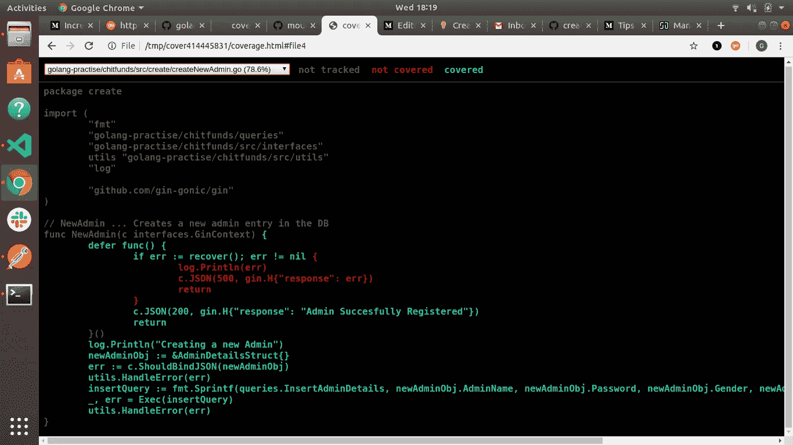

# Go 中的单元测试与现实世界的例子

> 原文：<https://levelup.gitconnected.com/unit-testing-in-go-205ada2b9d7c>

有许多文章展示了如何在 Go 中进行单元测试，但是其中许多文章只涉及基本单元测试的简单情况。对更深层次的概念没有什么透彻的了解。在本文中，我希望涵盖更复杂和真实的单元测试示例。我们将测试一个与数据库交互的 API 端点。

由于大多数关于 Go 单元测试的现有文章只关注一个简单的例子，所以没有嘲讽，没有存根，没有复杂的数据类型，没有接口。对我来说，能够为我的代码编写有用的单元测试是一件非常痛苦的事情。我的目标是通过提供我的经验和见解来帮助其他初学者节省一些时间。

# **我们将从本文中学到什么**

我们将测试一个 REST API 处理函数，它简单地绑定输入请求负载并将数据存储到 MySQL 数据库中。我将使用 Gin 框架，但是结果可以应用于任何 API 库。

首先，我们将看看我最初编写的一些紧密耦合(不正确)的代码。

让我们大致了解一下代码的作用。

`NewAdmin`函数接受一个类型为`*gin.Context`的参数，该参数包含与请求和响应相关的所有细节。

`ShouldBindJSON`将请求与`AdminDetailsStruct`对象绑定，并填充作为请求一部分的细节。如果与结构细节有任何不匹配，它将返回一个错误。

然后我们形成一个`query`和`Exec` 将执行查询。`connection.SQLConn`属于`*****mysql.Db` **类型。**

现在您已经对代码做了简要的概述，我们现在讨论如何实际测试。

## 上述代码中的错误

我写的初始代码中有一些错误，使得单元测试变得困难:

*   函数参数与特定类型紧密耦合
*   模仿一个外部包的功能(`connection.SQLConn.Exec`)。很多文章建议使用 monkey 补丁和接口。我个人反对猴子打补丁，使用接口需要开发人员真正擅长编写可测试的代码。

## 重构和构建应用程序

所以第一件事就是重构代码，使之松散耦合。重构后的项目结构如下。


`connection` - > `main.go`这将在服务器启动时打开一个连接并初始化一次。

`interfaces`->-`main.go`为`*gin.Context`定义了一个接口。`*gin.Context`有很多方法，但是对于我们的用例来说，这两种方法已经足够好了

`create`->-`createNewAdmin.go`

`create`->-

`create`->-`structs.go`

不要担心代码，我们一会儿将逐行讨论。

如果你注意到了不同，我们做了两个改变:

*   我没有接受`*gin.Context`作为函数参数，而是将其改为包含`JSON`和`ShouldBindJSON`方法的接口。所以任何实现这两个函数的结构都可以作为函数参数传递。
*   我们已经将`connection.SQLConn.Exec`赋给了一个变量。我们这样做的原因是，它给了我们在运行时通过其他函数改变变量的灵活性。任何改变这个变量的函数都必须分配一个具有相同 fn 参数类型和返回值的函数。

## 编写单元测试的步骤

*   步骤 1:创建一个实现`JSON`和`ShouldBindJSON`方法的结构(`ginContext`是这个结构)。
*   步骤 2:创建一个类型为`ginContext`的变量，并将其作为参数传递给`NewAdmin`。每当`JSON`或`ShouldBindJSON`函数触发时，不调用 Gin 的方法，而是调用测试函数传递的 struct 的方法。
*   第三步:将保存`connection.SQLConn.Exec`的`Exec`变量赋给一个虚拟变量，并将一个模拟函数赋给`Exec`。所以每当调用`Exec()`而不是调用实际的 MySQL `Exec()`时，它调用测试文件`Exec()`。
*   步骤 4:测试功能执行完成后，将`Exec`赋值为初始值。这确保了其他的测试不会受到这个变化的影响。

> **注意:当你做这样的事情时，永远不要并行运行测试。由于比赛条件，这可能会导致一些恶劣的影响。**

`ShouldBindJSON`中写的代码绑定虚拟数据。你现在不需要担心。

最后，我们需要测试我们的测试覆盖的代码量。

```
go test -coverprofile=c.out && go tool cover -html=c.out
```

只需运行这个命令，您就会在系统的默认浏览器中看到覆盖率报告



这是我写的第一篇关于 Medium 的文章，所以任何建议或改进都会被欣然接受。

[](https://gitconnected.com/learn/golang) [## 学习围棋-最佳围棋教程(2019) | gitconnected

### 22 大围棋教程-免费学习围棋。课程由开发者提交和投票，使您能够找到…

gitconnected.com](https://gitconnected.com/learn/golang)