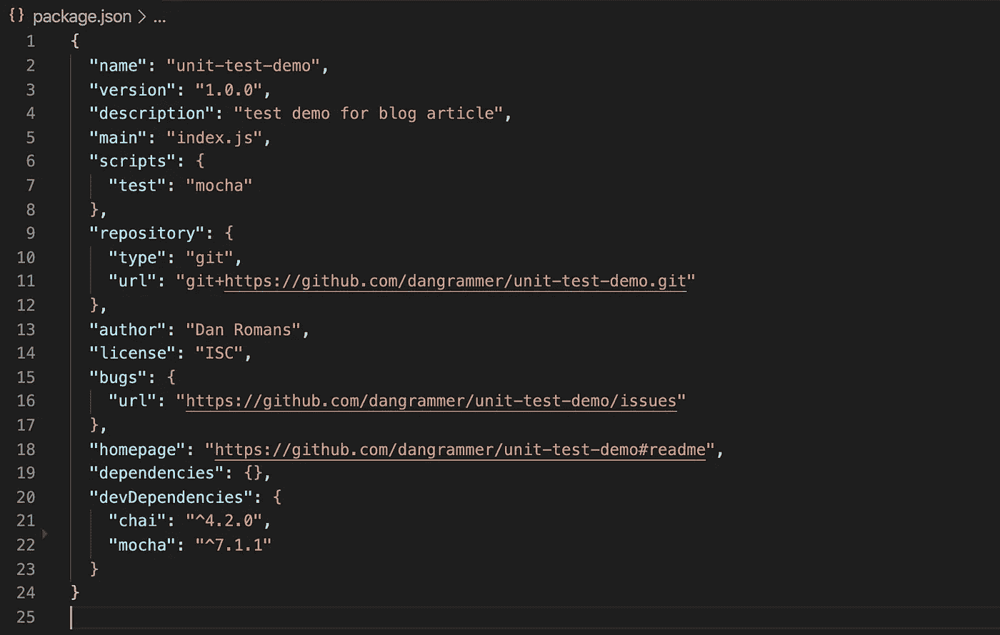
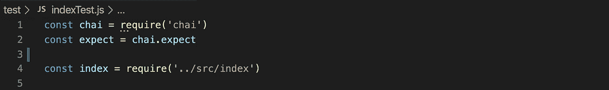
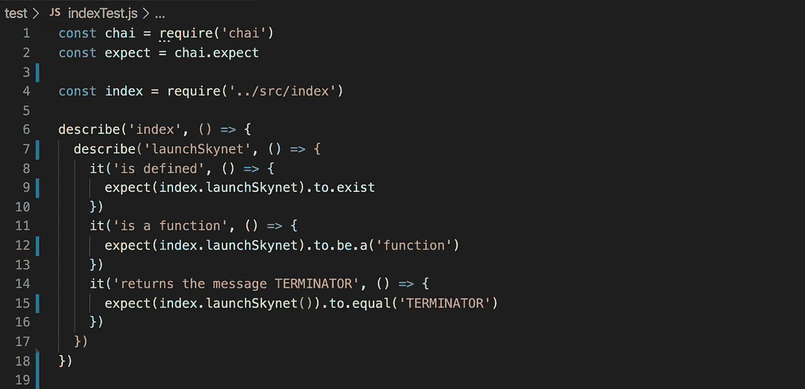
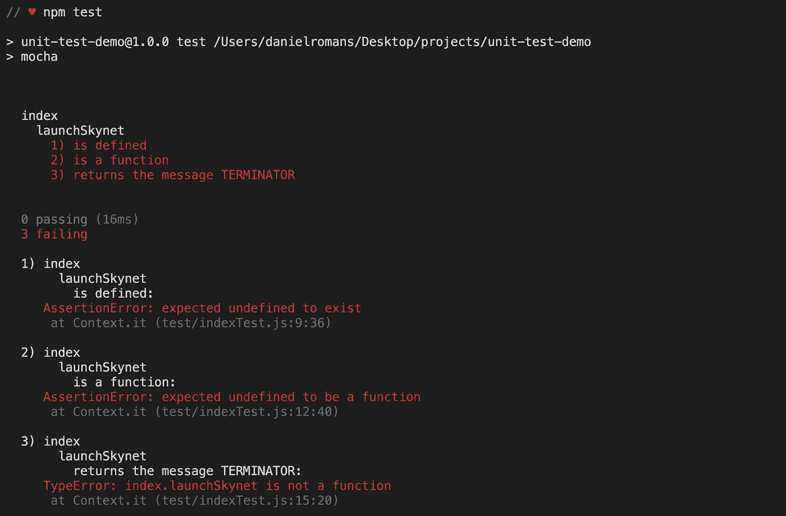
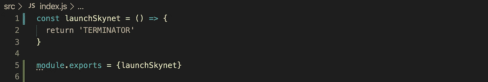
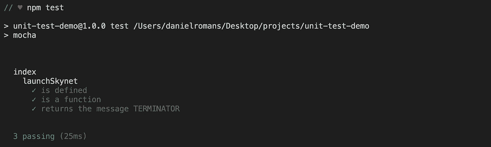

# 面向初学者的 JavaScript 单元测试

> 原文：<https://levelup.gitconnected.com/unit-testing-in-javascript-for-beginners-cf6db5c72fbc>


“是啊。我会飞。”

测试是一个非常有价值的过程。甚至托尼·斯塔克也做测试。在没有测试的情况下构建任何东西，都是在假设的基础上构建的。这是一种潜在的危险、昂贵或低效的方法。计算机编程是许多真正受益于测试的复杂构建实践之一。作为一个初学者，它不是一个课程或项目成功的必要条件，但是，在规模化的专业水平上，测试是标准的，这样网站不会崩溃，数据库不会损坏，天网不会在审判日进行报复。即使对初学者来说，测试也是一项需要掌握和养成习惯的技能。本文将通过运行时`[Node.js](https://nodejs.org/en/)`帮助指导`JavaScript`中单元测试的基本设置。

有不同类型的开发，*例如*行为驱动、错误驱动、测试驱动。我们将关注测试驱动的开发，它优雅地采用了单元测试。测试驱动的开发支持快速反馈循环的概念——构建、测试、重构、重复——这意味着关注小的部分或单元。请记住，测试有不同的模式，*例如，*集成、系统、验收，但是单元测试是测试序列的第一层。从底层到顶层，从细节到大局。单元测试是至关重要的基础，程序员只需做一点准备就可以轻松完成。

如果您已经编写了一个程序，然后运行该程序来评估性能，或者向控制台记录一条消息来验证数据类型或返回值，那么您已经执行了一次单元测试，尽管这是一次低效的测试。初学者的一个习惯，我可以说是舒适区，是依赖`console.log`和终端输出。这有时是一个很好的过程，但是随着代码库越来越复杂，它很快就变得不可行了。有一个模块化的概念——可以说是一种分工——这意味着一个程序文件可以从另一个脚本，一个测试脚本中进行测试。这允许一个有组织的、模块化的测试套件，它可能是自动化的。

多亏了我们在万维网上的好朋友，现在有了测试框架来赋予我们功能和更大的便利性。本指南将使用一个名为`[Mocha](https://mochajs.org/)`的开源`JavaScript`测试框架，用于`Node.js`和网络浏览器，以及一个名为`[Chai](https://www.chaijs.com/)`的补充断言库。注意，还有其他的测试框架和断言库，`Mocha`和`Chai`只是很普通，用得很好。带上你的咖啡师，我们开始吧。


一杯非常好的咖啡。

在这个例子中，我将使用一个基本的`Node.js`文件。我假设您的项目的文件目录和包管理器已经安装并启动。否则，停下来看看如何启动你的项目，无论是`Node.js`、`React`、`Angular`、`Vue`等等。只要您有一个文件目录、像`index.js`这样的根文件和`package.json`文件，您就应该能够理解。抱歉`Yarn`用户，但你可能还是会跟着做。

首先，有一个名为`unit-test-demo`的父目录，一个简单的文件结构，包括一个`index.js`文件，我将在其中编写一个程序，位于名为`src`的目录中(source——这是一个常规目录),以及一个与`package-lock.json`文件配对的`package.json`文件。

```
|-- unit-test-demo
| |-- src
| | |-- index.js
| |-- package-lock.json
| |-- package.json
```

对于下一步，我通常会看到首先安装的包和依赖项，但是我喜欢首先为要添加的工作准备我的文件结构。对我来说，工作站在工具出来之前就准备好了是有道理的。这就是我，做让*你*开心的事。

从前面对模块化的讨论中我们知道，我们应该创建一个专用的测试目录。这很重要，因为程序最终会增长，并且因为`Mocha`测试框架依赖于所述测试目录。在测试目录中，我们可以创建一个特定于我们想要运行单元测试的文件的测试文件，在本例中是`index.js`。您可以直接使用您的文本编辑器或者使用终端命令来创建测试目录和文件。从父目录中(单元测试演示):

```
mkdir test
```

然后从测试目录中:

```
touch indexTest.js
```

文件结构将如下所示:

```
|-- unit-test-demo
| |-- src
| | |-- index.js
| |-- test
| | |-- indexTest.js
| |-- package-lock.json
| |-- package.json
```

现在可以安装`Mocha`和`Chai`了。在终端中运行两者的安装命令。`i`是缩写的`install`命令，`--save-dev`是将安装保存为项目开发依赖项的标志。

```
npm i mocha --save-devnpm i chai --save-dev
```

瞧啊。您的 taquitor 应该已经成功安装了新的 brew。你可以通过检查`package.json`文件来验证。注意`“devDependencies”`键。



***注线** `**7**`。安装完`Mocha`后，我手动添加了`“mocha”`作为测试脚本。这使得测试可以通过使用终端命令`npm test`来运行。

用`Mocha`进行测试的语法近似于英语，而`Chai`则细化了这种近似。您可以不用像`Chai`这样的断言库来编写测试，但是由于断言库如此普遍地被使用并且使得编写测试更加容易，我们将直接跳到它上面。如果你想用`Mocha`探索更基本的测试，请探索[文档](https://mochajs.org/)或其他资源。

首先，让我们准备好`indexTest.js`文件来使用测试工具。`Mocha`被我们的测试脚本触发和访问。我们需要使用`Node.js()` `require()`函数来导入`Chai`。我们将把它赋给一个变量，然后建立`[expect](https://www.chaijs.com/guide/styles/#expect)`断言风格并把它赋给一个变量。我们还将`require()`我们想要测试的`index.js`文件。



接下来，我们来看一个单元测试。编写它是为了测试`index.js`文件中一个名为`launchSkynet`的函数。仔细检查一下，然后我们会分解它。



第`6`行是单元测试的外部范围。`describe()`函数接受两个参数:一个描述符和一个回调，用于指定和分组测试主题。可以看到，`describe()`是可以嵌套的。通俗地说:一个名为`index`的文件正在被评估。在`index`内部，一个名为`launchSkynet`的函数正在被评估。

在第`8`、`11`和`14`行，我们看到了`it()`函数。`it()`也接受一个描述符和一个回调，并评估一个特定的测试用例。这里，我们有三个测试用例:

1.  是否定义了`launchSkynet`？
2.  `launchSkynet`是函数吗？
3.  `launchSkynet`是否返回消息:`string` `TERMINATOR`？

这就是`Chai`的用武之地。在每个`it()`函数的回调中，会产生一个断言。在这种情况下，使用了 expect 断言样式，除了去掉空格、用点符号连接和用括号修改之外，它看起来就像英语一样简单！

*   我期望名为`launchSkynet`的东西存在于名为`index`的文件中。
*   我希望`index`中叫做`launchSkynet`的东西是一个函数。
*   我期望`launchSkynet`返回的值是`TERMINATOR`。

太棒了，我们已经编写了一个单元测试！现在我们可以使用终端命令`npm test`来执行测试。



这就是用像`Mocha`这样的框架编写单元测试的强大之处:多个指导性错误消息的整洁列表直接显示在终端输出中。谢谢你，塔吉特。当你有这样的信息时，你——*或另一个程序员*——确切地知道`index.js`文件中需要什么。让我们定义一个名为`launchSkynet`的函数，它返回`string` `TERMINATOR`。注意，由于我们正在处理一个基本的`Node.js`项目，我们需要用`module.exports`导出`index.js`模块。



如果我们用`npm test`再次运行我们的测试，我们应该看到通过测试的摘要，而不是失败的测试和错误消息。



当然，测试可能会变得更加复杂，处理异步代码等等，但是本指南旨在让您熟悉测试的概念以及在`JavaScript`中开始测试所需的基本工具集和指令。浏览一些文档并编写一些测试！请尽你的一份力量来阻止天网和审判日。

【github.com/dangrammer
T5[linked.com/in/danieljromans](https://github.com/dangrammer)
danromans.com