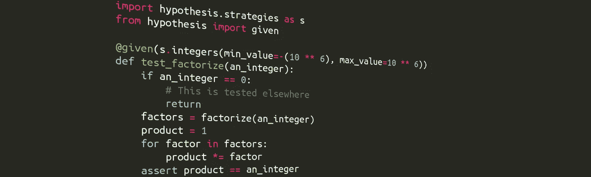
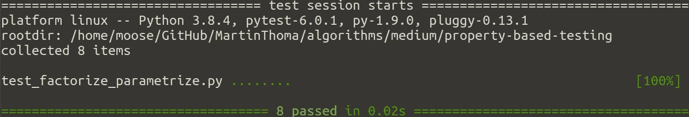
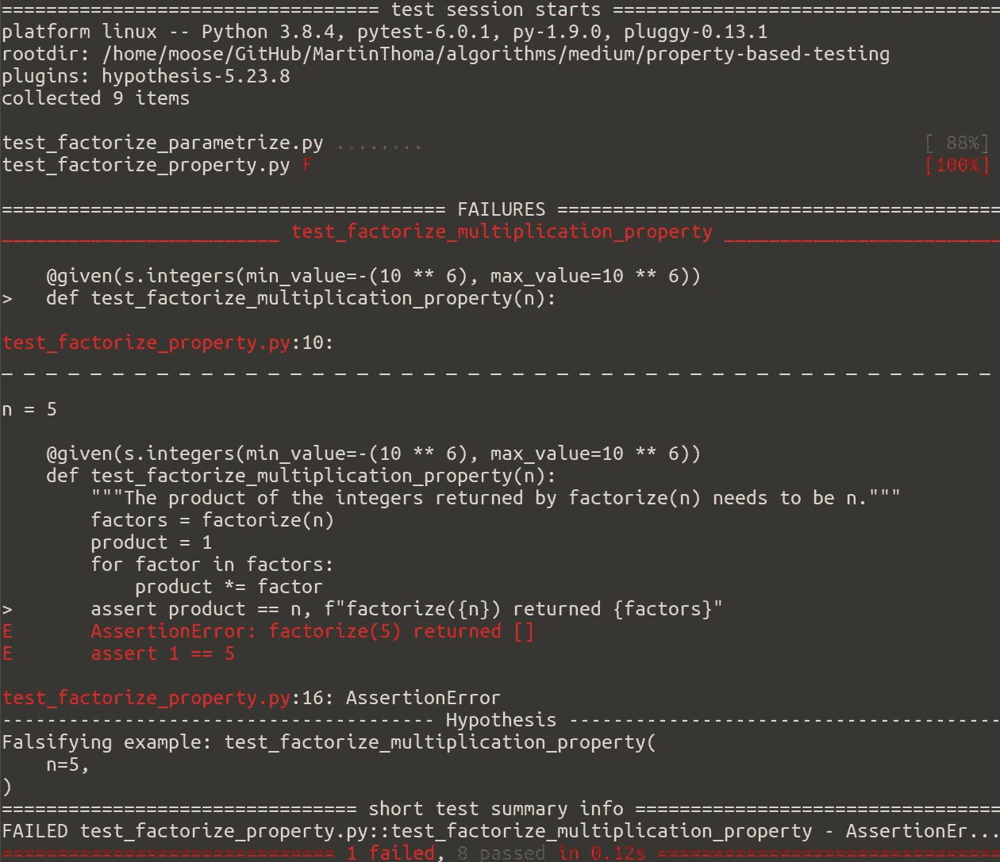
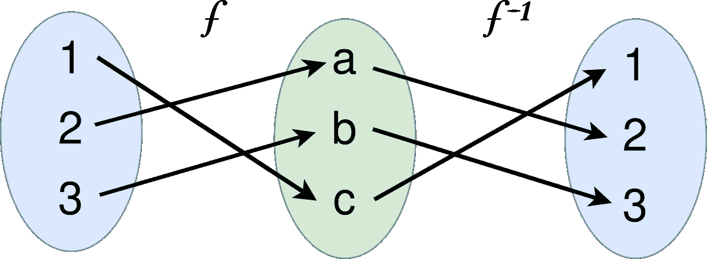

# 基于属性的 Python 测试

> 原文：<https://levelup.gitconnected.com/unit-testing-in-python-property-based-testing-892a741fc119>

## 类固醇的测试参数化



图片作者:马丁·托马斯

当你编写单元测试时，很难找到正确的测试用例。你想确定你报道了所有有趣的案例，但是你可能不知道或者忘记了其中的一个。例如，如果您对一个接收整数的函数进行单元测试，您可能会考虑测试 0、1 和 2。但是你想过负数吗？大数字呢？

我们只是在考虑整数的测试策略。策略是数据的生成器。属性测试框架`hypothesis`为[提供了许多类型的策略](https://hypothesis.readthedocs.io/en/latest/data.html)。可以用`pip install hypothesis`安装。

我们可以对这些输入——那些测试策略——做的一件事是检查运行时是否可接受，以及被测试的函数/方法是否不会崩溃。

如果我们将函数的输出与某些东西进行比较，效果会更好。检查等式是不可能的，所以我们需要知道函数的一个属性。一个我们一直期望保持的不变量。我们需要将我们的测试建立在函数的固有属性上。

为了进一步激发您对基于属性的测试的兴趣:

# 示例:整数因子分解

我们有一个函数`factorize(n : int) -> List[int]`，它接受一个整数并返回质因数:

> 如果一个整数 n 是正数，并且能被 1 和 n 这两个数整除，则称它为素数。

我们希望返回的整数的乘积就是数字本身。这就是我们如何设计函数行为:

*   factorize(0) = [0] —一个异常也是合理的
*   因式分解(1) = [1] —严格来说，1 不是素数。
*   因式分解(-1) = [-1] — …两者都不是-1
*   因式分解(-n) = [-1] +因式分解(n)，n > 1

实现可能如下所示:

你可能会对这里的环境感到有点不安

```
while i <= int(math.ceil(number ** 0.5)) + 1:
```

因此，您编写一个测试来检查重要的情况:

如果不熟悉测试参数化，您可能希望[阅读 py test . mark . parameter ize](https://towardsdatascience.com/unit-testing-in-python-structure-57acd51da923)。这太棒了，这几行运行了 8 个测试:



正在运行 pytest。马丁·托马斯截图。

对于`factorize`，基于属性的测试会是什么样子？

首先，我们需要考虑我们想要测试的属性。对于我们设计的`factorize`,我们知道返回数字的乘积等于数字本身。我们可以放入任何整数，但是如果整数变得太大，运行时间就会太长。所以让我们把它们限制在+/-一百万的合理范围内:

现在我们用`pytest`运行测试:



假设发现一个问题！马丁·托马斯截图。

正如你在上面的例子中看到的，`hypothesis`发现`factorize(5)`返回了一个空列表，它不会乘以 5。然后我们可以很快发现，我们实际上对所有的素数都犯了一个错误——我们需要把素数相加。添加以下代码行后，测试运行正常:

```
if number != 1:
    factors.append(number)
```

在失败的例子中值得注意的一件奇怪的事情是，它失败的地方是最小的正整数。这不是巧合。属性测试框架试图找到一个导致测试失败的简单例子。这个过程叫做[收缩](https://hypothesis.readthedocs.io/en/latest/data.html#shrinking)。

# 假设产生了什么？

你可以看看这样的例子:

```
from hypothesis import strategies as stst.lists(st.integers()).map(sorted).example()
```

# 我可以在哪里应用基于属性的测试？

这种模式适用于一些验证成本较低的算法:

*   [Arg max](https://en.wikipedia.org/wiki/Arg_max) :遍历列表，确保没有其他元素更大。
*   解一组方程:验证这个解实际上是一个解。
*   [约束满足](https://en.wikipedia.org/wiki/Constraint_satisfaction):验证解决方案满足所有约束。
*   所有 [NP 完全问题](https://en.wikipedia.org/wiki/NP-completeness):这是一组决策问题，很难找到答案，但很容易验证找到的答案。旅行推销员就是一个例子。给定一组推销员必须去的城市，有没有一个他能去的最长为 L 的旅行？鉴于这样的游览，很容易验证。不过，计算这样一次旅行可能很难。

较弱但仍有帮助的检查是验证返回值是否在候选集合中:

*   [最大公约数](https://en.wikipedia.org/wiki/Greatest_common_divisor):确保**实际上是**除数。
*   最短路径:确保**是一条**路径。
*   排序和排名:确保列表中的元素与之前的完全相同。也许你还可以测试排序/排名标准？
*   过滤:断言相关数据仍然存在/其他数据已被删除。

# 生成到测试模式

有时很容易生成一个样本来测试您感兴趣的函数。对于上面的因式分解的例子，你可能有一个已知素数的列表，你乘以它们的随机子集。如果你写一个函数来检查一个字符串是否是回文，你可以很容易地首先生成一个回文。如果您想检查文本是否包含给定的字符串，您可以在该字符串周围添加随机文本，然后进行检查。

# 示例:测试数据结构

我实现了一个区间数据结构，它有一个方法`issubset`

# 字符串验证

`hypothesis`可以生成一些特殊的字符串，例如电子邮件地址和 IP 地址。这意味着您可以轻松地检查函数的阳性情况，这些函数决定某个东西是 IP 地址还是电子邮件地址:

# 可逆函数



函数及其反函数。图片由马丁·托马斯提供。

如果您有一个函数和它的反函数，比如加密/解密或序列化/反序列化函数，您可以一起测试它们。测试策略应该只给出域内的值。

例如，如果我们想要测试`b64encode` / `b64decode`，测试将会是:

这个测试现在也证明了这两个函数属于同一类，并且应该按这个顺序使用。

# 神谕


照片由[珍·西奥多](https://unsplash.com/@jentheodore?utm_source=medium&utm_medium=referral)在 [Unsplash](https://unsplash.com?utm_source=medium&utm_medium=referral) 拍摄

在复杂性理论中，神谕是一个黑匣子，它能即时提供问题的解决方案。在这种情况下，这只是我们认为正确的第二个实现。如果你有一个复杂的算法问题，你可能首先要实现一个强力的解决方案，然后用这个更容易理解的解决方案来测试你更快的算法。蛮力算法就是神谕。

# 使用类型注释！

我喜欢字体注释💓如果你没有使用它们，我强烈推荐你阅读关于[类型注释](https://medium.com/analytics-vidhya/type-annotations-in-python-3-8-3b401384403d)和渐进打字的内容。

类型注释与基于属性的测试相关，因为带注释的类可以用来生成该类的随机对象。作为一名研究机器学习主题的数据科学家，我通常希望在预处理/后处理步骤中使用这种方法，因为感兴趣的对象可能相当复杂。假设是如何支持和产生这些结果的:

当您开发具有复杂业务逻辑的 web 应用程序时，它也会有所帮助。

# 最要紧的东西

我见过同样的概念被称为*生成测试*和*数据驱动测试*。第一个还好；我们为测试生成样本数据。

然而，我不会称之为*数据驱动测试*。我们没有获得真实世界的数据来生成我们的测试用例。

反过来想也很有趣:如果我们现在测试属性，那么我们之前测试的是什么？安德里亚·莱奥帕尔迪称之为基于实例或基于表格的测试。

基于实例的测试有利于覆盖已知的极限情况，而基于属性的测试有利于发现未知的极限情况。

我还要说，基于属性的测试几乎和模糊化一样。 [@nelhage](https://medium.com/u/92606ca29d25?source=post_page-----892a741fc119--------------------------------) 对此有更详细的阐述:

 [## 基于属性的测试越来越模糊

### “基于属性的测试”指的是编写对代码真实的语句(“属性”)，以及…

blog.nelhage.com](https://blog.nelhage.com/post/property-testing-is-fuzzing/) 

# 摘要

基于属性的测试不会取代基于实例的测试，而是对基于实例的测试的补充。它有时以非常简洁的形式记录属性，并有助于发现未知的边缘情况。执行基于属性的测试比执行基于示例的测试花费更多的时间。hypothesis 是编写基于属性的测试的一个很好的 Python 框架。

# 下一步是什么？

在这个系列中，我们已经有了:

*   第 1 部分:[Python 中单元测试的基础知识](https://medium.com/swlh/unit-testing-in-python-basics-21a9a57418a0)
*   第 2 部分:[补丁、模拟和依赖注入](/unit-testing-in-python-mocking-patching-and-dependency-injection-301280db2fed)
*   第 3 部分:[如何用数据库、模板和受保护的页面测试 Flask 应用程序](https://medium.com/analytics-vidhya/how-to-test-flask-applications-aef12ae5181c)
*   第 4 部分: [tox 和 nox](https://medium.com/python-in-plain-english/unit-testing-in-python-tox-and-nox-833e4bbce729)
*   第 5 部分:[结构化单元测试](https://medium.com/python-in-plain-english/unit-testing-in-python-structure-57acd51da923)
*   第 6 部分:[CI-管道](/ci-pipelines-for-python-projects-9ac2830d2e38)
*   第 7 部分:[基于属性的测试](/unit-testing-in-python-property-based-testing-892a741fc119)
*   第八部分:[突变检测](https://medium.com/analytics-vidhya/unit-testing-in-python-mutation-testing-7a70143180d8)
*   第 9 部分:[静态代码分析](https://towardsdatascience.com/static-code-analysis-for-python-bdce10b8d287) — Linters、类型检查和代码复杂性
*   第 10 部分: [Pytest 插件到爱](https://towardsdatascience.com/pytest-plugins-to-love-%EF%B8%8F-9c71635fbe22)

如果您对使用 Python 测试的其他主题感兴趣，请告诉我。