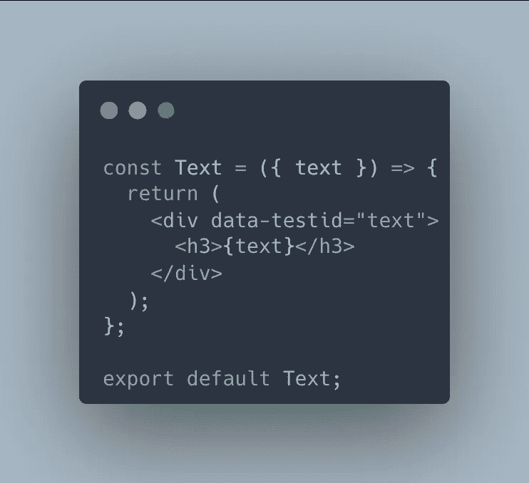
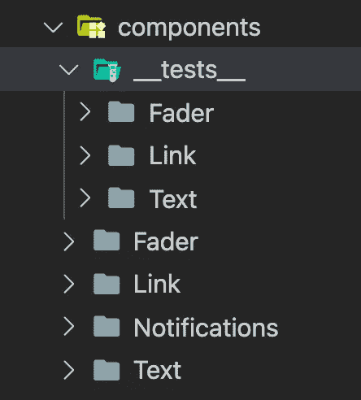
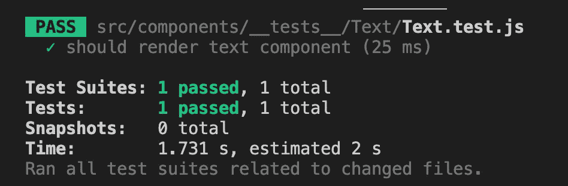
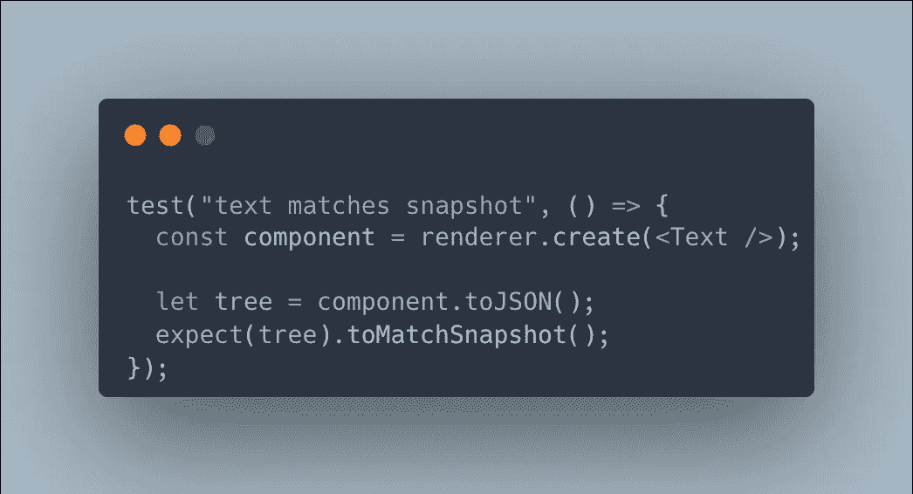
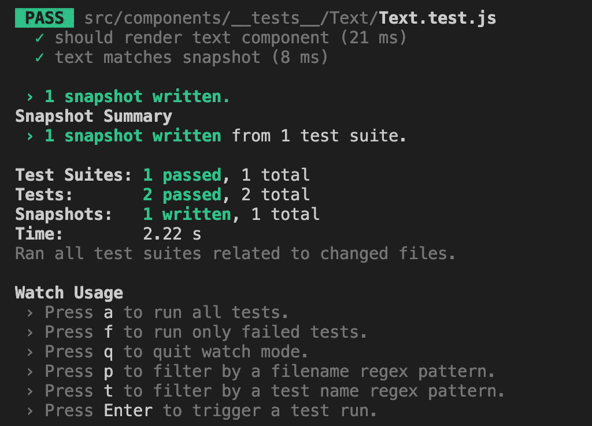
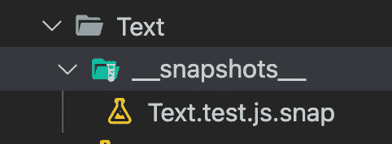

# React 中的单元测试

> 原文：<https://levelup.gitconnected.com/unit-testing-in-react-7301989565f2>

*react 中的单元测试*

*此处:*[*https://flatteredwithflutter.com/unit-testing-in-react/*](https://flatteredwithflutter.com/unit-testing-in-react/)

React 中的单元测试

我们将简要介绍:

1.  为组件编写单元测试
2.  用 Jest 进行快照测试

> *注:本文假设读者了解 React*


React 中的单元测试

# 关于单元测试

单元测试是一种孤立地测试单个软件单元的测试方法。这包括验证给定*输入*的功能或组件的*输出*。

就 React 组件而言，这意味着检查组件

*   按照指定道具的预期进行渲染。

主要目标是编写测试来验证我们的组件是否按预期工作。

[](https://youtube.com/shorts/4edYJZkmqs0?feature=share) [## 使用 Jest 在 React 中进行单元测试🤩👨‍💻# react js # react # shorts # programming @ aseem wangoo

### 我们将利用 jest 对我们的 react 组件进行单元测试。Jest 是一个 JavaScript 测试框架，旨在…

youtube.com](https://youtube.com/shorts/4edYJZkmqs0?feature=share) 

## 笑话介绍

我们将利用 [jest](https://jestjs.io/) 来测试我们的 react 组件。根据文件

> Jest 是一个 JavaScript 测试框架，旨在确保任何 JavaScript 代码库的正确性。它允许你用一个平易近人的、熟悉的、功能丰富的 API 来编写测试，并快速给出结果。

让我们看看如何安装它

*   安装以下开发依赖项

```
npm i --save-dev @testing-library/react react-test-renderer
```

> 注意:确保您的`react`和`react-test-renderer`使用相同的版本

## 为组件编写单元测试

我们将从创建一个简单的文本组件开始，如下所示



简单文本组件

它接受一个参数`text`，并使用`h3`样式标签显示在屏幕上。

> 记下**数据测试 id。**这将用于测试该组件

现在让我们测试这个组件，

*   我们创建了一个名为`__tests__`的文件夹，它位于`components`文件夹中。在其中，我们创建特定于组件的文件夹



文件夹结构

我们在`components`下有所有的组件，在`__tests__`下有所有的测试，这样我们可以为每个组件创建子文件夹。

例:对于`components/Text`，我们在`components/__tests__/Text`文件夹下有相应的测试

*   所有的测试都应该包含惯例`<TestName>.test.js`这有助于 jest 理解测试文件

所以我们的测试文件应该是`Text.test.js`

*   接下来，我们将包`*testing-library/react*` 和 jest 一起导入为

```
import { render, screen, cleanup } from "@testing-library/react";
import Text from "../../Text/Text";
import "@testing-library/jest-dom";
```

> 注意:我们还需要导入我们想要测试的组件。在我们的例子中，它是`Text`

*   这是我们测试的样子

```
test("should render text component", () => {
  render(<Text />); var textElem = screen.getByTestId("text"); expect(textElem).toBeInTheDocument();
});
```

**test** :这将创建一个测试闭包，并接受 par *am* `name`(您的测试的名称)和 param `fn`(您的测试的函数)

**呈现**:这来自于它呈现到一个容器中的`*testing-library/react*`，该容器被附加到文档体中。

> 在我们的例子中，我们呈现了`Text`组件

**screen** :这可以被认为是一个`document.body`，它包含了绑定到您在之前调用中呈现的组件的每个查询

> 我们将一个**数据测试 id** 分配给我们的文本组件，并尝试使用 [getByTestId](https://testing-library.com/docs/queries/bytestid/) 来获得它

最后，我们使用`expect`和`toBeInTheDocument`来测试元素是否存在于呈现的文档中。

`[jest-dom](https://testing-library.com/docs/ecosystem-jest-dom)`实用程序库提供了`.toBeInTheDocument()`匹配器，可以用来断言一个元素是否在文档的主体中。

*   使用运行测试

```
npm test
```



单元测试的结果

并且，我们编写了我们的第一个测试🎉🎉🎉

# 用 Jest 进行快照测试

当你想确保你的用户界面不会发生意外变化时，快照测试是一个非常有用的工具。

任何快照测试用例都会呈现一个 UI 组件，获取一个快照，然后将其与测试旁边存储的参考快照文件进行比较。如果两个快照不匹配，测试将失败:要么是意外的更改，要么是引用快照需要根据 UI 组件的新版本进行更新。

让我们测试一下我们的`Text`组件。



用 Jest 进行快照测试

*   我们将使用我们在上一步中安装的`*react-test-renderer*` 库。

我们可以使用测试渲染器为 React 树快速生成一个可序列化的值，而不是渲染图形用户界面，这需要构建整个应用程序。

*   我们使用`renderer`来创建`Text`组件
*   接下来，我们使用`toJSON`将响应保存在 JSON 中
*   最后，我们使用`expect`来比较使用`[toMatchSnapshot](http://This ensures that a value matches the most recent snapshot)` 的结果，这确保了值匹配最近的快照。
*   使用运行测试

```
npm test
```



React 中的快照测试

> 注意:第一次运行快照测试时，不会出现任何快照。控制台将告诉生成快照

*   快照在`__snapshots__`文件夹中生成，如下所示



生成的快照


```
*Hosted URL:* [*https://funwithreact.web.app/*](https://funwithreact.web.app/)[*Source code*](https://github.com/AseemWangoo/expriments_with_react)
```