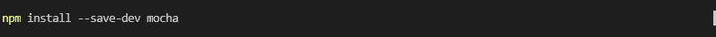
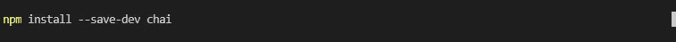
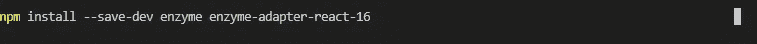
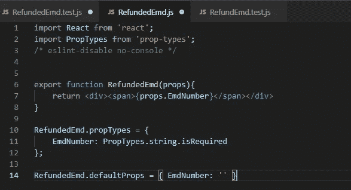

# 单元测试使用 Mocha、Chai、Enzyme 和 Nock 对 App 进行测试

> 原文：<https://levelup.gitconnected.com/unit-testing-reactjs-app-with-mocha-chai-enzyme-and-nock-e25fb0ef4a15>


摩卡，茶，酵素，诺克

几周前，当我在开发一个 React 应用程序时，我经历了为这个应用程序编写单元测试的练习。在这篇文章中，我将概述我是如何做的。我还写了启动 React 应用程序的过程，如果你想在这里阅读的话。因为我没有使用样板模板或 [create-react-app](https://github.com/facebook/create-react-app) 来启动应用程序，所以我必须手动连接测试环境。

# 摩卡

Mocha 是一个非常常见的用于测试运行的 JavaScript 框架。它拥有一个巨大的社区和一个庞大的支持生态系统。摩卡简单、灵活、有趣(从他们的标志中得来的)。你可以在这里和 [GitHub](https://github.com/mochajs/mocha) 上找到更多关于 Mocha [的信息。要将 Mocha 作为开发依赖项安装在您的应用程序中，请执行`npm install --save-dev mocha`](https://mochajs.org/)



将 Mocha 安装为开发人员依赖项的命令

# 柴

柴是一个断言库。Mocha 没有内置断言库，所以我选择 Chai 作为断言库。断言是一种声明测试中会发生什么的方式。Chai 文档指出:

> Chai 是一个用于[节点](http://nodejs.org/)和浏览器的 BDD / TDD 断言库，可以愉快地与任何 JavaScript 测试框架配对。

通过运行`npm install --save-dev chai`将 Chai 安装为开发者依赖项



将 Chai 作为开发人员依赖项安装的命令

# 酶

Enzyme 是一个辅助库，用于帮助测试 React 组件的输出。它是由 Airbnb 的工程师开发的。Enzyme 有助于测试组件，而无需在真实的浏览器中呈现它们。

> Enzyme 是 React 的一个 JavaScript 测试工具，它使测试 React 组件的输出变得更加容易。您还可以操纵、遍历和以某种方式模拟给定输出的运行时。
> 
> Enzyme 的 API 旨在通过模仿 jQuery 的 DOM 操作和遍历 API 来实现直观和灵活。

你可以在这里找到酶[的文档](https://airbnb.io/enzyme/)。*安装 enzyme 以及与您正在使用的 react(或其他 UI 组件库)版本相对应的适配器*。要安装，请执行`npm install --save-dev enzyme enzyme-adapter-react-16`



将 Enzyme 作为开发人员依赖项安装的命令

# 测试简单的组件

下面是要测试的基本组件。该组件呈现一个带有作为属性提供的数字的 div。



现在测试组件(代码如下):

1.  将要测试的组件导入到测试模块的范围中。
2.  从**酶**导入`configure` 。这使得酶能够与衔接子一起配置。
3.  从**‘酶-接头-反应-16’**导入`Adapter` 。请注意，我的反应版本是 16，因此从 16 进口。*要配置适配器，您应该在使用任何 Enzyme 的顶级 API 之前调用` Enzyme . configure({ adapter:new Adapter()})`，其中` Adapter `是对应于当前正在测试的库的适配器。例如从“酶-衔接子-反应-16”导入衔接子。*
4.  从**柴**导入`expect` 。期望或断言由函数`expect`生成，该函数采用生成值和期望值。
5.  进口反应，所以我们可以使用 JSX。
6.  从**酶**导入`shallow` 。这是为了允许测试组件的浅层渲染。Enzyme 的浅层渲染很重要，因为它允许您通过仅渲染最高/上层父组件来测试与其他组件隔离的组件。

参见下面的测试套件。

```
**import { configure, shallow }  from 'enzyme';
import { expect } from 'chai';
import Adapter from 'enzyme-adapter-react-16';
import { RefundedEmd } from './RefundedEmd';
import React from 'react';***/* 
Enzyme expects an adapter to be configured
To configure an adapter, you should call `Enzyme.configure({  adapter: new Adapter() })`before using any of Enzyme's top level APIs, where `Adapter` is the adapter corresponding to the library currently being tested. For example:**import Adapter from 'enzyme-adapter-react-16';
To find out more about this, see* [*http://airbnb.io/enzyme/docs/installation/index.html*](http://airbnb.io/enzyme/docs/installation/index.html) **/**// This connect enzyme to the react adapter* **configure({ adapter: new Adapter() });****describe('**Refunded Emd tests**',()=>{
** *// Should render \'Span with Emd in it\'*
 **it('**Should render \'<span>0864566536090</span>\' when supplied emd  \'0864566536090\'**', function() {****const emd =** '0864566536090';*// Using Enzyme's shallow to render the component. passing in emd* **const wrapper = shallow(<RefundedEmd EmdNumber={emd} />);***// Arranging the expected value*
  **const expectedContainedSpan =  <span>0864566536090</span>;***// Act* **const actualValue = wrapper.contains(expectedContainedSpan);***// Assert* **expect(actualValue).to.equal(true);
 });
})**
```

上面的测试套件从调用带有两个参数的 Mocha 函数`describe()` 开始:

1.  `string`:被测试的测试套件的名称或标题，在这里是`“Refunded Emd tests”`。
2.  `function` : 实现套件的代码块。

通过调用 Mocha 函数`it()`来定义测试，该函数也接受一个字符串和一个函数作为参数:

1.  `string`:测试的标题，在本例中为`“Should render \’<span>0864566536090</span>\’ when supplied emd \’0864566536090\’**’**`

b.)`function`:实现测试的代码块。在上面的测试中，它测试了一个组件应该在一个 span 中呈现所提供的数字。

为了安排和方便测试组件，我们使用来自 Enzyme 的`shallow`模拟呈现组件:

```
**const emd =** '0864566536090'; **const wrapper = shallow(<RefundedEmd EmdNumber={emd} />);**
```

> 浅层呈现对于约束自己将一个组件作为一个单元来测试是很有用的，并且可以确保你的测试不会间接断言子组件的行为。

我们*通过调用酶浅呈现组件包装器上的`contains`来执行*,预期跨度为数字。

```
*// Arranging the expected value*
  **const expectedContainedSpan =  <span>0864566536090</span>;***// Act* **const actualValue = wrapper.contains(expectedContainedSpan);**
```

# 作凹痕于

Nock 是一个模仿 HTTP 请求的库。Nock 的工作原理是劫持或拦截 HTTP 请求，然后返回测试所需的响应。换句话说，Nock 允许您通过覆盖 Node 的`HTTP.request`函数来指定一个假 API，并允许您指定一个响应。您可以独立编写测试，而不需要外部 API。Nock 有很好的文档记录，我建议如果你想使用它，在这里浏览文档和例子。

安装凹口:

```
npm install --save-dev nock
```

下面是一个基本的 JavaScript 类，它封装了用于更新卡号的函数。更新函数向 HTTP API“退款”发出一个获取 post 请求。为了测试这个函数，我必须模拟对 HTTP API 退款的调用，以便在测试中不依赖于 API。在 JavaScript 中有很多方法可以实现这一点，但是 Nock 是最简单的。看看这个类，尤其是更新函数:

两个非常基本的测试来说明如何使用 nock 进行测试。从做所有必要的导入开始。下面看看。

从`beforeEach`函数开始，这个函数有在每次测试前运行的设置代码。首先实例化`RefundCardSvc` 类并设置公共变量。

第 19 行准备了 Nock 在截获对 API 的调用后返回的预期响应。参见下面的片段。

```
//setting up the expected response
response ={
  result:{
    cards:[{
      cardNumber: cardNumber
    }]
  }
};
```

Nock 将拦截对`.../api/Refund`的 HTTP POST 请求，并回复一个状态 200，主体将包含上面在 JSON 中指定的响应。

Nock 将请求体与提供的 JSON 对象完全匹配，在本例中:`{ CardNumber: cardNumber }`。当`svc.Update()` 被调用*时，下面的代码将截取 svc 中对“http://localhost:4247/API/Refund/”*的调用。**

```
*//Mock the call by hijacking the call nock("http://localhost:4247/api/Refund/")
.post("/", { CardNumber: cardNumber })
.reply(200, response);*
```

*最后，通过调用更新函数，我们将对响应结果进行断言。*

```
*// Act
svc.Update(cardNumber)
.then(resp => {
 // Assert
  expect(resp.result.cards[0].cardNumber).to.equal("0864566536090");
})
.then(done, done);*
```

*Nock 已经协助测试了隔离功能。不需要运行实际的 API 来测试您的代码。上面的代码可以在 GitHub [这里](https://github.com/gifthove/cardnumbertestdemo)找到。如果您有任何疑问和意见，请在下面评论。如果你喜欢这篇文章，请不要忘记鼓掌。*

*[](https://gitconnected.com/learn/node-js) [## 学习 Node.js -最佳 Node.js 教程(2019) | gitconnected

### 前 33 个 Node.js 教程-免费学习 Node.js。课程由开发人员提交和投票，使您能够…

gitconnected.com](https://gitconnected.com/learn/node-js)*