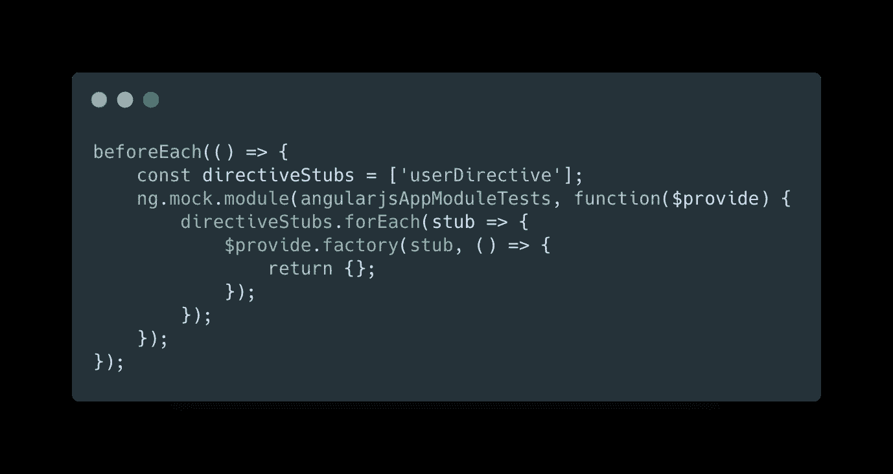

# 使用 ngUpgrade 进行单元测试

> 原文：<https://levelup.gitconnected.com/unit-testing-with-ngupgrade-b84c36535c6c>

在过去的两年中，我的团队所做的大部分工作都围绕着 ngUpgrade 包，我很高兴地说，大部分工作都是无缝和简单的。一旦一切都启动了，降级 AngularJS 要消费的服务和组件的艺术对我们来说已经很好了。一个在早期给我们带来很多麻烦并且有时仍然令人头疼的领域是消耗两个框架的应用程序的单元测试部分。让我们一步步走过去。

**Services**
为了简洁起见，让我们假设我们有一个现有的 AngularJS 应用程序，并且我们已经用升级包引导了它。我们已经编写了第一个 Angular 服务，对它进行了降级，现在正在我们现有的 AngularJS 服务中使用它。一切都完美无缺，我们感觉棒极了。现在，我们想要为 AngularJS 服务运行(或者编写，如果它们还不存在的话)我们的单元测试，该服务正在使用降级的 Angular 服务。还有…

或者其他可能的罪魁祸首

其中 UserService 是注入 AngularJS 服务的 Angular 服务的名称。我在这里创建了一个示例库:[https://github.com/saconnolly/ngupgrade-unit-testing](https://github.com/saconnolly/ngupgrade-unit-testing)，我们可以用它来讨论这两个错误消息(感谢[托马斯·图拉真](https://medium.com/u/360cd444e1fc?source=post_page-----b84c36535c6c--------------------------------)，我克隆了他的报告[https://stackblitz.com/edit/angular-ng-upgrade-downgrade](https://stackblitz.com/edit/angular-ng-upgrade-downgrade)作为起点)

如果您克隆我的回购，检查标签`starting_point`，并运行`ng test`，您将看到 3 个测试通过。如果你打开`index.ts`，看看`downgraded-angular-module`和`downgraded-angular-module-tests`两个模块的区别，你会注意到用于测试的模块不需要引导模块。如果你添加了这个，你会得到`Angular injector before bootstrapping`错误。然后如果你打开`app.service.ajs.spec.ts`你会看到这条线

这就是奇迹发生的地方(感谢[皮特·培根·达尔文](https://medium.com/u/ece7b098dce2?source=post_page-----b84c36535c6c--------------------------------)在[https://angular . io/API/upgrade/static/testing/createngularjstestingmodule](https://angular.io/api/upgrade/static/testing/createAngularJSTestingModule)上所做的所有努力)。它允许我们放弃引导混合应用程序进行测试，并允许注入器根据需要运行。

**组件**

这才是真正有趣的地方。对于跟随代码的任何人，检查标签`starting_components`，您将看到一些变化:

*   添加了角度组件:用户
*   将 AngularJS 的组件降级
*   使用了 app.component.ajs.ts 中的 angularJs <user>组件</user>

组件本身非常简单，当您导航到/angularjs 路径时，您可以看到它正在工作。你还可以看到，我添加了一个非常简单的测试来编译 angularjs 应用程序组件，我还添加了我们之前针对降级服务所做的修复。

如果你不关心测试降级组件的行为，解决方案是非常简单的(我知道，在这一点上，它变成了组件测试而不是单元测试。但我经常在棱角分明的世界里看到线条模糊)。

这将允许我们为降级的组件创建“存根”,这样它们就不会编译实际的组件，而只是作为一个空的 HTML 元素出现在 DOM 中。通过检查标签`stub_out_components`，您可以在代码中看到这一点。对于在整个应用程序中使用的组件来说，这是一个完美的解决方案，因为您不需要在测试中测试组件的功能。随着升级的进行，您可以根据需要向`directiveStubs`数组中添加任意多的指令。

但是现在让我们想象一下，在我们的`app.component.ajs.spec.ts`中，我们想要测试以确保用户组件呈现了一个 span 标签。因为存根将覆盖现有 AngularJS 指令的行为，所以删除该指令是无效的。我们的测试可能很简单，比如:

因此，为了让它通过，我们需要编译指令，而不是使用存根。如果您看一下标签`bootstrapped_hybrid_app`,我们可以逐步完成让这些测试工作的过程。首先要注意的是，我们不再剔除角度分量，也不再使用 createAngularJSTestingModule。我们从调用`clearPlatforms`开始，这允许我们破坏现有的测试平台并从头开始。然后我们调用我们在`test-helpers.ts`中定义的`testSetup`。这允许我们收集我们需要的模块，用我们想要测试的组件引导应用程序，并返回我们将需要的注入器。然后我们使用这个注入器来获得我们在`getUpradeObjects`中需要的对象，比如 AngularJS `$compile`函数。一旦完成，我们就可以使用`compileDirective`来编译 AngularJS 指令，它带有一个嵌套的 Angular 组件，也将被编译。现在，我们可以这样测试角度组件的内部工作方式:

这是我发现的引导混合应用程序允许跨框架单元测试组件的最简单的方法，我希望这有所帮助！

 [## 编写面试问题

### 跳到内容一个完整的平台，在那里我会教你找到下一份工作所需的一切和技巧…

技术开发](https://skilled.dev)