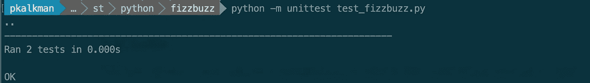
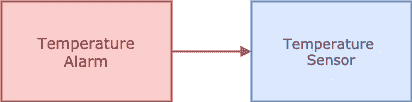
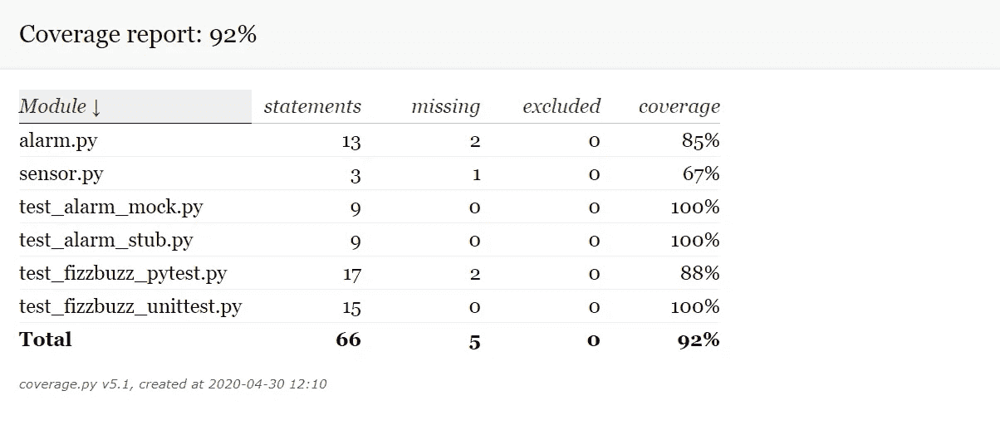
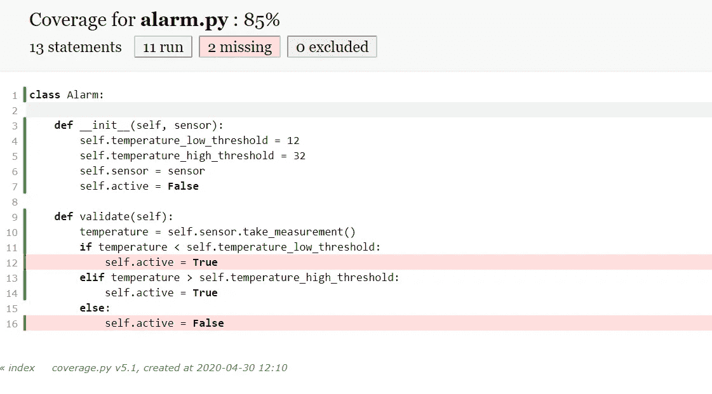
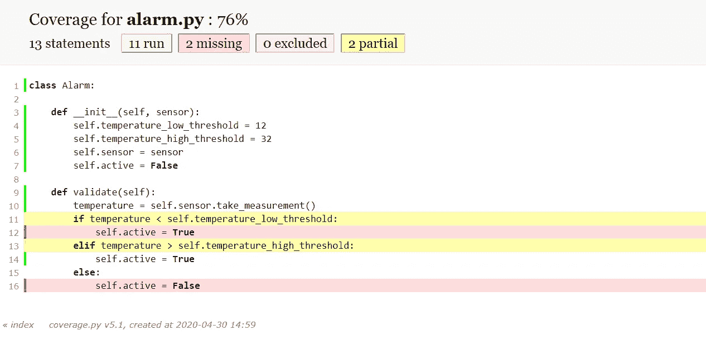

# 用 Python 进行单元测试

> 原文：<https://levelup.gitconnected.com/unit-testing-with-python-736112619620>

## 验证您的 Python 代码是否正常工作


Python 中的单元测试，图片作者

每年我都试图学习一门新的编程语言。今年开始学 Python。

在我白天的工作中，我是一名职业程序员。我用的是 C++，C#，Javascript。我是一个开发团队的成员，该团队使用单元测试来验证我们的代码是否如预期的那样工作。

在本文中，我通过讨论以下主题来研究如何用 Python 创建单元测试。

*   单元测试基础
*   可用的 Python 测试框架
*   测试设计原则
*   测试双打
*   代码覆盖率

为了能够理解本文，我假设您对 Python 有基本的了解。

# 单元测试基础

我使用 FizzBuzz 编码表创建了单元测试示例。编码形是程序员的一项练习。在这个练习中，程序员试图解决一个特定的问题。但是**主要的**目标不是解决问题而是练习编程。

有[不同的代码卡塔](https://github.com/gamontal/awesome-katas)你可以用来练习；我用的是 **FizzBuzz 码形**。FizzBuz 是一个简单的代码表，非常适合解释和展示 Python 中的单元测试。

FizzBuzz 代码形:

> 写一个程序打印从 1 到 100 的数字。但是对于三的倍数，打印“嘶嘶”而不是数字，对于五的倍数，打印“嗡嗡”对于 3 和 5 的倍数的数字，打印“FizzBuzz”

结合单元测试的例子，我将定义单元测试语言，这样我们就可以互相理解了。

## 单元测试

单元测试是由程序员编写的自动化测试，用于测试程序的一小部分。单元测试应该快速运行。与文件系统、数据库或网络交互的测试不是单元测试。

为了用 Python 创建第一个 FizzBuzz 单元测试，我定义了一个继承自`unittest.TestCase`的类。这个`unittest`模块在 Python 的标准安装中可用。

测试 FizzBuzz 代码 Kata 的两个单元测试

第一个单元测试验证了如果 FizzBuzz 过滤器接收到数字 1，它将返回字符串“1”。第二个单元测试对数字二做同样的事情。

## 判例案件

我们将类`FizzBuzzTest`中的方法`test_one_should_return_one()`称为测试用例。测试用例是测试程序特定部分的实际测试代码。

第一个测试用例验证了如果数字 1 通过 FizzBuzz 过滤器，它将返回字符串“1”。使用`self.assertEqual`方法对结果进行了验证。该方法的第一个参数是预期结果，第二个参数是实际结果。

如果您查看这两个测试用例，您会发现它们都创建了一个`FizzBuzz`类的实例。第一个在第六行，另一个在第十一行。

我们可以通过重构这两种方法中`FizzBuzz`实例的创建来改进代码。

重构单元测试中 FizzBuzz 实例的创建

我们使用`setUp`方法来创建`FizzBuzz`类的实例。来自`TestCase`基类的`setUp`在每个测试用例之前被执行。

另一个方法`tearDown`在每个单元测试执行后被调用。您可以使用它来清理或关闭资源。

## 试验夹具

方法`setUp`和`tearDown`是测试夹具的一部分。测试夹具用于配置和构建被测单元。每个测试用例都可以使用这些通用条件。在我们的例子中，我用它来创建 FizzBuzz 类的实例。

为了运行单元测试，我们需要一个测试运行程序。

## 测试跑步者

测试运行程序是一个执行所有单元测试并报告结果的程序。Python 中的标准测试运行程序可以使用以下命令从终端运行。

`python -m unittest test_fizzbuzz.py`



从命令行运行标准 Python 测试运行程序

## 测试套

我们单元测试词汇的最后一个术语是测试套件。测试套件是测试用例或测试套件的集合。通常一套测试包含应该一起运行的测试用例。

有了测试套件，我们完成了单元测试词汇。你现在知道下面的意思和区别了。

*   测试套
*   判例案件
*   试验夹具
*   测试跑步者
*   单元测试

# 单元测试设计

测试用例应该设计得很好。测试的名称和你如何组织你的测试是最重要的。

## 测试用例名称

测试的名称至关重要。它就像一个总结了测试内容的标题。如果测试失败，这是你看到的第一件事。因此，名称应该清楚地表明哪些功能不起作用。

测试用例名称的列表应该读起来像一个概要或者一个场景列表。这有助于读者理解被测单元的行为。

## 构建测试用例方法体

一个设计良好的测试用例由三部分组成。第一部分，**安排**，设置要测试的对象。第二部分**动作**，练习被测单元。最后，第三部分，**断言**，声明应该发生什么。

有时，我会在单元测试中添加这三个部分作为注释，以使其更加清晰。

在单元测试中添加 Arrange、Act 和 Assert 作为注释

## 每个测试用例的单个断言

尽管在一个测试用例中可能有许多断言。我总是尝试使用单个断言。

原因是当断言失败时，测试用例的执行停止。因此，您永远不会知道测试用例中的下一个断言是否成功。

# 使用 pytest 进行单元测试

在上一节中，我们使用了`unittest`模块。Python 的默认安装会安装这个模块。`unittest`模块于 2001 年首次推出。基于 JUnit，由 Kent Beck 和 Eric Gamma 开发的流行的 Java 单元测试框架。

另一个模块`pytest`是目前最流行的 Python 单元测试框架。相比于`unittest`框架，它更加 Pythonesque。您可以将测试用例定义为函数，而不是从基类派生。

由于`pytest`不在默认的 Python 安装中，我们使用 Python 的安装包 PIP 来安装它。通过在终端中执行以下命令，可以安装`pytest`。

`pip install pytest`

我将第一个 FizzBuzz 测试用例转换为下面的`pytest`。

首次使用 pytest 进行 FizzBuzz 测试

有三点不同。首先，你不需要导入任何模块。其次，你不需要实现一个类，从一个基类派生。最后，您可以使用标准的 Python assert 方法来代替自定义方法。

## 测试夹具

正如您所记得的，单元测试模块使用了`setUp`和`tearDown`来配置和构建被测单元。相反，`pytest`使用属性`@pytest.fixture`。在测试用例中，可以使用用属性修饰的方法的名称作为参数。

pytest 框架在运行时连接它们，并将`fizzBuzz`实例注入到您的测试用例中。

使用@pytest.fixture 通过 pytest 创建测试夹具

如果你想模仿单元测试`tearDown()`方法的行为，你可以使用同样的方法。你不用`return`，而是使用`yield`关键字。然后你可以把你的清理代码放在`yield`之后。

```
@pytest.fixture
def fizzBuzz():
    yield FizzBuzz()
    # put your clean up code here
```

## pytest 标记

标记是可以在各种功能的测试中使用的属性。例如，如果您将 skip 标记添加到您的测试用例中，测试运行程序将会跳过测试。

使用跳过标记来跳过一个测试用例

## pytest 插件生态系统

有许多为`pytest`增加额外功能的插件。写的时候差不多有 [900 个插件](http://plugincompat.herokuapp.com/)。比如 pytest-html 和 pytest-sugar。

**pytest-html**

pytest-html 是为测试结果生成 html 报告的`pytest`插件。当您在构建服务器上运行单元测试时，这非常有用。

**pytest-sugar**

pytest-sugar 改变了`pytest`的默认外观和感觉。它增加了一个进度条，并立即显示失败的测试。

# 使用测试替身(存根、模拟和伪造)

如果您想要单独测试模块或类，但是该模块或类依赖于不同的类，您可以使用 Test Double 来替换依赖关系。

替身演员就像替身演员。它是出于测试目的替换生产对象的通用术语。有各种各样的测试双打。

我使用杰拉德·梅萨罗什的 [xUnit 测试模式](http://xunitpatterns.com/)中的以下定义。

*   **模拟**是预编程的预期，形成了它们预期接收的呼叫的规范。如果他们收到一个他们不期望的调用，他们可以抛出一个异常，并在验证过程中进行检查，以确保他们得到了他们期望的所有调用。
*   **假的**对象有工作的实现，但是通常采用捷径，这使得它们不适合生产，例如，内存中的数据库。
*   存根为测试过程中的呼叫提供固定的答案，通常对测试程序之外的任何事情都不作回应。

## 使用 unittest 创建存根。模拟的

为了能够演示存根的使用，我们将离开 FizzBuzz，使用一个不同的示例。在这个示例中，我们将实现一个警报类，当温室中的温度达到某个阈值时，该类将生成警报。



我想测试警报功能。但是我不想使用实际的 Sensor 类，而是想使用一个 Test Double，我可以操纵它返回一个特定的测量值来测试警报。

我使用来自`unittest.mock`的`Mock`类在第七行创建一个存根。然后在下一行，我指示存根在调用`take_measurement`时返回值 35。

使用存根来隔离测试一个类

这使我能够测试如果测量的温度高于 32 摄氏度，警报是否激活。

如您所见，传感器短线看起来与外部的实际传感器类别相同。内部是不同的。它不测量温度。

## 使用 unittest 创建模拟。模拟的

模拟和存根之间的区别在于存根不会让测试失败。相反，如果没有正确调用，Mock 可能会测试失败。因此，模拟不仅仅是存根。

在我们看模拟之前，理解有三种不同的断言是很重要的。

1.  断言返回值或异常
2.  断言状态的改变
3.  断言方法调用。是否调用了特定的方法？

FizzBuzz 单元测试使用了第一种变体。断言返回值或异常。

```
def test_one_should_return_one(fizzBuzz):
    result = fizzBuzz.filter(1)
    assert result == ‘1’
```

报警装置测试使用了第二种变体。断言状态的改变。

```
assert alarm.active == True
```

对于第三种断言，我们需要一个模拟。我们用一个断言来扩展报警单元测试，该断言验证了调用了`take_measurement`方法。

使用模拟来验证方法是否被调用

在这个单元测试中，我们仍然使用单元测试模块中的模拟类。这是因为模拟类可以充当模拟或存根。通过在第十行添加验证，`mock_sensor.take_measurement.assert_called()`我们将它从存根改为模拟。因为模拟现在不能通过测试。

## 使用假货

我想说的最后一种测试替身是假的。Fakes 是具有有效实现的类。实现与生产不同。通常，他们有一个简化版本的生产代码。

您可以自己创建这些假货，但幸运的是，Python 已经有了一些现成的假货。

**用字符串替换文件。IO**

绳子。IO 模块是一个类，它充当一个文件，但是读写字符串缓冲区。字符串。IO 将数据存储在内存中。这意味着在你的测试中你可以使用 String。IO 而不是真正的文件。这将使你的单元测试更快更容易设置。

举例。

**用内存数据库替换数据库**

您可以通过更改连接字符串在内存中创建 SQLite 数据库。Python `sqlite`模块也支持这种行为。

使用内存中的数据库而不是磁盘上的数据库会使您的单元测试更快。

```
import sqlite3
conn = sqlite3.connect(':memory:')
```

**用轻量级 web 服务器替换 web 服务器**

Python 包括`SimpleHttpServer`。您可以使用这个模块为您的单元测试创建一个轻量级的 HTTP 服务器。例如，测试与外部 API 的交互。

这将使你的单元测试更快。

# 创建代码覆盖率报告

有一些工具可以用来创建代码覆盖率报告。这份代码覆盖率报告显示了单元测试执行(覆盖)了哪些代码。

我使用覆盖率和 pytest-cov 来创建代码覆盖率报告。覆盖率是一个测量代码覆盖率的通用包。模块 pytest-cov 是 pytest 的一个插件，它连接到覆盖率。

两者都可以使用 pip 安装。

`pip install coverage`

`pip install pytest-cov`

在您安装了这两个工具之后，您可以使用这两个命令生成一个覆盖率报告。在终端或命令中运行它们。

`coverage run -m pytest`

`coverage html`

第一个生成覆盖率数据。第二个命令将数据转换成 HTML 报告。覆盖率将报告存储在文件系统的文件夹`htmlcov`中。

如果你在浏览器中打开 index.html，它会显示每个文件的覆盖率。



覆盖率 HTML 报表概览

如果您选择一个文件，它会显示下面的屏幕。覆盖率向源代码添加了一个指示，显示单元测试覆盖了哪一行。

下面我们看到我们的单元测试没有覆盖第 12 行和第 16 行。



alarm.py 的覆盖率报告

## 分支覆盖测量

覆盖率也支持分支机构覆盖率测量。使用分支覆盖，如果您的程序中有一行可以跳转到多个下一行，覆盖将跟踪这些目的地是否被访问。

您可以通过执行下面的命令来创建一个包含分支覆盖率的覆盖率报告。

`pytest --cov-report html:htmlcov --cov-branch --cov=alarm`

我指示 pytest 生成一个包含分支覆盖率的 HTML 覆盖率报告。它应该将结果存储在`htmlcov`中。我告诉覆盖率只使用`alarm.py`，而不是为所有文件生成覆盖率报告。



启用了分支机构保险的保险报告

# 结论

这就结束了我对 Python 单元测试可能性的研究。

我向您展示了如何用 Python 创建和运行单元测试。我们使用了两个测试框架和测试运行器，即`unittest`和`pytest`模块。

我们看到了如何设计您的单元测试。想出测试用例的正确名称和测试用例体的正确结构。

我向您展示了各种类型的测试替身，比如存根、模拟和伪造。还解释了属于每个测试 double 的不同类型的断言。

最后，我们看了如何创建代码覆盖率报告。覆盖率报告有助于发现新代码中缺失的测试，或者确定哪些测试要添加到现有的代码中。

我将示例的源代码存储在这个 Github 存储库中。

感谢您的阅读。