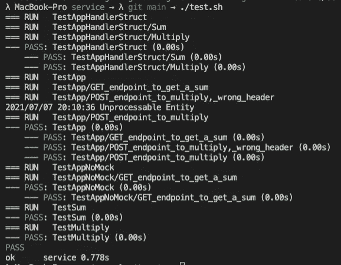

# 使用模拟对 Go 服务器进行单元测试

> 原文：<https://levelup.gitconnected.com/unit-testing-your-go-webserver-using-mocks-79d56fabc7b8>

在单元测试中使用模拟很重要。本文将向您展示如何利用依赖注入在 Go 测试中使用模拟。

照片由[本·怀特](https://unsplash.com/@benwhitephotography)在 [Unsplash](https://unsplash.com/) 拍摄

在今天的教程中，我想告诉你如何测试你的 Go 网络服务器。在这个例子中，我使用 [Go Fiber](https://github.com/gofiber/fiber) 作为我选择的 web 服务器框架。但是当然，你可以完全自由地使用任何你喜欢的框架。

如果你想看这篇教程的全部代码，甚至是我在这篇文章中没有提到的，你可以查看我的公共 GitHub 库。

 [## abszisex/medium-golang-testing-web server

### 通过在 GitHub 上创建一个帐户，为 abszisex/medium-golang-testing-web server 开发做出贡献。

github.com](https://github.com/Abszissex/medium-golang-testing-webserver) 

# 单元测试简短回顾

别担心，我不会“再次”详细解释什么是单元测试，哪些方法尤其存在于 Go 等中，这里有足够多的详细解释。只是一个简短的回顾。

单元测试是应该测试一个代码单元行为的测试。最简单的形式是，要测试的函数接受几个输入参数并产生一些输出。一个函数越实用/纯粹，就越容易测试。

尤其是在 Go 中，使用测试表来使测试尽可能地具有可读性和可维护性是常见的做法。尽管你可以在其他语言中毫无问题地使用测试表，但我没有像在 Go 中那样经常看到它。

让我们一起快速看一个简短的例子，看看一个典型的测试表是什么样子的。

想象一下我们的服务器`main`包中的`math.go`文件中的以下函数:

这种方法本身很容易理解。它只接受两个整数参数，并返回另一个整数，通过两个输入相乘来计算。

在下面的文件`math_test.go`中，你会看到一个 Go 测试文件，它使用一个测试表测试了 8 种不同的情况。

正如你在上面看到的，当使用一个测试表时，写很多不同的测试用例是非常干净的。您可以轻松地定义输入和预期输出属性，并将它们添加到匿名结构列表中。为了减少“噪音”,你甚至可以在定义结构时丢弃属性名。但是请注意，如果您的函数签名以及您的输入和输出定期更改，这可能会容易出错。但是如果是这样的话，你很可能会有其他的问题。😉

测试表完成后，我们可以很容易地迭代它的每一行，调用我们应该测试的函数，并用我们的预期结果验证实际结果。

如果我们的期望没有得到满足，那么提供一些适当的错误消息是非常重要的，它应该包括输入参数、实际结果和预期结果，以便您立即知道哪个测试用例出错了，并且您可以调查它。

为了向您展示为什么它如此重要，让我们看看下面的`go test -v`命令的输出。在下图中，您可以看到上述测试的测试运行结果，尽管我之前对预期结果做了一点修改，以使它们失败，并且添加了一个带有非常糟糕的错误消息的`TestSum`方法。

正如您在`TestMultiply`部分看到的，错误告诉您到底哪里出错了，而上面的`Sum was incorrect`没有告诉您测试失败的原因，如果您有一个很长的测试表，您会很高兴找到哪一行失败了。😉

但是回顾够了，现在让我们开始测试我们实际的服务器代码。

# 测试 Go 光纤网络服务器

你可以想象，与测试一个简单的纯乘法函数相比，测试一个 web 服务器并不那么容易。不过，我保证，这也没那么难。

在本文中，我不再赘述设置 Go Fiber 服务器的细节。如果你想看看它是如何完成的，以及如何添加 swagger 文档，请看看我以前的一篇文章:

 [## 用两个简单的步骤创建一个 Swagger 文档化的 Go Web 服务器

### 通过使用 Go Fiber 和自动生成的 Swagger 文档逐步解释如何设置 Go web 服务器。

levelup.gitconnected.com](/creating-a-swagger-documented-go-web-server-in-two-easy-steps-59f1118bd247) 

在下面的代码片段中，您可以看到一个使用 [Go Fiber](https://github.com/gofiber/fiber) 框架的简单 web 服务器设置。

我们的 web 服务器有两条路由需要测试。

*   `GET /sum`带有两个查询参数`x`和`y`
*   `POST /multiply`它接受格式为`{x: int, y: int}`的 JSON 主体有效负载

您还会注意到，在上面的代码片段中，我们传入了一个新的`AppHandlerStruct`实例，我们调用它来运行实际的业务逻辑，而不是从请求处理程序内部直接调用它。

您可以在下面的代码片段中看到带有`AppHandlerStruct`实现的`app_handler.go`文件:

这里你还可以看到我们调用了`Sum()`和`Multiply()`方法，这两个方法都是在我在文章开头展示的`math.go`文件中定义的。

你的第一个问题可能是:

> “为什么我们要把它弄得那么复杂？不需要整个`AppHandler`接口注入，直接调用我们的两个 math 函数不行吗？”

是的，你是绝对正确的，很可能大多数人也会这样做，对许多人来说，这可能是绝对没问题的。尽管当您开始涉及对数据库的查询而不仅仅是简单的数学函数时，您可能会遇到问题。

让我们想象以下情况:

*   我们没有注入实现`AppHandler`接口的对象，而是直接使用我们的函数。
*   我们访问数据库并在那里查询或修改数据，而不是简单的数学函数。
*   我们编写一个测试用例，启动服务器，然后向它发送一个请求。

现在我们已经遇到了你们大多数人都经历过的问题:

*   我们必须启动本地或远程数据库来访问/修改/创建数据。
*   在每次运行之后，也许在每次请求之间，我们需要清理数据库，并用一些干净的测试数据播种它。
*   由于正在访问一个“外部”系统，因此您会在测试中引入额外的延迟。
*   我们如何在管道上运行我们的测试？我们有远程数据库吗？我们如何处理同时运行的多个管道？我们必须在管道中建立一个临时数据库吗？

所有上述问题使得快速简单地测试你的代码变得非常困难和不容易。想一想仅仅因为你想测试你的`GET`端点是否工作而引入的所有复杂性。

此外，上面提到的案例已经更多地指向“集成测试”方向，而不是单元测试方向。正如标题所示，我们想要对我们的 web 服务器进行单元测试。

但是在每个人都尖叫着对我大喊大叫说我不应该跳过系统中的集成测试之前，不要担心我没有，当我做我的常规工作时，我也总是添加适当的集成测试，因为我认为它们也超级重要。

还有一个旁注:单元测试的美妙之处在于，当你想进行适当的单元测试时，你真的必须使用依赖注入这样的原则来编写干净的封装代码。所以你必须以可测试的方式编写你的代码。如果你只进行集成测试，你的底层代码看起来如何以及它是否被封装都是无关紧要的，因为你可能只触及服务器的端点并检查结果。

## 对 web 服务器进行单元测试

如果我们正在进行单元测试，那么这意味着我们试图只测试一个单独的单元。这也意味着，当我们对 web 服务器的端点进行单元测试时，我们不希望最终的业务逻辑被真正调用。在许多情况下，这可能是一些数据库函数，或者在我们的例子中只是数学函数。我们只想知道我们的端点定义是否正常工作和响应。

为了实现这一点，我们必须设法防止我们的请求处理程序代码调用真正的函数。也许你已经猜到了，但是…嘲笑救援。😉

我也看到一些人在尖叫:

> “如果我们模仿一切，我们将无法测试我们真正的业务逻辑，我们将整天只写模仿，而不做真正的编码。”

我真的明白了，相信我。但是从我到目前为止的经验来看，如果你真的必须模仿你的代码库中的所有东西，那么很有可能代码架构非常糟糕，并且没有考虑干净架构的一般原则。同样，这也取决于你写测试的目的是什么？

例如，如果我想对我的 web 服务器公开的路由进行单元测试，我想知道对于某些路由/报头/有效负载组合，是否返回了预期的响应报头/主体/状态代码，也许，这一切都有点依赖于开发人员，我想另外检查是否调用了某个处理程序方法以及使用了哪些参数。在这种情况下，我对真正的服务器是否在后台执行一些数据库查询、访问文件系统或其他什么事情一点也不感兴趣。我只是想测试我定义的 webserver 接口是否如预期的那样工作。在这里，模拟实际处理程序代码的单元测试是可行的。

正是出于上述原因，使用模仿/间谍来模仿后台的业务逻辑是绝对有意义的。正如您将很快看到的，我们在`main.go`文件中的`CreateApp`函数期待一个`AppHandler`的主要原因是，web 服务器不必关心底层的实际逻辑，它知道它得到了一些处理程序，它必须通过特定路由的特定接口调用这些处理程序，仅此而已。如您所料，由于实际的逻辑被传递到 web 服务器中，所以它非常适合模拟测试。😉

在我们的`main_test.go`部分，你可以看到我定义了一个`AppHandlerFake`结构，它实现了我们之前介绍的`AppHandler`接口。

但是这里有两个不同之处。首先，无论输入是什么，方法总是返回相同的值；其次，每次调用结构体的方法时，结构体的`Calls`属性的条目都会被添加，方法名称作为键，传入的方法参数是一个二维数组。

根据我们想要测试的方式和内容,`Calls`方法可能有些过头了。但是如果我们还想测试在我们的请求处理程序中调用了带有我们期望的参数的正确的`AppHandler`方法，我们必须跟踪这些调用，这样我们可以在以后测试它。

因此，让我们检查一下我们的`main_test.go`文件中的实际测试代码。这个文件实际上很长，尽管我已经从中删除了`AppHandlerFake`定义和一个助手方法(`Equal(...)`)。尽管如此，测试文件应该非常简单明了，由三个步骤组成:

1.  使用创建适当的 HTTP 请求所需的所有属性(HTTP 方法、路径、主体、头)定义测试表，我们期望从响应中得到什么(状态代码、主体、头)，以及我们期望使用哪个参数调用哪个处理程序方法。
2.  使用模拟的处理程序结构创建和启动 web 服务器。
3.  迭代测试表，针对 web 服务器运行 HTTP 请求，并验证我们的预期。

现在我们已经定义了我们的测试，是时候通过`go test -v .`命令运行它们了。

在下图中，您可以看到我们测试的输出。尽管我在这里创建了一个额外的小 shell 脚本。这样做的原因是我想输入更少的内容，并使用一些专有的突出显示我的测试的`PASS`和`FAIL`状态，这样我可以更容易地识别它们。

'的输出。/test.sh '

非常简单的 shell 脚本来突出显示“通过”和“失败”输出

正如您在上面的测试输出中看到的，测试比我在本文中讨论的要多一些。如果你想看所有的测试，也是本文没有提到的，你可以随时查看 Github 库。

# 摘要

我希望我可以向您展示，模拟并不像许多人认为的那样邪恶，当您想要测试应用程序的特定部分时，它们实际上非常有用并且易于实现。

## 你想联系吗？

如果你想联系我，请在 LinkedIn 上给我打电话。

另外，请随意查看我的书籍推荐📚。

 [## 我的书籍推荐

### 在接下来的章节中，你可以找到我对所有日常生活话题的书籍推荐，它们对我帮助很大。

mr-pascal.medium.com](https://mr-pascal.medium.com/my-book-recommendations-4b9f73bf961b)  [## 通过我的推荐链接加入 Medium—Pascal Zwikirsch

### 作为一个媒体会员，你的会员费的一部分会给你阅读的作家，你可以完全接触到每一个故事…

mr-pascal.medium.com](https://mr-pascal.medium.com/membership)