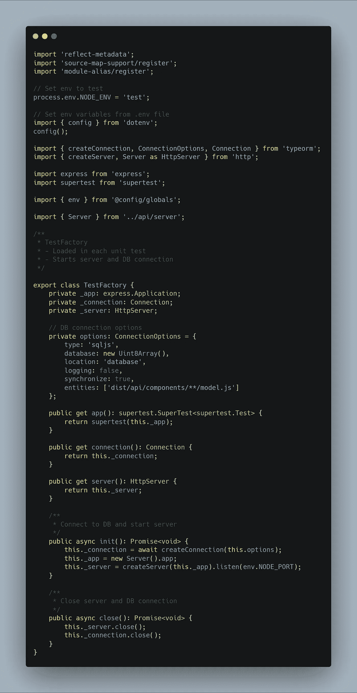

# 使用 ts、Express.js 和 TypeORM 构建的 Node.js APIs 的单元测试

> 原文：<https://levelup.gitconnected.com/unit-tests-for-node-js-apis-built-with-ts-express-js-and-typeorm-b6921bf92e28>


作者[卡特琳娜·林皮索妮](https://twitter.com/ninalimpi)

几天前，我写了一篇关于如何构建 Node.js REST APIs 的文章。然而，我并没有涵盖任何测试场景。所以现在是时候补上这个了。

我们将根据我的另一个故事中的项目结构，为单个 API 组件编写一个单元测试。目标是通过模仿数据库并向其路由发送 HTTP 请求来测试组件。

[](https://medium.com/swlh/how-i-structure-my-node-js-rest-apis-4e8904ccd2fb) [## 我如何构建 Node.js REST APIs

### 当我开始使用 Node.js 在服务器端构建 REST APIs 时，我为“应该如何……

medium.com](https://medium.com/swlh/how-i-structure-my-node-js-rest-apis-4e8904ccd2fb) 

为了编写测试，我使用了以下节点模块:

*   摩卡
*   柴
*   超级测试

## 项目结构

这就是我上面提到的项目结构。当然，你也可以使用其他的。

```
nodejs-api-structure
└───src
   │
   └───config
   │
   └───api
   │   │
   │   └───components
   │   │   │
   │   │   └───user
   │   │       │   controller.ts
   │   │       │   model.ts
   │   │       │   routes.ts
   │   │       │   service.ts
   │   │       │   user.spec.ts
   │   │
   │   └───middleware
   │   │
   │   │   routes.ts
   │   │   server.ts
   │
   └───test
   │   │   factory.ts
   │
   │   index.ts
```

我们将重点关注以下文件:

*   工厂. ts
*   用户规格

## 测试工厂-工厂. ts

这个文件是每个单元测试的某种设置文件。它负责数据库连接并启动 Express.js 服务器。

我们使用' *sqljs* '作为数据库类型，所以没有必要提供像 MySQL 或任何其他数据库那样的真实数据库。

实际上，代码应该是不言自明的。该类充当数据库连接和 express 服务器的容器。它提供了 getter 方法来使它们可访问，并提供了打开/关闭连接的方法。



工厂. ts

## 组件测试-用户规格

这个文件涵盖了 API 组件的单元测试。在那里，我们使用不同的 HTTP 请求方法，如 *POST* 、 *PUT* 、 *GET* 和 *DELETE* 来测试组件的 API 端点。

首先，我们创建一个`TestFactory`类和`User`模型的新实例。`mockTestUser`方法返回一个包含一些虚拟数据的`User`实例。此外，我们创建了另一个实例`testUserModified`，它具有一些修改过的属性，将用于测试 *PUT* 端点。


用户规格

现在我们定义 Mocha 的`before`和`after`方法。`before`在测试开始前执行，而`after`在测试结束后执行。

在它们内部，我们调用工厂的`init`和`close`方法，这些方法在测试开始前建立一个新的数据库连接和 express 服务器，并在测试结束后断开连接。


用户规格

需要注意的一件重要事情是，当您有多个单元测试时，每个测试都会建立一个新的数据库连接和 express 服务器。

为了向服务器发出 HTTP 请求，我使用 Supertest 和 Chai 来验证服务器响应。

下面是一个组件的完整代码:


用户规格

**这篇文章最初发表在我的博客上。看一看。**

 [## 用 ts、Express.js 和 TypeORM 构建的 Node.js APIs 的单元测试。

### 2020 年 1 月 8 日不久前，我写了一篇关于如何构建 Node.js REST APIs 的文章。但是，我没有盖…

拉斯瓦切特.德夫](https://larswaechter.dev/blog/nodejs-rest-api-testing/) 

我目前正在做一个兼职项目，在那里你可以看到像这样的测试场景。例如，看看那里的`User`或`Task`型号。

[](https://github.com/Aionic-Apps/aionic-core/tree/master) [## Aionic-Apps/aionic-core

### Aionic 为项目管理和协作提供开源应用程序。我们的重点是简化和…

github.com](https://github.com/Aionic-Apps/aionic-core/tree/master)