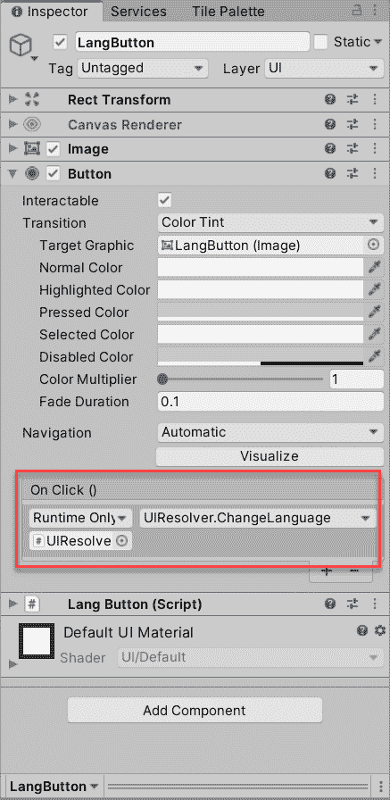

# Unity:高级本地化

> 原文：<https://levelup.gitconnected.com/unity-advanced-localization-802cb954ca16>


这篇文章是 Unity 的延续:本地化变得容易。如果您还没有阅读第一部分，我强烈建议您在继续下一步之前阅读，因为本教程是基于之前创建的代码和资产的。

在第二部分，我将展示你可以在游戏中使用的高级本地化技术。在本页结束时，你将拥有一个全功能的**改变语言**按钮，这是任何项目都需要的组件。

这种方法最好的部分是可扩展性——不需要修改代码就可以添加对其他语言的支持。

和往常一样，GitHub 提供源代码，请在本页末尾找到链接。

# **第一部分。图像和文件**

首先，让我们添加所需的**改变语言**按钮图片。请注意，我已经将它们放在了`Images\Resources\LanguageImages`文件夹中，因为我们稍后将需要从脚本中访问它们。


现在我们将在场景中添加按钮。进入层级视图，找到`Canvas`，右键- > UI- >按钮。你可以删除子`Text`组件，我们不会使用它。将其中一张图片贴在`Image`组件上。最终结果应该是这样的:


接下来，让我们将语言属性文件移动到`Lang/Resources`下的`LangFiles`文件夹中。这种方法需要访问所有支持的语言，在我们的例子中，每个`LangFile`代表一种语言。


简单回顾一下，这是您现在应该拥有的层级视图:


大多数组件已经在第一部分中创建好了，`LangButton`是刚刚添加的新组件。

# 第二部分。脚本

`LangResolver`脚本需要做一些改动。我们需要一个包含所有支持的语言和相应的文本键值对的`Dictionary`,而不是一个只保存当前系统语言属性的`Dictionary`。正如前面提到的，我们将通过`LangFiles`文件定义所有支持的语言。

但是在我们开始使用`LangResolver`之前，我想对之前教程中创建的`LangText`脚本做一个改进。为了更好地分离概念，添加了以下方法:

```
public void ChangeText(string text)
{
   GetComponent<Text>().text = Regex.Unescape(text);
}
```

更改`Text`组件文本绝对不是`LangResolver`的责任。

接下来，让我给你看一下所有修改后的`LangResolver`脚本:

```
public class LangResolver : MonoBehaviour
{
   private const char Separator = '='; private readonly Dictionary<SystemLanguage, LangData> _langData = new Dictionary<SystemLanguage, LangData>();
   private readonly List<SystemLanguage> _supportedLanguages = new List<SystemLanguage>(); private SystemLanguage _language; private void Awake()
   {
      DontDestroyOnLoad(gameObject);
      ReadProperties();
   } private void ReadProperties()
   {
      foreach (var file in Resources.LoadAll<TextAsset>("LangFiles"))
      {
         Enum.TryParse(file.name, out SystemLanguage language);
         var lang = new Dictionary<string, string>();
         foreach (var line in file.text.Split('\n'))
         {
            var prop = line.Split(Separator);
            lang[prop[0]] = prop[1];
         }
         _langData[language] = new LangData(lang);
         _supportedLanguages.Add(language);
      }
      ResolveLanguage();
   } private void ResolveLanguage()
   {
      _language = PrefsHolder.GetLang();
      if (!_supportedLanguages.Contains(_language))
      {
         _language = SystemLanguage.English;
      }
   } public void ResolveTexts()
   {
      var lang = _langData[_language].Lang;
      foreach (var langText in Resources.FindObjectsOfTypeAll<LangText>())
      {
         langText.ChangeText(lang[langText.Identifier]);
      }
   } private class LangData
   {
      public readonly Dictionary<string, string> Lang;

      public LangData(Dictionary<string, string> lang)
      {
         Lang = lang;
      }
   }
}
```

好吧，这是怎么回事？已经创建了一个私有的内部类来保存语言键值对的`Dictionary`。它现在被用作键为`SystemLanguage`的`_langData`T5 的值。创建这个内部类的主要原因是将来可以用其他与`Text`相关的属性来扩展它，比如`Font`、`Font Style`、`Font Size`等。

让我们仔细看看`ReadProperties`方法。有几件事正在发生:

*   解析所有可用的文件，并将键值对存储在`LangData` `Lang`字段中
*   在解析过程中，`_supportedLanguages` `List`被每个支持的`SystemLanguage`填充
*   要使用的语言是由`PrefsHolder`实用程序类决定的——我们一会儿就会研究它
*   `Awake`和`ResolveTexts`方法不变

我想在这里休息一下，谈谈其中一个坚实的原则，即**单一责任原则**。作为一名单人游戏开发者，你可能会认为干净的代码和良好的设计对于中小型项目来说并不重要，毕竟没有人会去关注它。因此，为了开发速度，可以违反某些原则。

如果你不同意上述说法，我尊重你。在 Unity 中编码肯定不同于在 Java 或 C++中进行企业级编码，理解它并调整某些编码行为需要一段时间。

我在我第一个发布的 Unity 游戏中违反了单一责任原则，主要是因为我不知道如何做得更好。我也学到了应该避免什么，下一个游戏有更干净的代码。简而言之，对于你开发的任何游戏，试着将游戏逻辑、UI 处理、保存、广告和商店购买彼此分开。就像在本教程中一样，对于 lang 文件解析(`LangResolver`)、UI 处理(`UIResolver`)和配置保存(`PrefsHolder`)有一个明确的责任定义。

为了简单起见，所有的代码都可以放在一个脚本中，并且以完全相同的方式工作。但是我不会在真实的项目中这样做，因此教程“继承”了相同的设计原则。我总是努力展示从经验(和以前的错误)中学到的最佳设计决策和实践。

让我们来看一看`PrefsHolder`:

```
public static class PrefsHolder
{
    private const string Lang = "Lang"; public static void SaveLang(SystemLanguage lang)
    {
        PlayerPrefs.SetString(Lang, lang.ToString());
    } public static SystemLanguage GetLang()
    {
        Enum.TryParse(
            PlayerPrefs.GetString(Lang, Application.systemLanguage.ToString()),
            out SystemLanguage language);
        return language;
    }
}
```

这是一个简单的静态实用程序类，基本上是 Unity 的`PlayerPrefs`的包装器。

到目前为止一切顺利，现在是时候实现本教程的主要目的了——改变语言的可能性。我们将扩展`UIResolver`脚本来支持这一点。另外，随着语言的改变，按钮图像应该被适当地选择。毕竟，应用的修改`UIResolver`现在看起来如下:

```
public class UIResolver : MonoBehaviour
{
    private Image _langButtonImage;
    private LangResolver _langResolver;
    private readonly Dictionary<string, Sprite> _langImages = new Dictionary<string, Sprite>(); private void Start()
    {
        _langButtonImage = FindObjectOfType<LangButton>().GetComponent<Image>();
        _langResolver = FindObjectOfType<LangResolver>();
        _langResolver.ResolveTexts(); foreach (var sprite in Resources.LoadAll<Sprite>("LanguageImages"))
        {
            _langImages[sprite.name] = sprite;
        } ResolveLangImage();
    } public void ChangeLanguage()
    {
        _langResolver.ChangeLanguage();
        ResolveLangImage();
    } private void ResolveLangImage()
    {
        _langButtonImage.sprite = _langImages[PrefsHolder.GetLang().ToString()];
    }
}
```

你有没有注意到在`Start`方法中，我在寻找`LangButton`成分？在 Unity 中，有多种方式将不同的对象连接在一起:可以使用标签、名称或公共字段。我更喜欢使用脚本。`LangButton`是从`MonoBehaviour`派生的空类，它的存在只是为了能够访问它所附加的`GameObject`。除此之外，代码相对简单，我们将所有精灵存储在一个`Dictionary`中，所以我们可以在语言改变后应用它。和以前一样，所有文本最初都在`Start`上解析。每当接收到`OnClick`事件时，就会调用`ChangeLanguage`方法。



这里缺少的最后一块是`LangResolver::ChangeLanguage`方法本身，所以让我们来填补这个空白。该方法应改变当前的`_language`，调用`LangText::ChangeText`方法，并将选择的语言保存在`PlayerPrefs`中以备将来使用。

```
public void ChangeLanguage()
    {
        var currentLanguageIndex = _supportedLanguages.IndexOf(_language);
        _language = currentLanguageIndex ==
                    _supportedLanguages.Count - 1
            ? _supportedLanguages.First()
            : _supportedLanguages[currentLanguageIndex + 1]; ResolveTexts();
        PrefsHolder.SaveLang(_language);
    }
```

我不想在`_supportedLanguages`列表中为当前语言索引保留一个单独的字段，因为通过`IndexOf`很容易解决这个问题。

现在是切换回 Unity 的时候了，按 Play 并点击`LangButton`来改变语言！


# **第三部。附加语言支持**

正如我在开始时承诺的，为了扩展支持的语言列表，不需要修改代码。让我用西班牙语来说明这一点。只需要两个步骤:

*   向`LanguageImages`添加新图像


*   向`LangFiles`添加一个新的文本文件


点击播放，点击几次`LangButton`，你会看到


# **事后**

完成教程做得很好！如果你有任何问题，请在下面的评论区留言。

本教程的第一部分是[这里是](https://medium.com/@pudding_entertainment/unity-localization-made-easy-37b14adfc581)

项目源文件可以在[这个 GitHub 资源库](https://github.com/Enigo/UnityAdvancedLocalization)中找到

# 支持

如果你喜欢你看的内容，想支持作者——非常感谢！
下面是我的以太坊钱包小贴士:
**0x b 34 C2 BCE 674104 a 7 ca 1 ecebf 76d 21 Fe 1099132 f 0**