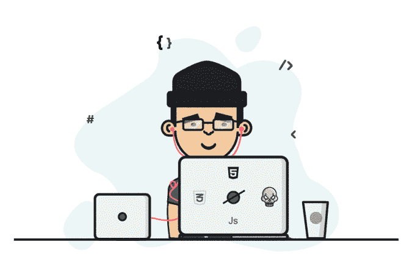
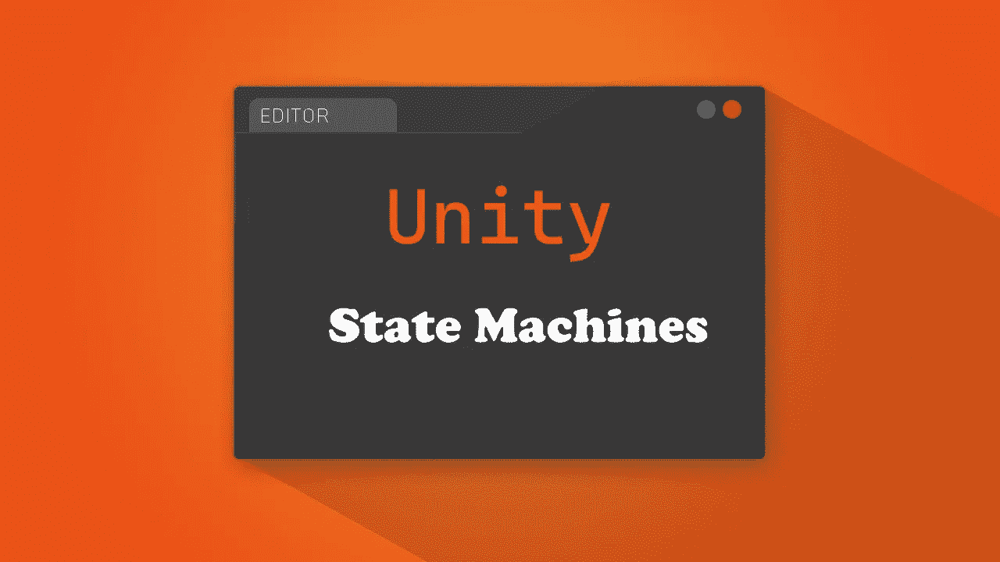
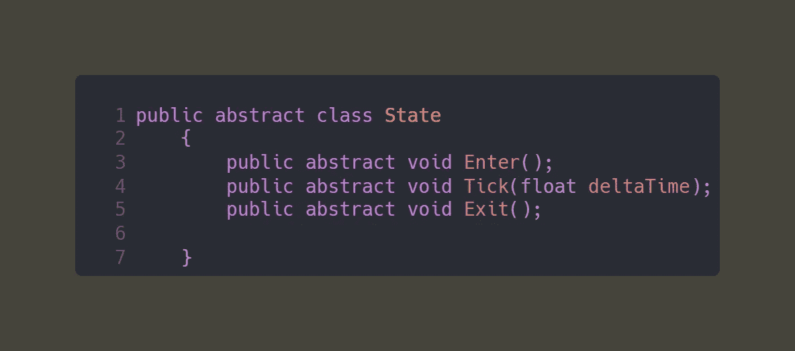
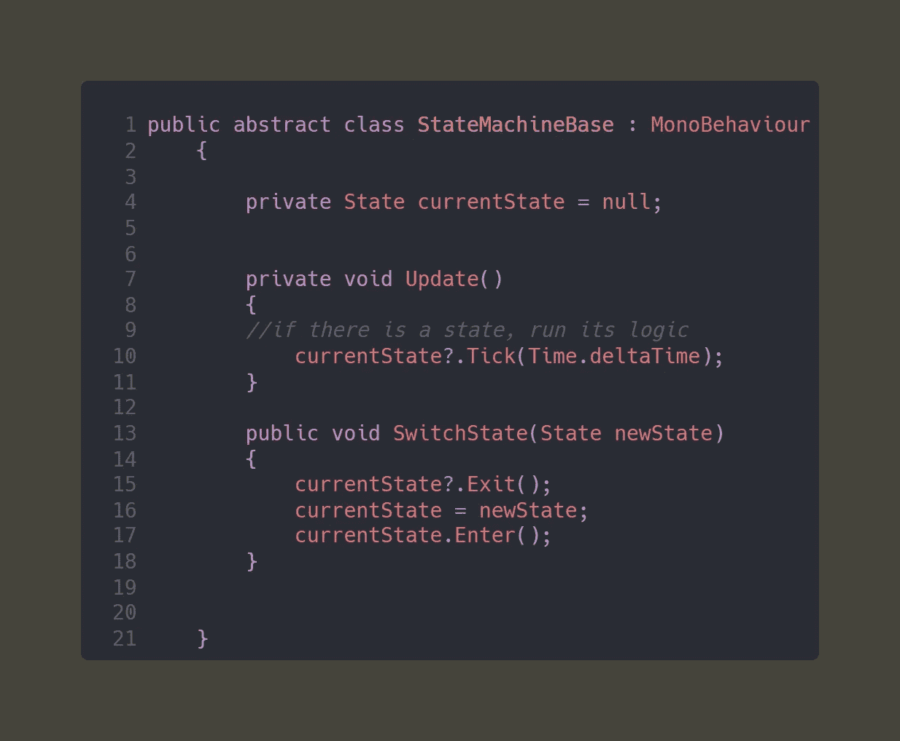
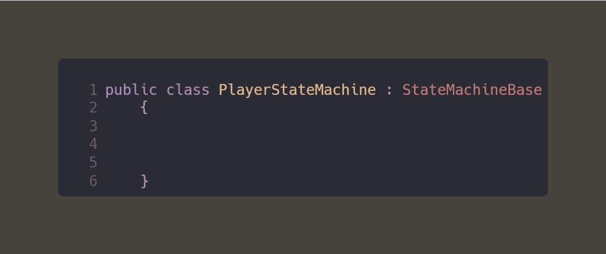
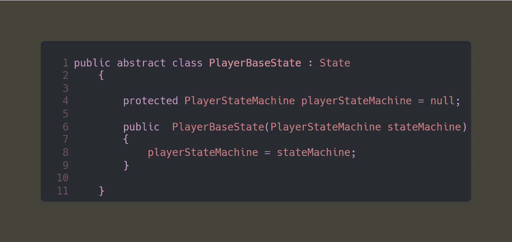

# Unity 创建你自己的状态机

> 原文：<https://levelup.gitconnected.com/unity-creating-your-own-state-machine-35569f829302>

距离我上一次写文章已经快 7 个月了，但那纯粹是因为我终于实现了成为一名职业游戏开发者的梦想。我被招募到“ [*Eduplaytion*](https://www.linkedin.com/company/eduplaytion) ”工作，我们一直在为学校开发一个非常有创意的数学游戏，给数学带来真正的乐趣。这款游戏是基于网络的，名为“*”并将于本月向学校发售。*

**

*游戏开发生活*

# ***状态机***

*状态机是控制游戏流程和执行的一种方式。对于 AI 来说，为了控制他们的行为以及他们何时以及如何做某些动作，这通常是完美的。*

**

*最近，我已经开始创建我自己的小型，也许 Soul 的迷你原型和状态机将完全适合这个项目。*

*作为一名 Unity 的游戏开发者，你肯定已经创建了很多状态机，有时甚至在不知不觉中使用了 Unity 自己的动画师/动画系统。这是一个很好的工具，但是创建你自己的状态机将会给你更多的控制动作的流程，最重要的是它允许你的角色或者 AI 在一个时间处于一个状态。*

**

> *B ase 状态*

*让我们首先从创建一个状态的基础开始，这个基础可以被继承来创建你的角色/AI 将要处于的不同状态。*

**

*基础状态*

*注意它只有 3 个抽象方法。 ***进入*** 和 ***退出*** 的方法是不言自明的。将 *deltaTime* 作为参数的“ ***Tick*** ”方法将成为该状态的核心，其中保存了该状态的所有逻辑，并且该方法将进入“ ***Update*** ”。*

> *基础状态机*

*这个脚本将是机器的基类，将被玩家或人工智能继承。它将控制流程状态之间的切换和运行代码当前的*活动状态。**

****

**基础状态机**

> **玩家基本状态和基本状态机**

**就目前而言，我们只会创建玩家用来控制状态的基地。首先，我们将创建两个类，一个从基本状态继承，另一个从基本状态机继承。**

**这样玩家的基状态就会知道玩家的基状态机，并使用一个构造函数来赋值，然后用玩家的基状态机来控制玩家的不同逻辑。**

****

**玩家的基本状态机**

****

**玩家的基本状态**

**作为一个快速提示，我们稍后将使用玩家的基础状态来创建不同的状态，如奔跑、跳跃等等…**

**这只是编写自己的状态机的基本框架和开始。如果您想了解更多关于状态机以及我是如何在我的项目中实现它们的，请跟随后续文章。祝你编码周愉快。**

**感谢您成为我们社区的一员！在你离开之前:**

*   **👏为故事鼓掌，跟着作者走👉**
*   **📰查看[级编码出版物](https://levelup.gitconnected.com/?utm_source=pub&utm_medium=post)中的更多内容**
*   **🔔关注我们:[推特](https://twitter.com/gitconnected) | [LinkedIn](https://www.linkedin.com/company/gitconnected) | [时事通讯](https://newsletter.levelup.dev)**

**🚀👉 [**加入升级人才集体，找到一份惊艳的工作**](https://jobs.levelup.dev/talent/welcome?referral=true)**