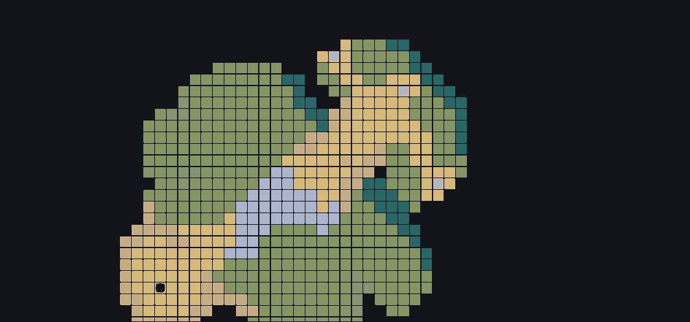
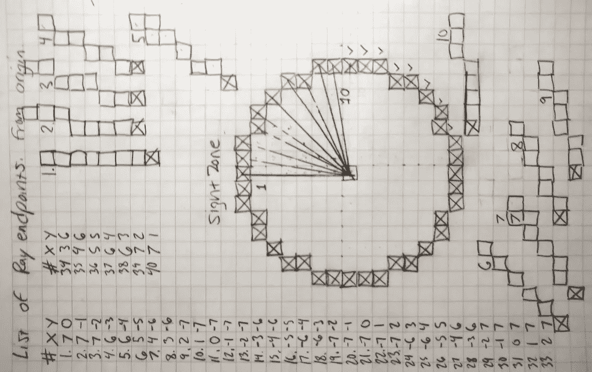
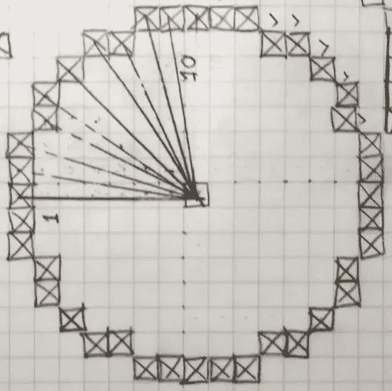
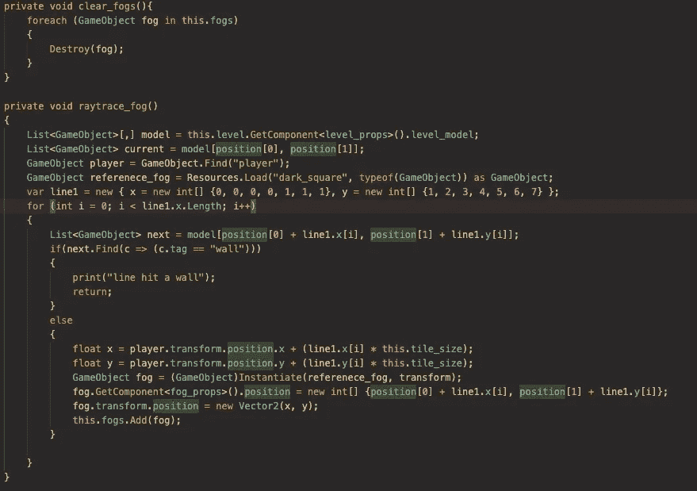
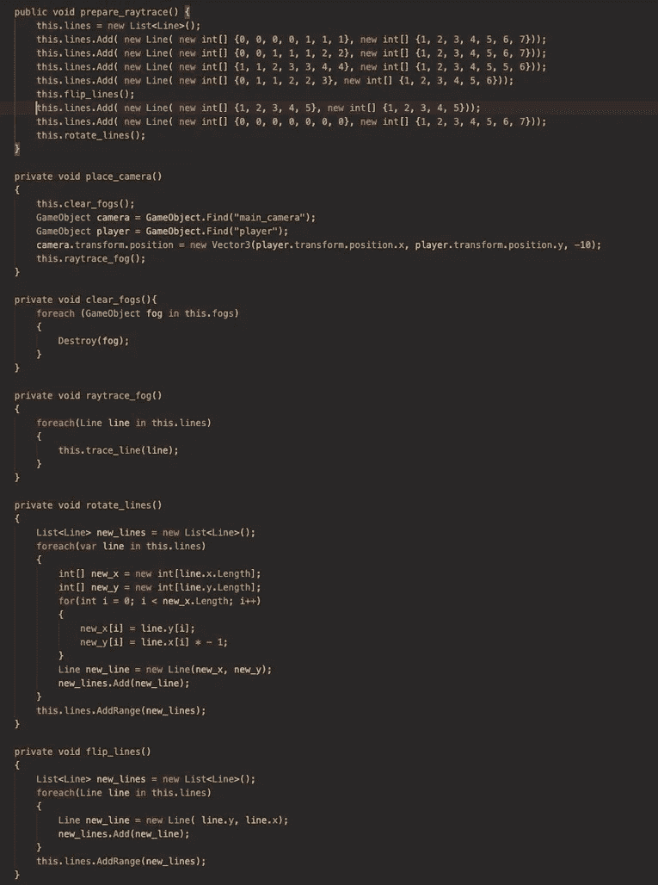
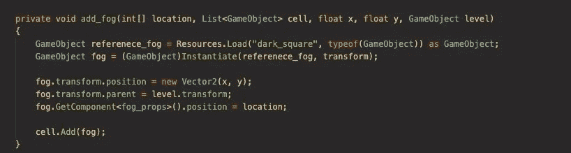
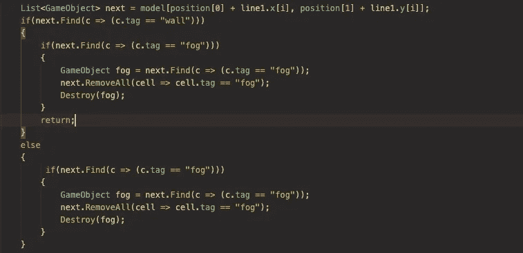

# Unity:如何在网格中实现光线追踪

> 原文：<https://levelup.gitconnected.com/unity-how-to-implement-raytracing-in-a-grid-12fa5896c22d>

## 网格游戏开发日志第 10 天



描绘战争迷雾的游戏图像

# 目标

今天的目标是在我的游戏中制造战争迷雾。我希望角色能够从各个方向看到 7 个街区。

## 我该怎么做？

我要用一个叫做光线追踪的概念。

计算机还没有足够快或足够聪明来环顾四周，收集所有现实的数据，并在处理 100%的可用数据时模拟像视线这样的东西。所以，几十年来大多数工程师模拟视线的方法是用一种叫做光线追踪的东西。

光线跟踪对于无数的应用程序非常有用，但这可能是主要的经典用例。



我们将在角色周围每隔一段时间画一些“光线”。这些光线会刺激视力。某些标记的游戏对象会阻止它们。我的笔记在上面，但我会分解它:



这是我游戏中视觉的影响范围。这个角色有 40 个端点。

起初，我尝试使用直线算法，但我选择手动绘制直线，因为我只需要定义其中的 5 条。

我只需要定义 5 的原因是，我可以用一小片圆创建的形状，应用一系列公式，使它围绕原点旋转。

每行中每个单元格的象限旋转公式如下所示:

## 90 度

```
x = y
y = -x
```

## 180 度

```
x = -x
y = -y
```

## 270 度

```
x = -y
y = x
```

我将制作 5 条线，并将每条线的形状绘制到屏幕上。每条线将以硬编码的方式遍历，并在遇到带有“墙”标签的对象时停止追踪。这将模拟视觉障碍。

然后，通过将上述公式应用到每个单元格，在围绕字符位置旋转所有线条后，我将重复这个跟踪过程 3 次以上。最后，这会在角色周围画一个对称的圆。

在我的网格生成中，我将为游戏中的每个瓷砖创建一个黑色方块。当角色四处移动时，射线会永久移除黑色方块。当角色离开一个区域时，它会留下显示的单元格。这将创造我的战争迷雾效果。

## 首先，光线追踪的“你好世界”

如果你曾经像我一样感到力不从心或不知所措，最好从尽可能小的一步开始。

第一步是光线跟踪的概念验证。我在我的角色运动行为脚本中添加了一些方法。



这里没有什么太花哨的东西。我创建了一个匿名类型，用两个数组依次表示我的光线的所有相对 x 和 y 位置。

我还添加了另一个高排序层数的预置，所以它肯定会被涂在任何其他预置的上面。

它从角色的位置开始绘制光线，直到遇到墙壁。光线填充的每个位置都被添加到顶级雾列表中，然后在每次新的光线跟踪检查之前清除雾列表。

结果如下:

你会注意到，当我在关卡中移动时，它从角色身上画了一条黑线。这条黑线代表投射出的一条光线，作为概念的证明。您还会注意到它被墙和其他带有墙标签的东西挡住了。

在未来，我将创建一个墙标签的层次结构，以便视觉只阻挡墙，水只阻挡运动而不阻挡视觉，但现在，这正如预期的那样工作。

下一步是添加其他 4 条线，并使用上述公式旋转它们。然而，在我围绕原点旋转它们之前，我将在第一象限的轴上翻转它们，以使“形状”占据网格的第一象限。



在这个模块中，我正在做我上面描述的事情。我明确地定义了一些线，然后用公式将它们绕原点翻转/旋转。

这是翻转第一象限对角线上的前 5 条线，然后将前 10 条线构成的整个形状旋转到右下象限后的结果。

现在，我重复完全相同的旋转函数，用各自的公式计算网格的每一个象限，得到我的光线的完整圆，如下图所示。

出于性能原因，我在角色实例化期间调用准备光线跟踪方法。该方法的目的是在应用所有公式后用线条填充光线列表。

这样，一旦游戏对用户开始，整个圈的线已经在内存中分配，在游戏过程中不需要重新分配。我不需要计算机一直准备新的数组和列表并进行操作(即使它肯定足够快来处理这些)，它将简单地遍历准备好的行列表并跟踪每个字符动作的行。

## 让整个世界充满黑暗

由于这个功能是为了实现战争迷雾，我将在整个游戏中填充黑色方块，并让我的光线移除它们，而不是绘制它们。

我在我的网格生成器中用我添加的这个方法做这个，现在每个单元放置都调用这个方法。



## 让脚本在返回之前显示墙的第一层

在上面的视频中，你会注意到光线正好停在障碍物前，但是我想把第一层墙的雾去掉，让玩家看起来能看到他们所在房间的内部。

这是一个简单的修复方法。当我找到一个有墙标签的单元格时，我不会返回，而是继续移除雾，然后在雾从第一层墙移除后从循环中返回，就像这样。



## 最后的结果

现在我的游戏有战争之雾了！我认为这真的增加了游戏的探索感。我很满意。

下次见！