# Unity:实现黑暗模式

> 原文：<https://levelup.gitconnected.com/unity-implementing-dark-mode-9715ac8ac715>

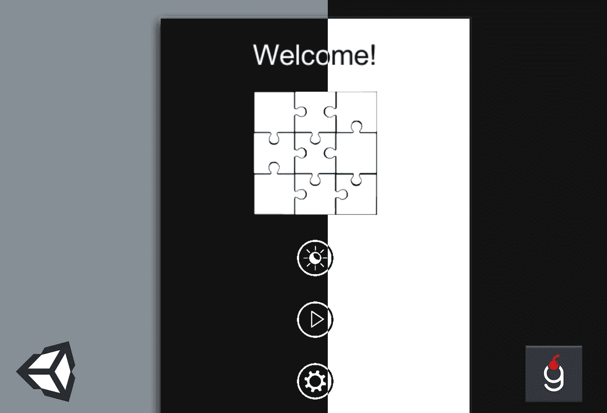

桌面上称之为黑暗模式，移动设备上称之为黑暗主题是当今的趋势。如果你想让你的游戏看起来更现代，让用户开心，拥有模式切换的可能性是一个必须具备的特性。在本教程中，我将向您展示如何添加黑暗模式的支持，相对较少的改变现有的图标和图像。

# 先决条件

我在这里使用的是 Unity 2019.3，但该解决方案也可以在任何其他版本中使用。我已经在我的一个游戏中实现了它——Zen Jigsaw——在那里找到它的实际应用。

和往常一样，GitHub 上有源代码，链接在文章的末尾。

本教程在逻辑上分为两个部分:映像准备和实现。所描述的方法可能需要基本的图像编辑技能(我是一个 Photoshop 用户)。请教你的设计师或者在下面留言，有需求我会加一个 Photoshop 的部分！

最终结果将如下所示:

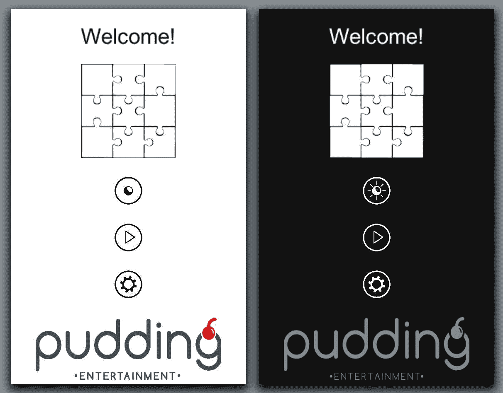

亮(左)和暗(右)模式

> **注意！在设计深色主题时，我偶然发现了这篇[的文章](https://material.io/design/color/dark-theme.html#)，它提供了许多关于颜色、形状和意识形态的宝贵建议。正如上面所说，“推荐的深色主题表面颜色是#121212”。#121212 是 RGB 模型中的颜色。我将把它称为深灰色。**

# 第一部分。调整图像

重要的是保持所有项目的资产在黑暗或光明的模式。不要把它们搞混了！这里值得一提的另一点是，由于游戏的极简设计，整个项目中只使用了两种颜色——深灰色和白色。然而，给定的解决方案，经过一些调整，适用于更广泛的颜色。

有 3 种不同的情况需要实施，我将一个一个地向您介绍。

1.  仅颜色不同的图标


每个图标都是一个单独的 png 文件，背景透明。

你可能想知道，为什么在上面的图片中图标的颜色是白色的，而在之前的最终结果屏幕上，在光线模式下，图标的颜色是黑色的。我不想在两种形式中复制所有的图标，并发现只有一个区别——颜色。因此，你可以默认所有的图标都是白色的，并在 Unity 中直接改变它们。

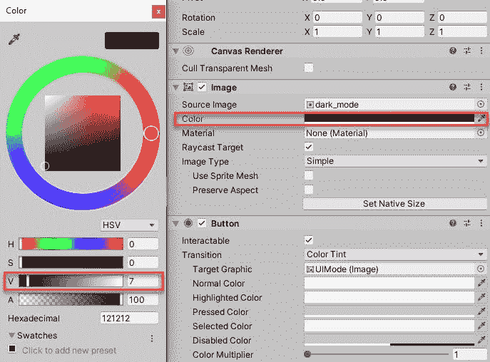

使白色图标变成深灰色

这当然只适用于单色图标。如果不是这样，那么下一点是一个解决方案。

2.在每种模式下有不同精灵的图像


我公司的徽标

这种情况相对简单，您只需要拥有同一个图像的两个版本。考虑看看我以前的文章中关于如何减小最终 apk/aab 文件大小的提示。

3.无论选择何种模式，图像都保持不变

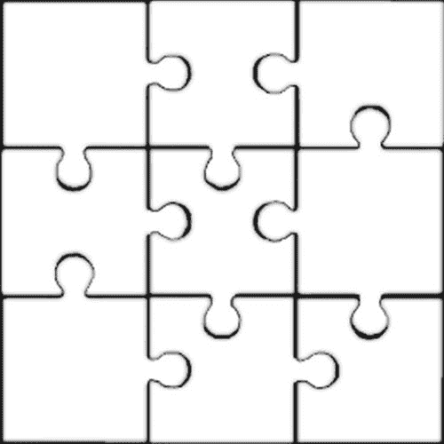

直接取自禅宗七巧板！

它在本教程中没有特殊作用，只是一个不会改变的形象。

至于场景设置，它是在光线模式下用一些图像和文本完成的，一切都来自标准的 Unity UI 包。

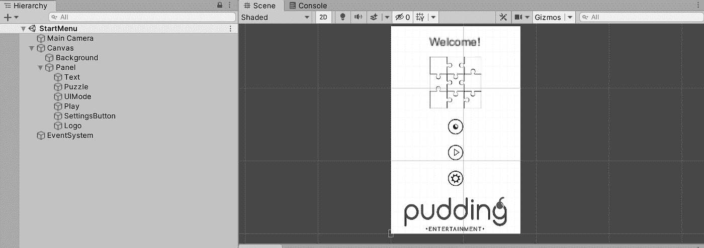

场景设置

现在，当场景和图像准备好了，我们可以继续前进，围绕它实现逻辑。

# 第二部分。解析模式

如果你读过我以前的文章，你就会知道我是干净代码和关注点分离的忠实粉丝。本教程也不例外。先说这里最重要的脚本— `UIModeResolver`。这个类将负责所有与 UI 模式解析相关的事情。正如上一部分所述，我们有 3 种不同的情况要实现。

首先，`UIModeResolver`应该能够找到场景中所有的白色图标和文本，并根据选择的模式改变它们的颜色。

```
public class UIModeResolver : MonoBehaviour
{
   private const float DarkGrey = 0.07f;
   private readonly Color _darkGrey = new Color(DarkGrey, DarkGrey, DarkGrey, 1); public void ResolveMode()
   {
       foreach (var text in GetComponentsInChildren<Text>(true))
       {
           text.color = text.color == Color.white ? _darkGrey : Color.white;
       } foreach (var image in GetComponentsInChildren<Image>(true))
       {
           image.color = image.color == Color.white ? _darkGrey : Color.white;
       }
   }
}
```

> **注意！**深灰色的颜色值是 RGB 0–1.0 格式。

这里的想法是决定如何改变一个元素的当前颜色，并把它变成相反的颜色。我们必须依赖颜色而不是布尔标志，因为场景中的资源在同一模式下可以是两种颜色。例如，如果你决定在浅色模式下文本为深灰色，图标为白色，那么在深色模式下文本为白色，图标为深灰色。

因为我们使用了`GetComponentsInChildren`方法，所以这个脚本应该附加到整个 UI 的父对象上— `Canvas`。

由于我们还没有从任何地方调用它，因此让我们创建另一个负责场景 UI 处理的脚本，并将其附加到 Panel 对象:

```
public class UIController : MonoBehaviour
{
   private UIModeResolver _modeResolver;

   private void Awake()
   {
       _modeResolver = FindObjectOfType<UIModeResolver>();
   } public void ToggleUIMode()
   {
       _modeResolver.ResolveMode();
   }
}
```

这里缺少的最后一部分是调用按钮上的`ToggleUIMode`方法:

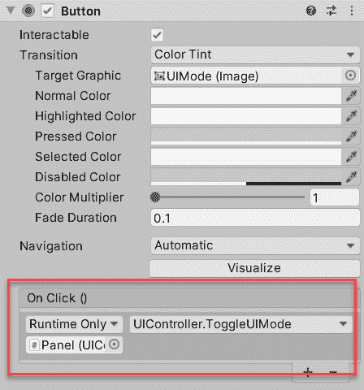

现在开始游戏，按下`UIMode`按钮，你会看到:

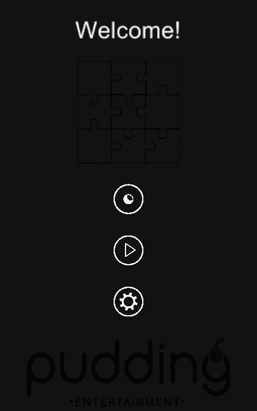

图标和文字与黑暗模式完美对齐！

接下来，让我们实现第二种情况，其中一个图像根据模式有不同的精灵。

```
public class UIModeElement : MonoBehaviour
{
   public Sprite LightModeSprite;
   public Sprite DarkModeSprite; public void ResolveImage()
   {
       GetComponent<Image>().sprite = PrefsHolder.IsDarkMode() ? DarkModeSprite : LightModeSprite;
   }
}
```

这是一个非常小的脚本，但在整个架构中起着至关重要的作用！主要是因为它封装了模式解析逻辑，并将其缩小到只有两个精灵。

还有一个`PrefsHolder`类，你可能在我之前的教程里见过。这是一个简单的静态实用程序类，基本上是 Unity 的`PlayerPrefs`的包装器，负责存储是否选择了黑暗模式并返回其布尔值:

```
public static class PrefsHolder
{
   private const string DarkMode = "DarkMode"; public static void SaveDarkMode(bool on)
   {
       PlayerPrefs.SetInt(DarkMode, on ? 1 : 0);
   } public static bool IsDarkMode()
   {
       return PlayerPrefs.GetInt(DarkMode, 0) == 1;
   }
}
```

在大型项目中，拥有这样的包装器而不是分散的属性是非常方便的。

回到`UIModeElement`——让我们把它附加到`Logo`图像上，并相应地选择精灵。

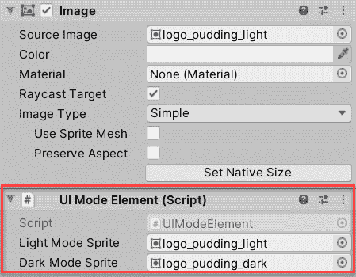

最后一步是将其连接到`UIModeResolver`中，只需对`ResolveMode`方法中的图像处理循环进行一次更改:

```
public void ResolveMode()
{
   ...
   foreach (var image in GetComponentsInChildren<Image>(true))
   {
       var uiModeElement = image.GetComponent<UIModeElement>();
       if (uiModeElement)
       {
           uiModeElement.ResolveImage();
       }
       else
       {
           image.color = image.color == Color.white ? _darkGrey : Color.white;
       }
   }
}
```

在切换回 Unity 之前，我建议我们先来看看第三种情况，精灵不需要在不同的模式下改变。这里的解决方案非常简单，只需做一点小小的修改，就可以重用`UIModeElement`:

```
public void ResolveImage()
{
   if (LightModeSprite)
   {
       GetComponent<Image>().sprite = PrefsHolder.IsDarkMode() ? DarkModeSprite : LightModeSprite;
   }
}
```

你注意到 if 语句了吗？这正是我们所需要的！这里的想法是，如果没有指定精灵，什么都不应该改变。让我们把它附加到`Puzzle`图片上

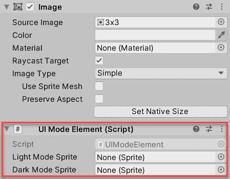

是时候看看一切是否如预期的那样运转了。现在开始游戏，按下`UIMode`按钮在模式间切换:

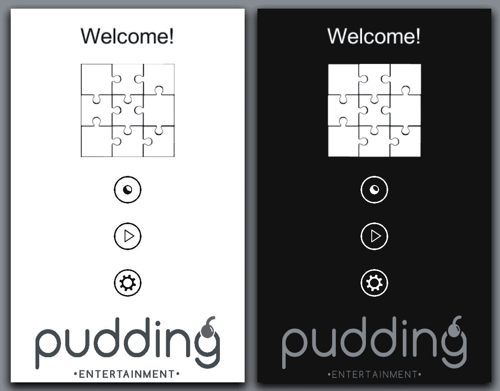

接近最终结果

# **第三部分。保存状态**

正如你在上面的屏幕上看到的,`UIMode`按钮精灵在两种模式下是一样的，这显然是不正确的。此外，选择的状态仍然没有持续，因此，如果玩家选择黑暗模式并重新开始游戏，他将看到光模式。让我们修复这两个缺陷吧！

我们将从每个模式一个合适的按钮图标图像开始。在当前的实现中,`UIController`脚本是这种功能的完美位置，因为它已经负责切换模式。

```
public class UIController : MonoBehaviour
{
   public Sprite[] UIModeImages;

   private UIModeResolver _modeResolver;
   private Button _uiMode;

   private void Awake()
   {
       _modeResolver = FindObjectOfType<UIModeResolver>();
       _uiMode = GetComponentInChildren<Button>();
       _uiMode.image.sprite = UIModeImages[PrefsHolder.IsDarkMode() ? 0 : 1];
   } public void ToggleUIMode()
   {
       var state = !PrefsHolder.IsDarkMode();
       PrefsHolder.SaveDarkMode(state);
       _uiMode.image.sprite = UIModeImages[state ? 0 : 1];
       _modeResolver.ResolveMode();
   }
}
```

这里的三个变化是:

*   增加了一个两种模式都有按钮精灵的公共字段

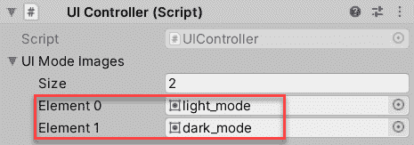

*   在`Awake`上，根据之前选择的模式解析出正确的按钮图标
*   在`ToggleUIMode`方法中，选择的模式被保存，图标子画面相应改变

剩下的最后一步是解决黑暗模式，如果它以前被选中，并设置所有的精灵。因为我们已经在光照模式下设计了场景(和整个游戏),所以只有当保存模式是黑暗模式时才需要它。这一改变将存在于`UIModeResolver`脚本中。

```
public class UIModeResolver : MonoBehaviour
{
   ...
   private void Awake()
   {
       ResolveDarkMode();
   } private void ResolveDarkMode()
   {
       if (!PrefsHolder.IsDarkMode()) return; ResolveMode();
   }
   ...
}
```

看起来很简单，在`Awake`上，我们正在检查保存的模式，如果需要，调用之前创建的`ResolveMode`方法。

# 然后

完成教程做得很好！如果你有任何问题，请在下面的评论区留言。

项目源文件可以在[这个 GitHub 库](https://github.com/Enigo/UnityDarkMode)中找到。

我提到的游戏在这里可以买到[禅宗七巧板](https://play.google.com/store/apps/details?id=pro.pudding.zen)。

# 支持

如果你喜欢你看的内容，想支持作者——非常感谢！
这里是我的以太坊钱包给小费:
**0x b 34 C2 BCE 674104 a7 ca 1 ecebf 76d 21 Fe 1099132 f 0**