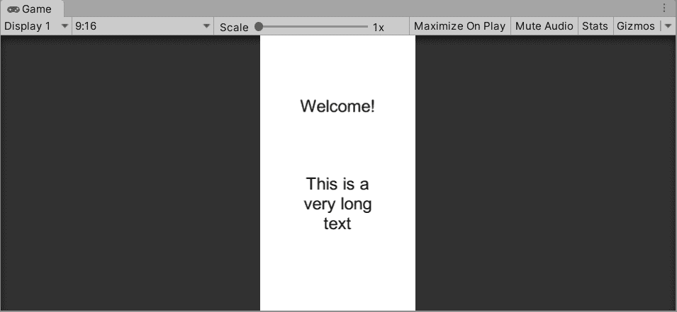
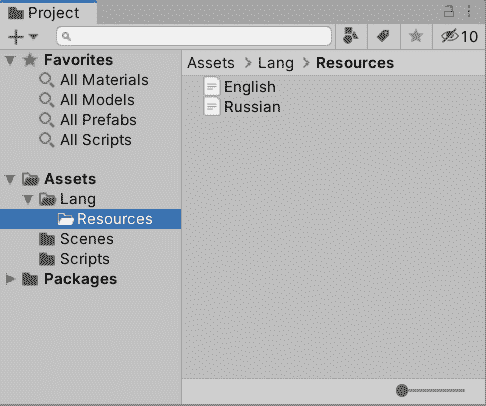
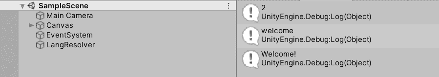
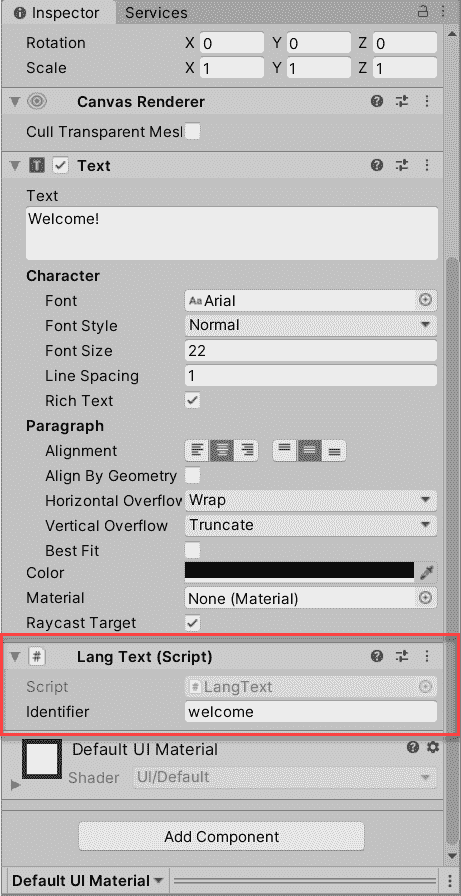
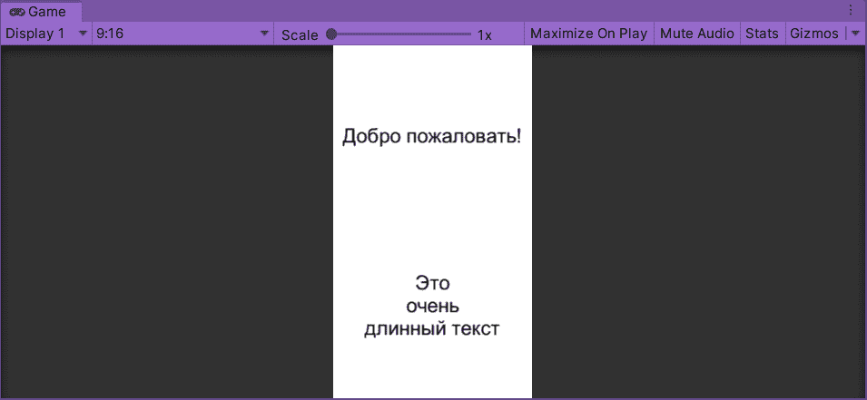
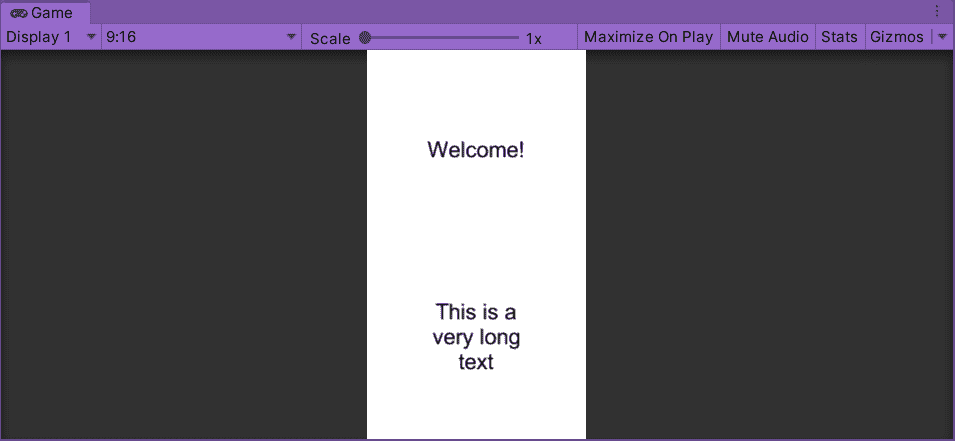

# 统一:本地化变得容易

> 原文：<https://levelup.gitconnected.com/unity-localization-made-easy-37b14adfc581>


[*视频教程点击这里*](https://youtu.be/e_c3JAZ7Zyo)

如果你是一个独立开发者或者一个小工作室，本地化是你最有可能不会在游戏的初始版本中实现的事情。然而，为了增加你的观众和吸引新玩家，多语言支持是你在后续版本中考虑的一个基本要素。在本教程中，我将展示一个非常简单的方法来为你的游戏做本地化，不需要任何第三方资产。

# **先决条件**

我将使用 Unity 2019.3，但早期版本也可以。我已经在我的一个游戏中使用了这些机制——[Zen Jigsaw](https://play.google.com/store/apps/details?id=pro.pudding.zen)——你可以在那里看到它的运行。

和往常一样，GitHub 提供了源代码，请在本文末尾找到链接。

本教程中描述的方法最适合中小型游戏。需要两个组件:保存所有游戏文本的属性文件和填充所需文本的语言解析器。

在本教程中，将使用两种语言——英语和俄语——但是这种方法可以方便地扩展到所有其他支持的语言。



场景设置

在 Unity 之前，我有过一次使用另一个流行的游戏开发框架 Libgdx 的经历。如果您曾经使用过它，您可能会在这里描述的技术中发现某些相似之处。Libgdx 中的本地化支持开箱即用，并且以极其简单的方式实现。我有点惊讶，Unity 还缺少这个必备功能。是的，[有 0.4](https://docs.unity3d.com/Packages/com.unity.localization@0.4/manual/) 包可用，但仍处于早期开发阶段。

# **第一部分。创建属性文件**

为了从代码中访问属性文件，我们将把它们存储在 Resources 文件夹中。



属性文件设置

我称那些文件为“属性”是因为其结构，例如 English.txt 文件有以下内容:

```
welcome=Welcome!
long_text=This is a\nvery long\ntext
```

每个财产文件将履行合同:

*   单行由两部分组成—分隔符左侧的键和右侧的值
*   各行之间用换行符隔开
*   文件名对应于 Unity `SystemLanguage`枚举
*   所有属性文件都有相同的关键字，但不同的*本地化*值
*   键和值之间的分隔符是“=”，您也可以使用任何其他符号

# **第二部分。读取属性文件**

为了利用之前准备的文件，让我们创建一个脚本，该脚本将负责逐行读取文件，收集所有的键值对并将它们填充到文本组件中:

```
public class LangResolver : MonoBehaviour
{
    private const char *Separator* = '=';
    private readonly Dictionary<string, string> _lang = new Dictionary<string, string>();
    private SystemLanguage _language; private void Awake()
    {
        DontDestroyOnLoad(gameObject);
        ReadProperties();
        Debug.Log(_lang.Count);
        Debug.Log(_lang.Keys.First());
        Debug.Log(_lang.Values.First());
    } private void ReadProperties()
    {
        _language = Application.systemLanguage;
        var file = Resources.Load<TextAsset>(_language.ToString());
        if (file == null)
        {
            file = Resources.Load<TextAsset>(SystemLanguage.English.ToString());
            _language = SystemLanguage.English;
        }
        foreach (var line in file.text.Split('\n'))
        {
            var prop = line.Split(*Separator*);
            _lang[prop[0]] = prop[1];
        }
    }
}
```

让我们创建一个新的空游戏对象并将 LangResolver 附加到它。

如果您现在点击播放按钮，您将看到以下输出:



这是`_lang` 字典的大小，也是英语属性文件中的第一个键和值！

有一个默认值是很重要的，以防有人用不支持的语言运行你的游戏。通常，使用英语，但它可能会有所不同。

> **注意！这个脚本只需要初始化一次，最好是在第一个场景(通常是飞溅的场景)。如果你没有这样的场景，应该添加一个重复的检查。**

此时，您可能想知道:语言选择器在哪里？我故意将 UX 的这一部分排除在教程范围之外。在现代游戏中，语言改变选项不再是必须的，依靠系统语言是完全可以的。但是我在[高级本地化教程](/unity-advanced-localization-802cb954ca16)中有它的封面，一定要去看看！

# 第三部分。本地化

下一步是将属性中的键绑定到文本组件。为此，让我们创建以下助手类:

```
public class LangText : MonoBehaviour
{
    public string Identifier;
}
```

这个脚本将被附加到我们希望用文件中的文本填充的每个文本组件上。**标识符**字段是来自属性的一个键。



最后一步是填写所有文本。让我们在 LangResolver 中添加以下公共方法:

```
public void ResolveTexts()
{
    var allTexts = Resources.FindObjectsOfTypeAll<LangText>();
    foreach (var langText in allTexts)
    {
        var text = langText.GetComponent<Text>();
        text.text = Regex.Unescape(_lang[langText.Identifier]);
    }
}
```

> **注意！** `Regex.Unescape`方法用于正确解析属性文件中的新行和其他可能的格式化字符。

虽然你可以从脚本内部调用这个方法(例如，从 Awake 中)，但我更喜欢有一个专用的`UIResolver` 类:

```
public class UIResolver : MonoBehaviour
{
    private void Start()
    {
        FindObjectOfType<LangResolver>().ResolveTexts();
    }
}
```

# **第四部分。测试**

现在棘手的部分是用不同的语言测试它，因为你需要调整你的操作系统语言。我相信您不希望这样做，所以让我们通过将`ReadProperties` 方法中的第一行改为`_language = SystemLanguage.Russian`来“模拟”这种行为

如果你点击播放按钮，你会看到:



俄语

看不懂西里尔文也不用担心，文字是直接翻译的。

默认情况下，使用英语的结果将是:



英语

通常，您不需要在文本组件本身中保留任何文本，因为它的文本无论如何都会被替换。然而，从 UX 的角度来看，理解文本的外观可能会有所帮助，所以我建议在 Unity editor 中保留一些文本，同时使用属性文件作为最终的事实来源。

# **事后**

完成教程做得很好！如果你有任何问题，请在下面的评论区留言。

项目源文件可以在[这个 GitHub 资源库](https://github.com/Enigo/UnityEasyLocalization)中找到

我提到的游戏可以在这里下载[禅宗七巧板](https://play.google.com/store/apps/details?id=pro.pudding.zen)。

# 支持

如果你喜欢你看的内容，想支持作者——非常感谢！
这里是我的以太坊钱包给小费:
**0x b 34 C2 BCE 674104 a7 ca 1 ecebf 76d 21 Fe 1099132 f 0**