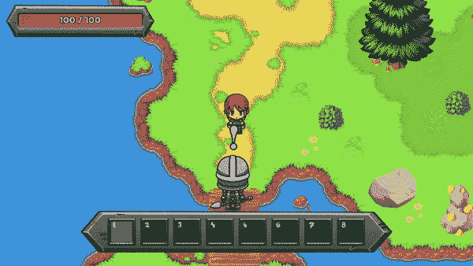
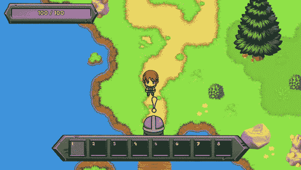

# Unity:读取外部 XML 文件

> 原文：<https://levelup.gitconnected.com/unity-reading-external-xml-files-ed199df66288>

更新:我写了本指南的平行版本，关于如何读取外部 JSON 文件。如果你感兴趣，一定要去看看！这两篇文章的内容是相似的，除了外部文件的格式。

[](https://allison-liem.medium.com/unity-reading-external-json-files-878ed0978977) [## Unity:读取外部 JSON 文件

### 通过在 JSON 文件中存储数据，我们可以对我们的游戏进行修改(例如，任务，语言本地化),而不需要任何…

allison-liem.medium.com](https://allison-liem.medium.com/unity-reading-external-json-files-878ed0978977) 

我们可以用 Unity 编辑器做很多事情，比如改变一个游戏对象/组件的属性，我们也可以用自定义 C#脚本做很多事情，比如一个对象的行为。例如，当角色走进一个预先定义的区域时，我们可以让一些文本出现在屏幕上。



当 Elise 走近 Alfred 时，他和她聊了起来。

虽然上面的例子可以完全用 Unity 编辑器和 C#行为来创建，但有时通过 XML 文件在外部定义一些属性是很有用的。例如，也许我们想在全球多个地区用不同的语言发布游戏。浏览 XML 文件列表并更改文本要比检查大量游戏对象并查看哪里有文本要切换容易得多。此外，对于 XML 文件，游戏逻辑保持不变，我们可以用 XML 文件更改语言本地化，注意游戏中的字体包含其他语言的字符。



有了 XML 文件，我们可以在游戏中定制语言本地化。

在本指南中，我将讨论如何在 Unity 中导入 XML 文件，并在游戏中使用这些 XML 文件的内容。例如，在[神秘女王](https://allison-liem.medium.com/mystery-queen-a-game-im-creating-with-my-family-7d4f17cbdac0)中，我们将 XML 文件用于任务系统，我将在以后的指南中详细介绍。

本指南的 Unity 场景、资源、源代码和 XML 文件可以作为 Unity 包从[下载。你也可以](https://allisonliem.org/unity/xmlimport.unitypackage)[访问 Github](https://github.com/allison-liem/unity-xml-import) 上的文件。本指南中的每一步都有单独的场景，因此您可以挑选自己想要的方式。项目和代码的创建是为了更容易理解效率，所以您可能想为自己的项目做一些优化和定制。

# 步骤 0:在 Unity 中设置场景

我们将在 Unity 中设置一个只有一个角色的基本场景。我们使用的是来自[解放像素杯](https://lpc.opengameart.org/)的免费精灵，也就是[ [LPC] Sara](http://opengameart.org/content/lpc-sara) 精灵。

Sara(角色)已经设置了 CapsuleCollider2D 和 RigidBody2D 组件，以及一个根据玩家的输入左右移动她的基本脚本。Sara 有一个 SpriteRenderer 和 Animator 来制作她的运动动画。特别是，我们用的是来自[的同一个萨拉，这是我们制作 2D 半透明效果的指南。](https://allison-liem.medium.com/unity-2d-translucent-effect-when-a-character-is-behind-an-object-f94f09165603)

接下来，我们将在场景中创建一些用户界面文本，我们将初始化没有文本。

我们还将设置一个空的游戏对象，以 BoxCollider2D 作为触发器，并附加一个行为，该行为将在 Sara 进入触发器时将文本更改为粗体的“Sara is in the trigger”，字体大小为 36，在 Sara 退出触发器时将文本设置为“Sara are not in the trigger”，字体大小为 30。

```
void OnTriggerEnter2D(Collider2D _)
{
  uiText.text = "Sara is in the trigger";
  uiText.fontSize = 36;
  uiText.fontStyle = FontStyle.Bold;
}void OnTriggerExit2D(Collider2D _)
{
  uiText.text = "Sara is no longer in the trigger";
  uiText.fontSize = 30;
  uiText.fontStyle = FontStyle.Normal;
}
```

这样，我们的基本场景就完成了，当 Sara 进入和退出触发器时，文本会发生变化。


文本根据 Sara 是在触发器内部还是外部而变化。

# 步骤 1:创建 XML 文件并在 C#中定义它们

首先，让我们为 Sara 输入触发器时出现的`text`创建一个 XML 文件( *enter.xml* )。我们还将有一个嵌套字段`font`，存储字体的`size`和`style`:

```
<trigger>
  <text>The trigger intersects with Sara</text>
  <font>
    <size>36</size>
    <style>italic</style>
  </font>
</trigger>
```

接下来，让我们为 Sara 退出触发器时的文本创建一个 XML 文件( *exit.xml* )。`text`、`font`、`size`和`style`将与 Sara 进入时不同:

```
<trigger>
  <text>The trigger no longer intersects with Sara</text>
  <font>
    <size>30</size>
    <style>normal</style>
  </font>
</trigger>
```

现在我们有了 XML 文件，我们还应该用 C#定义相关的类。为此，我们将创建一个`TriggerXml`类，在这里我们可以定义变量`text`和`font`，其中`font`是一个嵌套的 XML 标签。为了让 C#知道这些意味着与 XML 文件相关联，我们可以使用注释，即`XmlRoot`和`XmlElement`。我们还将创建一个`FontXml`类，包含像`size`和`style`这样的元素。

```
using System.Xml;
using System.Xml.Serialization;[XmlRoot(ElementName = "trigger")]
public class TriggerXml
{
  [XmlElement(ElementName = "text")]
  public string text; [XmlElement(ElementName = "font")]
  public FontXml font;
}[XmlRoot(ElementName = "font")]
public class FontXml
{
  [XmlElement(ElementName = "size")]
  public int size; [XmlElement(ElementName = "style")]
  public string style;
}
```

需要注意的一点是，我们有 2 个 XML 文件( *enter.xml* 和 *exit.xml* )，但这两个文件都是同一类型(`TriggerXML`)。您还可以定义不同的 XML 类型，和/或嵌套的 XML 元素，就像上面的`FontXml`一样。

# 步骤 2:在 C#中导入 XML 文件

既然我们已经创建了 XML 文件和 C#类，我们需要一种方法将文件导入 C#对象。幸运的是，C#有内置函数可以为我们做很多工作。这里有一个模板化版本的导入函数，您可以将它用于您定义的任何 Xml 类型的类(例如，上一步中的`TriggerXml`)。

```
public static T ImportXml<T>(string path)
{
  try
  {
    XmlSerializer serializer = new XmlSerializer(typeof(T));
    using (var stream = new FileStream(path, FileMode.Open))
    {
      return (T)serializer.Deserialize(stream);
    }
  }
  catch (Exception e)
  {
    Debug.LogError("Exception importing xml file: " + e);
    return default;
  }
}
```

例如，您可以使用以下代码片段导入 *enter.xml* :

```
TriggerXml enterTriggerXml = XmlUtils.ImportXml<TriggerXml>(Path.Combine(Application.dataPath, "Xml/enter.xml"));
```

我们提供的路径添加了一个前缀`Application.dataPath`，当在 Unity 编辑器中运行时，它通常是项目中的 *Assets* 文件夹。因此，该文件应该在 *Assets/Xml/enter.xml* 中。

通过`ImportXml`功能，我们现在能够将 XML 文件导入到我们的 Unity 项目中了！

# 步骤 3:将 XML 导入我们的场景

为了在场景中使用我们的 XML 文件，我们需要更新触发器的行为来加载`Start()`中的 XML 文件，并在 Sara 进入和退出触发器时使用 XML 内容来更改文本、字体大小和样式。

```
void Start()
{
  uiText = FindObjectOfType<Text>(); enterTriggerXml = XmlUtils.ImportXml<TriggerXml>(Path.Combine(Application.dataPath, enterXmlPath)); exitTriggerXml = XmlUtils.ImportXml<TriggerXml>(Path.Combine(Application.dataPath, exitXmlPath));
}void OnTriggerEnter2D(Collider2D _)
{
  SetUiText(enterTriggerXml);
}void OnTriggerExit2D(Collider2D _)
{
  SetUiText(exitTriggerXml);
}private void SetUiText(TriggerXml triggerXml)
{
  uiText.text = triggerXml.text;
  uiText.fontSize = triggerXml.font.size;
  if (triggerXml.font.style.Equals("italic"))
  {
    uiText.fontStyle = FontStyle.Italic;
  } else
  {
    uiText.fontStyle = FontStyle.Normal;
  }
}
```

现在，通过在触发器行为的属性中设置属性`enterXmlPath`和`exitXmlPath`(通过 Unity 编辑器)，我们可以通过编辑 XML 文件自由地改变触发器的内容。


文本和字体样式现在从外部 XML 文件加载。

# 我们是如何为神秘女王做到的

在[神秘女王](https://allison-liem.medium.com/mystery-queen-a-game-im-creating-with-my-family-7d4f17cbdac0)中，我们使用`ImportXml`模板函数来导入我们的 XML 文件。目前，我们在任务和角色相关的文本中使用 XML 文件。例如，当 Elise(玩家角色)与警卫 Alfred 交谈时，他们的聊天内容被定义在 XML 文件中。此外，Alfred 给了 Elise 一系列的任务，这些都是通过 XML 定义的，以便更容易地创建/维护任务，如果我们决定在将来进行语言本地化，也可以这样做。

为此，我们在 XML 导入的基础上构建了一个任务系统，它定义了任务的先决条件、奖励等等。我们还在 XML 文件中定义了通用的可定制标签，这些标签将在游戏中被替换为实际的文本。例如，XML 文件中的文本`Halt right there {player.name}!`在游戏中变成了`Halt right there Elise!`，从而允许玩家自定义他们角色的名字，并自动更新所有任务文本。我们将在未来的指南中讨论如何创建可定制的标签和任务系统！

我希望你喜欢这篇关于在 Unity 项目中导入和使用 XML 文件的指南！在 [Twitter](https://twitter.com/allison_liem) 和/或 [Medium](https://medium.com/@allison-liem) 上关注我，当我们讨论我们为[神秘女王](https://allison-liem.medium.com/mystery-queen-a-game-im-creating-with-my-family-7d4f17cbdac0)开发(和正在开发)的其他系统时，请继续关注更多与 Unity 相关的指南。如果你感兴趣，你也可以阅读下面我的关于创造昼夜循环的指南:

[](https://allison-liem.medium.com/unity-creating-a-day-night-cycle-bc59a1770b8c) [## 统一:创造昼夜循环

### 昼夜循环对于一些游戏来说很重要，例如让生物在晚上睡觉。

allison-liem.medium.com](https://allison-liem.medium.com/unity-creating-a-day-night-cycle-bc59a1770b8c)