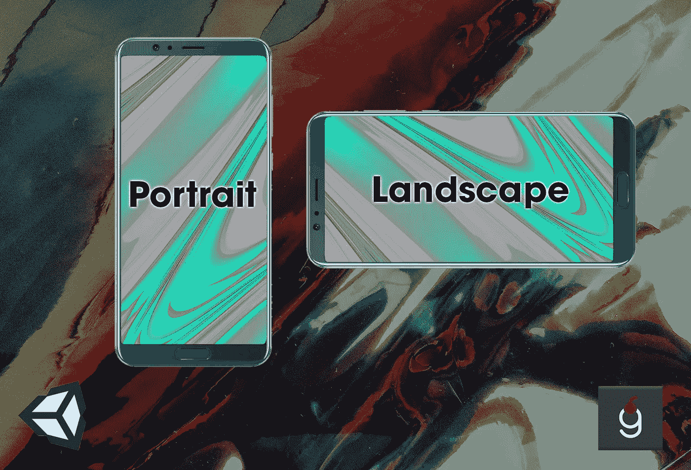
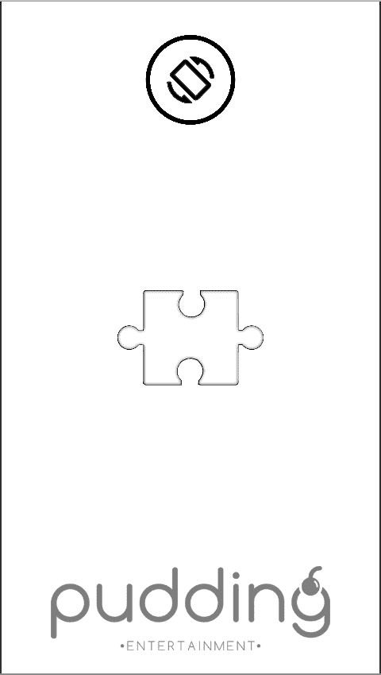
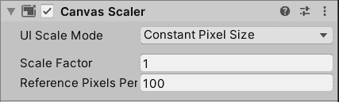
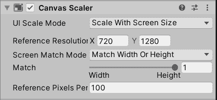
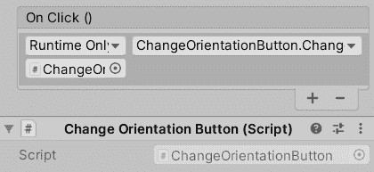
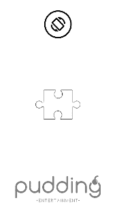
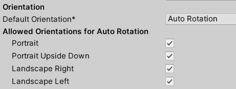

# Unity:支持纵向和横向屏幕方向

> 原文：<https://levelup.gitconnected.com/unity-supporting-portrait-and-landscape-screen-orientations-3330fdb0eaec>

背景照片由来自 Pexels 的安妮·伦凯拍摄

开发人员经常选择“忽略”市场上有两种屏幕方向的事实——纵向和横向，只支持其中一种。显然，这样做会遗漏很大一部分器件。在本教程中，我将向您展示如何添加对两种屏幕模式的支持，同时也揭示一些您可能没有想到的边缘情况。

# 先决条件

我用的是 Unity 2020.1.17。本文假设你的游戏**是**适合两种取向。就像我的情况一样， [Zen Jigsaw](https://play.google.com/store/apps/details?id=pro.pudding.zen) 从一开始就需要平板电脑的支持，但我从来没有找到时间*(直到上周)*来实现它。同样值得一提的是，该项目仅在 Android 上进行了测试。

与往常一样，GitHub 提供了项目源代码，请在页面末尾找到链接。

有三个部分:场景准备、编码和边缘案例。

# 第一部分。场景准备

在场景中添加第一个元素之前，你应该决定默认的屏幕方向。即使在极端的情况下，你可能想要为每个方向或者整个场景创建一个专用的 UI 层，我个人也不建议这样做，因为这会增加编码和维护的复杂性。构建每个场景的两个独立版本是一个繁琐的过程！对于本教程，我们将人像作为默认模式。

让我们设置我们的场景，我们将添加几个图像和一个按钮来改变方向:

场景设置

如果你曾经使用过 Unity UI，那么你可能已经听说过`[Canvas Scaler](https://docs.unity3d.com/Packages/com.unity.ugui@1.0/manual/script-CanvasScaler.html)`组件。选择层次中的`Canvas`对象以访问它:

默认值

这是每个新`Canvas`创建的默认缩放器。对于我们的情况，所选的`Scale Mode`将无法正常工作，因此我们需要修改它:

工作版本

一旦你改变了`UI Scale Mode`，场景中的所有元素瞬间变小。那正是`Canvas Scaler`的工作！根据默认的屏幕方向，应选择不同的值。对于肖像模式，我们希望匹配高度，参考分辨率应该是“流行的”肖像尺寸之一。

如果您现在将游戏选项卡预览更改为横向尺寸，所有元素在视觉上将保持与纵向模式下完全相同的大小。

场景设置完毕！是时候让那个按钮工作了。

# 第二部分。编码

不幸的是，你不能在 Unity 编辑器中测试旋转。要想看到它的运行，你需要插上你的手机，在那里运行游戏。

让我们用改变方向的方法创建一个脚本`ChangeOrientationButton`:

将脚本附加到按钮上，并将其连接到`OnClick`处理器中:

连接您的手机，建立和运行项目，看看旋转的行动:

> **注意！与 GIF 相比，它在手机上看起来更好。在现实中，当场景在相反的模式下被冻结几秒钟时，你实际上不会看到那些奇怪的中间帧。**

基本上就是这样，我们到此为止！如果你认为这好得不像是真的，请继续阅读，寻找隐藏在这个简单的方向改变过程中的各种边缘情况。

# 第三部分。边缘案例

您可能想知道——为什么要有那个按钮，而不是依靠设备方向改变事件呢？虽然有可能利用这一点，但这样做会使项目变得相当复杂，因为你需要考虑到方向的变化可能会发生在每一个场景中。最重要的是，Unity 没有为这个“本地”事件提供一个`EventHandler`。Unity 论坛上有各种各样的解决方法，但是，老实说，所有的方法都不完美。

是时候开始揭示我们的死简单实现的边缘情况了。

第一个也是最明显的缺失是没有设置储蓄。因为我们将方向改变公开为一个按钮，所以它应该在下次启动时被存储和恢复。否则你会让你的玩家失望，每次都要换。

如果你以前读过我的教程，你会立刻认出这个静态助手脚本:

我们应该相应地扩展`ChangeOrientation`方法:

到目前为止一切顺利，国家得救了。现在，我们应该弄清楚如何在下次启动时恢复它。有两种可能的情况需要考虑——玩家要么选择游戏的首选屏幕方向，要么不选择。让我们创建一个空的`GameObject`，并附上新的脚本`OrientationSetter` 。它将负责处理这两起案件。

完成后，如果玩家先前选择了一个不同于当前的方向，现在开始游戏，场景将会相应地改变。等等，你也注意到了吗？过渡不顺利！屏幕冻结了一会儿，感觉用户体验很差。

除此之外，还有一个尚未解决的边缘问题。如果设备自动旋转被激活怎么办？我很想和那些在 2021 年激活它的人谈谈。然而，有一个特性，我们需要适当地支持它。

让我们用一个我称之为`PreSplash`的解决方案来解决这两个问题！

这个概念相当简单——您可能会有第一个`Splash`场景，在那里您设置了所有需要一次性初始化的服务(想想`AdManager`或`StoreManager`)。我们将在`Splash`之前创造另一个场景，叫做`PreSplash`。除了您选择纯色的`MainCamera`和负责正确场景方向配置的`OrientationSetter` `GameObject`之外，场景上没有任何东西。此外，`OrientationSetter`脚本将被扩展以平滑屏幕方向变化过渡:

等待 3 秒钟可能看起来像一个黑客，但事实上它甚至不会被玩家注意到。如果你觉得等待时间太长/太短，你可以调整这个值。

看到它是如何变得越来越复杂了吗？而且还有一个！

为了涵盖设备自动旋转功能，我们需要使用**播放器设置分辨率和演示**配置。默认情况下，它具有以下值:

这基本上允许屏幕以任何方式旋转，不管我们之前做了什么。由于纵向模式被选为默认模式，我们可以取消横向右/左复选框。接下来，我们需要允许每个当前方向的正确旋转:

正如您所看到的，覆盖所有的边缘情况使得我们最初简单的代码变得更加复杂！

# 然后

完成教程做得很好！支持两个方向可以为您的游戏解锁更广泛的设备。但是请记住，只有在不损害整体界面的情况下，才应该这样做。

如果你有任何问题，请在下面的评论区留言。

项目源文件可以在 [this GitHub repository](https://github.com/Enigo/UnityBothOrientations) 中找到。

你可以在这个游戏中检验这一切— [禅宗七巧板](https://play.google.com/store/apps/details?id=pro.pudding.zen)。

**支持**

如果你喜欢你看的内容，想支持作者——非常感谢！
这里是我的以太坊钱包给小费:
**0x b 34 C2 BCE 674104 a 7 ca 1 ecebf 76d 21 Fe 1099132 f 0**