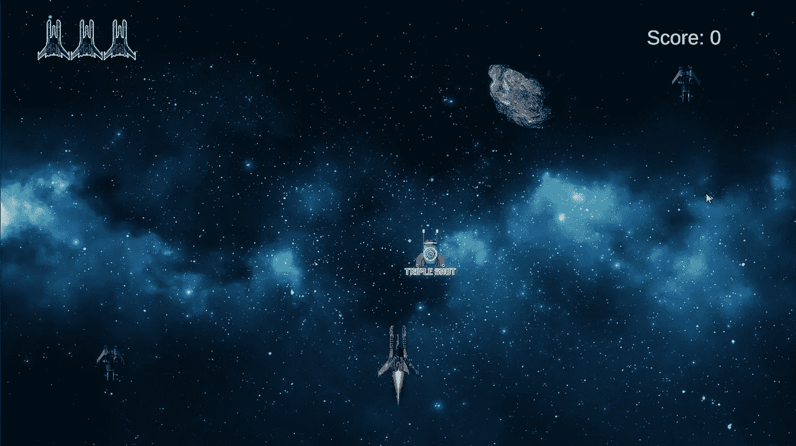
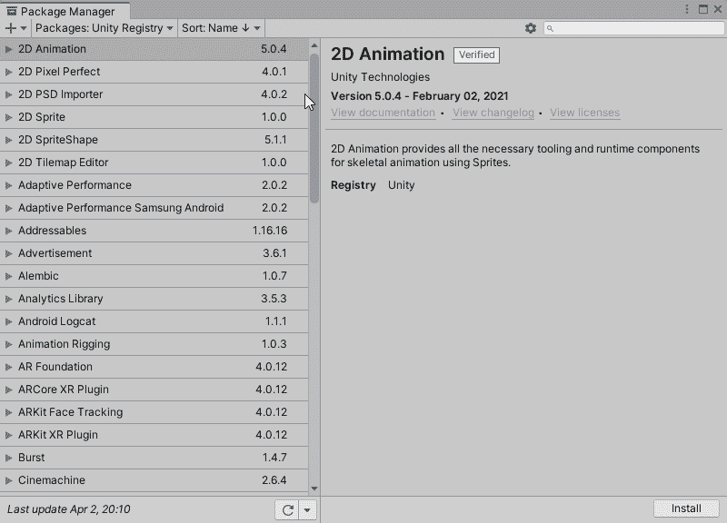
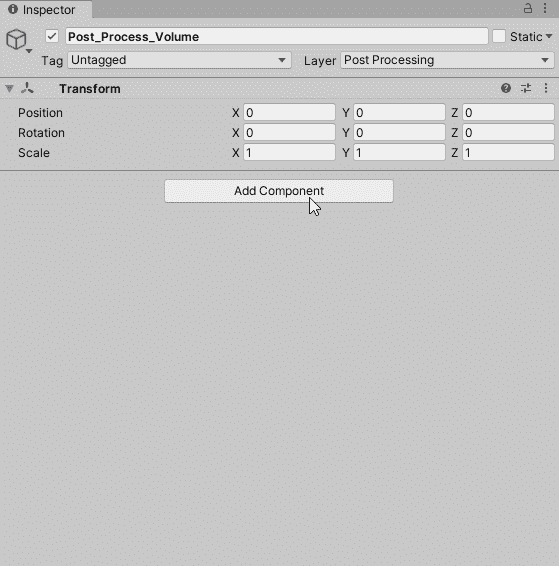
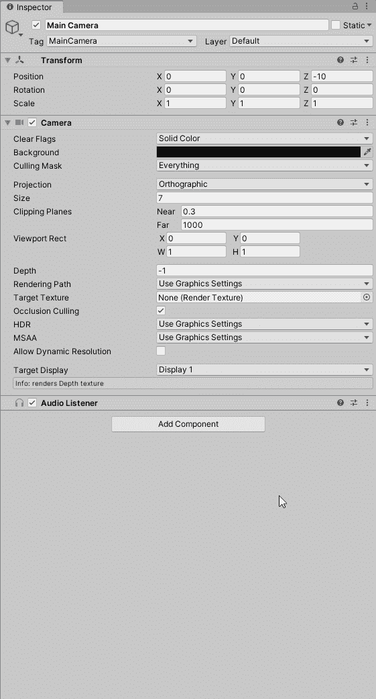
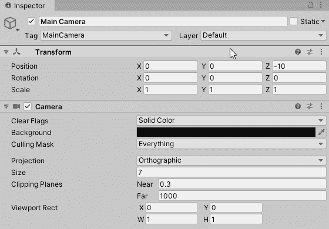
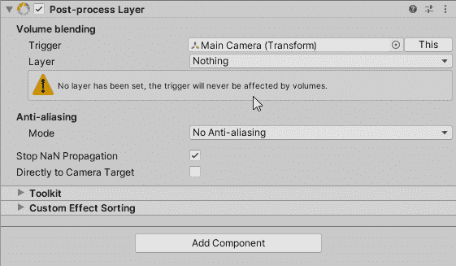
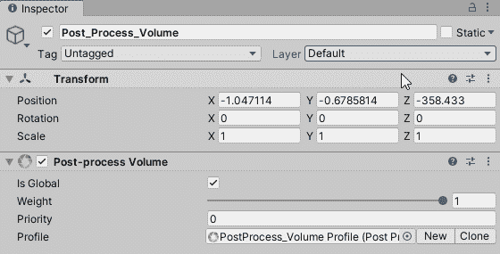
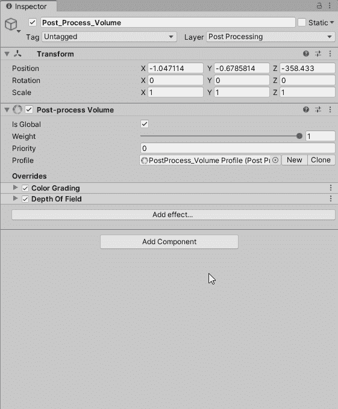
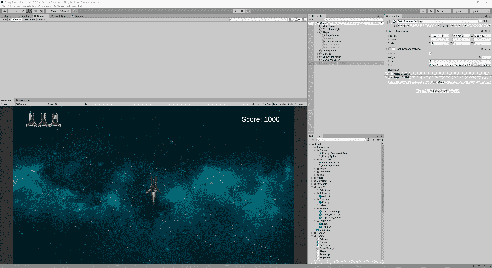

# Unity3D:如何使用后处理

> 原文：<https://levelup.gitconnected.com/unity3d-how-to-use-post-processing-57f2eccf9b22>

你想用后期处理效果让你的游戏看起来很有美感吗？我会告诉你怎么做！

后期处理美化视觉效果！

首先，我们需要安装后处理包。让我们点击**窗口>软件包管理器**。将弹出软件包管理器窗口。

搜索后处理包并安装！我已经安装了它，因此删除按钮显示。

安装完成后，我们要创建一个新的游戏对象，并将其命名为“ **Post_Process_Volume** 这个游戏对象将控制我们视频游戏中的所有效果。

我们需要附加一个**后处理卷**组件。这将允许我们创建一个配置文件，以便我们可以开始添加视觉效果。在这个例子中，确保我们选中了“**是全局的**，这样我们的整个游戏都会受到视觉效果的影响。

如果我们决定创建一个玩家可以在建筑物内外奔跑的 FPS 射击游戏，我们创建一个带有"**是全局的** " *被选中的*"和一个带有"**是全局的** " *未被选中的*的内部配置文件。这将允许我们控制环境的外观和感觉。

在添加效果之前，我们需要告诉我们的相机渲染这些体积效果。

让我们选择我们的相机，并附上一个"**后处理层**"组件。

我们需要创建一个新的层，这样我们就可以通过一个单独的层来识别任何后期处理。

确保您有一个后处理层。

现在我们需要在相机的“**后处理层**”组件中分配它。

最后，我们需要选择我们的“ **Post_Process_Volume** 游戏对象，并分配“ **Post Processing** ”层。

它将允许我们与连接到相机的后处理层组件进行通信。我们添加的效果将对摄像机进行更改，这样我们就可以可视化设置。

我们现在可以添加效果了！

选择“后处理量”游戏对象，点击“后处理量”组件中的“添加效果”按钮。

现在我们可以添加效果，你可以随心所欲了！

选择您想要添加的效果并调整设置。

通过颜色分级和景深，我可以根据自己的喜好调整视觉效果。下面是停用和重新激活“Post_Process_Volume”游戏对象的前后对比。

一个微妙的变化，但你可以看到多少视觉效果有所改善！这完全是偏好的问题，这就是你如何美化你的游戏！

我希望这将有助于你这样做！:)

今天到此为止。感谢您的阅读！