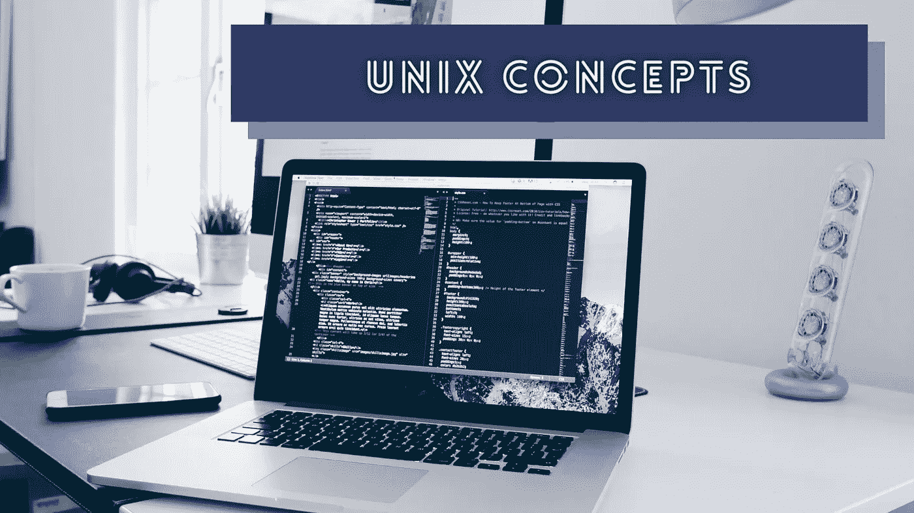
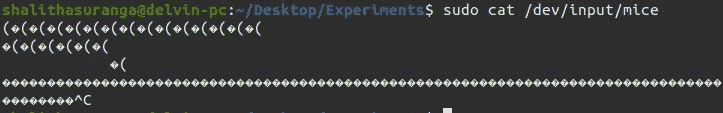
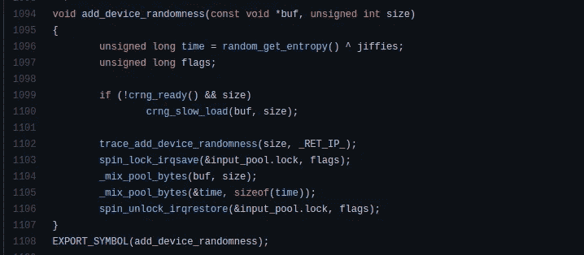
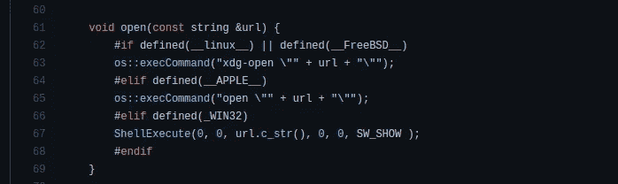
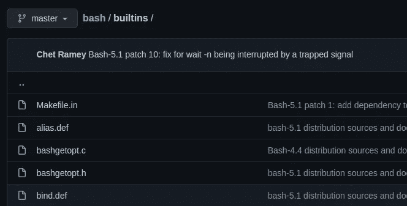

# 每个开发人员都应该知道的 Unix 内部概念

> 原文：<https://levelup.gitconnected.com/unix-internal-concepts-that-every-developer-should-know-374c3fb78b2e>

## 从程序员喜欢的操作系统中理解有趣的概念



由[克里斯多佛·高尔](https://unsplash.com/@cgower?utm_source=unsplash&utm_medium=referral&utm_content=creditCopyText)在 [Unsplash](https://unsplash.com/s/photos/coding?utm_source=unsplash&utm_medium=referral&utm_content=creditCopyText) 上拍摄，由 Canva 编辑

计算机用户通常使用各种操作系统进行日常计算活动。由于开发人员友好的环境、核心安全特性、可移植性和性能，大多数开发人员[倾向于使用](https://medium.com/swlh/why-i-switched-to-linux-after-using-windows-for-10-years-247de78058ef)基于 Unix 或类似 Unix 的操作系统进行软件开发。的开源运动。NET 框架(。NET Core)促使 Windows 开发者使用类似 Unix 的操作系统。

有几种方法可以使用基于 Unix 和类 Unix 的操作系统。举个例子，如果你热爱苹果硬件，你可以从 macOS 获得 Unix 的体验。如果你钦佩自由软件运动(GNU software freedom)背后的程序员所做的工作，你可能会使用基于 GNU/Linux 的操作系统。此外，基于 BSD 的操作系统，如 FreeBSD 和 Solaris，它们扩展了最初的 Unix 研究项目，也给了您很好的 Unix 体验。

学习操作系统内部是回答每个人对计算系统背后的好奇心的一个很好的方法。学习操作系统内部也有助于我们设计高质量的软件系统，构建操作系统友好的应用程序，学习低级编程，以及创新新的软件项目。在这个故事中，我将解释 Unix/Linux 操作系统的概念，帮助你理解你的操作系统最喜欢的部分。

# Unix 处理文件的原始设备 I/O

Unix 将系统文件存储在根目录中，Unix 在内部用一个 [inode](https://en.wikipedia.org/wiki/Inode) 结构表示每个文件。有没有看过`/dev`目录里面的文件？一些开发人员仍然认为这个目录包含与开发相关的文件，因为单词 *dev* 通常代表*开发*。但是，在操作系统上下文中， *dev* 指的是设备，`/dev`目录包含设备文件。设备文件为 I/O 设备提供了一致的接口——然后，用户程序可以通过标准的文件处理系统调用来访问硬件设备。

例如，您可以通过读取 Linux 上的鼠标设备文件来直接捕获原始鼠标事件。运行下面的代码，移动鼠标，看看会发生什么——它会将一些二进制字符传输到控制台。

```
sudo cat /dev/input/mice
```



从鼠标设备文件中捕获原始鼠标事件，由作者截图

像 [Python 键盘](https://github.com/boppreh/keyboard)模块这样的流行库直接从`/dev/input`文件中读取设备事件。然而，程序员也使用 X display 服务器工具(如`xdotool`)和 API 来捕获 I/O 设备事件，而不是处理原始设备事件。macOS core 不像 Linux 那样使用`/dev/input`目录来发出鼠标和键盘事件——它通过 Carbon 和 Cocoa 等框架 API 提供输入设备事件，并通过 [IOKit](https://developer.apple.com/documentation/iokit) 和 Quartz 事件 taps 提供低级人机界面设备(HID)访问。

# 特殊设备文件:零、空和随机

Unix 设备文件通常连接到物理硬件设备或虚拟终端( [TTY](https://en.wikipedia.org/wiki/Tty_(Unix)) 或 [PTS](https://en.wikipedia.org/wiki/Pseudoterminal) )，但是有三种特殊的虚拟设备:零、空和随机。众所周知的空设备(`/dev/null`)不返回输出，接受任何输入，因此它有助于丢弃任何不需要的输出流。同时，`/dev/zero`设备接受任何输入，但提供一个无休止的零字节流。

随机设备基于硬件噪声提供随机数。换句话说，随机设备比其他伪随机数发生器(PRNGs)产生更安全的随机数。在 Linux 上，随机设备用设备驱动状态、中断和内部定时器更新随机性的熵。例如，参见下面的 Linux 内核函数，它增加了来自设备的随机性。



Linux 随机设备的源代码，作者截图

Unix 系统上有两个随机设备:`/dev/random`和`/dev/urandom`。Linux 的`/dev/random`设备通常会等到内核事件产生足够的随机性。另一方面，`/dev/urandom`不会等待，总是提供随机位。在 macOS 上，这两种随机设备的行为方式相同。当您使用终端接口、加密系统和操作系统级实用程序时，了解这些设备是很有帮助的。

# POSIX 系统调用与操作系统库 API

如果所有操作系统都使用唯一的系统调用，本地跨平台软件开发活动就会变得困难。想象一下，如果您需要将一个原生 Unix 程序移植到没有 Cygwin (Windows POSIX 兼容层)的 Windows 平台上，会有多大的工作量。然后，你需要用 Windows 系统调用重写你的程序。如果有一个新的操作系统，并且您需要将您的程序移植到那个特定的操作系统，该怎么办？

POSIX 通过为操作系统系统调用、命令行解释器和核心实用程序引入定义良好的标准解决了这个问题。几乎所有基于 Unix 和类 Unix 的操作系统都遵循 POSIX 标准。因此，我们可以用可移植的源代码编写本机操作系统级的程序。例如，下面的 C++函数在 GNU/Linux 和 macOS 上创建了一个目录。

```
#include <[sys/stat.h](https://pubs.opengroup.org/onlinepubs/009695299/basedefs/sys/stat.h.html)>void createDir(const std::string &path) {
  mkdir(path.c_str(), 0700);
}
```

然而，POSIX 并没有为所有用户空间库提供严格的标准，但是它努力为核心系统服务和实用程序提供可移植性。例如，符合 POSIX 的操作系统可能会提供独特的本机 UI 工具包、图形库 API、核心硬件库(如 macOS [IOKit](https://developer.apple.com/documentation/iokit) 等)。

Unix POSIX 合规知识有助于构建可移植的本地软件和自动化脚本。

# 基于 Unix 与类似 Unix 的操作系统

有两种类型的 Unix 实现:基于 Unix 的和类 Unix 的。基于 Unix 的操作系统，如 BSD、Solaris 和 macOS，都是从最初的 Unix 研究项目中派生出来的源代码模块。Linux 和 Minix 等类 Unix 操作系统是基于 Unix 的特性和内部设计概念从零开始开发的。

尽管所有流行的 Unix 实现都通过 POSIX 标准为用户提供了可移植的核心接口，但这些操作系统遵循不同的体系结构模式。例如，GNU/Linux 发行版在主要的 Linux 内核项目中使用了单片内核架构。另一方面，macOS 使用 Darwin XNU 内核项目的混合内核实现。

另外，GNU/Linux 和 macOS 遵循不同的系统启动流程，但是系统核心组件仍然遵循 Unix 原则。例如，所有 Unix 实现都使用 Unix 的 init 守护进程概念来启动强制服务。GNU/Linux 用 PID `1`启动 systemd 守护进程，并通过`systemctl`命令提供管理后台服务的方法。同时，macOS 类似地启动 launchd 守护进程，并提供用于服务管理的`launchctl`命令。了解这些概念有助于您为多种类 Unix 和基于 Unix 的操作系统编写无错误的可移植本机程序。

例如，我编写了一个可移植的 C++函数来为几乎所有流行的 Unix 实现实现一个 URL 打开器，如下所示。



一个便携的 URL 打开器 C++函数，作者截图

此外，一些 Linux 发行版甚至为创建 GUI 提供了各种预安装的二进制文件。我在下面的故事中解释了 Ubuntu GUI 二进制文件。

[](https://medium.com/swlh/how-to-modernize-your-bash-scripts-by-adding-gui-cba613a34cb7) [## 如何通过添加 GUI 使 Bash 脚本现代化

### 厌倦了在控制台上显示原始文本？尝试 Zenity &通知-发送

medium.com](https://medium.com/swlh/how-to-modernize-your-bash-scripts-by-adding-gui-cba613a34cb7) 

# GUI 层、CLI 访问和命令行解释程序

我们可以通过 GUI 和 CLI 与 Unix 操作系统进行交互。类似 Unix 的操作系统如 GNU/Linux 有一个非常松散耦合的 GUI 层。换句话说，GUI 不是 GNU/Linux 的一部分。因此，我们可以通过内置 TTYs 的 CLI 使用 GNU/Linux，并通过安装各种桌面环境(如 GNOME、KDE、Xfce 等)来使用 GUI。macOS 通常带有一个有点紧密耦合的桌面环境，名为 [Aqua](https://en.wikipedia.org/wiki/Aqua_(user_interface)) ，但仍然通过 [Darwin](https://github.com/apple/darwin-xnu) 开源项目提供核心操作系统。

用 C/C++我们可以使用 Unix syscalls 根据命令生成进程，但是操作系统如何为从命令生成进程提供高效的接口呢？几乎所有类 Unix 和基于 Unix 的操作系统都预装了命令行解释器，如 Bash，用于从 GUI 终端和 tty 输入命令。

命令行解释器带有一种友好的命令语言来产生本地进程。此外，这些命令行语言为您提供了几个用于执行各种任务的预建命令。让我们通过一个简单的实验来确定一个本机进程和内置命令。当我们在 GUI 终端上输入`ls`时，Bash 将`/usr/bin/ls`二进制文件作为本地进程执行，并通过连接的 PTS 将输出返回到终端。我们可以用下面的命令来验证它。

```
which ls # outputs /usr/bin/ls
```

但是，`which`命令没有为`history`、`cd`、`jobs`和`alias`命令提供任何输出，因为这些不是 Unix 二进制文件，而是 Bash 的内置命令。使用以下命令验证它。

```
which history # no output
```

我们可以从 [GitHub](https://github.com/bminor/bash/tree/master/builtins) 上的 Bash 源代码中看到所有支持的 Bash 内置命令实现。



Bash 内置命令源码，作者截图

# 结论

在这个故事中，我们学习了基于 Unix 和类 Unix 操作系统中一些有趣的概念，如设备文件、特殊设备文件、系统调用、POSIX 标准、GUI 层和 Shell 解释器。理解这些概念有助于我们去除 Unix 系统背后的神奇部分——这样我们就可以更自信地完成日常的编程任务，因为我们知道其内部原理。从下面的故事中了解更多关于 Unix 命令的知识。

[](https://betterprogramming.pub/5-unix-terminal-tips-to-boost-your-coding-speed-c85f880606ed) [## 提高编码速度的 5 个 Unix 终端技巧

### 使用这些实践可以更快地完成编程任务

better 编程. pub](https://betterprogramming.pub/5-unix-terminal-tips-to-boost-your-coding-speed-c85f880606ed) 

感谢阅读。