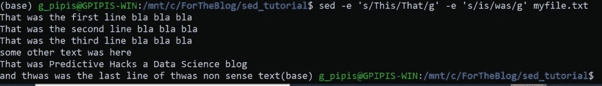

# 带有示例的 Unix sed 命令教程

> 原文：<https://levelup.gitconnected.com/unix-sed-command-tutorial-with-examples-4d59c9257004>

## 通过实际例子开始 sed


由[塞缪尔·切纳德](https://unsplash.com/@samuelchenard?utm_source=medium&utm_medium=referral)在 [Unsplash](https://unsplash.com?utm_source=medium&utm_medium=referral) 上拍摄的照片

[](https://jorgepit-14189.medium.com/membership) [## 用我的推荐链接加入媒体-乔治皮皮斯

### 阅读乔治·皮皮斯(以及媒体上成千上万的其他作家)的每一个故事。您的会员费直接支持…

jorgepit-14189.medium.com](https://jorgepit-14189.medium.com/membership) 

(**s**stream**ed**itor)是一个非常强大的解析和转换文本的工具，早在 1973 年由贝尔实验室开发。通常，您可以在任何 UNIX 变体中找到预安装的 sed，但是您可能需要安装它。

在本教程中，我们将通过示例向您展示 sed 命令的基本用法。对于示例，我们将使用以下两个文件。

**例如 csv**

```
ID,Name,Dept,Gender
1,George,DS,M
2,Billy,DS,M
3,Nick,IT,M
4,George,IT,M
5,Nikki,HR,F
6,Claudia,HR,F
7,Maria,Sales,F
8,Jimmy,Sales,M
9,Jane,Marketing,F
10,George,DS,M
```

**myfile.txt**

```
This is the first line bla bla bla
This is the second line bla bla bla
This is the third line bla bla bla
some other text is here
This is Predictive Hacks a Data Science blog
and this is the last line of this non sense text
```

在开始举例之前，让我们检查一下系统中是否安装了 sed。

```
sed --version
```


既然我们已经安装了 sed，我们就可以开始了！

# 如何逐行替换值

sed 最常见的命令是`'s/pattern/value/'`，它搜索一个字符串“模式”并用所需的值替换它。注意“ **s** 来自于“**替代**”。让我们来看一个例子，我们想把 **myfile.txt** 中的 **bla** 改成 **BLA** 。

```
sed 's/bla/BLA/' myfile.txt
```

我们得到了:

```
This is the first line BLA bla bla
This is the second line BLA bla bla
This is the third line BLA bla bla
some other text is here
This is Predictive Hacks a Data Science blog
```


**注意**:正如我们所看到的，它只将每行中第一次出现的“bla”替换为“BLA”。

如果我们想要替换每一次出现，那么我们应该在表达式中添加“g”(s/pattern/value/g)。“g”来自“global”。

```
sed 's/bla/BLA/g' myfile.txt
```

我们得到了:

```
This is the first line BLA BLA BLA
This is the second line BLA BLA BLA
This is the third line BLA BLA BLA
some other text is here
This is Predictive Hacks a Data Science blog
```


正如我们所看到的，我们用“bla”替换了所有出现的“BLA”。

# 如何用一个值替换第 n 次出现的内容

假设我们想用“bla”替换每行中第三次出现的单词“BLA”。我们可以很容易地做到如下:

```
sed 's/bla/BLA/3' myfile.txt
```

我们得到了:

```
This is the first line bla bla BLA
This is the second line bla bla BLA
This is the third line bla bla BLA
some other text is here
This is Predictive Hacks a Data Science blog
```


正如我们所看到的，每行中只有第三次出现的“bla”被替换为“BLA”。

# “&”的使用

我们可以使用“&”符号调用匹配的模式。比方说，我们希望将 eg.csv 的第一个数字放在括号中。让我们看看我们如何能做它。

```
sed 's/^[0-9]\{1,2\}/(&)/g' eg.csv
```

我们得到了:

```
ID,Name,Dept,Gender
(1),George,DS,M
(2),Billy,DS,M
(3),Nick,IT,M
(4),George,IT,M
(5),Nikki,HR,F
(6),Claudia,HR,F
(7),Maria,Sales,F
(8),Jimmy,Sales,M
(9),Jane,Marketing,F
(10),George,DS,M
```


**说明**:“^[0–9]\{1,2\}”部分搜索任何以 1 或 2 位数开头的行。然后，匹配的文本用“&”表示，因此“(&)”表示将前 1 到 2 位数字括在括号中。

# 多个命令

我们可以使用“-e”标志运行多个命令。比方说，我们想在同一个命令中用“**”、“**是”、“**”替换“**是”、“**”。**

```
sed -e 's/This/That/g' -e 's/is/was/g' myfile.txt
```

我们得到了:

```
That was the first line bla bla bla
That was the second line bla bla bla
That was the third line bla bla bla
some other text was here
That was Predictive Hacks a Data Science blog
```



# 指定线条范围

我们可以为 sed 命令指定一系列行。更具体地说，我们可以指定:

*   只有一个数字的一行。
*   最后一行带有“$”符号。
*   带有使用“/…/”符号的正则表达式的行
*   带有“**、**”符号的线条范围。
*   使用“**的反转表达式！**"符号。

# 如何替换特定行中的文本

假设我们只想将第三行中的“bla”替换为“BLA”。

```
sed '3 s/bla/BLA/g' myfile.txt
```

我们得到了:

```
This is the first line bla bla bla
This is the second line bla bla bla
This is the third line BLA BLA BLA
some other text is here
This is Predictive Hacks a Data Science blog
```


请注意，更改只发生在第三行。

# 打印特定行

我们可以打印特定的行。例如，假设我们想打印前 5 行。

```
sed -n '1,5 p' eg.csv
```

我们得到了:

```
ID,Name,Dept,Gender
1,George,DS,M
2,Billy,DS,M
3,Nick,IT,M
4,George,IT,M
```

使用$符号，我们可以打印到最后一行。例如，假设我们想从第 5 行到达末尾:

```
sed -n '5,$ p' eg.csv
```

我们得到了:

```
4,George,IT,M
5,Nikki,HR,F
6,Claudia,HR,F
7,Maria,Sales,F
8,Jimmy,Sales,M
9,Jane,Marketing,F
10,George,DS,M
```


最后，使用**！我们可以把这个表达式反过来。例如，假设我们想打印除前五行之外的所有行。**

```
sed -n '1,5 !p' eg.csv
```

我们得到了:

```
5,Nikki,HR,F
6,Claudia,HR,F
7,Maria,Sales,F
8,Jimmy,Sales,M
9,Jane,Marketing,F
10,George,DS,M
```

# 基于正则表达式打印行

假设我想返回所有包含" **bla** "的行，直到第一次出现" **here** "为止。

```
sed -n '/bla/ , /here/p' myfile.txt
```

我们得到了:

```
This is the first line bla bla bla
This is the second line bla bla bla
This is the third line bla bla bla
some other text is here
```


# 仅打印替换的行

我们可以通过使用-n 和-p 标志只打印被替换的行。例如，我们将用“数据科学”替换“ **DS** ”，并且我们将只返回有替换的行。

```
sed -n 's/DS/Data Science/p' eg.csv
```

我们得到了:

```
1,George,Data Science,M
2,Billy,Data Science,M
10,George,Data Science,M
```


# 删除行

我们可以用-d 标志“删除”行。当我们说删除时，我们的意思是不会打印这些行。不要担心你的原始文件，它不会受到影响。假设我想“删除”，即过滤掉所有包含“ **bla** ”的行。

```
sed '/bla/d' myfile.txt
```

我们得到了:

```
some other text is here 
This is Predictive Hacks a Data Science blog
```


# 用单个字符替换单个字符

类似于 UNIX 的“tr”命令，我们可以使用-y 标志用单个字符替换单个字符。我们可以使用映射一次替换许多单个字符。比如说我想把小写元音改成大写。

*   a → A
*   e → E
*   我→我
*   o → O
*   u → U

```
sed 'y/aeiou/AEIOU/' myfile.txt
```

我们得到了:

```
ThIs Is thE fIrst lInE blA blA blA
ThIs Is thE sEcOnd lInE blA blA blA
ThIs Is thE thIrd lInE blA blA blA
sOmE OthEr tExt Is hErE
ThIs Is PrEdIctIvE HAcks A DAtA ScIEncE blOg
```


我们可以看到，所有的元音都是大写的。

# 在每行后添加一个空行

我们可以在每行之后插入一个空行，如下所示:

```
$ sed G myfile.txt
```

我们得到了:

```
This is the first line bla bla blaThis is the second line bla bla blaThis is the third line bla bla blasome other text is hereThis is Predictive Hacks a Data Science blogand this is the last line of this non sense text
```


# 如何删除空行

在前面的例子中，我们添加了空行。让我们看看如何使用 sed 删除空行。

```
sed G myfile.txt | sed '/^$/d'
```

我们得到了:

```
This is the first line bla bla bla
This is the second line bla bla bla
This is the third line bla bla bla
some other text is here
This is Predictive Hacks a Data Science blog
and this is the last line of this non sense text
```


# 外卖

sed 是处理文本文件的强大工具，对于数据科学家和数据工程师来说是一项极具竞争力的技术技能。它使我们能够进行基本的数据清理和一些检查，而不必使用 R 或 Python 将文件加载到内存中。如果你对 sed 教程感兴趣，你可能也会喜欢那个 [awk 教程](https://predictivehacks.com/awk-tutorial-for-data-scientists-and-engineers/)。敬请关注。

*最初发表于*[T5【https://predictivehacks.com】](https://predictivehacks.com/unix-sed-command-tutorial-with-examples/)*。*