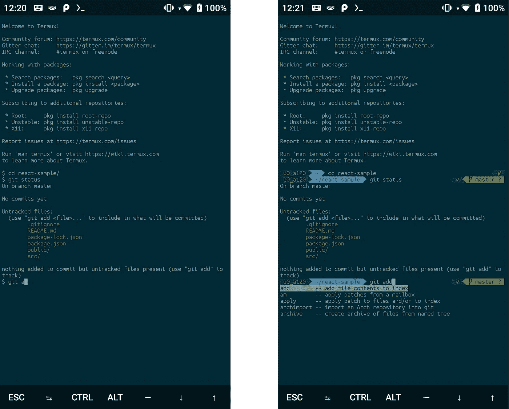
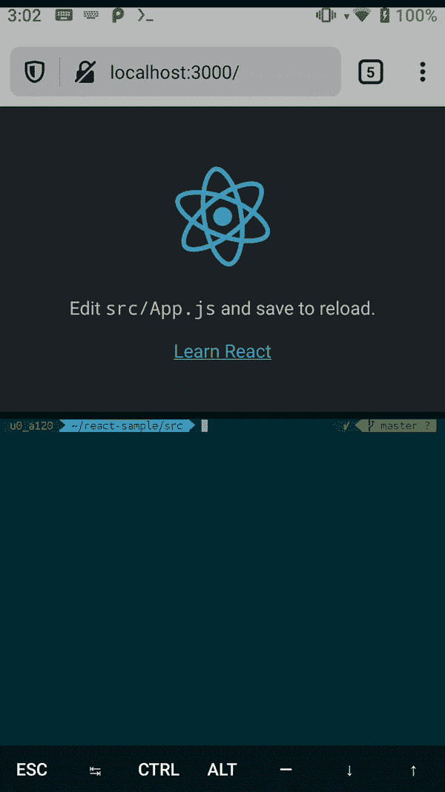
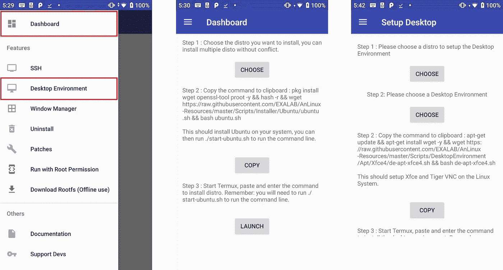
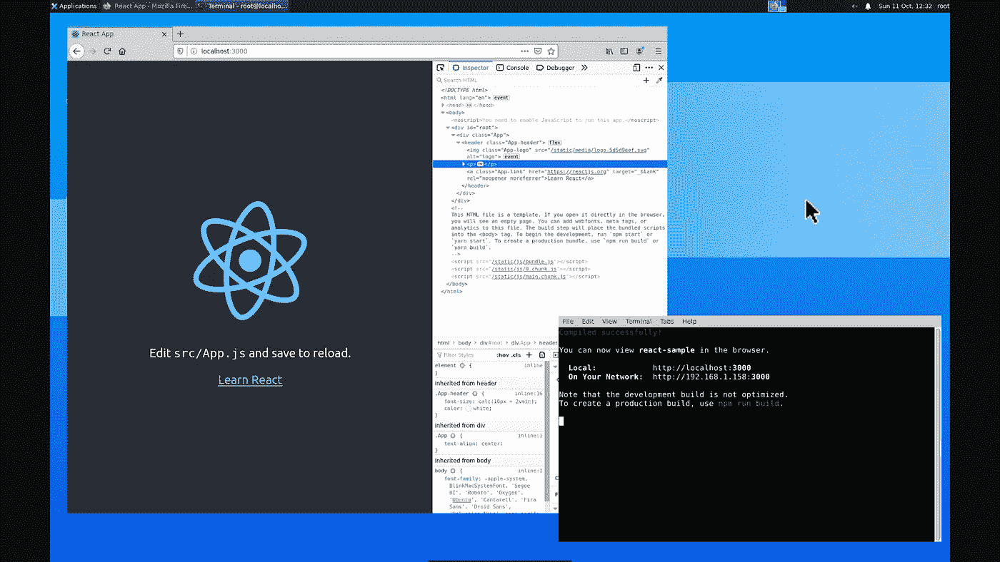

# 释放你的无根安卓手机的潜力

> 原文：<https://levelup.gitconnected.com/unleash-the-potential-of-your-unrooted-android-phone-ae835c4af633>

由 [Unsplash](https://unsplash.com?utm_source=medium&utm_medium=referral) 上的[极客镜头](https://unsplash.com/@geekyshots?utm_source=medium&utm_medium=referral)拍摄的照片

据估计，全球 85%的智能手机用户使用安卓系统。不管你是被这个生态系统的实惠价格、高度可定制的特性所吸引，还是对水果的彻底蔑视，你都很有可能没有探索过你的(非 root)Android 设备可以做的惊人事情。

Android 操作系统的核心是建立在 Linux 内核之上的。Android 和其他发行版的一个主要区别是，它没有打包许多 Linux 中常见的 GNU 库。因此，大多数应用程序无法在 Android 中运行。相反，Android 运行时(ART)执行从 Java 编译的 dex 文件和字节码——我们都太熟悉的 play store 应用程序。

找出一种访问 Linux 外壳的便捷方式是释放手机潜力的关键。令人欣慰的是，终端的大门一直敞开着，今天，我们可以在各种开源项目做出的巨大贡献的基础上再接再厉……进入 Termux。

# 安装 Termux

> Termux 是一个 **Android 终端模拟器**和 Linux 环境应用程序，无需启动或设置即可直接工作。一个**最小基本系统**被自动安装，额外的软件包可以使用软件包管理器获得。

这就是官方文档[对这个漂亮工具的定义。Termux 提供的体验类似于从 Alpine base 映像创建 docker 映像时获得的体验——一个最小的轻量级环境。从](https://wiki.termux.com/wiki/Main_Page) [play store](https://play.google.com/store/apps/details?id=com.termux) 安装 Termux 后，遵循以下简单的步骤，让它为你更努力地工作:

安装 Termux 和基本依赖项

请注意，在 Termux 中可以安装的内容是有限制的。例如，我让`nvm`工作的尝试从未成功过(这里是[线程，这里是](https://github.com/nvm-sh/nvm/issues/1645))，这就是为什么我依赖于`nodejs-lts`包的原因。安装依赖项可能有点碰运气，但至少根据我的经验，只要稍加调整，就可以让大多数东西正常运行。

在这个时代，如果你认为 Termux bland 很无聊，那是情有可原的。毕竟，这是一个没有炫丽色彩的终端，而且它看起来不会增强个人的 1337 开发者能力。接下来让我们解决这个问题！

# 安装 Oh-My-Termux

如果您是从 Linux 或 OSX 机器上开发的，那么您很可能在某个时候使用过或看到过有人使用 Oh-My-Zsh。这一切的核心是 Zsh，它很像 Bash，但增加了一些功能，如通过插件和主题进行内置定制(查看[这里](https://github.com/ohmyzsh/ohmyzsh/wiki/Themes)的官方主题列表)。为了以最少的努力让事情运转起来，我建议设置 Oh-My-Termux。它为您设置了最流行的主题， [Powerlevel9k](https://github.com/Powerlevel9k/powerlevel9k) ，并为您安装了必要的电力线字体:

要在 Bash 或 Zsh 之间切换您的 shell，您可以分别键入`chsh`后跟`bash`或`zsh`，然后重启您的 shell。下面是安装 Oh-My-Termux 后，默认 Bash shell 与 Zsh 的对比。在 Bash 中，我必须键入我想要执行的完整 git 命令。然而，使用 Oh-My Termux，我只需要键入`git a`并按下`TAB`键，这就为我提供了一个可以使用的匹配 git 命令列表。下面是他们整容前后的样子:

(左)普通 Bash 终端与(右)包含大量有用信息的 Zsh 终端的对比图

使用 Bash，每当我们打开一个 shell 时，我们想要初始化的任何东西(比如脚本或环境变量)通常都会添加到`~/.bashrc`。对于 Zsh，同样的概念也适用，但是我们现在看的是`~/.zshrc`。这也是 Zsh 可以根据您的需求进行定制的地方:

~/中的可用自定义。zshrc

请注意，在撰写本文时，Powerlevel9k 已被弃用。您可能希望更新您的配置以使用其继任者 [Powerlevel10k](https://github.com/romkatv/powerlevel10k) 。它提供了一些物质和美学上的增强，比如让插件以非阻塞的方式加载，以及一个新的 CLI 向导来进一步定制界面。

# 那么我们现在能做什么呢？

用 NodeJS 设置 Termux 和 Oh-My-Termux 理论上允许你承担 web 开发任务……但是如果你问我的话，我会说这有点难。我盯着 6 英寸的屏幕不会超过 15 分钟；用我肥胖的手指敲击软键盘只会加速我的屏幕在`BACKSPACE`键周围的退化。但是，嘿，也许视野狭窄是你的特殊能力，或者你是那些维姆大师中的一个，在这种情况下，去争取吧！如果不是为了全面的开发，那么我使用 Termux 做什么呢？

*   **使用它来控制我的 Heroku 服务**:当我需要它们更可靠地运行时，将项目升级到`Hobby`层，然后当我想要它们隐藏时，将它们切换回`Free`层&将 web dynos 缩放到 0。最简单的方法是通过`npm i -g heroku`在特穆克斯找到 Heroku。将下面的脚本放在`~/toggleHeroku.sh`中，我们可以使用`~/toggleHeroku.sh start`或`~/toggleHeroku.sh stop`来启动或停止我们的服务。

用于切换 Heroku 服务的层级和可见性的脚本

*   **为移动应用运行一个模拟服务器**:在开发移动应用时，拥有一个可以为应用提供模拟响应的后端是一个好主意。这使得前端开发人员可以专注于客户端 UI 和逻辑，而不必担心服务器就绪或网络不稳定。有什么比在同一部手机上运行模拟服务器更好的方法呢？
*   **获得关于 WIP 项目的意见**:如果你有一个仍在进行中或包含敏感信息的项目，控制其分布将是你的首要任务之一。但是如果你需要别人的意见，但又不想带着你的笔记本电脑到处跑，该怎么办呢？对我来说，一种方法是将项目克隆到 Termux 中，运行它，然后从我手机的浏览器中查看它。为了说服自己这是可行的，用一个`create-react-app`项目来尝试一下:

如果你在平板电脑上，更大的屏幕尺寸为你提供了更多的选择，让你创造出一个明智的开发者体验。你可以为 Termux 和你的浏览器使用 Android 的分屏功能，你甚至可以安装`Tmux`在同一个 Termux 屏幕上创建多个会话。但只是为了证明像热模块重载这样的特性仍然有效…

使用 Termux 和 Firefox 为 create-react-app 项目重新加载热模块

# 与 AnLinux 一起更进一步

到目前为止，我们所取得的任何成就都可以让你看到你的 web 项目在手机上的表现。在某种程度上，如果你使用一个提供切换到`Desktop site`的浏览器(比如 Firefox，Chrome ),你也可以测试桌面上的东西是如何呈现的。然而这并不总是可行的，而且像`:hover`这样的鼠标相关事件是不可测试的。

如果拥有这种能力对您来说很重要，那么您会很高兴听到 AnLinux 提供了什么。AnLinux 可以在 [play store 这里](https://play.google.com/store/apps/details?id=exa.lnx.a&hl=en_IN)下载。正如该应用程序的全名所示，它基本上允许你在没有 Root 权限的情况下在 Android 上运行 Linux。在引擎盖下，它使用了 [PRoot](https://wiki.termux.com/wiki/PRoot) ，它是:

> …一个`chroot`、`mount --bind`和`binfmt_misc`的用户空间实现。这意味着用户不需要任何特权或设置来做一些事情，例如使用任意目录作为新的根文件系统，使文件在文件系统层次结构中的其他地方可以访问，或者通过 QEMU 用户模式透明地执行为另一个 CPU 架构构建的程序。

(左)我们将使用的 AnLinux 菜单中的特性，(中)Linux 发行版的安装和(右)桌面 GUI 的设置。

在本指南中，我们将经历一个 Linux 发行版的安装过程(在上图中直观地称为`Dashboard`)，然后安装一个`Desktop Environment`。为什么是两步？安装一个发行版服务器会为您提供一个 shell 环境，允许您执行与 sysadmin 相关的操作。可选地，在我们的例子中，我们希望有一个 GUI 来分析我们的应用程序如何在桌面上响应。因此，我们也需要安装一个桌面环境。

**1 安装 Linux 发行版(Dashboard)** :到目前为止，我只尝试过使用 Ubuntu，强烈建议你将它作为你的主发行版。从 AnLinux 复制命令，并在 Termux 中执行它——这应该只需要一两分钟。安装完成后，您会看到在`~/start-ubuntu.sh`中创建了一个文件。

**2 安装桌面环境**:我强烈推荐 Xfce4，因为当我尝试 Mate、LXQt 或 LXDE 时，桌面环境没有正确呈现。首先，确保您执行了`~/start-ubuntu.sh`，这将激活您的 shell 中的 Ubuntu 实例。通过观察你漂亮的 Oh-My-Termux 界面是如何消失的，你可以确定你在 Ubuntu shell 中(你可以在以后为 Ubuntu 实例设置它)。执行从 AnLinux 复制过来的命令。去喝咖啡——在我被提示选择键盘布局之前，安装花了大约 **23 分钟**。它又继续运行了 15 分钟，然后提示我设置 VNC 密码，最后完成了。

此时，Ubuntu 实例应该已经安装了 TigerVNC 服务器。几个 VNC 命令现在象征性地链接到你的`bin`文件夹:

*   **vncpasswd** :执行这个来改变你的 VNC 密码。
*   **vncserver-stop** :关闭 VNC 服务器。默认情况下，它将运行`vncserver -kill :1`，阻止进一步连接到显示器 1。
*   vncserver-start :启动 VNC 服务器。默认情况下，它将运行`vncserver -geometry 1028x768 -depth 24 -name remote-desktop :1`，允许客户端连接通过端口`5901`显示 1。注意服务器如何以`1028x768`的分辨率运行。为了修改它以适合您的客户机的屏幕分辨率，我们需要修改 **vncserver-start** 脚本:

修改 vncserver-start 脚本以匹配客户端屏幕分辨率

通过运行`vncserver-stop`，然后运行`vncserver-start`，重启 VNC 服务器。

# 连接 VNC 浏览器

剩下的工作就是连接一个客户端来查看 Ubuntu Xfce4 GUI。您可以使用 RealVNC over `http://[phone-lan-ip]:5901`等客户端从台式机或笔记本电脑进行连接。然而，假设我们通过这些额外的步骤从我们的手机上看到 GUI，从 play store 下载 [RealVNC](https://play.google.com/store/apps/details?id=com.realvnc.viewer.android) ，并连接到`127.0.01:5901`。出现提示时输入您的 VNC 密码—您现在应该能够与您的桌面 GUI 进行交互了！

出于某种原因，互联网浏览器对我不起作用，直到我通过打开终端并执行`apt install firefox`安装了 Firefox。根据你的喜好/需求，你可以随意安装 chrome 或任何其他浏览器。

Android 手机上的 VNC 浏览器图片，连接到同一部手机上 Termux 的 Ubuntu 实例的 TigerVNC 服务器。

# 结论

我们探讨了 Termux、Oh-My-Termux 和 AnLinux 如何相互补充，将您的 Android 手机变成开发机器。当您试图安装您需要的依赖项时，由于 Termux 的设计方式，您可能会偶尔遇到困难；来自 PRoot 的伪根访问；或者缺乏对 ARM 架构的支持。然而，它让我们可以用手机做更多的事情，这里的限制不是因为技术挑战，而是因为我们缺乏想象力。