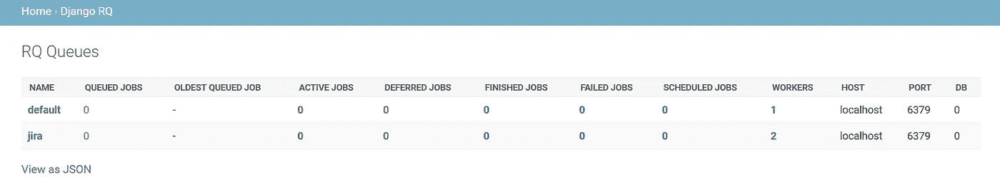

# 释放 Redis x Django 的力量

> 原文：<https://levelup.gitconnected.com/unleashing-the-power-of-redis-x-django-1c84b716679b>

## 在 Django 中使用 Redis 缓存数据和排队作业


来自 [Unsplash](https://images.unsplash.com/photo-1567177173026-402dd75a5ab7?ixlib=rb-1.2.1&ixid=eyJhcHBfaWQiOjEyMDd9&auto=format&fit=crop&w=1950&q=80) 的背景照片

# **1。缓存数据 Django 会话的替代方案**

Django 中的会话框架并不适合每个站点访问者获取、加载和设置大量数据的情况。错误消息“请求的会话在请求完成前被删除。例如，用户可能在并发请求中注销。”当有大量会话数据需要加载时，可能会弹出。由于每次请求都会加载会话数据，存储大量数据会降低应用程序的速度。在这种情况下，Redis 缓存可以充当 doppelgnger！事不宜迟，让我们快速检查一下这是如何完成的。

## **第一步:安装 redis 和 django-redis 库**

```
yum install redis
pip3 install django-redis
```

启动 Redis 服务的便捷命令:

```
On Linux: systemctl start redis.service
On Windows: redis-server.exe
```

## **第二步:在 settings.py 中定义缓存**

必须通过定义所有必需的参数来实例化缓存—后端定义要使用的缓存后端，位置创建套接字连接，CLIENT_CLASS 是默认的 Redis 客户端。

```
# Cache
CACHES = {
    'default': {
        'BACKEND': 'django_redis.cache.RedisCache',
        'LOCATION': 'redis://127.0.0.1:6379/',
        'OPTIONS': {
        'CLIENT_CLASS': 'django_redis.client.DefaultClient',
        }
    }
}
```

## **步骤 3:在 views.py 中复制会话**

django 会话通常由一个键值对来标识。为了在定义缓存的同时复制相同的行为，必须获得会话密钥来隔离每个站点访问者的值。可以分别使用 redis 客户端的 *hset()* 和 *hget()* 方法来设置和检索键值对。

# **2。Redis 队列—后台作业处理程序**

用户不喜欢等待页面加载；他们打算快速地从一个网页转到另一个网页。在这种情况下，当构建 web 应用程序时，异步执行长期运行的后台任务通常是受欢迎的。Redis Queue 将任务排队，并在后台一个接一个地运行它们(这可以通过控制工作线程的数量来实现异步运行),而不会中断用户的视图。这里有一个简短的安装和运行 Django Redis 队列的操作指南。

## **步骤 1:安装 django rq 库**

```
yum install redis
pip3 install django-rq
```

启动 Redis 服务的便捷命令:

```
On Linux: systemctl start redis.service
On Windows: redis-server.exe
```

## **第二步:在 settings.py 中实例化队列**

必须在 INSTALLED_APPS 部分添加一个队列— HOST 属于服务器，PORT 是 Redis 使用的默认端口，DB 属于第一个数据库。

```
INSTALLED_APPS = [
    ...
    'django_rq',
]RQ_QUEUES = {
    'default': {
    'HOST': 'localhost',
    'PORT': 6379,
    'DB': 0,
    }
}
```

## **第三步:在 urls.py 中定义 URL**

在主项目 *urls.py* 文件夹中，定义 Django Redis 队列 URL。

```
urlpatterns = [
    path("django-rq/", include('django_rq.urls')),
    ...
]
```

## **第四步:在 tasks.py 中定义后台作业**

在 django app 文件夹中创建一个名为 *tasks.py* 的文件。在那里定义一个函数。

## **第五步:调用 views.py 中的 redis 队列**

在 *views.py* 中，需要调用之前定义的函数。获取队列*‘默认’*，设置超时，从而将任务排队。

## **第六步:django-rq 上线**

如果服务器在 localhost 上，URL 应该是 *localhost/django-rq* 。



django-rq 在线

*‘默认’*队列与 1 个工作线程相关联，而‘jira’队列与 2 个工作线程相关联。

方便的命令:启动“默认”rq 工作器—

```
python3 manage.py rqworker default
```

希望这篇文章对你有所帮助。感谢阅读！