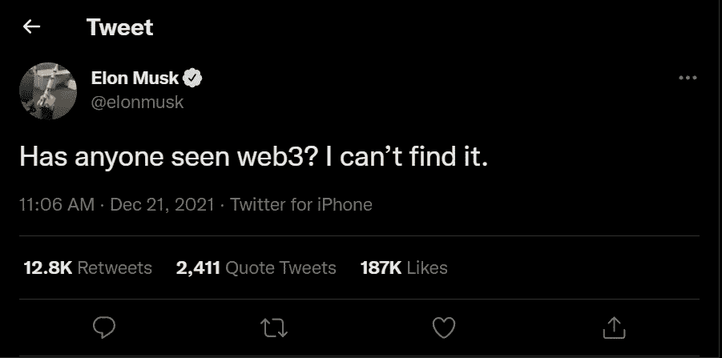
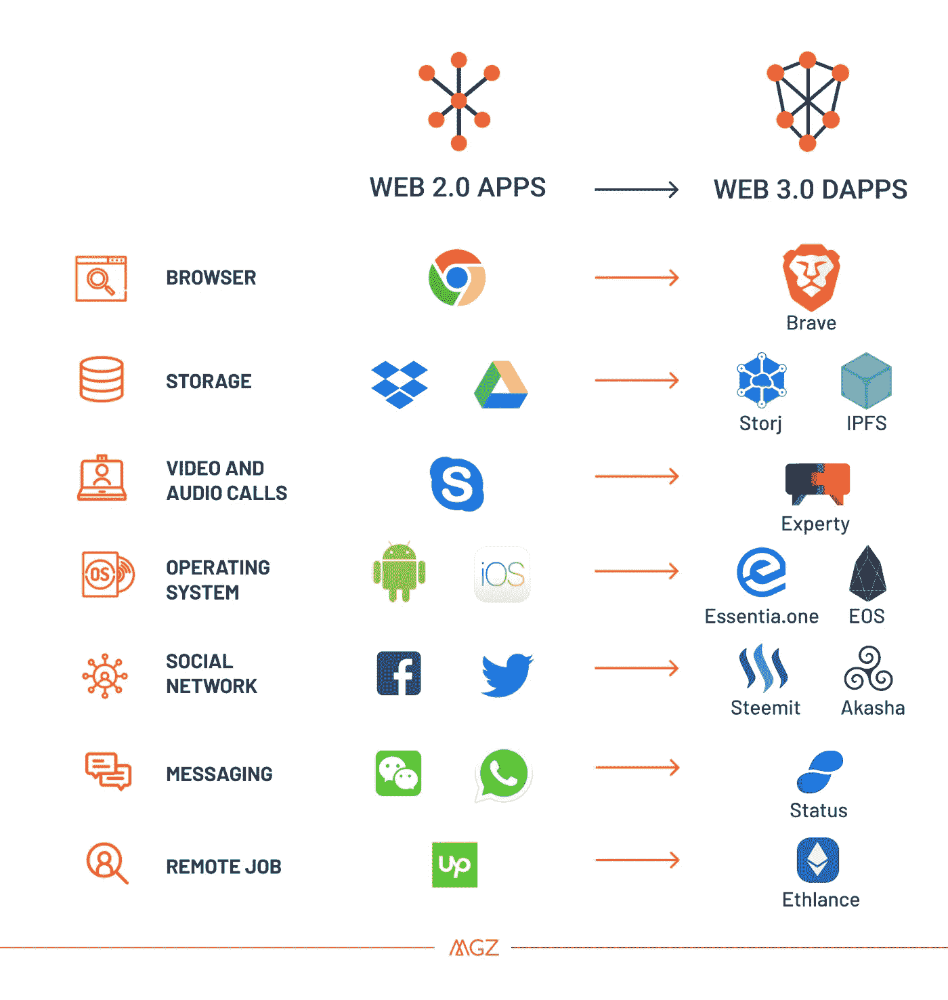

# 与 Web 2.0 不同，Web 3.0 对用户(只有创建者)没有真正的优势

> 原文：<https://levelup.gitconnected.com/unlike-web-2-0-web-3-0-has-no-real-advantage-to-the-users-only-the-creators-5da3ee300839>

## 用户是拼图中最重要的部分

图片由 [AlphaTradeZone](https://www.pexels.com/photo/man-in-white-dress-shirt-holding-tablet-5831356/) 提供

主导技术的当前创造者在任何人了解新技术之前就利用了它们。

像他们一样，我一直在寻找可以利用的新技术。创造出能永远改变我们生活方式的东西是我长久以来的梦想。

我不会让自己负担过重，我会保持警惕，调查更新的技术。当我保持警惕时，web 3.0 的想法让我很难过，非常难过！

# 来自第一原理的 Web 3.0

先说一点历史。Web 1.0 完全是关于静态网页的。Web 2.0 允许用户输入他们可以查看和交互的信息。

它带来了社交媒体的出现，并在这个过程中创造了科技巨头。web 3.0 呢？它提供什么？

为了能够掌握 web 3.0 的潜力，我们需要从最初的原则来看待它。关于 web 3.0，我们可以获得哪些最简单的事实？

以下是最简单的事实。

*   分散式—没有中央控制点。
*   高隐私和反垄断网站。
*   高安全性—减少黑客攻击和数据泄露。(数据不集中)
*   无许可的区块链——没有审查，对所有人开放。
*   平稳、不间断—无单点故障。

以上事实很吸引人但是有一个问题。好处似乎就在幕后。

对普通用户来说没有直接可见的好处。这篇来自 UX 集体出版物的[编辑精选的文章称，web3 的用户界面将在一段时间内变得糟糕。](https://medium.com/user-experience-design-1/why-blockchain-and-web-3-user-interfaces-will-suck-for-a-while-7575b7515757)

埃隆·马斯克甚至怀疑 Web3 是不是一个东西。

来源:推特

最大的科技巨头是那些把用户体验放在首位的家伙。比如 Tik Tok、脸书、Instagram、苹果等平台。

另一方面，那些将工程置于用户体验之上的人失败了。一个例子是诺基亚，他们甚至嘲笑苹果的跌落测试。

用户更关心他们的体验，而不是幕后的东西。

下面是一些关于用户体验如何影响公司的疯狂统计数据。

> “UX 投资的投资回报率是 9，900%。
> 
> 改善客户体验可以将 KPI 提高 80%以上。
> 
> 一个好的用户界面可以将网站的转化率提高 200%。
> 
> 90%的用户会因为糟糕的设计而离开网站。
> 
> 70%的在线业务失败是因为糟糕的 UX。”——[Truelist Ux-Statistics](https://truelist.co/blog/ux-statistics/)

# 密码世界是关于钱的

随着超过 3000 种加密货币和 NFT 的兴起，Web3 已经变成了一场淘金热。

我可以肯定地说，最大的受益者不会是开采黄金的人，而是卖铲子的人。

## BitClout 及其兄弟

Bitclout 背后的想法是，它给创造者硬币作为一个分散的平台。从本质上说，创造者是由他们的追随者奖励的。你也有机会为创作者下注。

这是一个迷人的概念。但是在这样一个平台上，普通人有什么优势呢？我指的是用户，不是创造者或影响者。仅仅是钱和赌一个人的能力吗？

> "金钱收益会降低 web 3.0 的渗透率吗？"

大多数去中心化的应用主要是关于钱的，特别是加密货币。

普通人寻求他们热爱的东西，稳定和满足。有些人不在乎钱。

赚钱的能力伴随着赔钱的能力。所以这本身也是一种风险。人们可能不太容易接受。

# 分析 Web 3.0 计时

谈到新技术的成功，时机被列为最重要的因素。

我举个例子。在 Airbnb 出现之前，人们不会为了赚点外快就把房子给一个陌生人。风险资本家和投资者觉得这个想法很疯狂。

Airbnb 的成功在于它的时机。这发生在 2008 年经济衰退最严重的时候。当时，人们不会介意把房子租给陌生人来获得额外收入。

web 3.0 会给大多数人同样的保证，并导致 dApps 的广泛采用吗？

下面的图片来自一篇推销 web 3.0 梦想的文章。文章发表于 2018 年 1 月。

[来源](https://medium.com/@Matzago/why-the-web-3-0-matters-and-you-should-know-about-it-a5851d63c949)

到现在已经四年了。我们取得了哪些进展？旅程变成了淘金热，我们有点看不见北极星了。

# 元宇宙:这是白日梦吗？

这个概念在脸书的元宇宙宣言之前已经存在多年了。

HTC 在未能征服智能手机市场后，于 2016 年转向制造 VR 头戴设备。他们想比任何人都更早得到下一个大东西。看起来他们并没有错。

元宇宙某种程度上满足了用户体验。他们可能认为制作 3D 网络互动可能是答案。

但是一个 3D 游戏化的社交媒体平台如何适应这个世界呢？无论如何，我们都必须成为游戏玩家。

我们还需要购买虚拟现实耳机来完整地体验元宇宙。可能会把我们的手机收起来，因为我们可以像在手机上一样与元宇宙的内容互动。

如果每个人都在我们的办公室、家里、娱乐场所等地方带着 VR 头戴设备，这个世界会是什么样子？或者也许我们的整个生活都将转移到云上，我们将什么也不用做，只是坐着或睡觉。

把世界推向幻想感觉不对。我们应该生活，欢笑，体验这个世界。

在我们找到改善 web 3.0 用户体验的方法之前，目前的概念可能只是另一种时尚。