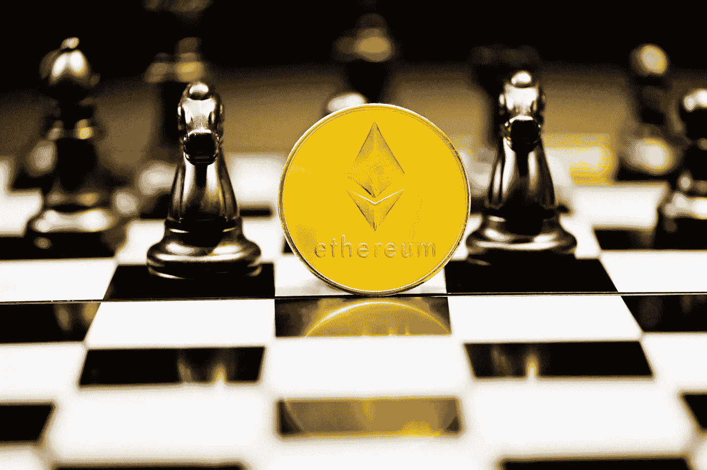

# 通过双重挖掘释放低哈希速率 GPU 的全部潜力

> 原文：<https://levelup.gitconnected.com/unlock-the-full-potential-of-low-hash-rate-gpus-with-dual-mining-8cf343c0c968>

低散列率(LHR)GPU 现在可以同时挖掘两个硬币



[行政长官](https://unsplash.com/@executium?utm_source=unsplash&utm_medium=referral&utm_content=creditCopyText)在[广场](https://unsplash.com/s/photos/ethereum?utm_source=unsplash&utm_medium=referral&utm_content=creditCopyText)拍照

最近几个月购买的大多数 3000 系列显卡都是低散列率(LHR)卡。这些牌的以太坊采矿性能降低了大约 50%。然而，自这些限制产生以来，矿业团体一直在努力规避这些限制。最新发布的 NBMiner 和 T-Rex 为 LHR 卡带来了高达 70%的原始性能，现在 T-Rex 允许用户同时挖掘以太坊和另一枚硬币。在稍微降低性能的情况下一次挖掘两个硬币是最大化 LHR 卡性能的聪明方法。在这篇文章中，我将讨论用 LHR 卡采矿的选择，以及如何充分利用你的卡。

# 为什么 LHR 卡会存在？

自去年发布以来，Nvidia 的 3000 系列显卡在库存中极难找到。即使在今天，在它们首次发布一年后，找到 3000 系列显卡也越来越难了。许多人认为我们持续的硅短缺是原因，但是，对于他们的存在，3000 系列 GPU 的生产速度比 Nvidia 生产过去的卡更快。英伟达多次表示，前所未有的需求是你在 2021 年买不到新 GPU 的原因。虽然这些卡的需求很高有很多原因，但一个驱动因素无疑是它们在挖掘加密货币方面的利润有多高。

以太坊矿业在整个 2021 年都非常有利可图，尽管 EIP-1559 的费用结构发生了变化，但仍然保持盈利。因为采矿是如此有利可图，有自由资本的人几乎没有理由放弃购买 GPU 进行采矿。毕竟，个人拥有的显卡越多，采矿的利润就越大。

然而，显卡不仅仅是为加密货币采矿而制造的。内容创作者和游戏玩家对这些高性能卡有巨大的需求，英伟达受到了游戏玩家的主要批评，特别是因为它允许矿工从在线零售商那里购买所有可用的带机器人的卡。为了防止他们生产的每一个 GPU 都被立即购买并放置到采矿设置中，Nvidia 在 3060 的发布中开始在他们的 GPU 中放置哈希限制器。这些卡在它们的 SKU 中通常用 LHR、低散列率来表示。一个 LHR 卡有一个软件锁，在 Ethash 算法上降低了大约 50%的性能。

## 为什么不直接开采其他硬币呢？

最初看到一个新的 3080Ti 在 Ethash 算法上只能达到 57 MH/s，而我的非 LHR 3080 能够超过 90 MH/s，这有点令人失望。这是以太坊挖掘潜力的一个显著减少，特别是考虑到 3080Ti 比 3080 贵得多。由于这种减少，许多 LHR 卡的所有者正在挖掘使用不同算法的替代硬币，如 Ravencoin、Ergo 或 Conflux。这三种硬币使用自己的算法，而不是 Ethash，这意味着 LHR 卡能够在不降低速度的情况下挖掘它们。虽然这些硬币可能不像以太坊采矿那样有利可图，但它们比以 50%的速度开采以太坊要好得多。

然而，开采替代硬币也有不利的一面。加密货币的价值在决定整体矿业利润方面发挥着重要作用。以太坊采矿之所以如此有前途，部分原因是它的价值越来越高。与其他替代硬币相比，以太坊也相当稳定。在矿工能够卖掉他们赚到的钱之前，一枚较小的硬币总有可能会失去很大的价值。许多密码爱好者也非常看好以太坊的未来价值，许多小矿工只是将他们开采的硬币作为投资。我会更倾向于尽快清算其他硬币，以确保利润。

因此，开采像 Ergo 这样的硬币并不是一个坏的选择，但它不如以太坊开采理想，并且仍然比全速开采以太坊的利润少。

# LHR 通过双重开采完全解锁

虽然目前还没有完全消除 Ethash 算法限制的解决方案，但现在有一种方法可以通过双重挖掘获得大致相同的原始利润。随着 T-Rex 0.24.0 的发布，矿工现在可以通过同时挖掘 ETH 和 altcoin 来实现至少具有 8Gb VRAM 的 LHR 显卡的全部挖掘潜力。

同时挖掘两个硬币将比单独挖掘一个硬币获得更多的收入。这也意味着矿工仍然可以积累一些以太坊，这通常被认为是比替代品更好、更稳定的投资。双重采矿的主要缺点是，如果你将整个 GPU 专用于一个硬币，你将积累两个硬币的速度较慢；如果你可以接受不太频繁的支出，这不会特别重要。

我将使用 LHR 3080Ti 作为测试卡，对每种组合进行一些比较。值得注意的是，每种组合都有不同的 VRAM 要求，我将在每一节中介绍。需要更高数量的 VRAM，因为 GPU 必须能够存储两个完整的数据集，称为 Dag。

## ETH & ERGO

ETH 和 ERGO 是唯一可以在具有 8GB VRAM 的 Windows 上完成的组合，这意味着 Windows 上的 LHR 3070Ti 用户将需要使用该选项。

同样值得注意的是，ERGO mining 的性能会受到哈希速率限制器的影响，但是，大多数 LHR GPU 不会因为轻微的超频调整而出现性能下降。最好是先尝试单独采 ERGO 拨入合适的超频，再尝试双采。

使用 3080Ti，我们可以为 ETH 实现 35 MH/s 的哈希速率，为 ERGO 实现 180 MH/s 的哈希速率。这导致税前收入为 7.20 美元。加上我当地的电费，这大约能带来 6.40 美元的利润。在撰写本文时，这是最有利可图的组合，因为 ERGO 的盈利能力目前很高。LHR 3080Ti 上的双重采矿 ERGO 和 ETH 目前比单独的非 LHR 3080 采矿以太坊赚取更多的原始利润，这表明这种变通办法在规避限制方面是有效的。

## ETH & RVN

双矿 Ravencoin 和以太坊在 Windows 上至少需要 10GB 的 VRAM，在 Linux 上至少需要 8GB。

使用 3080Ti 使我们的 ETH 哈希速率达到 35 MH/s，而 Ravencoin 的哈希速率达到 29 MH/s。这一组合为我们带来了大约 6.24 美元的收入，或者用我当地的电费计算，我们获得了 5.19 美元的利润。一段时间以来，拉文硬币一直是我最喜欢的替代硬币。Ergo 的盈利能力最近才超过 it，他们可能会暂时保持领先地位。

## ETH & CFX

以太坊和 Conflux 是在 Windows 和 Linux 上唯一需要 10GB VRAM 的组合，这意味着 3070Ti 用户无论使用什么操作系统都没有这个选项。

再次使用 3080Ti 分别实现了 36 MH/s 和 60 MH/s 的 ETH/CFX 哈希速率。这一组合的收入/利润分别为 5.92 美元/4.97 美元。我个人可能会选择其他两个选项中的一个，除非你因为其他原因想要挖掘 Conflux。

# 配置双重挖掘

你可能想知道设置双重采矿是否会很复杂，我可以向你保证这很容易！当我们用霸王龙挖掘任何东西时，我们提供我们希望它使用的算法和我们选择的池的信息。对于以太坊，命令行参数如下所示:

```
t-rex.exe -a ethash -o stratum+tcp://us2.ethermine.org:4444 -u <ETH_WALLET_ADDRESS> -p x -w <ANY_USERNAME>
```

我们告诉它使用 Ethash 算法，即 us2 区域中的 Ethermine 池，然后给它我们的钱包地址。为了一次开采两个硬币，我们需要为它提供第二个算法和池的信息。如果我们也想挖掘 Ergo，我们需要使用以下代码行:

```
t-rex.exe -a ethash --lhr-algo autolykos2 -o <ETH_POOL> -p x -w rig0 --url2 <ERGO_POOL> --pass2 x
```

这里我们告诉 T-Rex 使用 autolykos2 作为我们的“lhr-algo”，这是 Ergo 的算法。然后，我们将两个硬币的池信息传递给它。当你下载最新版本的霸王龙你会发现。bat 文件，包含双重挖掘的每个组合的完整示例。

## 超频

Nvidia 的 3000 系列 GPU 可以很好地处理超频，当 VRAM 超频时，许多 GPU 的性能会明显更好。我个人使用超频内存和低功耗运行我的卡，这导致了较低的内核时钟。挖掘在很大程度上依赖于 GPU 的内存来不断读取 DAG 的随机切片，然后将这些切片散列在一起，因此加速它可以真正提高性能。

DAG 是大约每 100 小时更改一次的数据集，必须在开始挖掘之前加载到 GPU 内存中。DAG 的大小总是在增加，这也是为什么 3GB VRAM 的显卡已经无法开采以太坊了。

对于所有这些试验，3080Ti 被设置为 82%的功率，内存超频为+1000。没有应用内核超频，因为内核超频往往会增加热量，而不会提高采矿性能。我经常将功率限制在 75%左右，以进一步减少热量。GPU 的风扇最好在~70%以下，以减少磨损，所以我喜欢设置我的风扇速度，并将我的超频设置调整到我想要的温度。

## 检查温度

Nvidia 3070Ti/3080/3090 都拥有全新的 Micron GDDR6X 内存，速度惊人，有助于实现出色的采矿性能。这种内存往往运行得非常热，似乎有些制造商使用了次优的散热垫来消除卡上的热量。

T-Rex 现在每次在命令提示符下更新时都会读出内核温度旁边的内存温度。GDDR6X 内存的理想最高温度是 95 度。您可以通过冷却房间、提高风扇速度或降低内存的超频来减少这种情况。如果你经常看到温度超过 100 度，那么我会研究更换你的特定 GPU 上的散热垫，就像我对我的 GPU 所做的那样。

# 包扎

虽然我看到了低散列率卡被创造出来的原因，但我认为拥有它们的人应该能够在有利可图的开采持续的时候加以利用。双重挖掘是目前最有利可图的利用低杂凑率卡挖掘加密货币的方式。虽然它也有一些缺点，比如支付频率较低，但我非常喜欢在你选择的替代硬币旁边挖掘一些以太坊。

# 资源

*   [T-Rex 双矿设置和提示](https://github.com/trexminer/T-Rex/wiki/LHR)
*   [最新霸王龙发布](https://github.com/trexminer/T-Rex/releases)
*   [如何挖掘以太坊](/earn-money-mining-ethereum-before-its-too-late-5ccf6a4e4df7)

***免责声明*** *:本文所写均非理财建议。这里的信息是个人经验和研究的结果。我不是财务顾问。*