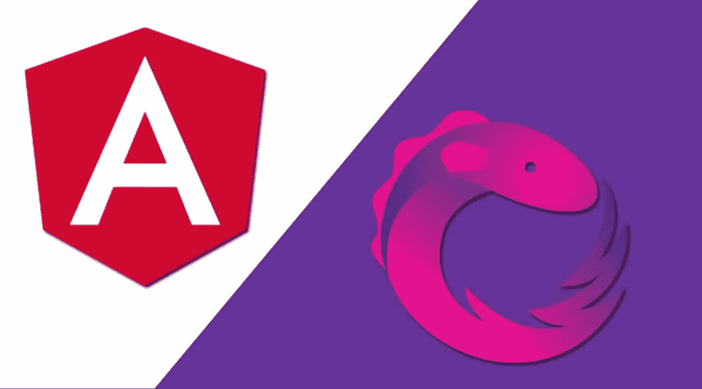

# 退订有角度，正确的方式

> 原文：<https://levelup.gitconnected.com/unsubscribing-in-angular-the-right-way-6ed82be43ccc>

一旦你掌握了它，使用 RxJS 的事件驱动实现对你的 Angular 应用程序的动态化大有帮助。即使你刚刚开始使用 Angular，也强烈建议你使用 Observables，Subjects，Subscriptions 等。以充分利用应用程序。也就是说，如果做得不好，RxJS 实现可能会以应用程序性能下降的形式出现。即使是已经使用 Angular 一段时间的开发人员也可能会犯的最大错误之一是取消订阅的概念以及如何最好地做到这一点。这就是我们将在这篇文章中探索的。

# 退订首先有必要吗？

绝对的。当然，即使你没有退订业务，你的观察和订阅也会很好。对于未经训练的人来说，尤其是在小型应用程序中，一切看起来都很好。让我试着用现实生活中的类比来解释退订会带来什么。

假设你在一家餐馆。在饭菜端上来之前，你决定去洗手。你去洗手间，打开水龙头，按下皂液器。出于某种原因，皂液分配器停留在按下的位置，肥皂不断滴出。你洗了手，决定让水龙头开着——这有什么坏处呢，最终会有人来关上水龙头，还会修好皂液机。几分钟后，当你正在享用你的食物时，或者甚至一个小时后当你吃完了你的菲力牛排，留下一笔可观的小费并离开时，洗手间的水龙头仍然在出水，未经检查的皂液机也是如此。明白我的意思了吗？

虽然你从来没见过，但是损失了很多水，还有很多肥皂。下水道很有可能会堵塞，导致混乱的局面。如果你把你的 observables 打开并在使用后取消订阅，这几乎就是会发生的事情。未检查的内存泄漏将在应用程序运行时发生，并可能导致问题，尽管从外部来看，至少在最初的部分，您可能对即将到来的麻烦一无所知。

要了解这一点，请订阅组件中的一个可观察对象，并持续记录来自该可观察对象的数据。你会看到伐木会继续进行。

> *组件将被销毁，但订阅将继续存在*

更多的日志将不断被添加到浏览器控制台。更有甚者，如果我们回到原来的路线。该组件将与新的订阅一起被重新创建。这就是为什么在使用后，取消订阅 observables 是绝对重要的，以解除应用程序对它的订阅，以跟踪一些更新。

> Angular 是一个健壮的框架，它在内部取消订阅隐式创建的观察对象，如 HTTP 调用、异步管道等。然而，我们创建的观察和订阅，我们必须明确地取消订阅。

解决了这个问题，让我们看看取消订阅一个可观察对象的各种方法(是的，不止一种方法)。

# 方法 1:手动方式使用*【退订()】*

这是最常用的方法，也是我们教初学者开始观察和订阅的方法。

可以看出，这里没有发生多少火箭科学。我们在这个方法中所做的就是调用订阅的 unsubscribe，如果它被定义的话，当组件被销毁时。简单，而且大部分工作都完成了。

现在想象一下，你的组件有很多这样的订阅，当组件被销毁时，确保所有东西都被取消订阅会很快变成一个过程，更不用说 *ngOnDestroy* 函数会有更多的行。这就是我们需要更好的方法的地方，也是下一个方法出现的地方。

# 方法 2:使用 takeUntil()的声明式或“自动”

根据官方文件，

> `*takeUntil(notifier: Observable<any>)*` *—发出源可观察对象* ***发出的值，直到*** *a* `*notifier*` *可观察对象发出一个值。*

简而言之，我们可以使用 takeUntil 操作符，通过向它传递一个布尔型 observable 来使订阅更加智能。一旦我们遵循这个方法，我们在 OnDestroy 方法中要做的就是使可观察的真值化，并单独取消订阅，这将依次停止以这种方式处理的所有订阅。查看以下示例实现。

> 这种方法是解决整个退订问题的灵丹妙药吗？不完全是。

虽然它很有效，但它也有自己的缺点和缺陷。

1.  这很冗长，因为需要声明一个主题作为 *takeUntil* 方法的通知符
2.  有一些事情你可能会搞砸，比如但不限于忘记对我们的通知器主题进行 *next()* 和 *unsubscribe()* (或者 *complete()* )调用，或者忘记实现 OnDestroy 方法本身，举几个例子。
3.  需要特别注意的是，如果你使用其他操作符，比如 *map()* ， *filter()* 等等。在*管道()*内部，*直到*应最后放置，以便处理所有生成的可观察物。

# 方法 3:总有浪费的异步管道

管道是 Angular 的一大优点。可以编写尽可能多的自定义管道，我们开箱即用的管道本身是丰富的，其中一个令人难以置信的管道是*异步*管道。这允许您直接在模板中使用观察值，如下所示

这是迄今为止最紧凑的解决方案，这是毋庸置疑的事实。看，没有*的麻烦，直到*，订阅，破坏方法，什么都没有。然而，这也有不利的一面，尤其是一个大的方面。

> 因为数据是直接在模板中解析的，所以不能从组件中对其进行操作，而是必须按原样使用。

总之，这就像那些数学问题中的一个。没有什么独特的方法。这都可以归结为情况和个人选择，这是你在编写 Angular 代码的过程中逐渐形成的。也就是说，*采取了直到*和*异步*管道方法并肩站在一起，并在简单的退订上突飞猛进(方法 1)。就我个人而言，我使用 *takeUntil* 方法，因为我希望组件中有可用的数据以防万一。

> 这个故事最初发表后，一些好人愿意花时间回应并提供一些意见，我非常感谢这种姿态，因为它也帮助我提高。所以，这里有一个镜头给 [Károly Tranta](https://medium.com/u/63f345744d27?source=post_page-----6ed82be43ccc--------------------------------) 、 [Mdroz](https://medium.com/u/64f874e142e?source=post_page-----6ed82be43ccc--------------------------------) 、[Leandro hereu](https://medium.com/u/54c492106876?source=post_page-----6ed82be43ccc--------------------------------)和 [David Adams](https://medium.com/u/7ba07cd6dc56?source=post_page-----6ed82be43ccc--------------------------------) 。请仔细检查他们的回答！我还推荐你看看 Angular 中的另外两个退订解决方案，我在文章中没有提到——until-destroy 和 SubSink 。

这是所有的乡亲。我希望你在结束这篇文章时，对处理可观察到的取消订阅有更好的看法。编码快乐！

> 有兴趣和我就这个故事或 Angular、Typescript 和 Javascript 进行一对一的交谈吗？前往[雇佣作者](https://www.hiretheauthor.com/ashwinSathian)让我们连线！