# 将嵌套的子选择 SQL 查询分解到 cte 中

> 原文：<https://levelup.gitconnected.com/untangling-nested-subselect-sql-queries-into-ctes-ce89f51ba156>

在本指南中，我将遍历一个包含几层嵌套子选择的查询，并了解如何将查询重构为更易读的 cte。

根据最近的经验，我将使用一个我比较熟悉的行业的业务问题:流媒体音乐分析。

# 业务需求

我们想知道哪些听众，如果有的话，有资格参加某些活跃艺术家的促销活动。有几个要求是合格的。

1.一个听众必须在最后一天播放一个被提升的艺术家的歌曲超过 100 次。

2.这位艺术家是一次积极推广活动的一部分。

3.听众已经成为付费阶层的一部分至少一年了。

4.该监听程序尚未针对活动促销进行促销。

# 数据模型

这里有一个非常简单的关系实体关系图(ERD ),展示了数据是如何存储在 RDBMS 中的。

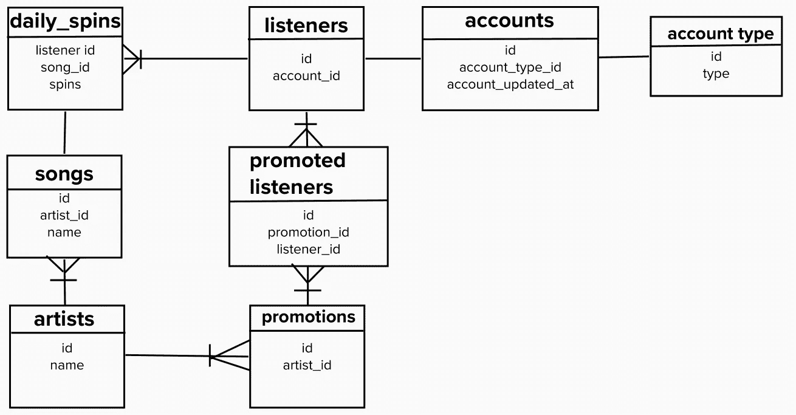

以展平的形式写出来，可能是这样的:

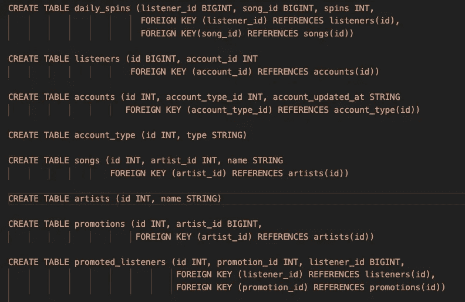

**daily_spins** :听众一天内播放某首歌曲的次数。听众和歌曲的外键。

**监听器**:监听器信息和元数据。帐户的外键。

**账户**:账户信息，包括最后更新日期。使用 account_type 的外键进行规范化。

**account_type** :存储不同客户层级的维度表。付费与免费增值。

**歌曲**:包含曲目名称的歌曲信息。艺术家的外键。

**艺术家**:艺术家信息。

**促销**:主动促销信息。艺术家的外键。

**promoted_listeners** :多对多连接表，将听众链接到艺术家促销。用于跟踪已收到促销的侦听器的状态。

现在让我们看看执行这一分析的现有查询。

# 子选择查询版本:

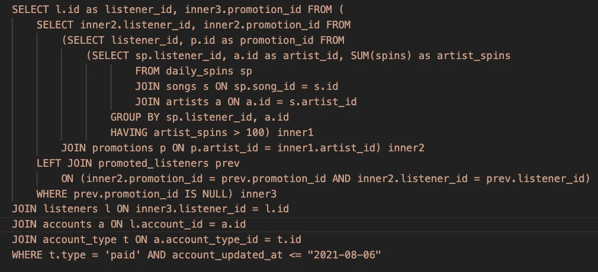

呀！

这个查询可能会完成这项工作，但是很难阅读和维护。如果除了作者之外的任何人需要做出改变，这可能是非常具有挑战性的。即使是原作者也可能在以后很难记得它是如何工作的。

让我们考虑一下如何将这个查询重构为 CTEs，使它产生相同的输出，但更容易理解。

# 第一步:了解需求。

在我们开始重构之前，让我们确保我们已经掌握了查询的目标。

我们正在寻找有资格获得他们尚未收到的积极促销的听众。听众必须在给定的一天内对所有艺术家的歌曲播放超过 100 次(又名旋转),并且已经成为付费客户层的一部分至少一年。

所以这意味着:

1.  如果一个听众在一天之内没有超过 100 次组合旋转属于一个艺术家的歌曲->过滤掉。
2.  如果听众旋转不属于被提升的艺术家->过滤掉。
3.  如果一个听众至少有一年不属于付费阶层->过滤掉。
4.  如果听众符合上述要求 1 -3，但只符合他们已经收到的促销->过滤掉。

我们想要真正理解需求的原因是，在重构过程中，我们很可能会重新输入相当多的查询。**最好是从头重写查询的主要部分，而不是剪切并粘贴子选择片段到 CTE 链中**。试图直接对 cte 进行查询操作通常不太顺利。此外，重新键入让我们有机会注意到潜在的优化，我们马上就会看到这一点。

# 步骤 2:使用现有的查询获取输出基线

在我们可以重构之前，我们必须首先在一组测试输入上运行查询，并将结果存储在某个临时表中。

在任何变化发生之前，我们需要知道结果是什么。这是一种常见的 QA 技术。

我们可以稍后使用临时表来比较重构后的查询输出。

# 步骤 3:重构为 CTEs

首先让我们试着梳理一下不同的子选择区域在做什么。

# CTE 1 ->听者艺术家组合旋转

首先，我们将下面的`inner1`部分视为查询工作负载的入口点。

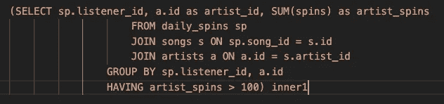

从分组和 HAVING 过滤器可以清楚地看出，这部分试图对由`(listener_id, artist_id)`播放的歌曲进行 sum()并只保留 sum >为 100 的组。这可能是我们的第一个 CTE `listener_artist_spins`。

顶级查询将快速过滤掉听众旋转计数，这些计数没有足够的旋转数用于任何在活动促销中出现的艺术家。

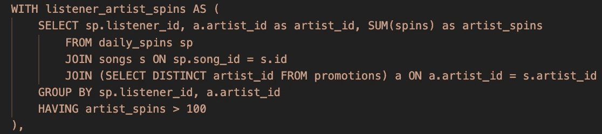

该查询按听众和艺术家对 spin 记录进行分组，以获得给定听众的每个艺术家的所有 spin 的总和。然后，它使用必须只保留至少有 100 个组合旋转的组。您会注意到它还使用了一个子选择来获取活跃促销中的艺术家 id。

但是等等，我认为这个练习的全部目的是将查询分支到更容易解析的 cte 中？是的，这是真的，但有时子选择非常有用，仍然可读。在这种情况下，我们可以通过内部加入积极推广的艺术家来过滤掉大量的自旋数据。我们必须使用 DISTINCT，因为给定的`artist_id`可能会出现在多个提升中，我们不想过度扩展内部连接。

我们可以设置逻辑，只获取艺术家的推广作为顶级 CTE，然后进行旋转级别过滤，但这不会给我们带来太多，除了稍微长一点的 CTE 查询。

这是对嵌套子选择查询版本的优化，该版本最初收集具有> 100 次旋转的每个`(listener_id, artist_id)`组，而不管艺术家是否是活动促销的一部分。积极推广的艺术家子集比全部艺术家小几个数量级，因此这确实有助于快速过滤数据。

# CTE 2 ->听众与推广

接下来我们看到这个片段，它采用`inner1`并加入`artist_id`的促销活动，形成`inner2`。

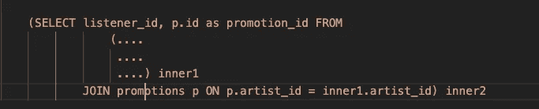

这一部分只保存被提升的艺术家的旋转计数，并将`promotion_id`传递给查询的其余部分。

我们可以把这个移到下一个 CTE: `listeners_with_promotion`。

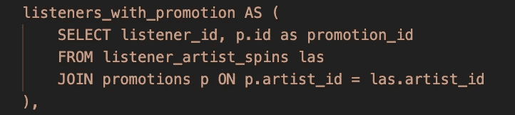

这个 CTE 只不过是内部重新加入晋升，用`(listener_id, artist_id)`换成`(listener_id, promotion_id)`。

# CTE 3 ->以前没有晋级

我们要确保在考虑给定的`promotion_id`时`listener_id`还没有被提升。

在子选择版本中，该要求由`inner3`满足

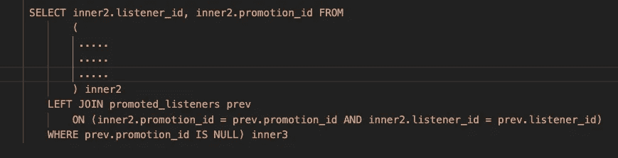

所以现在我们有了下一个 CTE: `not_previously_promoted`

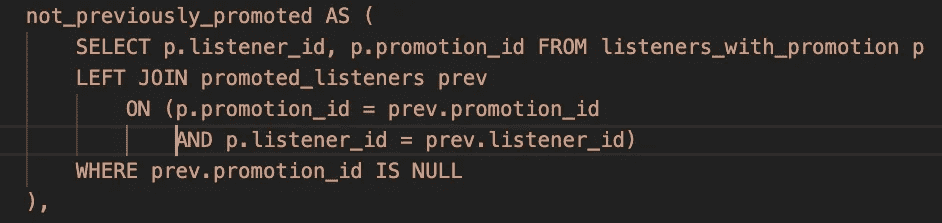

在这种情况下，我们离开了 JOIN，只接受那些没有考虑给定侦听器的`promotion_id`。检查 promoted_listeners 中的 null `promotion_id`意味着左连接没有找到任何匹配，这表明用户还没有收到升级。

# CTE 4 ->付费听众合格

现在，我们需要考虑给定的侦听器是否符合客户身份。

在子选择版本中，我们可以在查询的外部看到这个逻辑

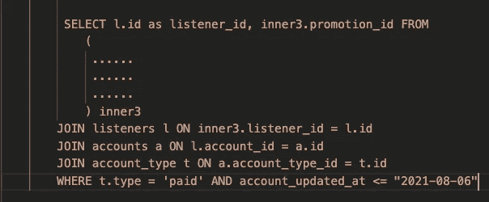

所以现在我们有了下一个 CTE: `listeners_eligable_for_promotion`

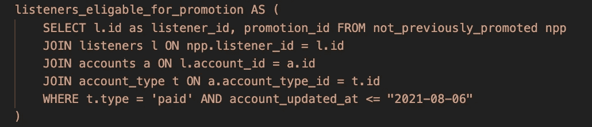

为此，我们基于`listener_id`对帐户信息做一些简单的内部连接，然后确定侦听器的帐户类型是否是`paid`，以及定义该类型的最近更新是否在去年(基于本文撰写的时间)。在这个查询的一个稍微现实一点的版本中，我们需要一个更加明确的日期标记，而不仅仅是记录最后更新的时间，但是这可以用于演示目的。

现在剩下的就是选择通过所有过滤器的剩余监听器 id 和促销 id！

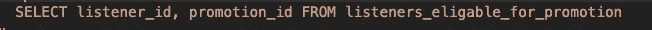

以下是该查询的完整 CTE 版本:

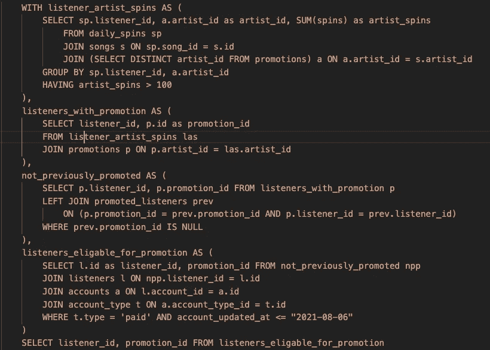

# 步骤 4:比较查询输出和基线临时表的准确性。

我们可以使用 EXCEPT 将基线输出与任何新输出进行比较

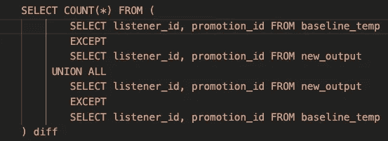

这个查询有效地进行了两个不同的集合比较来回答问题。

1.  在子选择查询中找到了 CTE 查询中没有的记录吗？
2.  在 CTE 查询中是否找到了子选择查询中没有的记录？

SQL EXCEPT 操作符将保留左边所有不在右边的记录。

我们将它们结合在一起，只是为了得到任何差异的组合计数。

希望我们能看到差值计数等于零。这意味着基本输入集和新输出是完全相同的。

# 结论

我们可以遵循这个通用蓝图，将任何复杂的子选择查询重构为 CTE。

1.  仔细理解查询的要求。
2.  通过对受控测试数据运行查询，在临时表中获得基线输出。
3.  将不同的子选择级别逐步分解成 cte，通常从子选择查询的内部开始，然后向外移动。尽量避免复制粘贴。把它作为考虑任何优化的机会。
4.  针对相同的受控测试数据运行新版本。将输出存储到自己的临时表中。
5.  比较新旧临时表，查看是否有任何差异。如果发现了差异，这意味着 CTE 查询有一点问题(或者您可能发现了原始查询的一个 bug)。)