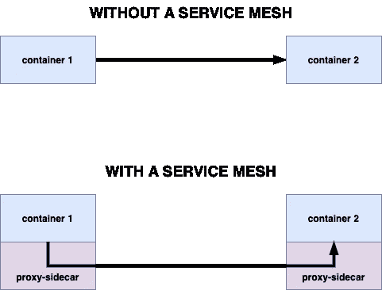
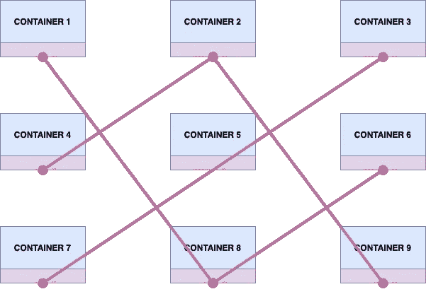
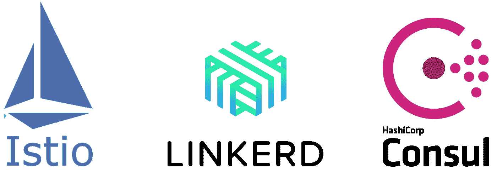
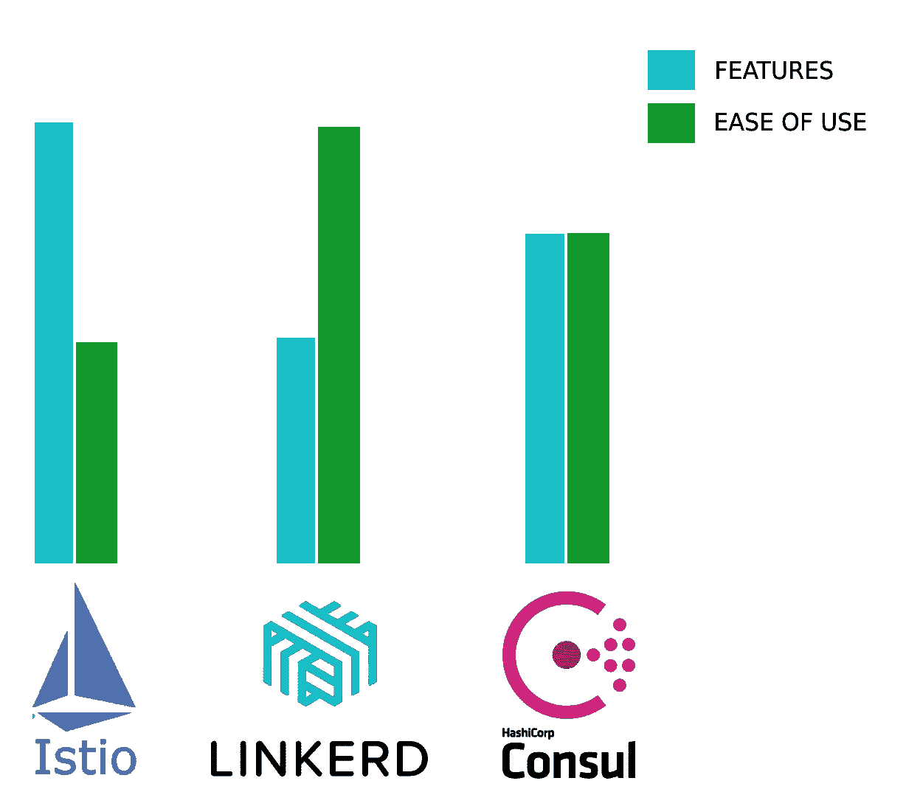

# 解开服务网格

> 原文：<https://levelup.gitconnected.com/untangling-the-service-mesh-24797e29eb92>

服务网格在社区中已经存在很长时间了，许多开发人员已经采用了它。如果你是那些希望使用它的人之一，并且想知道到底什么是服务网格，哪个是适合你的环境的正确选择，那么这个博客就是为你准备的。

服务网格管理应用程序不同组件之间的网络流量。它是一个专用的基础设施层，构建的唯一目的是将服务到服务的通信逻辑从应用程序中分离出来并进行抽象。这提供了单点访问、管理和治理的便利性。

# 它实际上做什么？

为了管理网络，每个通信都通过与应用微服务一起运行的侧车来代理。这将应用程序代码从网络逻辑中分离出来，并允许开发人员专注于他们的关键业务逻辑。

如上所示，通信现在将被运行在同一 pod 中的 sidecar 代理容器截获，并将被另一端的类似 sidecar 接收。

# 那我为什么要用一个呢？

除了从网络代码中分离应用程序代码的明显好处之外，服务网格还解决了其他一些问题。随着服务数量的增长，网络会变得相当复杂。

在这种情况下，跟踪和调试任何失败都是痛苦的。服务网格通过**跟踪和收集与服务间通信相关的指标**来解决这个问题。此外，服务网格可以将失败的请求重新路由到可服务的容器。

除此之外，服务网格是**高度可伸缩的**，且是可能随时间增长的应用程序的最佳选择。在不断增长的应用程序中，服务网格将消除为适应新服务而更改旧组件的业务代码的需要。旧组件将简单地发现新的加入者并开始路由。

此外，服务网格也满足安全性的要求。通过**实现策略**，服务网格可以允许和拒绝从一个服务到另一个服务的流量。此外，这些策略还可用于将部分或全部流量从一项服务转移到另一项服务，从而能够执行蓝绿色部署，或通过完全切断可服务服务器的部分流量来执行弹性测试。

# 市场上有哪些选择？

在 Kubernetes 市场，三个主要竞争者是 [Istio](https://istio.io) 、 [Linkerd](https://linkerd.io) 和 [Consul](https://www.consul.io) 。

由于运行代理服务和应用程序的核心概念保持不变，这些工具在架构上略有不同。这三者都支持主要的通信协议，包括 TCP、HTTP 和 gRPC。它们还支持相互 TLS，以便与本机证书管理进行安全通信。

那么这里到底有什么不同呢？

Consul 要求在所有节点上安装一个节点代理，用于对节点和在该节点上运行的服务执行健康检查。Linkerd 和 Istio 没有任何这样的要求。

Linkerd 是所有产品中最轻的，也是最容易安装的，但是它也有缺点，比如流量管理、弹性测试和分布式跟踪方面的功能更少。此外，它也不适用于多集群配置或虚拟机托管服务。因此，在使用 Kubernetes 专用的**时，在一个简单的架构中使用 Linkerd。**

现在来看另外两个竞争者，它们既可以在 Kubernetes 上工作，也可以在虚拟机上工作，还可以在多集群配置中工作。简单地说，如果你正在寻找功能，那么去 Istio。它是最老的(也是最成熟的)一个，并且由于其**过多的特性和不可否认的灵活性**而在社区中被广泛接受。安装 Istio 的方法有很多种，你可以在他们的安装指南[这里](https://istio.io/latest/docs/setup/install/)找到它们。

最后，如果你正在寻找**设置和管理的简单性**并且可以接受 Consul 的**小一点的特性列表**，那么这就是方法。要在您的环境中设置 Consul，请参考此处的。

# 离别赠言

希望本指南能帮助您在自己的环境中开始使用服务网格。请注意，服务网格是一个至关重要的组件，它将处理应用程序的一个非常动态的方面。这意味着您的需求会随着您的发展而变化，您的服务网格首选项也是如此。