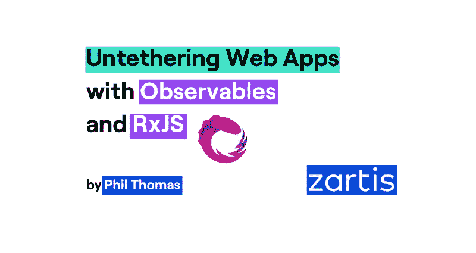

# 用 Observables 和 RxJS 解开您的 web 应用程序——zart is

> 原文：<https://levelup.gitconnected.com/untethering-your-webapps-with-observables-and-rxjs-zartis-bca73df12d67>



如果你是一名开发人员，并且喜欢掌握全局，那么你现在可能已经听说过术语“ [Observables](https://rxjs-dev.firebaseapp.com/guide/observable) ”。如果你没有，不客气，这是给你的。如果你已经很熟悉了，那么这篇文章可能会给他们一个新的解释。

首先，我想说明的是，我对可观测量的看法是基于我自己的奋斗和经历。我宁愿像希望别人告诉我的那样告诉他们，而不是逐字逐句地给你学术上的废话。

这是我的附加价值，但它带有公平的警告:并不是这篇文章中描述的所有术语和方法都与官方文件一一对应。在可能有分歧的地方，我会代表读者尽量指出来，以避免混淆。

# 什么是可观测量？

想象一下，你在给定的范围内有一组事件，就像你阅读这篇文章时秒秒滴答。如果你是一个普通读者，这一系列滴答作响的事件将会发生有限的次数，通常是几百次左右，每秒钟一个事件。如果你是一个非常慢的读者，并且永远以萨特式的方式被这篇文章所吸引，它们在时间上也可以是开放式的。你也可能速度无限快，让时钟只滴答一次，或者你可能根本没有读它，也没有任何事件发生。但真正的问题是，谁在听滴答声？可能没有人，可能只有一个听众，也可能有多个听众。此外，当每个侦听器订阅流时，将确定它们接收什么事件。

ReactiveX 和它的 JS 实现 RxJS 提供了一个整体的工具集来处理这些概念性的场景，并带有可观察的内容。这里事件的范围发生在一个可观察的实例内。换句话说，一个可观察的是一系列事件发生的竞技场，所以我们也可以把它想象成“溪流”、“通道”或“管道”。此外，一个可观察的实例公开了一个 subscribe 方法，该方法可用于通知每个发生的事件。

# 创造可观的

## 用手

可观察的(手动)实现的最简单的例子是:

```
**const** stuff$ = **new** Observable(subscriber => {
  subscriber.next(**1**);
  subscriber.next(**2**);
  subscriber.next(**3**);
  subscriber.complete();
});

stuff$.subscribe(num => {
  console.log(num);
});
```

*例 1a*

注意这里的[订户](https://rxjs-dev.firebaseapp.com/api/index/class/Subscriber)参数。这是一个可观察的关键组成部分之一(以及[订阅](https://rxjs-dev.firebaseapp.com/api/index/class/Subscription))。另外，请注意 complete()方法，它关闭了可观察对象并发出一个完成事件。最后，请注意我是如何在包含可观察变量的名称后面附加一个美元符号的:这是一个常见的约定。你也可以创建一个可观察的接口——实现[主题](https://rxjs-dev.firebaseapp.com/guide/subject):

```
**const** stuff$ = **new** Subject();
stuff$.subscribe(num => {
  console.log(num);
});
stuff$.next(**1**);
stuff$.next(**2**);
stuff$.next(**3**);
stuff$.complete();
```

*例 1b*

```
/* Output of either: 1a and 1b*/
// 1
// 2
// 3 (complete)
```

## *带助手功能*

手动实例化一个可观察对象并不常见。相反，我们通常依赖于助手方法(技术上来说是[创建操作符](https://www.learnrxjs.io/operators/creation/)——我们将在下一节中讨论更多)，如:of、from、defer 等，它们返回一个可观察的实例。让我们看看它们是如何工作的，以及它们帮助你创造了什么类型的可观测量。

*   [***(共***](https://rxjs-dev.firebaseapp.com/api/index/function/of) ):将在 subscribe 上按顺序发出任何传递的参数(这使得它“冷”)，然后将完成。
    举例:

```
of(**1**, **2**, **3**); // same as example 1
```

*例二*

*   [***from***](https://rxjs-dev.firebaseapp.com/api/index/function/from):同上，但只接受一个参数，它解析这个参数。最常用于从承诺转换。在这种情况下，即使承诺已经解决，可观察对象也会发出。
    举例:

```
from([**1**, **2**, **3**]); // same as example 1
```

*例 3a*

```
from(**new** Promise(resolve => resolve(**1**));
// outputs 1 and completes
```

*例 3b*

*   [***defer***](https://rxjs-dev.firebaseapp.com/api/index/function/defer):取一个返回可观察值的函数，在每次订阅时调用。这是一个典型的“冷”可观察的例子。
    举例:

```
defer(() => of(**1**, **2**, **3**)); // same as example 1
```

*例 4a*

```
defer(() => from(asyncApiCall()));
// Will make call *on (each) subscription*
```

*例 4b*

*   [***from event***](https://rxjs-dev.firebaseapp.com/api/index/function/fromEvent):将创建的可观察对象附加到 DOM 或 NodeJS 事件的发射上。第一个参数是发射目标，第二个参数是要转发的事件的名称。这是一个典型的“热”可观察的例子。示例:

```
fromEvent(document, 'click'); // emits on every click
```

*例 5*

*   [***间隔***](https://rxjs-dev.firebaseapp.com/api/index/function/interval) :这将创建一个可观察对象，它将按照传入参数定义的节奏(以毫秒为单位)无限触发。输出等同于示例 7。示例:

```
interval(**1000**); // emits an incrementing, zero-offset counter
```

*例 6*

# 订阅 Observables

每次您订阅一个可观察对象，就会创建一个[订阅](https://rxjs-dev.firebaseapp.com/api/index/class/Subscription)，并保持开放状态(在内存中)，直到被取消订阅或可观察对象关闭(自动取消订阅)。当不再需要订阅时(例如，从一个已卸载/销毁的组件)，对未完成的可观测量取消订阅的重要性怎么强调都不为过。让我们来看看这个更复杂的例子:

```
**const** timer$ = **new** Observable(subscriber => {
 **let** i = **0**;
 **const** timer = () => subscriber.next(i++);
  setInterval(timer, **1000**);
 **return** () => {
    clearInterval(timer)
    subscriber.complete();
  };
});**const** timerSubscription = timer$.subscribe(num => {
  console.log(num);
});/* Output */
// (wait 1 second...)
// 0
// 1
// 2
// … until
timerSubscription.unsubscribe();
```

*例 7*

# 处理错误和完成事件

到目前为止，我们只提到了常规事件，但是可观测量也可能发出两种其他类型的事件:出错时，如果可观测量的源发生错误，以及完成时，当可观测量关闭。[要订阅这两个参数](https://rxjs-dev.firebaseapp.com/api/index/class/Observable#example),您可以向 subscribe 方法传递一个 [PartialObserver](https://rxjs-dev.firebaseapp.com/api/index/type-alias/PartialObserver) 类型，或者第二个(错误处理程序)和第三个(完成处理程序)参数。让我们看两个例子:

```
from(apiCall()).subscribe(
  response => console.log(response),
  error => **throw** error,
  () => console.log('Observable closed')
);
// same as...
from(apiCall()).subscribe({
  next: response => console.log(response),
  error: error => **throw** error,
  complete: () => console.log('Observable closed')
});
```

*例 8*

# 可观察的类型

所以我们已经确定，每个可观测的事物都是一系列事件的封装。但这里有一个转折:可观察到的东西可能有也可能没有点火钥匙。这意味着，您可以将可观察对象连接到现有的事件源(如开放的 websocket 连接、DOM 事件流、用户事件等)。)，可观察对象只是多个订阅者可以随时收听的“事件管道”,或者，这是有趣的部分，您可以增强这个“管道”,以点燃订阅的事件源。我们分别称这两种概念类型为“热”和“冷”:

*   **【热】可观察物**:它们“代理”来自独立来源的事件，这些事件可能(也可能没有)在任何给定订阅的时间开始(甚至停止)触发。示例:一个 MouseEvents 流，无论我们是否已经将它“附加”到一个可观察对象，或者在我们这样做之前，它都将存在并可能被激发(参见示例 5)。注意:这些可观测量通常是多播给多个观察者的。
*   **“冷”可见物**:它们是完整的包装。他们在订阅上打开事件源的点火。示例:我们可能希望在每次订阅一个可观察对象时执行一个网络请求(参见示例 4)。注意:这些可观测量通常是单播给一个观察者的。

有时，你会听说第三种类型的可观测量，称为**“温暖”可观测量**。从名字上看，你可能已经猜到它们代表了以上两种类型的混合。实际上，对于第一个订阅者来说，它们是冷的可观察对象(因此事件源在初始订阅时启动),而对于后续订阅者来说，它们是热的可观察对象。
一个典型的应用是当订阅者计数(称为 [refCount](https://rxjs-dev.firebaseapp.com/api/operators/refCount) )下降到零时重置可观察值，并在新的第一个订阅上重新启动事件发射源的一个新实例。

# 生态系统

# 经营者

我们在创建可观测量时已经看到了一些操作符，然而真正的操作符是那些反应和/或转换可观测量吞吐量的操作符。您可以在 Observable 的 pipe 方法中使用这些方法，并且可以连接任意多的方法。它们将按顺序被调用，并转发转换后的值，这与承诺中的情况非常相似。让我们来看一些典型的例子:

## 简单运算符:

*   [***map***](https://rxjs-dev.firebaseapp.com/api/operators/map) :非常像 Array.map，允许你处理每个事件，并将其转换为给定的返回值。示例:

```
of(**1**, **2**, **3**)
  .pipe(map(e => e + **1**))
  .subscribe(e => console.log(e))
/* Output: */
// 2
// 3
// 4 (complete)
```

*例 9*

*   [***点击***](https://rxjs-dev.firebaseapp.com/api/operators/tap) :与 map 相同，但返回被忽略，吞吐量不变。将此方法用于每个事件的副作用或日志记录/调试目的。
    reduce:类似于 Array.reduce，根据处理函数进行累加，并在完成时返回累加器。类似于运算符扫描，它在每个事件上都返回累加器。示例:

```
of(**1**, **2**, **3**)
  .pipe(reduce((acc, e) => `${acc}${e}`, ''))
  .subscribe(e => console.log(e));
/* Output: */
// "123" (complete)
```

*例 10*

*   [***取***](https://rxjs-dev.firebaseapp.com/api/operators/take) :只取指定数量的事件，之后完成(或当可观察关闭时)。
    举例:

```
of(**1**, **2**, **3**)
  .pipe(take(**2**))
  .subscribe(e => console.log(e));
/* Output: */
// 1
// 2 (complete)
```

*例 11*

*   [***第一个***](https://rxjs-dev.firebaseapp.com/api/operators/first) :和 take(1)一样，但是如果可观察对象在发射前关闭会发射错误。
    举例:

```
EMPTY // rxjs.EMPTY creates an observable that immediately closes
  .pipe(first())
  .subscribe(
    e => console.log(e),
    error => console.log(`Error: ${error.message}`),
    () => console.log('Complete!'),
  );
/* Output: */
// Error: no elements in sequence
```

*实施例 12*

## 高级操作员:

*   [***switch map***](https://rxjs-dev.firebaseapp.com/api/operators/switchMap)，[***merge map***](https://rxjs-dev.firebaseapp.com/api/operators/mergeMap)，[***concat map***](https://rxjs-dev.firebaseapp.com/api/operators/concatMap)，[***outlet map***](https://rxjs-dev.firebaseapp.com/api/operators/exhaustMap):将源(又称“外层”)可观测的发射映射到嵌套(又称“内层”)可观测的发射上。示例:

```
interval(**1000**)
  .pipe(switchMap(e => apiCall(e)))
  .subscribe(e => console.log(e));
/* Output: */
// Result of apiCall(1)
// Result of apiCall(2)
// ...
```

*例 13*

***注* :** 这三类“组合”运算符的区别在于如何通过可观测量解决重叠或补全。我全心全意地推荐 [RxMarbles](https://rxmarbles.com/) 的例子，直观地比较三者。

*   [***fork join***](https://rxjs-dev.firebaseapp.com/api/operators/forkJoin):在概念上非常类似于 Promise.all。它将可观察值作为参数、数组或可观察值的对象图，并等待它们全部完成，然后返回结果的数组(前两种情况)或对象图(第三种情况)。示例:

```
forkJoin({
  foo: apiCall('foo'),
  bar: apiCall('bar'),
  baz: apiCall('baz')
}).subscribe(
  apiResponses => {
    // do something with apiResponse.foo, apiResponse.bar or apiResponse.baz
  },
  error => console.log('One of the requests failed:', error)
);
```

*例 14*

***注:*** *这个运算符实际上是一个创建运算符。*

***注 2:*** 如果您想单独处理错误，而不是在单个请求失败时组合操作失败，您需要在每个请求上使用 catch 操作符

*   [***combine test***](https://rxjs-dev.firebaseapp.com/api/index/function/combineLatest):类似于 forkJoin，但每次输入观察值都发出(一旦所有输入观察值都产生了至少一个值)。这意味着它可能有无限个值，并且可能不完整，输入可观察值在产生值之前不必完整。示例:

```
combineLatest(
  apiCall('foo'),
  apiCall('bar'),
  apiCall('baz')
).subscribe(([foo, bar, baz]) => console.log(
  `API-Call Foo Latest: ${baz},
  API-Call Bar Latest: ${bar},
  API-Call Baz Latest: ${baz}`
));
```

*例 15*

***注意* :** 这个运算符其实是一个创建运算符。

*   [](https://rxjs-dev.firebaseapp.com/api/operators/debounce)*[***审计***](https://rxjs-dev.firebaseapp.com/api/operators/audit)[***采样***](https://rxjs-dev.firebaseapp.com/api/operators/sample)[***节流***](https://rxjs-dev.firebaseapp.com/api/operators/throttle)[***缓冲***](https://rxjs-dev.firebaseapp.com/api/operators/buffer)[***窗口***](https://rxjs-dev.firebaseapp.com/api/operators/window) :我们您可能熟悉 lodash 等库中的一些概念。*

# *常见使用案例*

## *使用异步调用(又名承诺)*

*我们已经在例 3b 中学习了如何从一个承诺创造一个可观察的，但是相反的也很简单。请参见以下示例:*

```
***const** resultPromise = timer(**3000**).toPromise();
resultPromise.then(result => console.log(result));*
```

**例 16a**

*或者，如果您在异步上下文中:*

```
***const** result = async timer(**3000**).toPromise();
console.log(result);*
```

**例 16b**

*[js]/*两者的输出*/
//(等待 3 秒)
// 0(完成)[/js]*

## *使用 DOM 事件*

*通常，您会发现自己有一系列需要过滤、去抖或抑制的鼠标事件。一个典型的场景是手动检测双击。这个例子善意地借用了 [learnrxjs](https://www.learnrxjs.io/operators/transformation/buffer.html) :*

```
***const** clicks$ = fromEvent(document, 'click')
clicks$.pipe(
  buffer(clicks$.pipe(throttleTime(**250**))),
  // if array is greater than 1, double click occured
  filter(clickArray => clickArray.length > **1**)
).subscribe(() => console.log('Double Click!'));*
```

**实施例 17**

# *解开绳索的场景*

## *WebAPI 调用和热观察*

*我已经简单地提到了“温暖的”可观测量是第三种可观测量。这就是它们派上用场的地方。想象一个典型的场景，其中有多个组件请求 WebAPI 数据。如果它们发生的时间相对接近，您可能希望避免每个事件导致一个单独的调用，以便最小化 WebAPI 服务器的网络流量。这相对容易用可观测量来实现:*

```
***function** performNetworkRequest(): Observable {
 **return** defer(() => from(asyncApiCall()));
}

**let** bufferedRequest$;
**function** getBufferedNetworkRequest() {
  bufferedRequest$ = bufferedRequest$ || performNetworkRequest()
  .pipe(
    shareReplay(),
    finalize(() => { bufferedRequest$ = **undefined**; })
  );
 **return** bufferedRequest;
}*
```

**实施例 18**

*在示例 18 中，第一个订阅将触发 networkRequest。当网络请求“进行中”时发生的所有订阅将等待网络请求解决(通过 [shareReplay](https://rxjs-dev.firebaseapp.com/api/operators/shareReplay) 实现)，然后通知所有订阅者并关闭。使用操作符，我们可以在源完成时清除 bufferedRequest$变量，这样新的调用将重新触发网络请求。我们可以通过设置基于时间的缓存策略来改进这一点，但是这超出了本文的范围。*

## *使用实现 RxJS 的库*

*随着时间的推移，越来越多的库开始实现反应模式。其中一些内置了 RxJS，例如，这允许它们的内部使用，以及它们的外部使用，以允许更好的优化。*

*Angular 的 API 的一个例子是它的 [httpClient 服务](https://angular.io/guide/http)，它将在执行网络请求时方便地返回可观察到的内容，以及[表单控件](https://angular.io/guide/reactive-forms)，它允许轻松订阅表单值的变化(valueChanges)和反应验证。*

# *继续敲！*

*我接触过的每一个使用过高级 RxJS 模式的同事，每次都说这个库和它的模式让他们大吃一惊。这也发生在我身上。我已经经历了几次“哇，现在我明白了”到“哇，现在我真的明白了”的时刻，我相信以后还会有更多。*

*我还必须说，尽管由于 RxJS，我的工作效率得到了普遍的提高，但我有时还是会在试图理解官方文档(一定要检查 [learnrxjs.io](https://www.learnrxjs.io/) ，这是一个救命程序)时，或者只是通过调试事件没有“通过”或“丢失”的问题，而这最终源于我自己的一些愚蠢错误(例如，没有关闭 forkJoin 上的源代码)。记住在操作符之间使用 tap 操作符进行调试！*

*由于时间原因，还有许多其他方面的可观察性我没有涉及，比如主题的类型(例如行为主题、回放主题)或测试(用弹珠)。我鼓励你自己去旅行，如果你希望我们将来写任何相关的话题，请随时给我们在 sayhello@zartis.com 写信。*

**最初发表于*[*https://www.zartis.com*](https://www.zartis.com/untethering-webapps-with-observables-rxjs/)*。**

**作者*:*

*[](https://www.linkedin.com/in/filiptc/) [## Philip Thomas Casado-UI Lead-zart is | LinkedIn

### 在全球最大的职业社区 LinkedIn 上查看菲利普·托马斯·卡萨多的个人资料。菲利普列出了 6 项工作…

www.linkedin.com](https://www.linkedin.com/in/filiptc/)*