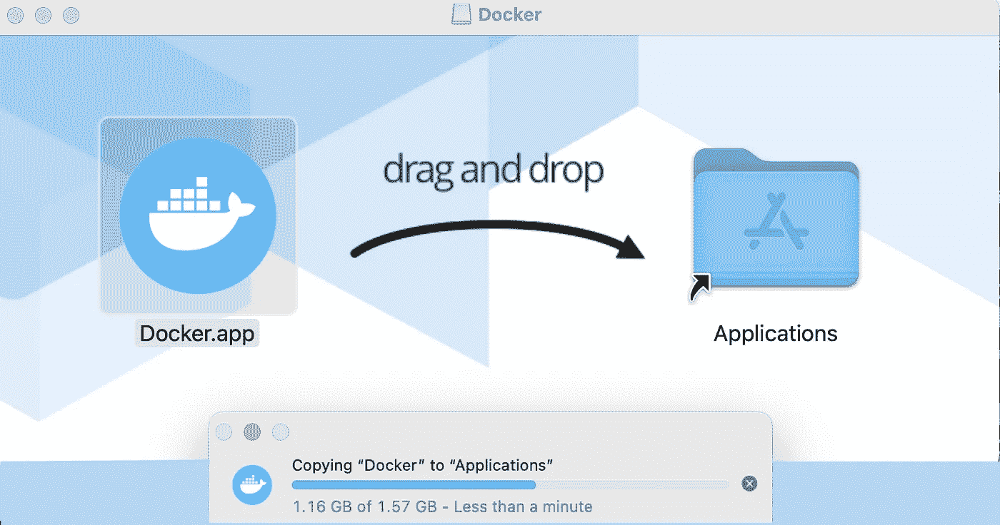
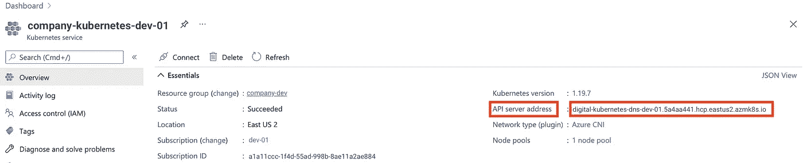

# 启动并运行 Azure Kubernetes 服务(AKS)和 DevOps 管道

> 原文：<https://levelup.gitconnected.com/up-and-running-with-azure-kubernetes-aks-and-devops-pipelines-configuring-the-kubernetes-1b85608e6b0d>

## 第 2 部分—配置 Kubernetes 集群


船轮——来自[佩克斯](https://www.pexels.com/photo/close-up-photogrpahy-ship-captains-control-1416649/?utm_content=attributionCopyText&utm_medium=referral&utm_source=pexels)的[尼克·德穆](https://www.pexels.com/@nick-demou-365778?utm_content=attributionCopyText&utm_medium=referral&utm_source=pexels)摄影

我们回到 AKS 和 DevOps 管道系列的第二部分。如果你刚刚加入我们的旅程，你可能想看看这个系列的第一部分: [*启动并运行 Azure Kubernetes 服务(AKS)和 DevOps 管道——在 Azure 门户中设置 AKS*](/up-and-running-with-azure-kubernetes-service-aks-and-devops-pipelines-2208c24378ff)

现在我们已经完成了 AKS 的部署，我们需要一些方法来与它对话。幸运的是，有一个很棒的命令行界面(CLI)可以做到这一点:kubectl。Kubectl 就是**KUBE**rnetes**C**ommand-line**T**oo**L**(关于缩写的假设完全是我自己的！)，它允许您对 Kubernetes 集群运行命令。

> Kubernetes 命令行工具 kubectl 允许您对 Kubernetes 集群运行命令。您可以使用 kubectl 来部署应用程序、检查和管理集群资源以及查看日志。

我们将使用 kubectl 来执行下一阶段的配置和设置，在阅读本系列后，您也可以在 Visual Studio 代码中使用它来代替 Azure DevOps 管道和扩展等工具。

> **为了更深入地了解 kubectl**
> [kubectl | Kubernetes 的概述](https://kubernetes.io/docs/reference/kubectl/overview/)

# 先决条件的安装

## 通过 Docker 桌面安装 kubectl

如果你在 Mac 或 Windows 上，你有两个选择来获得 kubectl，在 Linux 上你只能选择一个(尽管有不同的方法)，应该跳到 ***通过命令行工具*** 安装 kubectl。

如果你还在读这一节，我们会假设你是在 Mac 或 Windows 上！我发现目前为止获得 kubectl 最简单的方法是安装 Docker Desktop。现在，如果您以任何方式使用 Docker 容器，我建议您安装 Docker Desktop，即使您没有利用 Kubernetes(但是为什么不呢！？).这是一种安装 Docker、Kubernetes、开发者工具的快速简单的方法，现在也有来自 Snyk 的图像漏洞扫描。另外，它有一个漂亮的 GUI 来帮助管理图像和一些配置。

> Docker 桌面包括 Docker 应用程序、开发人员工具、Kubernetes 和生产 Docker 引擎的版本同步。Docker Desktop 允许您利用经过认证的图像和模板以及您选择的语言和工具。开发工作流利用 Docker Hub 将您的开发环境扩展到一个安全的存储库，以实现快速自动构建、持续集成和安全协作。

你可以得到。dmg 或者。exe 安装程序从 [Docker 桌面为 Mac 和 Windows | Docker](https://www.docker.com/products/docker-desktop)

在 Windows 上，安装就像运行。exe(你知道的，ol '双击？).

在 Mac 上，安装就像运行。dmg，然后常见的拖放到应用程序。



在 Mac 上安装 Docker 桌面

## 通过命令行工具安装 kubectl

啊，我们的老朋友 CLI。
现在，根据您的操作系统，这里的步骤可能会略有不同。

**车窗通过卷曲
1。**在命令提示符下，导航到您希望 kubectl 二进制文件驻留的目录(例如 C:\windows 或 D:\cool-tools 等。)，然后用 curl 拉到那里:

```
**cd Windows**
```

然后:

```
**curl -LO https://dl.k8s.io/release/v1.20.0/bin/windows/amd64/kubectl.exe**
```

**2** 。将 kubectl 目录添加到您的路径中
如果您下载了 kubectl 二进制文件，比如 C:\windows 或者您的路径中已经存在的另一个目录，那么您不需要执行这个步骤。但是，如果没有，您需要添加它。要确定这一点，用`**echo %PATH%**`检查当前在您的路径上有什么。还是为了更容易读懂`**echo %PATH:;=&echo.%**`。仅对于您的登录用户，假设 kubectl 二进制文件在***D:\ cool-tools***中，您将运行:

```
**setx path "%PATH%;D:\cool-tools\"**
```

对于所有用户(需要提升的/管理员访问权限)，假设 kubectl 二进制文件在***D:\ cool-tools***中，您将运行

```
**setx /M path "%PATH%;D:\cool-tools\"**
```

> **抬头！**
> 要在你的%PATH%中看到这些变化，你需要打开一个新的命令提示符。
> 
> **抬头！**
> 如果你利用另一种方法设置你的路径，比如用
> **设置 PATH = % PATH %D:\cool-tools\"** —它将只为当前会话设置路径。一旦您注销了 Windows，对您的路径的更改将不再存在！

**Windows via PowerShell 和 PSGallery** 如果您在 PowerShell 中使用 PSGallery 包管理器，安装 kubectl 二进制文件的另一种方法如下(使用这种方法，您不需要手动修改路径):

**1。**在 PowerShell 提示符下

```
**Install-Script -Name 'install-kubectl' -Scope CurrentUser -Force**
```

然后:

```
**install-kubectl.ps1 [-DownloadLocation <path>]**
```

> **在 Windows 上安装的其他方法**
> [在 Windows 上安装并设置 kubectl | Kubernetes](https://kubernetes.io/docs/tasks/tools/install-kubectl-windows/)

**macOS via curl**

在 macOS(和 Linux)上安装 curl 与在 Windows 上安装略有不同，因为我们在下载了 kubectl 二进制文件之后还需要几个步骤。

**1。**从一个终端，拉最新稳定的 kubectl 二进制:

```
**curl -LO "https://dl.k8s.io/release/$(curl -L -s https://dl.k8s.io/release/stable.txt)/bin/darwin/amd64/kubectl"**
```

**2。**使其可执行:

```
**chmod +x ./kubectl**
```

**3。**将它移动到您希望它驻留的位置(假设是***/usr/local/bin/ku bectl***):

```
**sudo mv ./kubectl /usr/local/bin/kubectl**
```

然后，让 root (admin)用户拥有它:

```
**sudo chown root: /usr/local/bin/kubectl**
```

> **抬头！**
> 尽量避免将二进制保存在下载目录中。除了最佳实践之外，在 macOS Big Sur 上运行驻留在下载目录中的项目(如 VS 代码)时会出现一些问题。

**自制苹果电脑**

要用家酿软件包管理器安装 kubectl 二进制文件，只需从终端运行一个简单的命令行程序(不需要额外的步骤):

```
**brew install kubectl**
```

在 Linux 上安装 curl 与在 macOS 和 Windows 上安装略有不同，在我们下载了 kubectl 二进制文件后，需要运行一些不同的任务。

**1。**从一个 shell 中，拉出最新稳定的 kubectl 二进制:

```
**curl -LO "https://dl.k8s.io/release/$(curl -L -s https://dl.k8s.io/release/stable.txt)/bin/linux/amd64/kubectl"**
```

> 抬起头来！
> 执行步骤 **2.a.** **或步骤 2.b.** ，**不要两者都执行！**

**2.a.** 安装 kubectl 二进制文件(假设 root 访问):

```
**sudo install -o root -g root -m 0755 kubectl /usr/local/bin/kubectl**
```

**2.b.** 或者没有 root 权限(仅限登录用户)。在您登录的用户目录中创建目录:

```
**mkdir -p ~/.local/bin/kubectl**
```

然后，将 kubectl 二进制文件移到那里:

```
**m****v ./kubectl ~/.local/bin/kubectl**
```

最后加上 ***~/。local/bin/kubectl*** 到您的$PATH(永久的，这需要编辑您的 shell 配置文件，如 ***~/。bashrc (*** 假设 bash shell)但是这取决于您使用的 shell)。在您喜欢的编辑器中打开它，比如 vi(如果这个文件不存在，您可以简单地先运行`**touch ~/.bashrc**`):

```
**vi ~/.bashrc**
```

然后，将该路径添加到文件的底部，如下所示:

```
**export PATH=$PATH:~/.local/bin/kubectl**
```

最后保存退出 vi。

> **注意**
> 对于那些不了解 vi 的神秘本质的人来说，保存和退出是通过以下命令序列执行的:按`**ESC**`(它应该在编辑器的底部提供一个冒号( **:** )提示符)然后按`**s**`接着按`**ENTER**`保存，然后按`**q**`接着按`**ENTER**`退出。

**Linux via native package management(基于 Debian)** 在尝试通过软件包管理安装之前，我们需要确保我们的软件包管理器拥有最新的软件包索引。然后，我们可以获取 kubectl 二进制文件。

**1。**更新 apt-get:

```
**sudo apt-get update**
```

然后:

```
**sudo apt-get install -y apt-transport-https ca-certificates curl**
```

**2。**获取谷歌云公共签名密钥(Kubernetes 是谷歌维护的一个项目，如果你在 Azure 环境中对此有疑问！):

```
**sudo curl -fsSLo /usr/share/keyrings/kubernetes-archive-keyring.gpg https://packages.cloud.google.com/apt/doc/apt-key.gpg**
```

**3。**添加 Kubernetes apt 存储库:

```
**echo "deb [signed-by=/usr/share/keyrings/kubernetes-archive-keyring.gpg] https://apt.kubernetes.io/ kubernetes-xenial main" | sudo tee /etc/apt/sources.list.d/kubernetes.list**
```

**4。**再次更新 apt-get:

```
**sudo apt-get update**
```

**5。**最后，安装 kubectl 二进制文件:

```
**sudo apt-get install -y kubectl**
```

**通过本地包管理的 Linux(基于 RedHat)** 在基于 red hat 的系统上安装比在基于 Debian 的系统上安装步骤少。其实就两个！

**1。**添加 Kubernetes yum 库:

```
**cat <<EOF > /etc/yum.repos.d/kubernetes.repo
[kubernetes]
name=Kubernetes
baseurl=https://packages.cloud.google.com/yum/repos/kubernetes-el7-x86_64
enabled=1
gpgcheck=1
repo_gpgcheck=1
gpgkey=https://packages.cloud.google.com/yum/doc/yum-key.gpg https://packages.cloud.google.com/yum/doc/rpm-package-key.gpg
EOF**
```

**2。**安装 kubectl 二进制文件:

```
**yum install -y kubectl**
```

# 添加 Kubernetes 集群并通过 kubectl 连接到它

既然先决条件已经解决了，我们就可以进入正题了。我们必须做的第一件事是将新的 Kubernetes 集群添加到 kubectl，这样我们就可以连接到它。

**1。**从 Azure 门户获取集群的 API 服务器地址:



Kubernetes 集群 API 服务器地址在 Azure 门户中的位置

**2。**使用 kubectl 添加集群:

```
**kubectl config set-cluster company-kubernetes-dev-01 --server=digital-kubernetes-dns-dev-01.5a4aa441.hcp.eastus2.azmk8s.io**
```

> **注意**
> 如果您在另一个应用程序中将上下文从这个集群中切换出来，比如在 VS Code 的 Kubernetes 扩展中，您可以通过 CLI 使用下面的命令`**kubectl config use-context company-kubernetes-dev-01**`轻松切换回来

# 设置名称空间

我们已经安装了 kubectl，现在已经连接到我们新的 Kubernetes 集群。我们需要做的下一件事是设置名称空间，以帮助组织我们的工作负载、作业、服务和 pods。现在这似乎并不重要，但是等到您部署了数千个微服务，所有这些微服务都在单个集群中执行不同的任务时，就知道了！

```
**kubectl create namespace financial**
```

# 是啊！您的 AKS 集群现在可以接受和运行容器了！

准备好继续并自动化您的容器构建和部署了吗？

查看 [**第 3 部分—使用 Azure DevOps 管道部署到 Kubernetes**](/up-and-running-with-azure-kubernetes-service-aks-and-devops-pipelines-deployment-40f054071477)