# 启动并运行 Azure Kubernetes 服务(AKS)和 DevOps 管道

> 原文：<https://levelup.gitconnected.com/up-and-running-with-azure-kubernetes-service-aks-and-devops-pipelines-2208c24378ff>

## 第 1 部分—在 Azure 门户中设置 AK

乐队指挥——照片由来自[佩克斯](https://www.pexels.com/photo/man-performing-on-stage-2102568/?utm_content=attributionCopyText&utm_medium=referral&utm_source=pexels)的[加布里埃尔·桑托斯·福托格拉菲亚](https://www.pexels.com/@gabrielsantosfotografia?utm_content=attributionCopyText&utm_medium=referral&utm_source=pexels)拍摄

在第 n 次在 Azure 中部署 Kubernetes，并随后将 Azure DevOps 管道连接到它以实现完全自动化的部署之后，以及意识到 AKS 的设置和众多选项甚至对经验丰富的 Azure 用户来说都可能看起来势不可挡——我决定为任何在类似设置中挣扎的人记录它。接下来，在第 2 部分中，我们将讨论 Kubernetes 的内部设置；在第 3 部分中，我们将配置一个 Azure DevOps 管道来自动部署到我们的新 AKS 资源。

> **注意**
> Azure Portal 只是在 Azure 中创建 AKS 资源的众多方式之一。其他方式包括 Azure CLI 和 PowerShell，它们都超出了本系列的范围。

**好了，言归正传！**

首先，你显然需要一个 Azure 账户。你说你没有？嗯，他们提供 25+始终免费的服务，12 个月免费的额外服务，以及前 30 天更多“优质”服务的 200 美元信用。你可以在 https://azure.microsoft.com/account/free 报名。如果你还没有账户的话，这应该足够给你一个类似的机会了。

# 创建资源

*   在[https://portal.azure.com](https://portal.azure.com)登录 Azure 门户
*   通过从左侧菜单中选择“创建资源”来创建资源。

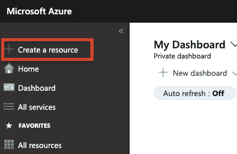

*   在接下来的屏幕上，在搜索栏中输入“Kubernetes Service”。

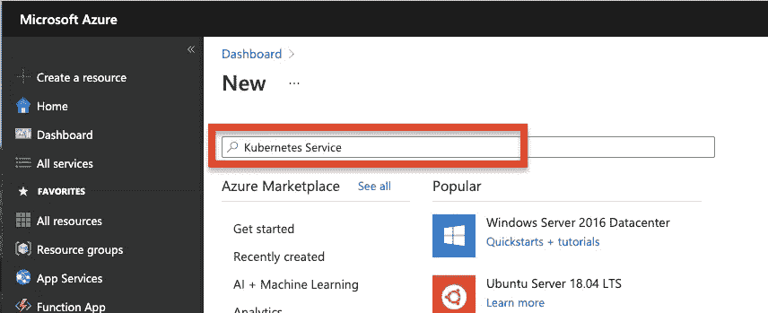

*   然后，选择“创建”

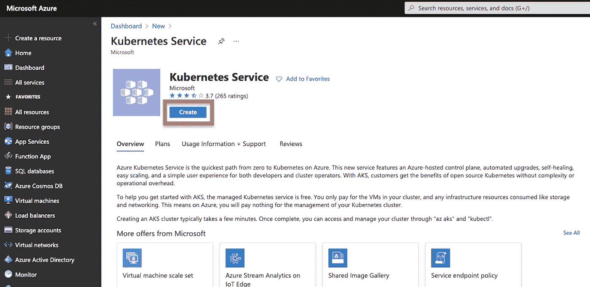

在下面的屏幕上，我们将开始配置新的 Kubernetes 服务。

# Azure Kubernetes 服务(AKS)资源的初始配置

## 基础

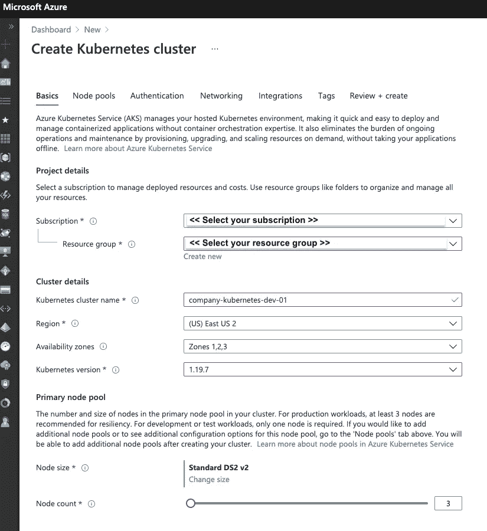

*   **订阅**。大多数人只有一个，其余的人选择合适的一个。
*   **资源组**。选择要添加 AKS 资源的资源组，或者通过 ***“新建”*** 链接新建一个资源组。

> **注意**
> 需要注意的是，这里选择的资源组将只包含 AKS 资源，而不包含实际的节点池、负载平衡器和其他与之关联的底层资源。这些是在一个新的单独的资源组中创建的，这个资源组由 Azure 自动方便地命名。

*   **Kubernetes 集群名称**。随便你怎么命名，但是我建议你尽可能地为你所有的 Azure 资源坚持一个相似的命名惯例。大多数团队对此已经有了一个格式，但是在新的项目中，您会希望有一个合适的格式。我倾向于使用:`**<<company/department/product>>-<<resource>>-<<environment>>-<<instance>>**`
    的格式，因此您的资源名称可能类似于:
    `**digital-kubernetes-dev-01**`

> 当提到命名你的资源时，我推荐如下:
> 
> —对于公司或部门，这将取决于您的场景。如果您所在的组织在同一个订阅中有多个公司(如控股公司)，您可能会希望以 company 或其缩写作为前缀(例如，如果您的公司是 Microsoft，则前缀应为“msft”)。如果您在一家公司(典型)，您可能希望按部门或产品(如“digital”或“myapp”)进行分隔。
> 
> —资源应该是不言自明的，这里唯一的建议是保持简单和一致。(例如，“kubernetes”或“database”)
> 
> —谈到环境，我建议根据环境选择“开发”、“生产”、“共享”、“登台”或“测试”中的一种。“共享”环境是为跨多个环境共享资源而保留的，例如 Active Directory/Active Directory B2C 或外壳存储帐户。
> 
> —最后，实例通常只有一种格式(例如，“01”、“001”、“1”)，因为我建议在所有资源上标注一个实例编号，以防需要多个匹配相同格式的实例。一个常见的场景是存储帐户和虚拟机，您可能有不止一个(例如，digital-vm-dev-14)。
> 
> 你可能会问为什么这很重要，为什么标签不能用来定义和查找资源。简单的回答是，虽然我强烈推荐准确、标准化和一致的标记，但以标准化的方式格式化资源名称可以让您从资源列表中快速确定资源类型、所有权和用途/目的。这绝不是必须的，但是随着你的组织的 Azure 资源的增加，你可能会感谢我！

*   **地区**。对于该资源组中的所有资源来说，这通常应该是相同的(假设您的资源组是按环境划分的，例如 digital-prod、digital-dev 等)。).原因很简单:
    1。潜在的入口和出口费用(在不同地区的资源之间移动数据有时会在您的账单上产生这些忍者费用)。
    2。速度。在同一个地区发出请求和来回移动数据将比在全国或世界范围内做同样的事情要快得多。

> **注意**
> 选择一个地区并坚持下去。这不一定是离你或你的公司办公室最近的地区。我(以及微软)建议你根据三个主要因素做出选择:
> 
> 1.**监管、合规和数据驻留要求**。那些讨厌的东西，我知道。然而，它们是你在选择一个地区时首先要考虑的因素。如果您的组织有特定的法规遵从性要求，就像许多组织一样(例如，SOX、PCI DSS 等。)然后，您很可能需要选择该国存在这些法规/合规性要求的地区(例如，如果您要求 SOX 合规性，您将无法选择位于加拿大或巴西的地区，这只是几个例子)。数据驻留也是许多政府机构以及为政府机构或国防和金融公司提供服务的组织所关心的问题。如果需要，还有特定的 Azure 区域和数据中心供政府使用(包括地方政府、美国联邦政府、美国国防部/国防部，以及利用和存储高度机密信息的政府机构和组织——称为 Azure Government for National Security)。
> 
> **监管/合规和数据驻留的可用区域**
> [选择适合您的 Azure 区域| Microsoft Azure](https://azure.microsoft.com/en-us/global-infrastructure/geographies/)
> 
> 2.**贵组织需要利用的资源类型的可用性**。并非所有资源类型在所有地区都可用，因此，如果您的组织需要利用特定的功能，您接下来会希望在选择时考虑这些功能。
> **各地区所有 Azure 资源类型**
> [各地区 Azure 产品|微软 Azure](https://azure.microsoft.com/en-us/global-infrastructure/services/?products=all&regions=all)
> 
> 3.**潜伏期**。与您的客户、组织的用户或本地/托管服务器的距离很重要。很明显，您会希望选择一个最接近您的大部分用户群的区域，无论是内部还是外部，或者最接近您的内部或协同定位的服务器，这些服务器经常与您的 Azure 资源交换数据。在某些情况下，您可能希望将几个地区作为独立的资源组，每个资源组根据到用户群的距离提供服务(例如，如果您在东海岸和西海岸都有大量用户，您可能有两个生产资源组，一个在 ***东美国 2*** ，另一个在 ***西美国*** )。
> 注意:如果您的组织已经或计划使用快速路线，这些注意事项可能会发生变化。请咨询您的网络或 IT 团队，了解他们可能提供的更多信息和建议。
> 
> **你可以在 Azure | Microsoft Docs 中阅读有关区域和可用性区域的更多信息**

*   **可用区域**。默认情况下，选定区域的所有分区都会被选定。这允许节点池分布在整个区域的可用性区域中，有助于在一个区域(通常是区域中的一个或多个数据中心)出现服务中断时防止整个节点池中断。并非所有地区都支持 AKS 的此功能，因此如果需要，请确保选择适当的地区。
    在此阅读更多关于 AKS 集群可用性区域的信息:
    [AKS 集群可用性区域概述|微软文档](https://docs.microsoft.com/en-us/azure/aks/availability-zones#overview-of-availability-zones-for-aks-clusters)
*   **Kubernetes 版本。**很简单，就是 Kubernetes 的版本。出于明显的稳定性原因，除非您有理由使用它，否则我建议使用“预览”版本以外的版本。在撰写本文时(2021 年 3 月)，这个版本是 1.19.7。请记住，您总是可以在以后升级集群(使用滚动升级来防止任何停机)，所以不要在这个特殊的决定上花费太多时间。
    提供每个版本信息的 Kubernetes 变更日志可以在这里找到:
    [Kubernetes 变更日志](https://github.com/kubernetes/kubernetes/blob/master/CHANGELOG/README.md)
*   **主节点池**。现在，我们开始选择将充当我们的 Kubernetes 节点的底层虚拟机。要改变节点大小，选择 ***，改变大小*** 。根据您的特定工作负载，这可能会有很大的变化，这方面的考虑超出了本文的范围。也就是说，如果您正在部署微服务，那么如果您正确构建它们，它们将是小型、紧凑和高效的。因此，单个节点本身通常可以是“轻量级”的，并且可以通过根据需要缩放节点的数量来处理负载，这比缩放现有节点的大小容易得多(例如，与手动缩放大小相比，允许全自动的“弹性”或“可突发”容量)。我发现 B2s 实例附近的一些东西对 Node.js 微服务工作得很好(与 Kubernetes 节点无关！).

> **注意**
> 如果您发现选定的节点大小不太适合您组织的需求，可以*更改它*。
> 在初始配置期间的“基本”页面上，您只需设置主节点池。您将能够在下一步“**节点池**”中添加更多节点池，并在以后根据需要添加更多节点池。

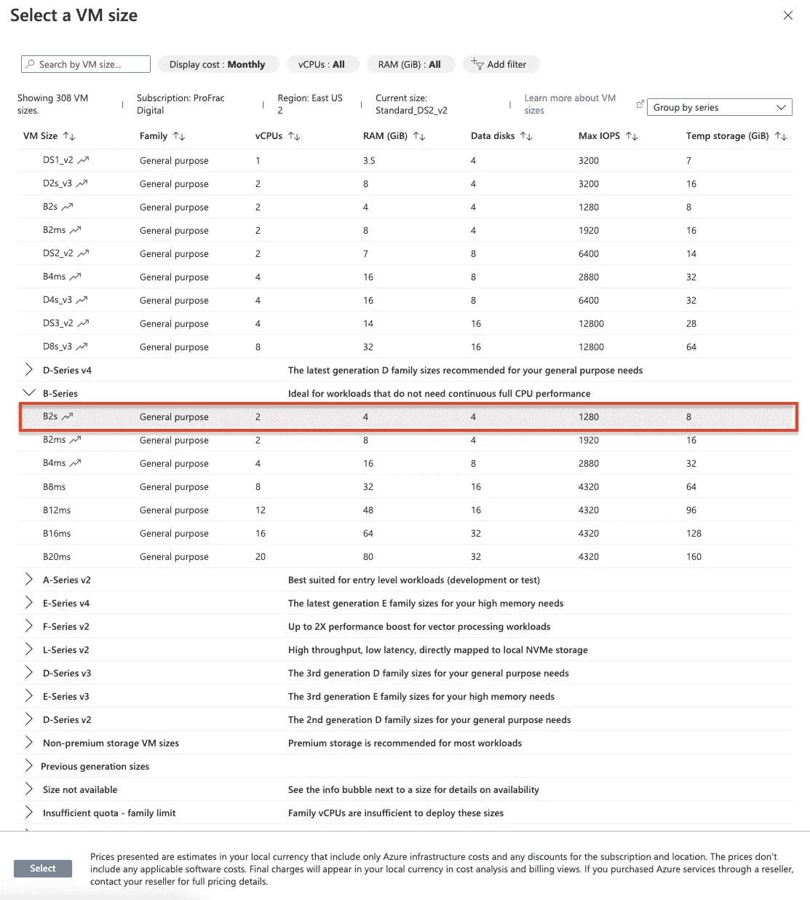

*   **节点计数**。这只是最初使用选定的节点大小创建的节点数。最小值为 1，但默认为 3。我强烈建议生产工作负载至少使用三个节点，尽管开发环境可以使用一个节点。然而，在任何将执行负载测试的环境中，您还会想要精确地复制生产环境选择。因此，如果您的生产环境在单个节点池中使用 4 个 B2s 节点，您将希望为执行负载测试的环境选择相同的节点(例如，“**阶段**或“**测试**”)。

> **注意**
> 显然，在前面的步骤中选择的每个可用性区域必须至少有一个节点。因此，如果您所在的地区是“**美国东部 2** ”，并且选择了“ **1、2、3** ”可用区域，那么您至少需要三个节点。

## 节点池

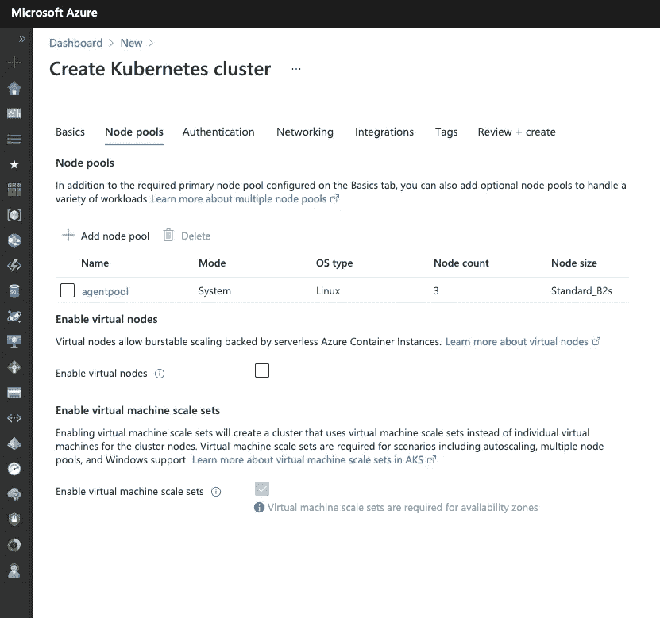

*   **节点池**。在这里，我们将查看 AKS 资源的节点池。将列出在上一步中选择的默认节点池。您现在也有机会根据需要添加额外的节点池，方法是选择“ ***”添加节点池*** ”。您也可以通过选择节点池的名称来修改节点池，例如“ ***agentpool*** ”。请注意，一旦选择了要修改的节点池(或在添加新节点池的操作过程中)，您现在还可以选择“ ***每个节点的最大数量*** ”。这允许您限制将在给定节点上运行的 pod 的数量。因此，即使节点上还有剩余资源，如果已经达到最大数量的单元(例如，110 个单元中的 110 个单元)，也不会向该节点部署额外的单元。
    我建议添加一个额外的节点池，配置为“ ***用户*** ”的“ ***模式*** ”和您选择的操作系统(Linux 是默认的，建议使用)。然后，这个节点池将运行您的实际工作负载，而默认节点池将保持 Kubernetes 的运行和操作。这样，您的应用程序就不会占用可能影响底层 Kubernetes 系统服务的资源。

> **抬头！**
> 如果选择默认节点池进行配置，则不能更改某些属性，如“**模式**”和“**操作系统类型**”，因为需要分别为“**系统**”和“ **Linux** ”。对于额外的节点池，您可以将它们分别更改为“**系统**或“**用户**和“ **Linux** 或“ **Windows** ”。请记住，如果您选择“ **Windows** ，您将被要求配置额外的认证属性，并且将无法使用 kubenet 网络插件(我们将在后面讨论)。

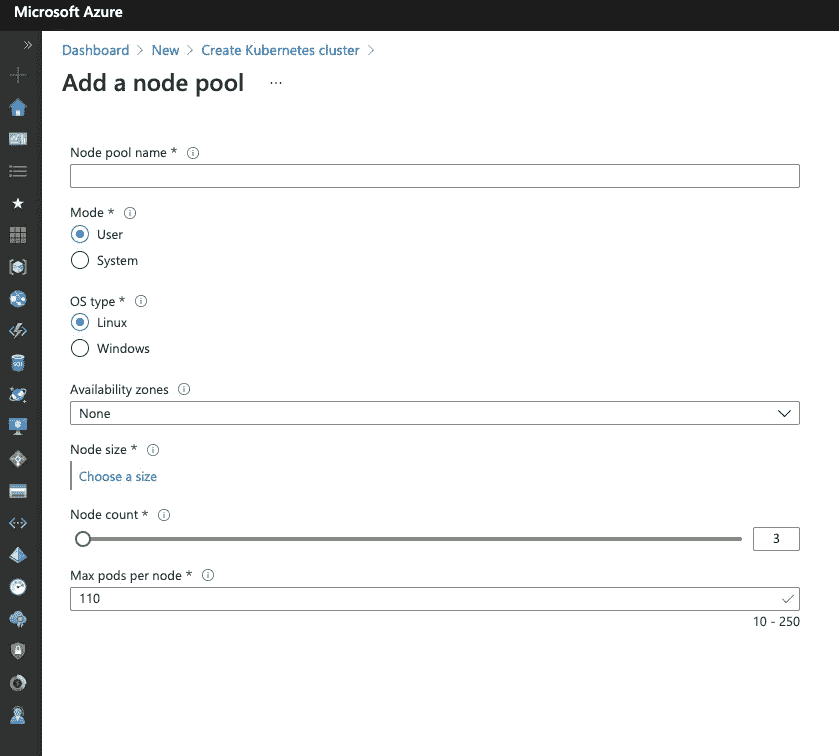

*   **启用虚拟节点**。如果您可能会遇到需要快速扩展来支持不可预测和随机的高突发事件(例如，一只股票的高交易量，因为它们超过收益 300%！)，你可能要考虑这个选项。它将容器部署到 Azure 容器实例(无服务器“虚拟机”)来帮助处理负载。我强烈推荐*而不是*对*预期的*缩放事件使用此选项，因为使用容器实例所涉及的费用可能远远高于简单地调整 AKS 集群和相关的缩放设置。
*   **启用虚拟机规模设置**。如果您选择了可用性区域，则不能取消选择此选项。我想不出有多少用例是您不希望在 Kubernetes 实现中使用 scale sets 的，但是我当然也没有魔法水晶球！

## 证明

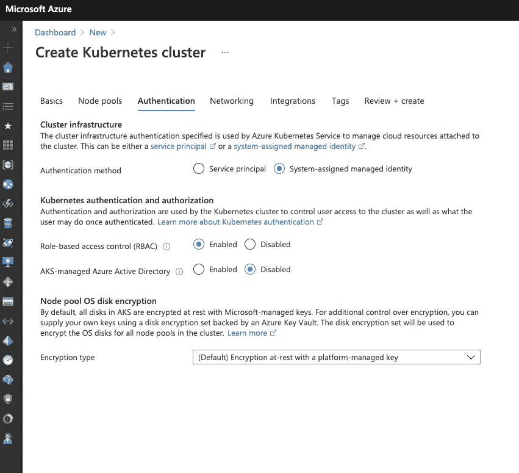

*   **集群基础设施**。这里的选项是让 AKS 使用系统分配的托管身份或服务主体来管理连接到群集的云资源(如附加存储/虚拟磁盘)。如果您的组织需要管理这一点，或者减轻您的管理负担，那么服务主体可能是一个不错的选择。否则，对于本文的范围，保留默认的“ ***系统分配的托管身份*** ”处于选中状态。
*   **Kubernetes 认证和授权**。登录后用户对群集的访问权限和能力。启用“ ***基于角色的访问控制(RBAC)”***允许权限基于用户角色，而不是逐个用户地管理。默认情况下，RBAC 是启用的，我建议在任何部署中保持此 ***启用*** 以及本文的范围。要使用 Azure Active Directory 组管理 RBAC，请启用“ ***AKS 管理的 Azure Active Directory*** ”选项。对于本文的范围，这应该保持 ***禁用*** (默认)。
*   **节点池 OS 磁盘加密**。Azure 中的资源利用微软管理的密钥进行静态和动态加密。AKS 中的节点池也不例外。然而，你也可以选择 BYOK(自带钥匙)。出于本文的考虑，我们将把“ ***加密类型*** ”设置为 ***(默认)静态加密，使用平台管理的密钥*** 。

    我们来快速切入，解释一下为什么一个组织会使用这个选项:
    1 .恶意用户的窥探，这些恶意用户可能会获得对私钥的访问权。这个坏演员可能代表竞争对手，商业机密可能会被泄露。
    2。如果一个密钥从另一个客户的订阅中泄露，并且微软在客户之间重复使用它(不太可能？是的。不可能？没有)。
    3。为了防止政府入侵(国外或国内)和在没有适当授权或传票的情况下获取数据(让我们这么说吧，如今世界各地的政府及其领导人太经常地说，这是“你的法律，但不是我的法律”)。

## 建立工作关系网

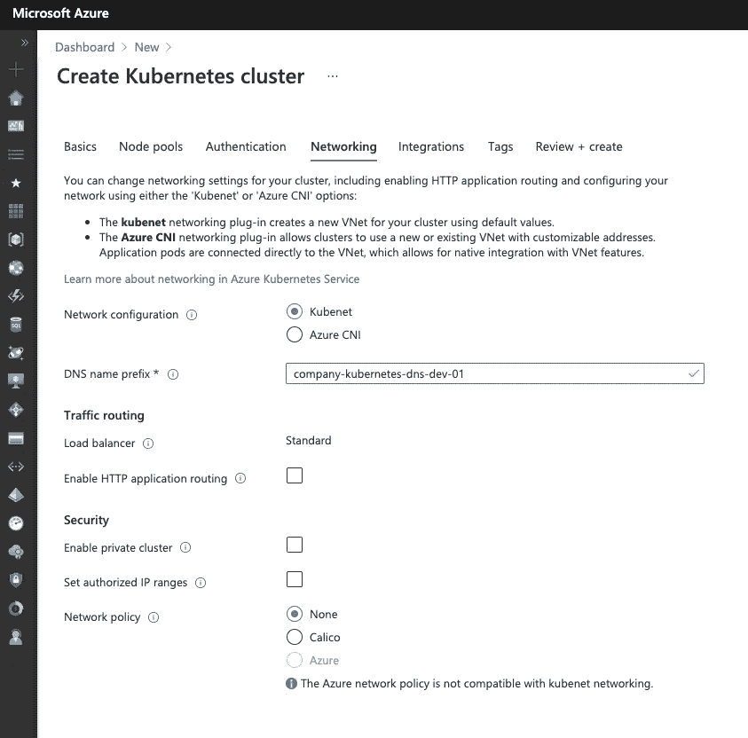

*   **网络配置**。这里的选项有“*”或者“ ***蔚蓝 CNI*** ”。对于大多数情况来说，“***”Kubenet***”就足够了，它为云不可知策略提供了与通用 Kubernetes 安装更接近的一致性。“ ***Azure CNI*** ”通常用于在更精细的级别上管理节点池和群集的 VNet(虚拟网络)、子网和 NSG(网络安全组)。利用“ ***Azure CNI*** ”选项的一个典型用例是防止在快速路由连接上查看时与内部网络的地址空间重叠。然而，对于本文的范围，为了简单起见，我们将把这个集合留给“***【Kubenet】***”。*

> *抬起头来！
> 此阶段的正确选择至关重要，因为网络配置以后无法更改。以后改变这种情况的唯一方法是使用更新的网络配置和它承载的应用程序完全重新部署 AKS 资源。虽然这可以高度自动化，但仍然会导致不必要的、有时不可接受的停机。*

*   ***DNS 名称前缀**。这只是安装创建的 DNS 资源的前缀名称。使用我们前面讨论过的相同命名约定，一切都会好的。我们将按照`**digital-kubernetes-dns-dev-01**`的思路输入一些东西*
*   ***负载平衡器**。选项有" ***【基本】*** "和" ***【标准】*** "，但是在 Azure Portal 中创建 AKS 资源时，不能从" ***【标准】*** "进行更改(这是本系列的范围)。如果您需要一个" ***"基本*** "负载平衡器，您将不得不利用 Azure CLI 或 PowerShell 使用 ARM (Azure 资源管理器)模板创建资源。*
*   ***启用 HTTP 应用路由**。此选项创建并允许公众通过 dns 名称访问您的 pod。这也将在您的订阅中创建一个 DNS 区域。此选项的目的是允许快速访问您的 pod，而无需配置 Kubernetes 入口控制器。在本系列中，我们将使用入口控制器，因此我们将*而不是*选择“ ***启用 HTTP 应用程序路由*** ”作为本系列的主题。*
*   ***启用私有集群**。此选项确保 Kubernetes API 服务器(在 Azure 托管订阅中)和节点池(在您的订阅中)之间的通信仅通过专用网络进行。启用此选项的替代方法是流量可以/将会在 API 服务器和节点池之间的订阅之间流动(通过 VNets)。我们将*不会*为这个系列的范围启用这个选项。*

> ***为了更深入地了解私有集群**
> [创建一个私有 Azure Kubernetes 服务集群——Azure Kubernetes 服务|微软文档](https://docs.microsoft.com/en-us/azure/aks/private-clusters)*

*   ***设置授权 IP 范围**。除了启用私有集群，您还可以设置一系列允许与 Kubernetes API 服务器通信的 IP 地址。我们将*不*为本系列的范围启用此选项。*
*   ***网络政策**。这个很快就会变得复杂。需要注意的重要事项是，该选项指定是否以及如何将策略应用于对特定 pod 的访问。此选项仅适用于 Linux 节点池，因为“ ***Calico*** ”和“ ***Azure*** ”选项都利用 *Linux IPTables* 来实施策略。“ ***无*** ”选项不应用任何网络策略(顾名思义！),“ ***Calico*** ”选项启用 Calico 网络策略，“ ***Azure*** ”选项启用使用 Azure 网络配置(VNets、子网、网络安全组等)的策略。).Azure 网络仅适用于“ ***Azure CNI*** ”网络配置。对于此系列的范围，应选择“ ***无*** ”选项。

    有关 Calico 的更多信息，请参见:
    [项目 Calico | Tigera](https://www.tigera.io/tigera-products/calico/)*

## *集成*

*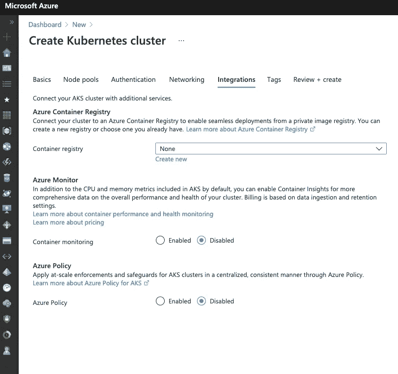*

*我们将跳过对 Integrations 页面上所有选项的选择，因为它们都超出了本系列的目的范围。但是，我们*能不能*说说他们是什么！*

*   *蓝色集装箱注册处。该选项将 Azure 容器注册表连接到 AKS 资源。您还可以通过选择“新建”选项来创建 Azure 容器注册表。稍后，我们将使用 CLI 工具`**kubectl**`和我们的 Azure DevOps 管道进行设置。因此现在，把这个设置为“ ***无*** ”。*
*   *Azure 监视器。如果要启用对该 AKS 资源的监控，可以启用“ ***容器监控*** ”选项，并选择适当的“ ***日志分析工作区*** ”或通过选择“ ***创建新的*** ”来创建一个新的。这里捕获的数据也可以通过第三方工具发送，如 *New Relic、Splunk、*和许多其他工具。我们将在本系列的范围内禁用该选项，因为我们不接受指标。*

> ***抬头！** 启用“**集装箱监控**”可以快速向您的帐户添加费用，因为每秒钟都会捕获大量指标。这并不是说不需要或不值得进行监控，这只是一个警告，以确保在收到令人讨厌的账单之前进行正确的配置！*

*   *蔚蓝政策。这也超出了本系列的范围，但是对于使用 Azure 的成熟组织和团队来说，这无疑是一个应该启用的选项。可以在用户和角色/组级别设置策略，以管理对资源以及其他权限的修改。*

## *标签*

*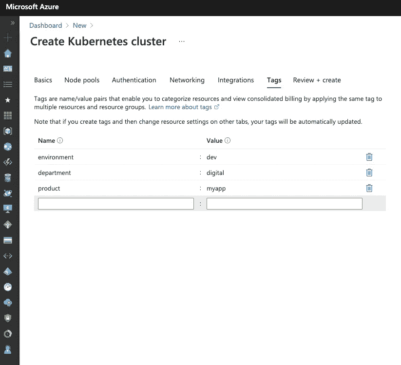*

*标签对于快速定位资源、基于特定标签创建仪表板和指标以及帮助在组织内部分配计费费用非常有价值。输入您想要的任何标签，但是没有一个标签是本系列所必需的。*

> ***建议**
> 至少，我建议在每个资源上使用以下标签:*
> 
> *— **环境**:这应该设置为与您自己的环境分解相对应的值(例如“ **dev** ”、“ **prod** ”、“ **shared** ”、“ **stage** ”、“ **test** ”等)。)*
> 
> *— **部门**:应设置为该资源被利用的部门名称(如“**数字**”、“**研发**”、“**财务**”等)。)*

## *审阅+创建*

*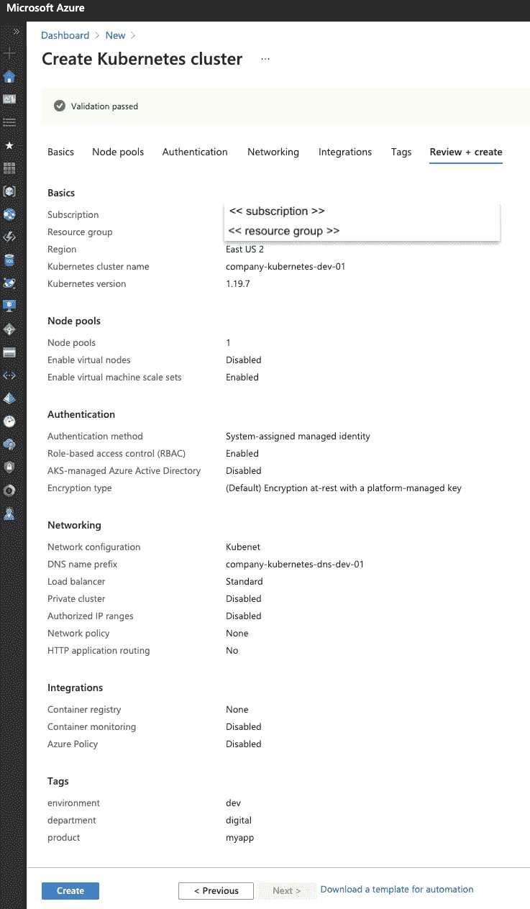*

*一旦 Azure Portal 验证了所选的配置，您就可以选择“创建”按钮并启动和运行您的 AKS 资源了！取决于几个因素，这可能需要五分钟到几个小时(我只见过后者一次)。平均大约二十分钟。*

*(满怀希望地)祝贺 AKS 部署成功！*

# *下一个*

*准备好继续前进并为部署容器做好准备了吗？
查看 [***第 2 部分—使用 kubectl***](https://medium.com/p/1b85608e6b0d) 配置 Kubernetes】*