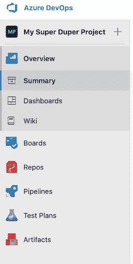
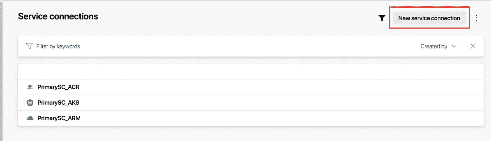
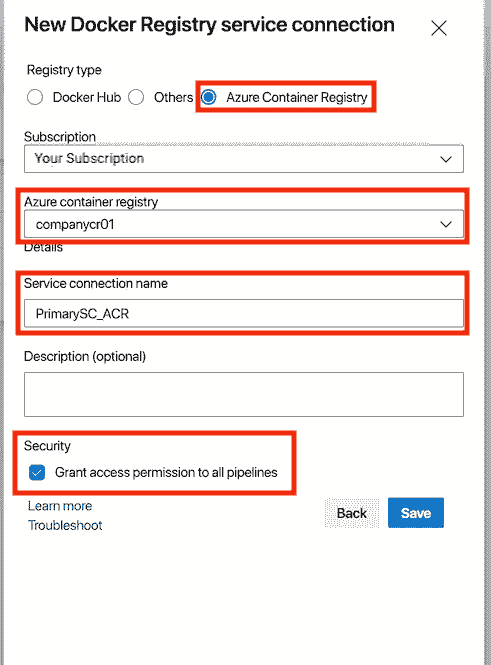
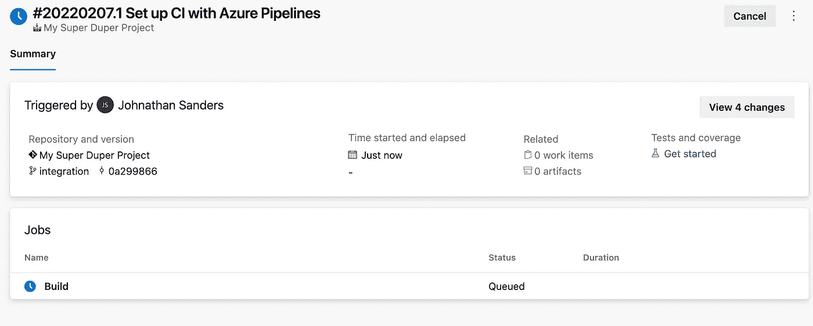
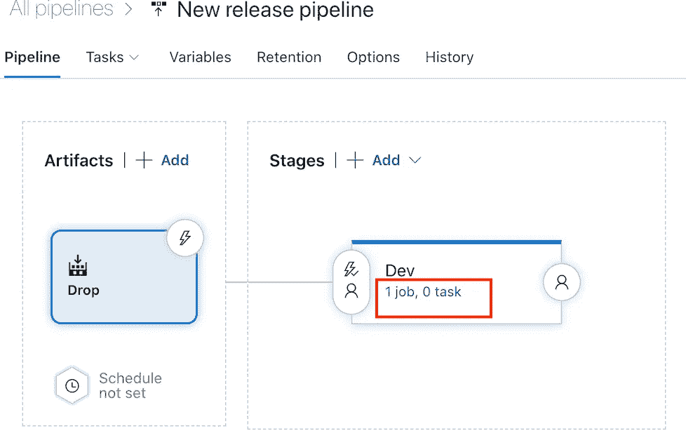

# 使用 Azure Kubernetes 服务(AKS)和 DevOps 管道启动和运行—部署

> 原文：<https://levelup.gitconnected.com/up-and-running-with-azure-kubernetes-service-aks-and-devops-pipelines-deployment-40f054071477>

**第 3 部分— *使用 Azure DevOps 管道部署到 Kubernetes***


管道——照片由[亨利&公司](https://www.pexels.com/@hngstrm?utm_content=attributionCopyText&utm_medium=referral&utm_source=pexels)从[派克斯](https://www.pexels.com/photo/gray-metal-pipe-beside-wall-1983924/?utm_content=attributionCopyText&utm_medium=referral&utm_source=pexels)拍摄

我们回到 AKS 和 DevOps 管道系列的第三部分(也是最后一部分)。如果您刚刚加入我们的旅程，您可能想看看这个系列的前两部分: [*在 Azure 门户中设置 AKS*](/up-and-running-with-azure-kubernetes-service-aks-and-devops-pipelines-2208c24378ff)*和[*配置 Kubernetes 集群*](https://tbd)*

*我们的 Kubernetes 集群应该已经启动并运行了，所以我们剩下要做的就是配置我们的 Azure DevOps 管道。*

*从任何管道开始，我们显然必须有一个要部署的应用程序和一个存放它的存储库。如果你心中还没有一个应用程序，你可以把这个[超级简单的 NodeJS+Express“Hello World”应用程序](/a-containerized-nodejs-express-hello-world-application-28d286556890)组合在一起。*

# ***先决条件***

## ***Azure 容器注册表***

*如果您已经有了一个容器注册中心，可以将容器放入其中，那么这一步就没有必要了。如果没有，Azure Container Registry 是一个很好的地方。*

*前往你的 [Azure 门户](https://portal.azure.com)并选择左手边的 ***创建资源*** 。从那里，选择“*”面板下的“ ***容器*** ，然后选择“ ***容器注册表*** ”。**

****

**在下一页(创建容器注册表)，选择要部署到的订阅和资源组，或者使用“ ***”创建新的*** ”创建新的资源组。输入注册表名称，该名称在所有 Azure 容器注册表中必须是唯一的。选择要部署的地区，在 SKU 下拉列表中选择“ ***基本*** ”。接下来，选择底部的“ ***审核+创建*** ”按钮，然后选择“*”按钮。***

******

> *****注意**
> 这里我们不讨论任何网络或加密选项，因为基本 SKU 不支持这些项目的定制。有关可用 SKU 及其适用定价的更多信息，请参见[定价—集装箱注册](https://azure.microsoft.com/en-us/pricing/details/container-registry/)***

# *****项目设置*****

## *****创建 Azure DevOps 组织*****

***为了利用 Azure DevOps 的力量，我们创建一个 Azure devo PS 组织是有意义的！前往[https://dev.azure.com](https://dev.azure.com)并选择“自由启动”按钮。***

******

> ***请记住，“免费开始”链接的位置可能会随着时间的推移而改变，但在撰写本文时，它就在这里！***

***从这里，你将继续使用你的 Azure 帐户登录，它应该会带你到你的项目仪表板。如果你 ***从来没有*** 使用过 Azure DevOps，会提示你创建一个项目开始使用。如果您 ***已经*** 使用了 Azure DevOps，您将看到显示您组织中不同项目的卡片。***

## **创建项目**

**在这里，您需要输入一个项目名称，并确保可见性是“*”。从那里，展开“ ***【高级】*** ”面板，并确保“ ***【版本控制】*** ”被设置为“***【Git】***”。然后，选择 ***创建*** 。***

****

> ****注意**
> 如果您在“**高级**”面板下还有一个“**工作项流程**”下拉菜单，您可以将其保留为“**基本**”或选择您喜欢的任何其他流程。虽然这是在真实场景中设置项目的关键步骤，但它与本文的范围无关。**

**在这里，您将看到关于新项目的摘要信息。它应该包含一个面板，其中包含“*”、“ ***板卡*** ”、“ ***Repos*** ”、“ ***管道*** ”、“ ***测试计划*** ”、“ ***工件*** 。***

****

> **与吉拉等其他解决方案相比，使用 Azure DevOps 的最大优势之一是，当你创建一个新项目时，你的董事会/Backlog、代码仓库、管道、测试计划和工件都在一个地方，并且无缝链接在一起，无需任何配置——开箱即用。当然，您可以自定义一些东西，但是在其他解决方案中这样做可能需要几个小时(如果不是几天甚至几周)才能将它连接到其他解决方案以获得相同的功能，更不用说正确使用它所需的配置了！**

## **建立服务连接**

**在我们可以连接我们的 Azure 门户资源(例如 AKS & Azure Container Registry)之前，我们需要在 Azure DevOps 中创建和链接一个服务连接。**

**我们希望建立三个服务连接，一个用于 Azure 资源管理器，一个用于 Azure 容器注册，一个用于 Azure Kubernetes 服务。**

**确保您在我们刚刚创建的新项目中，然后转到左侧导航栏底部的 ***【项目设置】*** ，然后选择****【管道】*** 。***

****

**然后，选择 ***“创建服务连接”*** 按钮，或者 ***“新服务连接”*** (如果已经存在)。**

****

**如果您已经有服务连接**

****

## **Azure 资源管理器**

**在打开的面板上，选择“Azure 资源管理器”,然后选择面板底部的“下一步”。**

****

**在那里，选择“服务主体(自动)”，然后选择“下一步”。**

****

**最后，确保将“ ***作用域级别*** 设置为 ***【订阅】*，*【资源组】*** 设置为我们之前创建的包含您的 Kubernetes 和容器注册表的资源组的名称，输入您选择的“ ***服务连接名称*** ，然后选择“ ***授予对所有管道的访问权限【T63 然后，选择 ***【保存】*** 。*****

**

## *Azure 容器注册表*

*在打开的面板上，选择***“Docker 注册表”*** ，然后选择面板底部的 ***“下一个”*** 。*

**

*从那里，在 ***【注册类型】下选择***【Azure Container Registry】***，*** 选择您的订阅，确保 ***【资源组】*** 设置为我们之前创建的包含您的容器注册表的资源组的名称，输入您选择的一个 ***服务连接名称*** ，然后选择 ***授予所有访问权限然后，选择 ***【保存】*** 。****

**

## *蓝色库伯内特服务*

*在打开的面板上，选择面板底部的***【Kubernetes】***，然后选择 ***【下一步】*** 。*

**

*从那里，选择***【Azure 订阅】******【认证方式】*** 选择你的订阅，选择你的 Kubernetes 集群 ***【集群】*** 设置命名空间为 ***默认*** ，选择 ***使用集群管理员凭证*** ，输入一个 ***服务然后，选择 ***【保存】*** 。****

**

## ***设置知识库***

**

*在项目面板上选择“*”**

**然后，在“ ***下从命令行*** ”部分，选择“*”按钮。***

******

***从这里，转到您最喜欢的终端，导航到项目目录的根目录，粘贴您刚刚复制的命令，并运行它。***

> *****抬头！**
> 如果你的项目还没有被初始化为 Git 项目，你需要在粘贴上面的命令之前运行 **git init** 。这当然假设您的机器上已经安装了 Git，如果没有，您将需要安装它。下载[并安装](https://git-scm.com/downloads) Git 后，查看官方 tutoria l。***
> 
> *****抬头！**
> 如果您还没有为您的 Git 配置设置 Azure DevOps repositories 授权，您需要这样做，以便将您的代码从您的本地机器推送到 Azure DevOps repos。事实上，你上面`***git remote add origin***`的方式可能会在此基础上改变。查看[官方文档](https://docs.microsoft.com/en-us/azure/devops/organizations/accounts/use-personal-access-tokens-to-authenticate?view=azure-devops)中的**个人访问令牌** (PATs)了解如何做到这一点。***

***一旦库被推送(在**“从命令行推送现有库”**部分`**git push -u origin --all**`中的第二个命令)，在项目面板上选择“ ***文件*** ”。***

**我们现在需要设置一个集成分支，这样我们就可以将变更推送到我们的工作分支，然后在我们的集成分支中创建 pull 请求，我们将设置它来触发我们的构建！所以，选择" ***主*** "下拉列表上方的" ***文件*** "页面，然后选择选项为" ***"新建分支"*** "。**

****

**在弹出的对话框中，在“*”框下输入“ ***集成*** ”，然后选择“ ***创建*** ”。***

****

# ****设置构建过程****

## ****创建版本****

**既然我们已经创建了项目，我们的分支也准备好了，我们需要设置构建过程来构建我们的项目(在本文的例子中:运行 NodeJS 应用程序的 docker 容器),并将其发送到容器注册中心。**

> ****注意**
> NodeJS 应用程序离唯一可以这样部署的应用程序**很远**。事实上，天空才是极限。在这个过程中，您可以构建用 C、C#、C++、Java、Kotlin、Objective C、Python、Swift 和许多其他语言编写的应用程序(既可以在 Docker 容器中也可以是独立的)。**

**在您创建了主分支的集成分支后，您需要继续选择 ***“设置构建”*** 按钮**

****

**在下一页上，将会提示您使用一个模板来帮助您创建构建。在本文使用的示例中，我们将选择“ ***Docker —构建并推送一个映像到 Azure 容器注册表*** ”。然而，如果你使用不同的构建过程(比如说在 docker 容器之外，或者你没有把你的容器推到 Azure 容器注册表)，你总是可以选择***“Starter pipeline”***然后从那里开始！**

> ****抬头！**
> 可用的选项可能因您而异，但您可以通过滚动到底部并选择“**显示更多**按钮来查看所有可用的模板。如果您没有看到您的场景的模板，您可以选择“ **Starter pipeline** ”并手动配置。**
> 
> ****抬头！**
> 如果系统提示您选择要使用的订阅(如果您的组织有多个订阅)，请选择包含您将部署到的资源的订阅(如果您遵循整个文章系列，这将是您在第 1 部分中创建资源的订阅— [使用 Azure Kubernetes Service (AKS)和 DevOps Pipelines](/up-and-running-with-azure-kubernetes-service-aks-and-devops-pipelines-2208c24378ff) )。**

**由于我们选择了“***”Docker—构建并推送一个映像到 Azure 容器注册表*** ”模板，因此我们可以选择 Azure 订阅中的所有容器注册表。选择“**容器注册表**”下拉菜单，并选择我们在上面的 ***先决条件*** 中创建的“ ***companycr01*** ”容器注册表。**

**从这里，输入我们将要部署的" ***映像名称*** "。然后，选择 ***验证并配置*** 。给它一些时间来验证。**

****

**看看那个！Azure DevOps 自动创建了 YAML 文件，并让我们准备好构建和上传到我们的容器注册表——就这样！
选择 ***保存并运行*** 。**

**Azure DevOps 还保留了一个管道变更库，就像您保留了一个源代码库一样。将显示一个 ***“保存并运行”*** 面板，让您能够更改该构建配置的提交消息。输入您想要的内容，然后选择“ ***”保存并运行*** ”。**

****

> ****抬头！**
> 如果您设置了分支策略(例如，不直接提交到集成分支——例如，仅提交请求),您可能需要选择**“为此提交创建一个新分支”**。如果您只是跟随本教程，您可以将它留为**“直接提交到集成分支”**。**

**Azure DevOps 将创建管道，并运行它。在下一页上，您将看到关于构建的信息，例如 ***构建名称*** 和 ***提交消息*** ，触发该构建的 ***分支*** 和 ***提交*** ，以及该流程的 ***作业*** 的状态(是的，您可以有多个作业—或者任务—作为构建的一部分运行。这些可以并行或异步运行。**

****

**如果一切顺利，你的 ***构建*** 的状态应该在一会儿之后变为 ***成功*** 。**

****

> ****注**
> 通过选择显示整体状态的作业，您可以查看作为作业一部分执行的每个活动的状态。**

## ****在容器注册表中验证容器****

**在我们继续之前，让我们先验证一下我们的容器确实在我们的容器注册表中！**

**再次打开 [Azure 门户](https://portal.azure.com)，在上面 ***先决条件*** 中创建的 Azure 容器注册中心内，选择“ ***服务*** ”下的“ ***存储库*** ，然后选择存储库(在我们的例子中，它是 ***companycr01*** )，然后选择标签**

**从这里，您应该能够看到集装箱的所有信息，包括货单。**

****

****测试管道触发器****

**好了，这太棒了，我们现在有了要构建的管道，并在提交时自动发送到容器注册表。但是，您可能想测试一下这是否可行。**

**在您的代码编辑器(Visual Studio 代码？)或者喜欢的终端，从我们在 Azure DevOps 的代码库中下拉我们的集成分支:
`**git pull origin integration**`
然后，切换到集成分支:
`**git checkout integration**`**

**接下来，我们需要从集成 it 分支到我们的特性分支(这将是您正在工作的代码的工作分支——无论它是一个故事、一个任务、一个冲刺，还是您的团队的任何分支策略)。
对于这篇文章，我们称它为 ***【特征-a】***:
`**git branch integration feature-a**`
然后检查新的分支:
`**git checkout feature-a**`**

**现在，对代码中的任何文件进行您想要的任何更改并保存它(只要更改不是在 ***中列出的文件中进行的)。git ignore*T22！).****

**然后，让我们提交我们的更改，并将其推送到 Azure DevOps 中的远程存储库。`**git commit -a -m "Added info to README"**`**

> ****注意**
> git commit 命令中的`**-a**`选项告诉 git 在一个步骤中提交**和**阶段。`**-m**`命令应该是不言自明的——它提供了提交消息！**

**最后，我们需要推送到 Azure DevOps 中的远程存储库。
**

**如果我们返回到 Azure DevOps，并在左侧面板上的“***【Repos】***”下选择“ ***文件*** ”，我们应该会看到“ ***功能-a*** ”刚刚已经更新，并提示我们创建一个拉取请求。因此，让我们继续并选择“ ***创建一个拉动式请求*** ”。**

****

**在下一页，确保合并方向是从 ***特征-a* 到*集成*** 。如果不是，请选择适用的下拉列表来纠正这一点(如果您没有在 Azure DevOps 中进行我们在此设置之外的任何操作，它很可能会显示 ***功能-将*转换为*main***-这是您想要更改的！).**

**一旦这一点得到验证并根据需要进行更改，选择“ ***创建*** ”按钮。**

****

> ****注意**
> 一些额外的项目有点超出了本文的范围，但是仍然非常有用:
> **- Reviewers**
> 允许您选择一个或多个用户和/或组，作为可选或必需的评审者添加到这个提交中。**
> 
> ****-添加必需的评审者**
> 将所有提交的必需评审者添加到该分支(集成)。这对于首席开发人员、架构师、QA 或其他人在构建和管道开始之前所要求的审查非常有用。**
> 
> ****-要链接的工作项**
> 将 Azure DevOps 板中的工作项交叉链接到此提交。这将显示板中适用工作项的提交，并将显示提交中的适用工作项。看，我告诉过你这是现成的！**

**好吧！下一页是我们批准和完成合并请求的地方(随后启动我们的自动构建过程)。选择 ***批准*** 按钮，然后选择 ***【完成】*** 按钮，打开 ***完成拉动请求*** 面板。**

****

**在打开的“ ***完成拉动请求*** ”面板上，保留所有选项不变(除非你知道自己在做什么，需要改变一些东西)，然后选择“ ***完成合并*** ”。**

****

> ****注意**
> 如果您是审批者，您可以选择**批准**按钮或使用那里的下拉菜单选择其他操作，如“**拒绝**”。当然，你可能想在“**添加注释**”框中添加注释，以帮助编写代码的人修复问题！**
> 
> ****抬头！**
> 如果合并完成前需要审批，必须选择**审批**按钮，并选择在**完成**前完成的流程。**

**现在，导航到左侧面板上“ ***管道*** ”下的“ ***管道*** ”来查看管道运行中自动构建的结果。它将显示触发它的合并、它被触发的时间以及完成它所花费的时间。您还可以选择管道来查看更多细节，就像我们之前在初始设置该管道时所做的那样。**

****

# ****释放它****

**我知道这是一个漫长的旅程，但信不信由你，我们几乎完成了！下一步是进入发布渠道，创造一些真正的奇迹。**

## ****设置发布管道****

**导航到 Azure DevOps 左侧面板上的“ ***管道*** ”然后“ ***释放*** ”。**

****

**然后在主页面上选择 ***新建管道*** 。**

****

**然后，您将被带到一个页面，显示新的发布管道设置。从自动弹出的 ***“选择模板”*** 面板中，滚动到底部，选择 ***“空作业”*** ，然后选择 ***“应用”*** 。**

****

**在下一个打开的面板上，在“ ***艺名*** 下，输入“ ***Dev*** ”巧妙地引用开发环境！然后，简单的收尾这个面板(这个面板上没有其他按钮来“ ***保存*** ”，你只要关闭就可以了)。**

****

## ****添加一个神器****

**让我们选择 ***添加一个神器*** 。**

****

**在打开的" ***添加一个工件*** 面板上，留下" ***构建*** "作为选择选项在" ***源类型*** 下，选择你的" ***项目*** "和" ***源*** "(这应该是我们之前创建的构建管道)。然后，确保“ ***默认版本*** ”设置为“ ***最新*** ”，并输入“ ***降*** ”为“ ***源别名*** ”。最后，选择 ***添加*** 。通过选择***【Build】***，我们告诉发布程序从先前的管道构建中获取它所引用和发布的工件。 ***【源别名】*** 仅仅是一个名字，帮助区分不同的工件进行触发。**

****

## ****设置阶段****

**继续选择我们之前创建的"***" 1 job，0 task***" text on "***Dev***" stage(不要只是单击"***【Dev】***stage，它会将您带到一个与我们希望的不同的地方！).**

****

**这应该会打开一个相当无聊的页面，但我们肯定会改变这一点！
选择 ***代理工作*****

****

**现在，在打开的“ ***代理作业*** ”面板上，您需要做几件事情。首先，在 ***代理规格*** 下选择首选代理。对于大多数情况来说，“***-Ubuntu-latest***”就足够了。但是，如果您有特定的代理需求，比如 MacOS 版本(比如 iOS 应用程序？)或本机 Windows 应用程序，您可以根据自己的特定需求选择合适的应用程序。**

**在这个面板的下面，您会发现另一个选项，如果您正在使用来自安全位置的变量，您会想要检查这个选项:“允许脚本访问 OAuth 令牌 ”。这样做，然后选择面板顶部的 ***保存*** 。**

****

**一旦选择了“ ***【保存】*** ”，系统会提示您保存的文件夹。保留默认设置，选择 ***确定*** 。**

## ****生成 Kubernetes 清单文件****

**对于此任务，我们将使用 PowerShell。所以，选择“ ***+*** ”按钮旁边的“ ***”代理作业*** ”。然后，搜索“ ***电源*** 或“ ***powershell*** ”并选择“ ***PowerShell*** ”选项，然后选择“ ***添加*** ”。**

**接下来，选择左侧的新任务。**

****

*   ****任务版本** 将此设置为 ***"2。*"*** (或您可用的最新版本)。**
*   ****显示名称** 将此改为对任务有意义的名称，如*****生成 Kubernetes 清单文件*******
*   ******键入**
    选择“ ***内联*** ”表示我们将内联输入我们的脚本信息，而不是从文件中提取。****
*   ******脚本**
    输入下面的脚本，并记下带有`**#**`符号的注释。****

```
******'# demoapp/deployment.yaml
# Deployment
apiVersion: apps/v1
kind: Deployment
# Provide some metadata for help referring to our containers
metadata:
  name: demo-app
  labels:
    app: demo-app
spec:
  # Tell Kubernetes how many replicas to create initially
  replicas: $(REPLICAS__TO__USE)
  # Enter a selector name (again for reference)
  selector:
    matchLabels:
      app: demo-app
  template:
    # More metadata
    metadata:
      labels:
        app: demo-app
    spec:
      containers:
        # Tell Kubernetes where to get the container from
        - name: demo-app
          image: companycr01.azurecr.io/demo-app:$(Build.BuildId)
# Set the port for which the container will run on
        # This should be the same as the port in your app config         
          ports:
            - name: http
              containerPort: $(HTTP_LISTEN_PORT)
              protocol: TCP
          env:
            - name: REPLICAS
              value: "$(REPLICAS__TO__USE)"
            - name: HTTP_LISTEN_PORT
              value: "$(HTTP_LISTEN_PORT)" 
---
# demoapp/service.yaml
# Service
apiVersion: v1
kind: Service
metadata:
  name: demo-app
  labels:
    app: demo-app
spec:
  type: LoadBalancer
  ports:
    - port: $(HTTP_LISTEN_PORT)
      targetPort: http
      protocol: TCP
      name: http
  selector:
    app: demo-app' | Set-Content $(Agent.TempDirectory)/manifest.yaml'#******
```

******保存** 选择*【保存】* ，然后在出现的对话框中选择 ***【确定】*** 。****

## ******部署 Kubernetes 清单******

****既然我们的清单已经生成，我们就可以部署它了(这会告诉 Kubernetes 拉容器并进行部署)。对于这个任务，我们将使用“ ***部署到 Kubernetes*** ”。所以，再次选择“ ***+*** ”按钮旁边的“ ***”代理作业*** 。然后，搜索“ ***部署*** ，选择“ ***部署到 Kubernetes*** ”选项，然后选择“ ***添加*** ”。****

****从这里，选择左侧的新任务，然后在打开的新面板中:****

********

*   ******任务版本**
    设置此项为" 0。*(或您可用的最新版本)****
*   ******显示名称**
    输入一个有意义的名称，你懂的……类似于 ***【部署到 Kubernetes】***。****
*   ******动作**
    选择 ***【部署】*** 进行动作。****
*   ******Kubernetes 服务连接**
    选择我们之前创建的服务连接***" PrimarySC _ AKS "*******
*   ******命名空间**
    在 ***【命名空间】*** 字段中输入变量`**$(KUBERNETES__NAMESPACE__DEMO_APP)**`。****
*   ******策略**
    将此设置保留为 ***【无】*******
*   ******清单**
    在此字段中，您需要选择我们将部署清单的位置。这恰好是我们在前一个任务中生成的，所以输入/选择`**$(Agent.TempDirectory)/manifest.yaml**`****
*   ******容器**
    在本栏位输入“demo-app”。****
*   ******ImagePullSecrets**在这里输入变量`**$(DOCKER__AUTH__SECRET__NAME)**`。****
*   ******展示状态超时**
    您可以将此设置为该任务被视为失败之前等待的秒数。请记住，有几个因素可能会导致此任务运行的时间比预期的长。在这个练习中，我们将它保留在***【0】***，这意味着没有超时。****

****继续选择 ***“保存”*** ，然后根据需要提供注释，然后选择 ***“确定”。*******

## ******变量******

****因为我们在那些任务中使用了一些变量，所以我们需要配置它们，以便部署可以找到它们。要做到这一点，头转向左侧导航面板上的 ***【库】*** 选项。****

****在那里，你需要使用出现的页面上的 ***【变量组】*** 选项创建一个新的变量组。****

********

****在变量组屏幕上，输入一个 ***【变量组名称】*** (这里我用的是 ***【初级】*** )。****

****现在，选择页面左下方的 ***"+添加"*** 选项，然后开始输入变量名和值。您将希望使用与我在这里列出的相同的名称，或者如果您更改它们—在我们在前面的步骤中所做的清单和任务设置中更改它们！****

****这是将为我们创建的容器存储库机密的名称，主要用于参考。****

****`**HTTP_LISTEN_PORT**`这是我们的容器将侦听的端口(这需要与您的应用程序中的 docker 文件中配置的端口相同！).****

****`**KUBERNETES__NAMESPACE__DEMO_APP**`这是部署容器的 Kubernetes 名称空间。我们将它设置为***“financial”***，因为这是我们之前创建的名称空间。****

****`**REPLICAS__TO__USE**`这个数字表示我们的容器有多少个副本(不是我们可能拥有的容器数量)。如果我们的标准是用两个容器来管理工作量，那么我们将从***【2】***开始。****

********

## ****试验****

****现在我们已经设置好了一切，我们可以测试发布了！
返回到版本，然后选择您的版本(Demo-App - CD)。
然后，选择 ***【创建发布】*******

********

****在打开的面板上，只需选择 ***【创建】*******

********

****一旦创建了发布，选择发布的阶段(在我们的例子中: ***【开发】*** )来查看细节。****

********

****代理将完成其步骤，并在发生时提供日志。****

********

****如果一切顺利，您的发布应该是这样的！****

********

# ****打电话****

****一段很长的旅程，我知道…****

****我们终于准备好从 Kubernetes 调用我们的服务了！****

****您将使用从您的 Kubernetes 部署中创建的 IP 地址，最快的方法之一是回到我们的老朋友: ***kubectl*** 。
转到终端或命令提示符，输入以下命令将名称空间切换到 financial: `**kubectl config set-context --current --namespace=financial**`****

****之后，获取包含我们公共 IP 的服务信息进行调用:`**kubectl get service**`****

****这个命令应该会返回类似这样的内容，包括您的 ***外部 IP*** :****

********

****为了进行测试，我们所要做的就是打开我们最喜欢的 web 浏览器(或 API 测试工具，如 Postman)并输入***http://<EXTERNAL-IP 地址> :8800*** (因此，使用上面的例子，这将是[***http://20.75.25.111:8800***)](http://20.75.25.111:8800))****

## ****最后的结果****

****甜蜜的胜利！****

********

******感谢你坚持和我在一起，我希望你喜欢这些文章！******