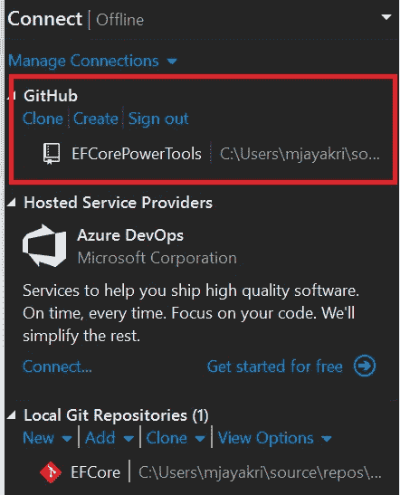

# 在 Visual Studio 中启动并运行 GitHub 扩展

> 原文：<https://levelup.gitconnected.com/up-and-running-with-github-extension-in-visual-studio-3120cfefcd2b>

Github 扩展— Visual Studio

# 介绍

在本文中，我们将学习 Github 扩展及其在 Visual Studio 中的用法。你已经知道 Github 是什么，我们如何存储我们的库，以及它如何帮助其他人克隆我们开发的东西。这是一个用于协作开发的一体化平台。

**设置**

让我们首先安装扩展，稍后我们将使用它。

下面是下载扩展的链接-> [Git Hub 扩展](https://marketplace.visualstudio.com/items?itemName=GitHub.GitHubExtensionforVisualStudio)

一旦你点击要安装的扩展，确保重启 Visual Studio。

供你参考，我用的是 Visual Studio 2019。

**Visual Studio**

打开 Visual Studio ->点击团队资源管理器

图一

点击连接->

图二

您可以选择从浏览器登录 Github，也可以选择 GitHub 企业用户登录，如果您不是 GitHub 用户，底部有一个注册选项，您可以在这里创建自己的帐户。

# GitHub 集成

图三

成功登录后，您会发现 Github 集成了 Visual Studio 以及一些特性

**克隆**

点击 Clone，在这里你可以找到所有与我们的 GitHub 相关的库，你可以将项目克隆到我们的本地路径，如下图所示。

它还将在 Visual Studio 中用打开项目

图 4

**创建**

它有助于在 GitHub 中开设一个帐户，以创建回购协议，并在项目中工作。

**签退**

除了注销什么都不是。一旦你注销，整个过程将从零开始。

**添加/更改账户**

有一个选项，添加或更改帐户，可以同时将 GitHub 帐户从一个帐户更改为另一个帐户。

**最终输出**

图五

项目成功地克隆到我们定义的本地路径，我们可以照常开始工作。我们还可以选择提交和检查分支，也可以从一个分支切换到另一个分支。我们必须跟踪问题，并通过图形用户界面进行推拉检查。

# 摘要

这个扩展可以免费使用。在本文中，我们已经了解了如何在没有任何命令的情况下安装和使用 Github extension for Visual Studio。在 VS 2019 甚至更早的版本中很容易使用这个扩展。

希望这篇文章对你有帮助。

继续学习！