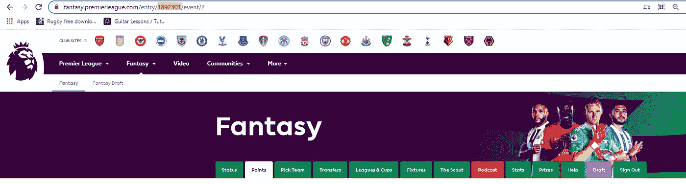
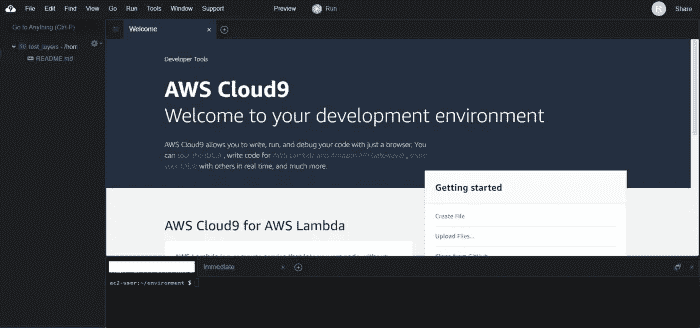
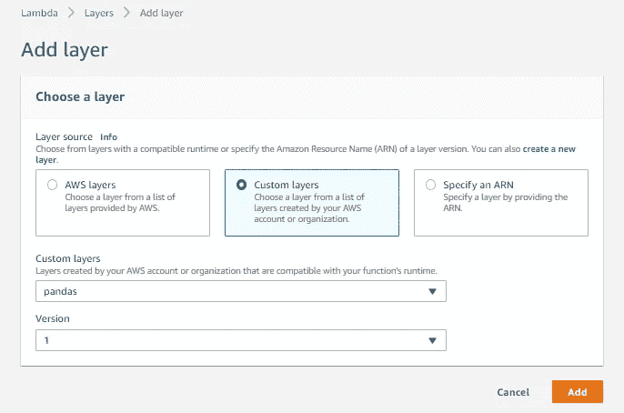
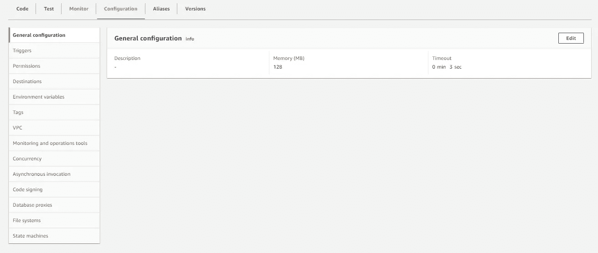
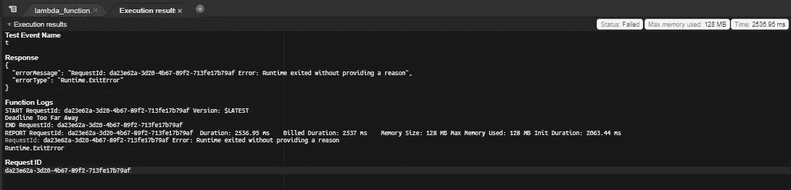
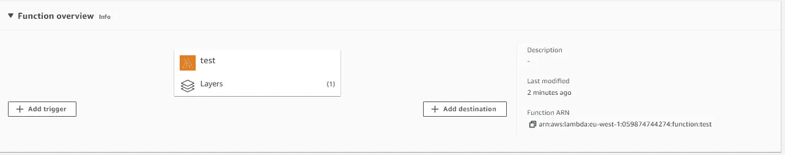
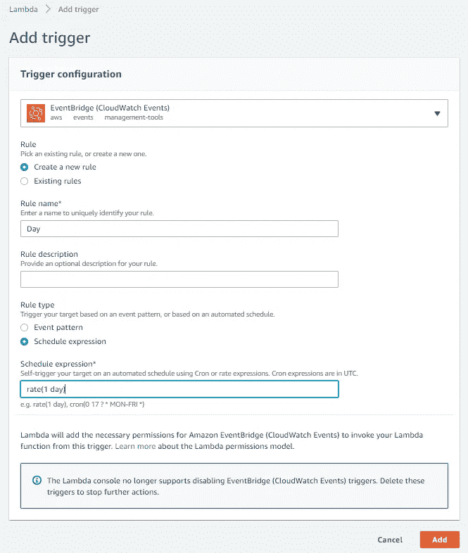

# 更新:用 Python 和 AWS Lambda 自动管理你的梦幻英超球队。

> 原文：<https://levelup.gitconnected.com/updated-automatically-manage-your-fantasy-premier-league-team-with-python-and-aws-lambda-e92eebacd93f>


在过去的一个月里，我在[自动管理你的梦幻英超](/automatically-manage-your-fantasy-premier-league-team-with-python-fpl-pandas-docker-and-aws-ea373097a3c7) (FPL)队的旧帖子获得了很多关注。然而，我不喜欢把它作为教程，有几个原因。

库如何返回数据的第一个问题导致了一些不必要的代码行，这些代码行是可以改进的。

#2 我使用了 [iterrows()](https://pandas.pydata.org/docs/reference/api/pandas.DataFrame.iterrows.html) ，这总是很糟糕，应该避免。

#3 梦幻英超的“赛程难度评级”很糟糕，而且从来都不准确，我想用一个更好的指标。

#4 它依赖于使用 Docker 和 AWS ECS Fargate，这不一定是坏的，因为它们是初级到中级程序员需要学习的重要技术(这是这篇博客的目标)，然而，在 Windows 机器上安装 Docker(尽管我喜欢 Linux，但这是最流行的操作系统)是一种痛苦，不应该成为一个简单有趣的项目的一部分，如梦幻足球机器人。

我仍然会保留它，因为它是 FPL 图书馆的有用指南，但我决定重新审视这个项目，目的是通过以下方式使它更简单:

只使用请求和熊猫图书馆。

使用 AWS Lambda 和熊猫图层。

我认为这将是一个很大的改进，如果你可以用 Lambda 做一个重复的任务，比如切换播放器，你可能应该这样做，因为这是 AWS 上最便宜的服务。

我还想补充一点，如果你使用这个教程来管理多个团队，你的账户有被封禁的风险，就像 FPL 的主要球员[最近做的](https://twitter.com/LiveFPLnet/status/1426781613694889988?s=08)。

对于本教程，你需要一个 AWS 帐户，一个 FPL 帐户和一个 Python 环境。

# 目标:

我们想让我们的梦幻英超球队每周更新，而我们什么也不做。

# 路线图:

我们将需要完成几件事情来让这个工作。

1.我们需要得到我们球队中有哪些球员的数据，英超球队的数据，英超球员的数据以及即将到来的比赛的数据。

2.我们需要知道游戏周的数字，我们想知道最后期限是否在 24 小时内，所以我们只在最后期限前做一个改变。

3.我们需要根据我们选择的球队中的每个球员的状态，他们即将到来的比赛以及我们决定使用的任何其他数据来给他们一个权重，并选择一个球员转会出去。

4.我们需要给每个球员一个权重，我们可以根据他们的状态，他们即将到来的比赛以及我们决定使用的任何其他数据来选择一个球员。

5.我们需要根据他们的状态，他们即将到来的比赛以及我们决定使用的任何其他数据，给我们选择的球队中的每个球员一个权重，并挑选 11 名球员首发，哪个是队长。

6.我们需要使用 FPL API 将我们的团队发布到网站上。

7.我们需要制作一个包含熊猫的 Lambda 图层。

8.我们需要将代码部署到 Lambda，并添加一个触发器来每天运行代码。

## 0.建立

我们需要从 FPL(梦幻超级联赛)获得我们的用户 id。如果你去网站的“积分”部分，你会看到网址是这样的“https://fantasy . premier league . com/entry/user _ id[/event/2](https://fantasy.premierleague.com/entry/1892301/event/2)”。6993864 是我的团队用户 ID，你的将是不同的。我们将把我们的电子邮件、密码和 user_id 传递到更新团队方法中。如果您想保持值的私有性，可以使用环境变量。



要设置 python 环境，请针对 Windows 运行以下命令:

```
python -m venv venv
source venv/Scripts/activate
pip install pandas
pip install requests
pip install datetime
```

我们将被触发的 main 被称为 lambda_handler，因为这是 AWS Lambda 上的默认名称，event 和 context 是必填字段。

```
def lambda_handler(event, context):
    email = "your_email"
    password = "your_password"
    user_id = "your_user_id"
    update_team(email, password,user_id)
```

## 1 & 2.获取数据并检查运行

在这篇文章之后，我制作了一个方法来帮助处理 get 请求。

```
def get(url):
    response = requests.get(url)
    return json.loads(response.content)
```

提供绝大部分数据的 API 端点是“https://fantasy . premier league . com/API/bootstrap-static/”。一旦我们得到回应，我们就用元素、团队和事件制作数据框架。玩家通常被称为 API 中的“元素”,游戏周是事件。

```
def get_data(): players =  get('[https://fantasy.premierleague.com/api/bootstrap-static/'](https://fantasy.premierleague.com/api/bootstrap-static/'))
    players_df = pd.DataFrame(players['elements'])
    teams_df = pd.DataFrame(players['teams'])
    events_df = pd.DataFrame(players['events'])
```

在拿到赛程之前，我们需要下一步计算出我们所处的比赛周。我们将为此使用 events_df，因为它包含每个游戏周的开始日期。

```
 today = datetime.now().timestamp()
    events_df = events_df.loc[events_df.deadline_time_epoch>today]
    gameweek =  fixtures_df.iloc[0].id
```

此时，由于我们有今天的时间戳，我们可以使用[时间增量](https://docs.python.org/3/library/datetime.html#timedelta-objects)添加 24 小时，并查看是否有截止日期。这让我们可以决定是运行整个程序还是立即退出，从而节省 AWS Lambda 的运行时间。

```
if check_update(fixtures_df) == False:
     print("Deadline Too Far Away")
     exit(0)def check_update(df):

    today = datetime.now()
    tomorrow=(today + timedelta(days=1)).timestamp()
    today = datetime.now().timestamp()
    df = df.loc[df.deadline_time_epoch>today]

    deadline = df.iloc[0].deadline_time_epoch
    if deadline<tomorrow:
        return True
    else:
        return False
```

现在我们已经有了游戏周，我们可以向 API 发送一个请求，请求即将到来的比赛。

```
fixtures = get('[https://fantasy.premierleague.com/api/fixtures/?event='+str(gameweek))](https://fantasy.premierleague.com/api/fixtures/?event='+str(gameweek)))
fixtures_df = pd.DataFrame(fixtures)
```

在返回所有数据之前，我想先做一些清理。你可以检查“球员 df”，你会注意到“这一轮比赛的机会”的所有字段都是 NaN。这个领域将保持南直到球员受伤，我们想[填补](https://pandas.pydata.org/docs/reference/api/pandas.DataFrame.fillna.html)所有南与 100。

```
players_df.chance_of_playing_next_round = players_df.chance_of_playing_next_round.fillna(100.0)players_df.chance_of_playing_this_round = players_df.chance_of_playing_this_round.fillna(100.0)
```

您还会注意到，玩家的团队名称不会出现，只有团队 ID。

我们希望比赛数据框和球员数据框中的球队名称能让调查更加清晰。有一些方法可以做到这一点，比如做一个合并，但我们将做一个[映射](https://pandas.pydata.org/pandas-docs/stable/reference/api/pandas.Series.map.html)来代替，因为它更轻更快。

我们从团队数据帧中的 id 到团队名称创建一个字典。

```
teams=dict(zip(teams_df.id, teams_df.name))
```

然后，我们可以将其映射到球员数据帧和固定设备数据帧中的新列。

```
players_df['team_name'] = players_df['team'].map(teams)
fixtures_df['team_a_name'] = fixtures_df['team_a'].map(teams)
fixtures_df['team_h_name'] = fixtures_df['team_h'].map(teams)
```

在球队数据框中，你会注意到每支球队都有一个他们在客场和主场实力的评级。在我的上一篇文章中，我使用了 fixtures 数据框中的 FDR 字段，但使用这个评级更有意义，因为它更准确。我们可以创建一个球队客场和主场实力的字典，并将其映射到 fixtures 数据框中的主客场球队。

```
home_strength=dict(zip(teams_df.id, teams_df.strength_overall_home))
away_strength=dict(zip(teams_df.id, teams_df.strength_overall_away))fixtures_df['team_a_strength']=fixtures_df['team_a'].map(away_strength)
fixtures_df['team_h_strength']=fixtures_df['team_h'].map(home_strength)
```

在这一站中，我们最不想做的事情就是在玩家数据框中设置一栏，显示他们即将到来的游戏有多难。我们将通过[合并](https://pandas.pydata.org/docs/reference/api/pandas.DataFrame.merge.html)球员和赛程数据帧两次，一次在客场，一次在主场，计算数据帧，然后将它们追加到一起。

由于玩家和装备都有一个名为“id”的字段，我们将[首先从装备中删除](https://pandas.pydata.org/pandas-docs/stable/reference/api/pandas.DataFrame.drop.html)id。

```
fixtures_df=fixtures_df.drop(columns=['id'])a_players = pd.merge(players_df, fixtures_df, how="inner", left_on=["team"], right_on=["team_a"])
    h_players = pd.merge(players_df, fixtures_df, how="inner", left_on=["team"], right_on=["team_h"])a_players['diff'] = a_players['team_a_strength'] - a_players['team_h_strength']
    h_players['diff'] = h_players['team_h_strength'] - h_players['team_a_strength']players_df = a_players.append(h_players)
```

现在我们可以只返回球员和赛程数据帧(我们不需要球队数据帧)和比赛周。

以下是第 1 部分和第 2 部分的完整代码:

## 第 3 部分—选择球员出局

在 FPL，每个游戏周有 4 个决定。

*   要转出哪个球员。
*   哪个球员要转入？
*   让哪些球员首发/替补。
*   哪些队员为队长/副队长

我们将为每个决策设定 3 个权重。这些权重完全是任意的，我在本教程中使用的数据可能与你决定使用的完全不同。

由于 API 要求我们进行身份验证，我们将创建一个[请求会话](https://docs.python-requests.org/en/master/user/advanced/)，并使用我们的用户名和密码登录。

```
session = requests.session()
data = {'login' : email, 'password' : password, 'app' : 'plfpl-web', 'redirect_uri' : '[https://fantasy.premierleague.com/'](https://fantasy.premierleague.com/')}
login_url = "[https://users.premierleague.com/accounts/login/](https://users.premierleague.com/accounts/login/)"

session.post(url=login_url, data=data)
```

现在，我们可以使用在步骤 0 中获得的团队 id 来获得我们的团队。

```
url = "[https://fantasy.premierleague.com/api/my-team/](https://fantasy.premierleague.com/api/my-team/)" + str(id)
team = session.get(url)
team = json.loads(team.content)
```

您会注意到，这并没有返回我们需要的所有数据，但它确实返回了玩家 id。如果我们把它放到一个列表中，我们可以使用 Pandas [loc](https://pandas.pydata.org/docs/reference/api/pandas.DataFrame.loc.html) 函数来过滤我们的 players_df，使用' ~ '操作符返回我们所有的球员以及所有不在我们队伍中的球员。

```
players = [x['element'] for x in team['picks']]
my_team = players_df.loc[players_df.id.isin(players)]
potential_players = players_df.loc[~players_df.id.isin(players)]
```

回报还包括我们的“银行”价值，这将有助于筛选出潜在的玩家。

```
bank = team['transfers']['bank']
```

现在我们要决定如何权衡我们的球队来转移球员。您可以使用的一些因素有:

*   我们之前计算的夹具难度。
*   玩家组成。
*   玩家的可用性。
*   FPL 计算的玩家“期望点数”。
*   FPL 计算出的球员“影响力、创造力、威胁指数”。
*   运动员在比赛周转入/转出。
*   位置。
*   一个队在一个比赛周内比赛两次。
*   游戏周号码，例如表格，在最初的 10 周左右可能没有用。

如果你愿意，你可以收集其他数据，如投注数据、比赛地点的天气数据(坏天气通常意味着进球少)或国际足联球员评级。

我会利用球员的难度、状态、可用性，我会给门将额外的分数，因为我不想在赛季中更换门将。我还会用减分法，给所有玩家 100 分，正面的扣分，负面的加分。

我还会避免使用 iterrows，因为它太慢了，如果 Lambda 运行时每月超过 100 万毫秒，我们会被收费(如果这是你在 Lambda 上唯一做的事情，那是不可能的，但优化总是好的)。

```
def calc_out_weight(players):
    players['weight'] = 100
    players['weight']-= players['diff']/3
    players['weight']-= players['form'].astype("float")*10
    players['weight']+= (100 - players['chance_of_playing_this_round'].astype("float"))*0.2
    players.loc[players['element_type'] ==1, 'weight'] -=10
    players.loc[players['weight'] <0, 'weight'] =0return players.sample(1, weights=players.weight)
```

我根据[加权随机性](https://conor-aspell.medium.com/how-to-use-python-and-pandas-to-pick-a-fantasy-sports-team-4fe9afe18b2d)返回了一名球员，但你可以只返回最差的球员进行转移。

这是我的数据框看起来的样子，儿子，施梅卡尔和洛里斯都有 0%的机会被转出，扎哈是最有可能被转出的，然而，由于是[加权随机](https://conor-aspell.medium.com/how-to-use-python-and-pandas-to-pick-a-fantasy-sports-team-4fe9afe18b2d)，亚历山大-阿诺德被推荐转出(利物浦本周与切尔西有一场艰苦的比赛)。

## 第 4 部分—决定玩家

我们现在希望从我们的团队中删除该球员，并筛选出价格过高、在不同位置打球或为无效团队打球的潜在球员(我们已经有 3 名来自该团队的球员)。

```
position = player_out.element_type.iat[0]
out_cost = player_out.now_cost.iat[0]
budget = bank + out_cost
dups_team = my_team.pivot_table(index=['team'], aggfunc='size')
invalid_teams = dups_team.loc[dups_team==3].index.tolist()potential_players=potential_players.loc[~potential_players.team.isin(invalid_teams)]
    potential_players=potential_players.loc[potential_players.element_type==position]
potential_players = potential_players.loc[potential_players.now_cost<=budget]
```

我们现在想对潜在的玩家进行加权，这与我们之前所做的类似，你可以使用任何你想对玩家进行加权的数据，但我将使用与之前相同的数据，但这次使用了加法。

```
def calc_in_weights(players):
    players['weight'] = 1
    players['weight'] += players['diff']/3
    players['weight'] += players['form'].astype("float")*10
    players['weight'] -= (100 - players['chance_of_playing_this_round'].astype("float"))*0.2
    players.loc[players['weight'] <0, 'weight'] =0return players.sample(1, weights=players.weight)
```

我再次根据他们的体重选择一个随机的球员，选择最好的球员可能会更好。

这些都是被推荐调入的顶级后卫，明斯是加权随机选中的球员(阿斯顿维拉主场对布伦特福德)。

最终的权重将决定首发球员和队长/副队长。我们首先将新玩家添加到我们的开始团队中，然后调用该函数。

```
player_in = calc_in_weights(potential_players)
my_team = my_team.append(player_in)
my_team = calc_starting_weight(my_team)
```

## 第 5 部分—决定我们的首发

我们可以使用相同的方法让新来的球员给我们的球队称重，但我宁愿把更多的重点放在一场简单的比赛上，而不是形式上。对于我们的首发球员，我们也需要返回一个按重量排序的数据帧。

```
def calc_starting_weight(players):
    players['weight'] = 1
    players['weight'] += players['diff']/2
    players['weight'] += players['form'].astype("float")*5
    players['weight'] -= (100 - players['chance_of_playing_this_round'].astype("float"))*0.2
    players.loc[players['weight'] <0, 'weight'] =0
    return players.sort_values('weight', ascending=False)
```

选择我们的最终球队有点复杂，因为我们只需要 1 名守门员和至少 3 名后卫(2–6–2，2–5–3 是无效的阵型)。我决定总是只有 3 名后卫，并且只运行 3-4-3 和 3-5-2 阵型。

```
goalies = my_team.loc[my_team.element_type==1]defenders = my_team.loc[my_team.element_type==2]
    outfied_players = my_team.loc[my_team.element_type>2]captain = outfied_players.id.iat[0]
    vice_captain = outfied_players.id.iat[1]starters = goalies.head(1).append(defenders.head(3)).append(outfied_players.head(7))subs = goalies.tail(1).append(defenders.tail(2)).append(outfied_players.tail(1))
```

对于队长，我决定让最好的中场或前锋做队长，在这种情况下就是 Son(热刺主场对沃特福德)。

## 第 6 部分—上传变更

要上传我们的更改，我们需要制作一个“有效载荷”并将其发送到一个 url。有效负载应该是这样的:

```
{'transfers': [{'element_in': 176, 'element_out': 125, 'purchase_price': 50, 'selling_price': 50}], 'chip': None, 'entry': '6993864', 'event': 3}
```

*   元素 in 是我们玩家 in 的 id。
*   元素 out 是我们玩家 out 的 id
*   购买价格是我们球员的价格
*   卖价是我们球员出的价格。
*   参赛作品是我们团队的 id。
*   事件是游戏周。

我们还需要一些请求头:

```
headers = {'content-type': 'application/json', 'origin': '[https://fantasy.premierleague.com'](https://fantasy.premierleague.com'), 'referer': '[https://fantasy.premierleague.com/transfers'](https://fantasy.premierleague.com/transfers')}transfers = [{"element_in" : int(player_in.id.iat[0]), "element_out" : int(player_out.id.iat[0]),"purchase_price": int(player_in.now_cost.iat[0]), "selling_price" : int(player_out.now_cost.iat[0])}]transfer_payload = { "transfers" : transfers,"chip" : None,"entry" : id,"event" : int(gameweek)}url = 'https://fantasy.premierleague.com/api/transfers/'session.post(url=url, data=json.dumps(transfer_payload), headers=headers)
```

要发布我们的初始团队，有效载荷应该是这样的:

```
'picks': [{'element': 353, 'is_captain': False, 'is_vice_captain': False, 'position': 1}, {'element': 288, 'is_captain': False, 'is_vice_captain': False, 'position': 2}...{'element': 63, 'is_captain': False, 'is_vice_captain': False, 'position': 15}], 'chip': None}
```

有些位置是为特定的位置预留的，即 1 号和 12 号门将，2 号、3 号和 4 号后卫。我们还需要知道我们队长和副队长的 id，我刚刚设置了 2 个最佳中场/前锋。

```
captain = outfied_players.id.iat[0]
vice_captain = outfied_players.id.iat[1]
```

我决定做一个嵌套循环来构建有效负载，其中外部循环通过位置获取起始符，构建它们的条目，然后第二个循环获取 subs 并追加它们。

```
 picks =[]
    count = 1
    for i in range(1,5):
        players = starters.loc[starters.element_type==i]
        ids = players.id.tolist()
        for ide in ids:
            if ide == captain:
                player = {"element" : ide, "is_captain" : True, "is_vice_captain" : False, "position" : count}
            elif ide == vice_captain:
                player = {"element" : ide, "is_captain" : False, "is_vice_captain" : True, "position" : count}
            else:
                player = {"element" : ide, "is_captain" : False, "is_vice_captain" : False, "position" : count}
            picks.append(player.copy())
            count+=1
    ids = subs.id.tolist()
    for ide in ids:
        player = {"element" : ide, "is_captain" : False, "is_vice_captain" : False, "position" : count}
        picks.append(player.copy())
        count+=1
    team_sheet = {"picks" : picks,"chip" : None}
    headers = {'content-type': 'application/json', 'origin': '[https://fantasy.premierleague.com'](https://fantasy.premierleague.com'), 'referer': '[https://fantasy.premierleague.com/my-team'](https://fantasy.premierleague.com/my-team')}
    url = '[https://fantasy.premierleague.com/api/my-team/'+str(id)](https://fantasy.premierleague.com/api/my-team/'+str(id)) + '/'
    session.post(url=url, json=team_sheet,headers=headers)
```

这是我们 lambda 的完整代码。

## 第 7 部分-制作 Lambda 图层

AWS Lambda 是一个功能即服务产品，从设计上来说，它是让代码在云上运行的最快、最轻、最便宜的方式。然而，这意味着安装了有限数量的 python 包，这不包括请求或 pandas。

如果您有一台 Linux 机器，可以在本地构建一个层并将其推送到 AWS，但对于 Windows，最简单的方法是进入 [Cloud9](https://eu-west-1.console.aws.amazon.com/cloud9/) 点击“创建环境”>为您的环境命名并点击“下一步”>保留所有默认设置，然后点击“创建环境”。

启动需要一段时间，但一旦启动，就会转到屏幕下半部分的终端，运行以下 bash 命令。



```
mkdir folder
cd folder
virtualenv v-env
source ./v-env/bin/activate
pip install pandas
pip install requests
deactivate
```

然后运行这些命令来创建图层

```
mkdir python
cd python
cp -r ../v-env/lib64/python3.7/site-packages/* .
cd ..
zip -r panda_layer.zip python
aws lambda publish-layer-version --layer-name pandas --zip-file fileb://panda_layer.zip --compatible-runtimes python3.7
```

最后，你应该回到[云 9](https://eu-west-1.console.aws.amazon.com/cloud9/) 并删除环境。

## 第 8 部分—部署 Lambda

导航到[页面，点击“创建功能”。为您的函数命名，并选择运行时为 python 3.7。](https://eu-west-1.console.aws.amazon.com/lambda/)

在页面底部你会看到“层”，点击“添加层”，导航到“自定义层”，选择“熊猫”和版本“1”。



接下来，转到配置>常规配置，并将超时时间编辑为 15 分钟(最大值)。



您可以将您的代码粘贴到控制台中，也可以将其放入 zip 文件并上传，或者您甚至可以使用 [AWS CLI](https://medium.com/swlh/create-and-deploy-an-aws-lambda-function-for-data-collection-with-the-aws-cli-ad718ec61f8a) 来部署它。点击“部署”。

当变更已经部署时，点击“Test ”,并命名您的测试事件。再次点击“测试”。如果截止日期不在接下来的 24 小时内，您应该会收到如下消息:



如果截止日期在 24 小时内，您应该会收到一条成功消息。

最后要做的事情是设置它每 24 小时触发一次。



选择“添加触发器”>“事件桥”。然后如下图所示填写表格。



然后点击“添加”。

Lambda 现在将每天运行一次，并且只在截止日期前的 24 小时内进行更改。

## 结论

这是一个有趣的项目，如果你是初学者/中级开发人员，有兴趣学习更多关于 Python 中的熊猫的知识，我推荐你试试。

如果你觉得这很有用，请随意鼓掌，或者在 Medium 或 [LinkedIn](https://www.linkedin.com/in/conor-aspell/) 上关注我。