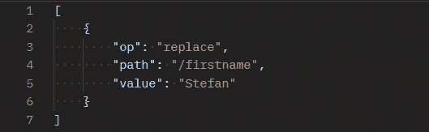
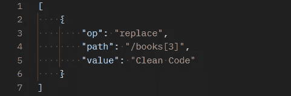
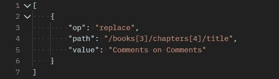

# 在 C#中部分更新对象

> 原文：<https://levelup.gitconnected.com/updating-objects-partially-in-c-2621927d5865>


在 [Unsplash](https://unsplash.com?utm_source=medium&utm_medium=referral) 上由 [Max Duzij](https://unsplash.com/@max_duz?utm_source=medium&utm_medium=referral) 拍照

我用反射写了自己的 Update Partial 机制，但是后来发现了 JsonPatch。如果您正在使用 Web APIs，并且还不知道 JsonPatch，那么您必须阅读这篇文章。

如果你对反射和我们如何加速反射感兴趣，我建议你也阅读文章的第一部分，这也是理解部分更新对象的标准化方法的需要的一个很好的开端。

# UpdatePartial

对我来说很明显，部分更新对象并不是某些对象所独有的，而是应该是通用的，这样它就可以被每个对象重用。这就是为什么我选择使用反射——在运行时动态地检索和设置对象的属性值，而不用对属性进行硬编码。但是因为众所周知反射很慢，所以我做了一个快速反射助手，它将一个 *PropertyInfo* 的 *GetMethod* 和 *SetMethod* 转换成一个委托，然后将它存储到一个静态类变量中。这意味着反射仅在第一次运行时较慢，而在下一次运行时几乎与没有反射的更新一样快，因为委托被缓存了。

# 履行

下面显示的接口用于检索属性的 get/set 委托。注意，需要模式匹配开关来指定类型，因为在调用方法调用时，泛型类型必须是硬编码的。这也是这种方法的一大缺点，因为每当为某个对象实现 *UpdatePartial* 方法时，它的所有属性类型都必须在模式匹配开关中。

静态类快速反射实现 UpdatePartial 方法，并使用 IPropertyDelegateService 创建包含所有属性更新的字典。

一个 *PropertyMode* (Include，Exclude)用于指定是更新字典中的条目，还是更新除字典中的属性之外的对象的所有属性。

这些是 *UpdatePartial* 方法的基础。要实际使用它，需要创建一个*IPropertyDelegateService*的具体实现。原则上，所有必要的方法都已经在接口中实现，但是如果需要更新的对象具有特殊类型，则必须扩展模式匹配开关，如下所示，以包括类型(在本例中为 *CustomClass* ):

现在唯一剩下的是一个在静态变量中存储属性委托的类。因为从业务角度来看，这一切都是非常低级的，所以我创建了一个 *CustomClassHelper* ，它作为一个包装器来隐藏混乱的细节。

# 优点:

*   相当普通
*   几乎与不使用反射一样快

# 缺点:

*   自定义类型必须扩展
*   嵌套对象不能部分更新
*   复杂的

尽管我为自己能让这个庞然大物正常工作感到非常自豪，但我很快得出结论，有效而复杂的代码并不好，因为我的同事不深入研究就无法理解这个解决方案。到目前为止，对于几乎总是需要扩展的自定义类型模式匹配来说，它不是自解释的，也不是直观的。几个星期后，我收到一个请求，要求部分更新 *CustomClass* 中的对象，老实说，我不知道如何扩展这个东西来完成这个任务。我也不想过多地接触它，因为与此同时，我已经忘记了实现的细节，而我自己，这个东西的创造者，也很难理解它。

很快我发现我必须扔掉它。它根本不可维护，与其花太多时间去适应它，不如寻找一个新的解决方案。这一次，它应该被标准化。一些我不必亲自去做的事。事实上，我很快就找到了有史以来最好的解决方案。

# JsonPatch

在 REST 中，PUT 和 PATCH 的关键区别在于，PUT 对一个对象进行完整的更新，这意味着一个对象的实例被一个新的实例完全替换。另一方面，补丁只指定了应该更新/添加/删除的对象的几个属性。这听起来和我以前实现的 *UpdatePartial* 非常相似，但是不同之处在于补丁是软件工程领域的一种标准化方法。

每当通过 json 以 restful 方式进行部分更新时，json 字符串应该如下所示:



# 操作:

*   替换
*   增加
*   去除
*   复制
*   移动

该路径指定应该更新的属性。它的构建类似于文件路径，也有斜杠，通过斜杠可以指定嵌套对象的属性。

例如，您可以使用此路径替换列表中的第四个元素，如下所示:



或者，您可以深入嵌套对象，只更新属性，而不更改整个嵌套对象，如下所示:



你看，用 PATCH 做复杂的事情非常简单，但是你如何构造这些操作呢？自己动手会很乏味，但幸运的是，ASP.Net 核心提供了开箱即用的解决方案。

# JsonPatchDocument

*JsonPatchDocument* 通过调用自身的方法(Replace、Add、Remove……)并向每个方法传递一个*表达式< Func < CustomClass，TProp > >* 和新值，让您非常方便地构建操作。最后，您可以简单地使用 JsonConvert 将其序列化为一个 json 字符串，看起来就像上面的图片之一。我编写了一个名为 *Serialize* 的扩展方法，它将旧的和修改后的 *CustomClass* 作为参数，构建 *JsonPatchDocument* ，并将序列化后的对象作为字符串返回，因为我必须向微服务发送 restful 补丁请求。这个微服务有一个补丁端点，它接收用于更新实体的*JsonPatchDocument<custom class>*。

与 *UpdatePartial* 相比，这要简单得多，因为我们不必担心自定义类型和实现助手服务。

为了实际进行部分更新，您可以使用 *applyTo* 方法，该方法获取一个对象并将存储在 *JsonPatchDocument* 中的所有操作应用于该对象。

```
patch.applyTo(customClassInstance);
```

# 优点:

*   简单的
*   标准化的
*   一般的

# 缺点:

*   没有人

# 结论

通过这次旅程，我不仅了解到 JsonPatch 非常棒，应该更频繁地使用，而且还了解到好的代码简单可靠。

从现在开始，每当我觉得自己在写复杂的代码时，我会看到一个危险信号，并寻找一种更简单的方法。大多数时候，你或我遇到的问题并不是唯一的，可能有人已经找到了解决方案，有时社区甚至已经同意将这些解决方案标准化。