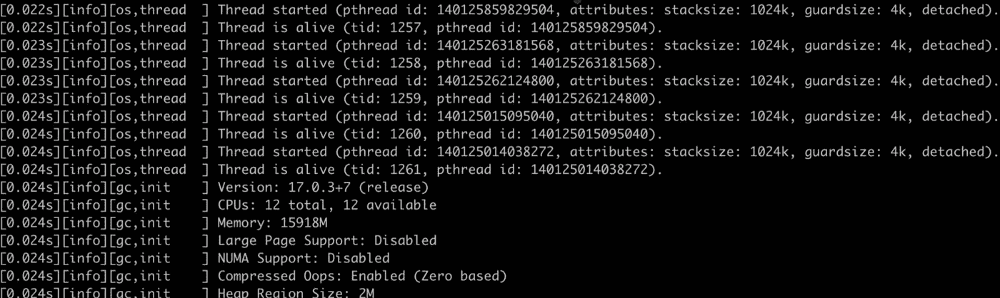

# 将 Java8 升级到 Java17

> 原文：<https://levelup.gitconnected.com/upgrade-java8-to-java17-every-java-developer-should-know-43358b30532a>


照片由 [Clément Hélardot](https://unsplash.com/@clemhlrdt?utm_source=medium&utm_medium=referral) 在 [Unsplash](https://unsplash.com?utm_source=medium&utm_medium=referral) 上拍摄

我正在从 Java8 迁移到 Java17。前期做了一些准备。过程中的一些信息记录如下。

# 1.编译相关

## 1.1 给 320

在 Java11 中，引入了一个提案 JEP 320: [移除 Java EE 和 CORBA 模块](http://openjdk.org/jeps/320)提案，该提案移除了 Java EE 和 CORBA 的模块，如果在项目中使用需要手动引入。例如，下面的`javax.annotation.*`:

在编译时将找不到相关的类。这是因为 Java EE `Java 9`在 Java 11 中已经被标记为弃用，在 Java 11 中正式移除，javax 包可以手动导入:

```
<dependency>
    <groupId>javax.annotation</groupId>
    <artifactId>javax.annotation-api</artifactId>
    <version>1.3.2</version>
</dependency>
```

## 1.2 使用 sun.misc.*下的软件包

例如，`sun.misc.BASE64Encoder`，这个很简单，只是替换工具类。

```
[ERROR]   symbol:   class BASE64Encoder
[ERROR]   location: package sun.misc
```

netty 的较低版本使用 sun.misc.*，编译错误信息如下

```
Caused by: java.lang.Nthe oClassDefFoundError: Could not initialize class io.netty.util.internal.PlatformDependent0 at io.netty.util.internal.PlatformDependent.getSystemClassLoader(PlatformDependent.java:694) ~[netty-all-4.0.42.Final.jar!/:4.0.42.Final]
```

对应的源代码如下:

```
/**
 * The {**@link** PlatformDependent} operations which requires access to {**@code** sun.misc.*}.
 */
final class PlatformDependent0 {
}
```

## 1.3 Lombok 使用 com.sun.tools.javac 下的软件包*

错误消息如下所示:

如果你在项目中使用`Lombok`，而且是低配版，就会出现。`Lombok`的原理是在编译期间做一些小技巧，使用下面的文件`com.sun.tools.javac`，升级到最新版本解决。

```
<dependency>
    <groupId>org.projectlombok</groupId>
    <artifactId>lombok</artifactId>
   <!-- <version>1.16.4</version>-->
    <version>1.18.24</version>
</dependency>
```

## 1.4 Kotlin 版本限制

我们的后端多年来一直是全功能的 Kotlin，Kotlin 升级也是我们的首要任务。

```
[ERROR] Failed to execute goal org.jetbrains.kotlin:kotlin-maven-plugin:1.2.71:compile (compile) on project encloud-core: Compilation failure [ERROR] Unknown JVM target version: 17 [ERROR] Supported versions: 1.6, 1.8
```

Kotlin 在 1.6.0 版本开始支持 Java17 字节码，1.6.0 以下的编译会直接报错

## 1.5 不赞成使用的依赖关系分析

可以使用`jdeps --jdk-internals --multi-release 17 --class-path . encloud-api.jar`进行项目依赖分析


这样你就知道哪些库需要升级了。

# 2.参数迁移

## 2.1 什么是统一日志记录

在 Java 领域，有比较知名的 log 框架，slf4j，log4j 等。这些框架提供了统一的编程接口，允许用户通过简单的配置实现日志输出的个性化配置，比如日志标签、级别、上下文(线程 id、行号、时间)，JVM 内部一直缺乏这样的规范，于是统一日志应运而生，实现了日志格式的统一。

我们接触最多的是 gc 日志。在 java8 中，我们配置 gc 日志的参数是`-Xloggc:/tmp/gc.log`。除了 GC，JVM 中还有大量其他相关的日志，比如线程、os 等。在新的统一日志中，日志输出的方式发生了变化`java -Xlog:xxx`，GC 不再是特殊的，只是日志的一种存在形式。

```
java -Xlog -version
```

输出如下所示:



您可以看到，在日志输出中，不仅有 GC 相关的日志，还有 os 线程相关的信息。其实 java log 的生产者有很多部分，比如线程、类加载、卸载、safepoint、cds 等等。


归根结底，日志打印需要明确回答三个问题:

1.  输出什么信息(标签)，输出什么日志级别(级别)。
2.  输出的位置(控制台或文件)。
3.  如何记录？

## 2.2 输出什么信息(选择器)

首先看什么部分，如何指定输出哪些信息，这在 JVM 内部叫做选择器。

JVM 使用`<tag-set>=<level>`的形式来表示选择器。默认情况下，tag 为`all`，表示所有 tag，level 为`INFO`，相当于下面形式的`java -Xlog -version`

```
java -Xlog:all=info -version
```

如果我们想输出标记为 gc、日志级别为 debug 的日志，我们可以使用`java -Xlog:gc=debug`格式:

这样就输出了标签为 gc，级别为 debug 的日志信息。

但是，这里有个坑点。这里的标签匹配规则是精确匹配。如果一个日志的标签`gc,metaspace`不符合上述规则，我们可以手动输出。

当然，这样做很麻烦。JVM 提供通配符`*`来解决精确匹配的问题。例如，如果我们想要标记为 gc 的所有日志，我们可以写:

如果您只想要信息级别的日志，您可以使用`java -Xlog:gc* -version`。

如果想知道哪些个性化标签可用，可以使用`java -Xlog:help`查找所有可用标签。

## 2.3 向何处输出(Output)

默认情况下，日志将输出到 stdout，JVM 支持以下三种输出方法:

*   标准输出
*   标准错误
*   文件

一般来说，我们会将日志输出到一个文件中，以供进一步分析。

```
-Xlog:all=debug:file=/path_to_logs/app.log
```

还可以指定原木切割的尺寸和方式

```
-Xlog:gc*:file=/path_to_logs/app.log:filesize=104857600,filecount=5
```

## 2.4 原木装饰工

除了正常信息之外，每个日志都有很多与日志相关的上下文信息，这些信息在 JVM 中被调用，`decorators`并有以下选项。

输出格式如下:

```
-Xlog:[selectors]:[output]:[decorators][:output-options]
```

*   选择器是多个标签和级别的组合，起什么(过滤器)的作用。格式为`tag1[+tag2...][*][=level][,...]`
*   装饰者是与日志相关的描述信息，也可以理解为上下文
*   输出是一个与输出相关的选项。一般我们会配置成输出到一个文件，根据文件大小进行剪切。

这里补充一个知识点，默认值:

*   **标签**:全部
*   **级别**:信息
*   **输出** :stdout
*   装饰者:正常运行时间，等级，标签

## 2.6 GC 参数迁移

可以看到 Xlog 下已经收集了 GC 相关的参数，Java8 下很多之前的参数都被移除或者标记为过期。

例如`PrintGCDetails`已经被`-Xlog:gc*`替换为:

标记为不推荐使用的常见参数有`-XX:+PrintGC`和`-Xloggc:<filepath>`。

此外，大量的 GC 参数被移除，比如常用参数`-XX:+PrintTenuringDistribution`，Java17 会拒绝启动。

```
java -XX:+PrintTenuringDistribution -version
Unrecognized VM option 'PrintTenuringDistribution'
Error: Could not create the Java Virtual Machine.
Error: A fatal exception has occurred. Program will exit.
```

更详细的删除参数如下

这些被删除的参数中的大部分可以在新的日志系统中找到。例如，`PrintHeapAtGC`这个参数可以用`-Xlog:gc+heap=debug`来替换。

看这部分源代码的变化就知道是这样的。在 Java8 中，`PSYoungGen::resize_spaces`代码如下:


在 Java17 中，日志打印的这一部分被 gc+ergo 的标记 log 所取代:


世代 GC `-XX:+PrintTenuringDistribution`中还有一个非常有用的参数，现在`gc+age=trace`被取代。

## 2.7 参数迁移示例

变更后:

**推荐配置**

# 3.运行相关

## 3.1 反射+私有 API 调用伤害

在 Java 8 中，没有人能阻止你访问特定的包，比如 sun.misc，反射也没有限制，只要 setAccessible(true)就可以了。Java 9 模块化后，一切都变了，`--add-exports`和`--add-opens`模块封装只能被突破和

*   `--add-opens`导出特定的包
*   `--add-opens`允许类路径深度反射访问模块中的特定包

## 3.2 关于 GC 算法的选择

CMS 正式退出历史舞台，G1 正式接手，ZGC 蓄势待发。就 GC 算法的选择而言，G1 仍然是目前最好的选择。由于 ZGC 的内存使用量被 OS 占用过高(是共享内存的三倍)的问题，进程可能会被 OOM-killer 杀死。

## 3.3 ZGC 三重分辨率内存

ZGC 的底层使用了一种叫做彩色指针的技术，它使用三种视图(Marked0、Marked1 和 map)来映射到同一个共享内存区域。原理如下:

你可以想象三个存储区域 p1、p2 和 p3 是 ZGC 的三个视图。

但在 Linux 统计中，虽然是共享内存，但还是会被统计三次，比如 RES。

同样的应用，用 G1 RES 显示占用 2G，ZGC 显示占用 6G

```
java -XX:+AlwaysPreTouch -Xms2G -Xmx2G -XX:+UseZGC MyTest
java -XX:+AlwaysPreTouch -Xms2G -Xmx2G -XX:+UseG1GC MyTest 
```


我们下面讨论的是与 G1 有关的。

## 3.4 不配置年轻一代的规模

这在《JVM G1 源代码分析和调优》一书中有详细描述，主要有两个原因:

*   G1 对内存的管理是不连续的，重新分配一个分区的成本非常低。
*   G1 需要根据目标暂停时间动态调整收集的分区数量。如果新一代的尺寸无法调整，那么 G1 可能无法满足暂停时间的要求。

如`-Xmn, -XX:NewSize, -XX:MaxNewSize, -XX:SurvivorRatio`不出现在 G1，只需要控制最大最小堆和目标暂停时间。

## 3.5 将`-XX:InitiatingHeapOccupancyPercent`调整到合适的值

IHOP 的默认值是 45。该值是开始并发标记的先决条件。在老一代中，并发标记任务将仅在总存储器堆栈空间的 45%之后开始。

增加这个值:并发标记可能需要更多的时间，同时 YGC 和 Mixed-GC 收集时的分区数量会减少，可以根据整体应用占用的平均内存来设置。

# 最后

**感谢阅读**。期待您的关注，阅读更多高质量的文章。


[omgzui](https://medium.com/@omgzui?source=post_page-----43358b30532a--------------------------------)

## 更好的编程

[View list](https://medium.com/@omgzui/list/better-programing-9b4c9bb174aa?source=post_page-----43358b30532a--------------------------------)108 stories

[omgzui](https://medium.com/@omgzui?source=post_page-----43358b30532a--------------------------------)

## Java 语言(一种计算机语言，尤用于创建网站)

[View list](https://medium.com/@omgzui/list/java-e7c93884d94b?source=post_page-----43358b30532a--------------------------------)55 stories

[omgzui](https://medium.com/@omgzui?source=post_page-----43358b30532a--------------------------------)

## 新闻

[View list](https://medium.com/@omgzui/list/news-67ec0a972660?source=post_page-----43358b30532a--------------------------------)23 stories