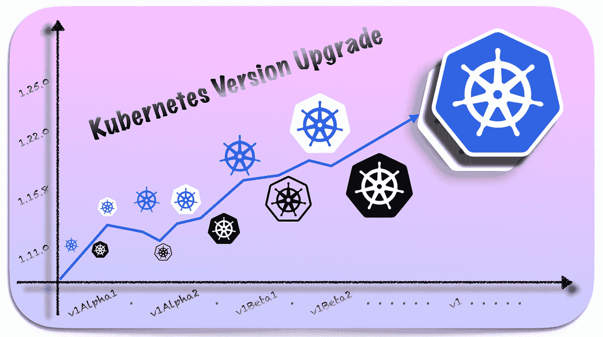
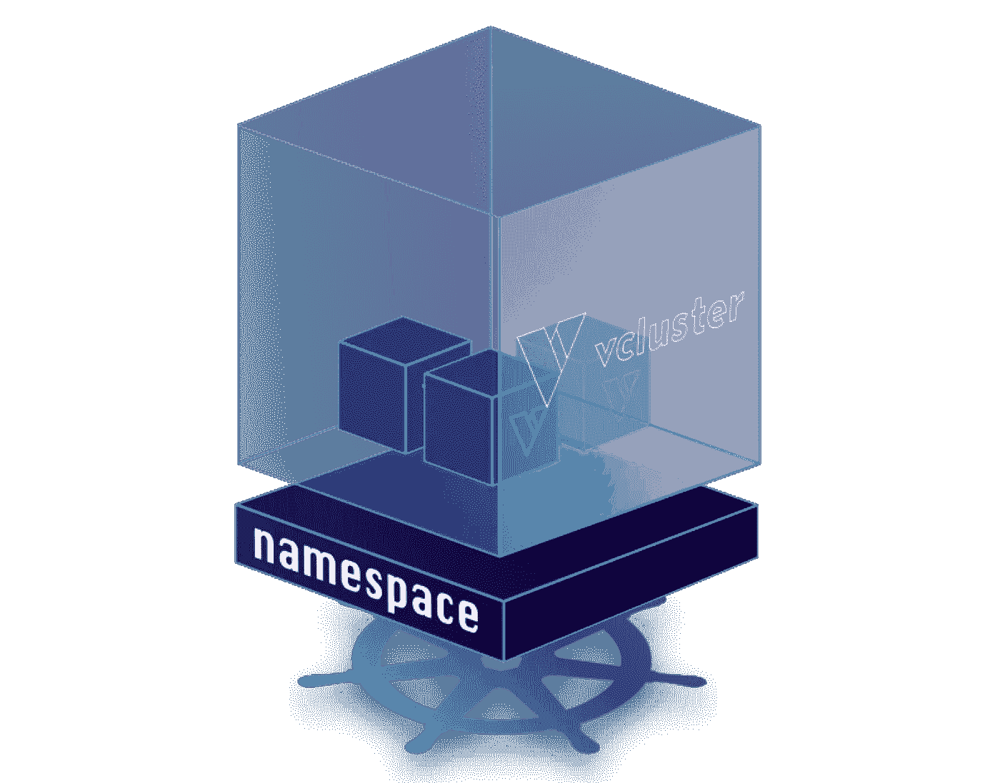
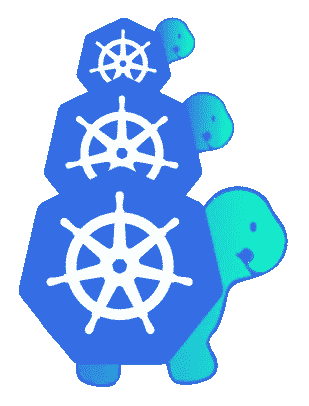
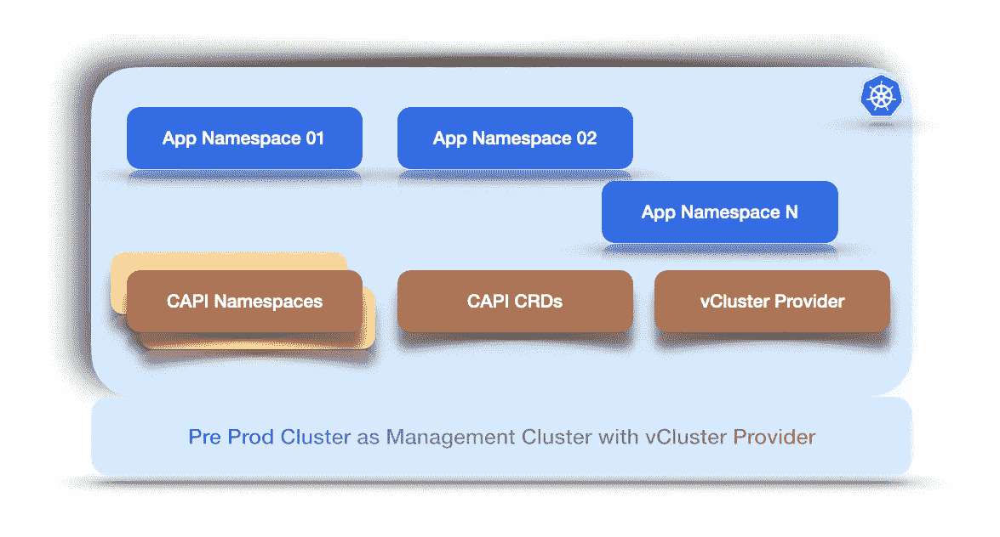

# 升级 Kubernetes 集群

> 原文：<https://levelup.gitconnected.com/upgrading-kubernetes-clusters-1ac91343a3da>

## 尽职调查以避免 API 被弃用/删除

升级 Kubernetes 集群版本

在上一篇文章[升级您的 Kubernetes 集群而不影响您的开发人员](https://faun.pub/upgrade-your-kubernetes-cluster-without-upsetting-your-developers-e7d8559dee49)中，我们推导出了针对 Kubernetes 目标版本部署的对象列表，这些对象针对的是过时的 API 和即将删除的 API。我们还识别和聚合了命名空间范围和集群范围的对象。

现在，作为平台工程师，我们有责任维护最新和稳定版本的集群。这消除了技术债务的风险，并提供了所有 API 的最新和最好的特性。尽管有很多更流畅的技术和策略来升级任何规模的 Kubernetes 集群，但我们不能直接升级集群。因为存在破坏集群中运行的应用程序/服务的风险。

也就是说，我们需要从应用程序团队那里得到许可，即他们的应用程序/服务的所有清单都根据 Kubernetes 的新版本进行了验证，并按预期工作，或者可能目标版本所需的对清单的必要更改已经完成，它们都为升级做好了准备。

这样做太容易了。由于从这个 [API 弃用助手](https://github.com/gkarthiks/argo-apid-helper)工具中，我们知道了针对目标 Kubernetes 版本的弃用和/或删除的 API 部署的对象，我们可以要求团队自己验证清单。然后我们可以升级集群。但是有一个共同的问题:*人为错误*。当要求团队验证他们自己时，不能保证他们都将验证完美的语义目标版本。团队可能会在本地运行 *minikube* 、 *kind* 和 *k3s* 集群，并根据他们运行本地集群的版本进行验证。贪婪的用户可能会验证最新版本的 Kubernetes 这可能缺少*向后兼容性*。

这意味着负责集群升级的团队应该控制应用程序团队正在验证的 Kubernetes 集群的目标语义版本。这使得我们需要创建一个新的集群，并使用目标版本来验证应用程序团队的清单。但是仅仅为了验证清单而创建一个集群将是一个非常昂贵的过程。不仅包括资源成本，还包括配置基础架构、连接以及在验证完成后拆除基础架构的成本。

所以我们的要求和我们想要达到的目标状态如下。

*   使用集中控制的目标版本调配新集群或多个新集群
*   尽可能降低成本因素
*   用 GitOps 引擎钩住新集群
*   要求应用程序团队在生产前针对新群集及其现有生产前环境进行 alpha-beta 部署

将新集群与 GitOps 引擎挂钩的好处是，我们得到了应用程序团队的认可，根据他们拥有的清单来验证目标 Kubernetes 版本 APIs 由于应用程序团队不需要花费时间进行验证，他们可以进行 alpha-beta 部署，而不必浪费时间部署到具有最新版本 API 的新集群。

# 缝合工具

平台工程或基础设施工程最吸引人的事情之一是通过自动化将不可能变为可能。为了实现上述任务并达到目标状态，即从应用程序团队处获得集群升级的“许可”,我们将把一些工具组合在一起，使其变得有价值。我们将逐一查看实现这一目标的需求、工具和步骤。

## 设置新的集群

正如我们已经讨论过的那样，创建一个新的集群需要一个专用的集群，这将是非常昂贵的。因此，为了尽量减少这种情况，我们将使用 Kubernetes 中的***Kubernetes***方法。

为此，我们将结合使用以下开源工具。

[***vCluster***](https://www.vcluster.com/) 是一个虚拟的 Kubernetes 集群，运行在常规的 Kubernetes 名称空间内。在调度工作负载时，vCluster 有一个*同步程序*，它将调度提交给实际的主机集群。

部署在实际 Kubernetes 集群的命名空间中的 vClusters

虽然有很大的资源利用率，但相比之下成本大大降低。此外，我们可以为每个团队部署集群，以缩短验证时间。部署 vCluster 本身是一个简单的过程。它带有详细的[舵图](https://github.com/loft-sh/vcluster/tree/main/charts)用于安装。但是如果我们不把它自动化，那将会多么有趣。

[***Kubernetes 集群 API***](https://cluster-api.sigs.k8s.io/introduction.html#kubernetes-cluster-apidiv-stylefloat-right-position-relative-display-inlineimg-srcimagesintroductionsvg-width160px-div)*是一个 Kubernetes 子项目，主要提供声明性 API 和工具来简化多个 Kubernetes 集群的供应、升级和操作。*

**

*Kubernetes 集群 API 提供程序*

*幸运的是，CAPI(集群 API)允许通过修改 [*clusterctl*](https://cluster-api.sigs.k8s.io/clusterctl/configuration.html) 配置来添加自定义提供程序，并且 vCluster 也有一个集群 API 提供程序，可以在[这里](https://github.com/loft-sh/cluster-api-provider-vcluster)找到。*

> *尽管在撰写本文时值得注意的是，vCluster CAPI 提供程序只能在运行 vCluster 提供程序的集群中托管 vCluster。*

*现在，按照 vCluster 提供者[这里](https://github.com/loft-sh/cluster-api-provider-vcluster#installation-instructions)和 CAPI [这里](https://cluster-api.sigs.k8s.io/user/quick-start.html#installation)的安装文档，指定一个*管理集群；*在这种情况下，这将是我们的生产前群集。现在部署 vCluster 提供程序。至此，我们已经拥有了将虚拟群集部署到生产前群集所需的所有基础架构组件，如下所示。*

**

*生产前群集，也称为群集 ctl 配置的管理群集*

*只需应用*集群模板* [清单](https://github.com/loft-sh/cluster-api-provider-vcluster/blob/main/templates/cluster-template.yaml)就可以在我们的生产前环境中配置一个虚拟集群。但是让我们把它模板化，包装成一个舵图。所以现在我们有了一个掌舵图，它是为 *Kubernetes 版本*和*集群名称*模板化的，比如[这个](https://github.com/gkarthiks/capi-vcluster-argo-chart) *。现在，我们所要做的就是将这个图表库连接到 ArgoCD，每当我们需要 Kubernetes 虚拟集群时，我们只需应用 ArgoCD 的应用程序/应用程序集清单。那会起作用的。**

> *注意:确保获得正确的 vCluster 控制平面 URL 那就是 <vcluster name="">.vcluster.svc.local</vcluster>*

*因此，我们已经为新集群配置了一个在我们控制范围内的目标版本。通过以虚拟方式调配新集群，*理论上，*这让我们实现了“零成本”复选框，尽管再次值得重复工作负载仍在主机集群上进行调度，从而导致资源消耗。*

## *用 GitOps 引擎挂接新集群*

*现在我们有了新的集群，我们需要它们与 GitOps 引擎挂钩。*

**

*ArgoCD，一个基于拉的 GitOps 引擎*

*我更喜欢它是 ArgoCD。它可以是任何 GitOps 引擎。要在 ArgoCD 中这样做，您必须拥有在目标集群中创建服务帐户的权限，我们拥有这种权限。运行以下命令将它们添加到 ArgoCD*

> *`argocd cluster add <cluster-name>`*

*既然我们已经将 vClusters 添加为 ArgoCD 中部署的目标集群之一，应用程序团队也应该能够对这个新目标进行一些 alpha-beta 部署。*

*一旦应用程序团队完成了对新的目标 Kubernetes 版本的验证(这应该不会花太多时间)，我们就必须让这个集群退役。这变得很容易，因为这些集群是通过 GitOps 引擎创建的，一旦 argocd 应用程序被删除，argocd 就会删除这些虚拟集群。但是还有一个额外的步骤要做，即从 ArgoCD 中删除那些虚拟集群的地址作为目标之一。为此，使用用于注册目标集群的名称运行以下命令。*

> *`*argocd cluster rm <cluster-name>*`*

## *升级集群*

*既然我们已经完成了尽职调查并获得了应用程序团队的批准，我们就可以安全地升级 Kubernetes 集群并避免 API 弃用和/或移除问题。*

*升级快乐！*

*如果你喜欢这篇文章，通过鼓掌帮助其他人找到它，并在这里和 [Twitter](https://twitter.com/gkarthics) 上关注我以获取更多更新。*

# *参考资料:*

*   *[Kubernetes 弃用助手](https://github.com/gkarthiks/argo-apid-helper/)*
*   *[K8s 弃用指南](https://kubernetes.io/docs/reference/using-api/deprecation-guide/)*
*   *[K8s 集群 API](https://cluster-api.sigs.k8s.io/introduction.html)*
*   *[ClusterCTL CLI](https://cluster-api.sigs.k8s.io/clusterctl/configuration.html)*
*   *[CAPI vCluster 提供商](https://github.com/loft-sh/cluster-api-provider-vcluster)*
*   *[ArgoCD 文档](https://argo-cd.readthedocs.io/en/stable/)*
*   *[vCluster](https://www.vcluster.com/)*
*   *[https://github.com/gkarthiks/capi-vcluster-argo-chart](https://github.com/gkarthiks/capi-vcluster-argo-chart)*