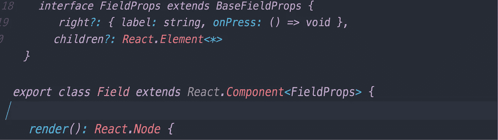
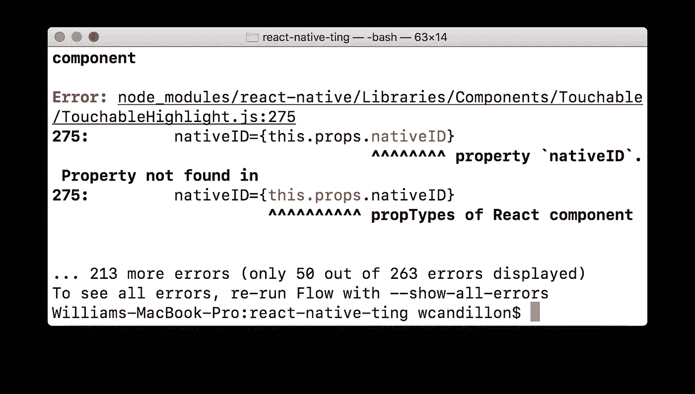
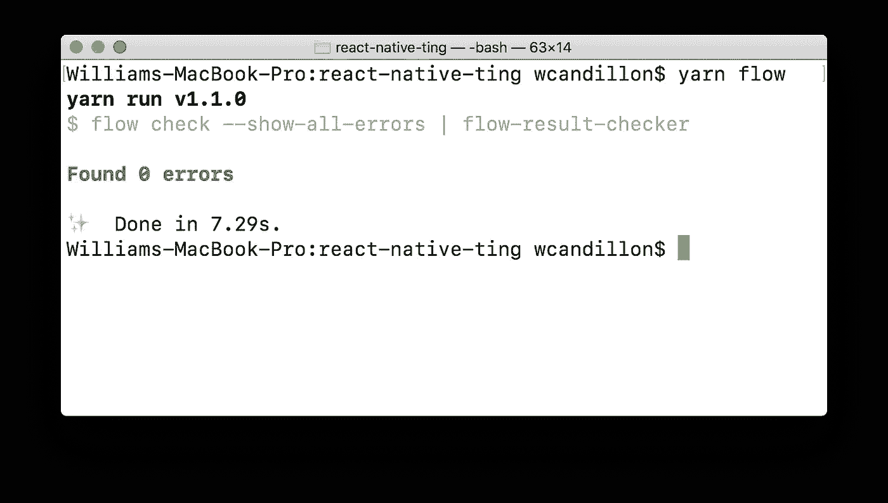

# 将 React & React Native 升级到 Flow 0.53.0 及更高版本

> 原文：<https://levelup.gitconnected.com/upgrading-to-flow-0-53-0-and-beyond-e8ce2e6e16b8>



在过去的 24 小时里，我对[流](https://flow.org/)的感情从沮丧到喜欢。显然，我并不孤单。如果你正经历着和我们一样的过山车，下面的几点可能会对你有所帮助。

我开始[为 React Native](https://react-native.shop) 构建一个新的高级入门套件。当我使用`$Diff`偶然发现一个 bug 时，这个项目最初是基于 Flow 0.49.0 的。多亏了 Flow sandbox，可以很容易地确认在最新版本的 Flow 中修复了这个 bug。所以我决定升级。会有多难呢？

## 第一步:流量升级

Flow 0.53.0 中的 React 支持有了显著的改进，正如在 [Flow 团队的文章](https://medium.com/flow-type/even-better-support-for-react-in-flow-25b0a3485627)中所描述的，有一个实用工具可以自动迁移您的代码库:`flow-upgrade`。

```
yarn create flow-upgrade
```

这个命令负责自动升级我的代码库。之后，需要进行一些小的手工修改。[关于其对 React](https://flow.org/en/docs/react) 的支持的流文档是一个必须阅读的资源。例如，为了访问[新的实用程序类型](https://flow.org/en/docs/react/types)，比如`React.Node`，以`import React from "react"`的形式编写的导入需要重写到`import * as React from "react"`。还需要使用类型为的接口而不是来迁移定义为[的组件属性。](https://github.com/facebook/flow/issues/5267)

## 第二步:流程结果检查器

当运行 0.53.0 及以上版本的 flow 时，您会注意到很多节点模块会抛出类型错误。它们没有通过类型检查器的原因有很多。例如，它们可能是使用您正在使用的旧版本的 flow 编写的。您不必对这些错误负责，但是您不能在您的流配置文件中简单地忽略它们。



你不负责的打字错误

有两个软件包可以过滤来自`node_modules` : [流结果检查器](https://github.com/jbreckel/flow-result-checker)和[流错误抑制器](https://github.com/Palisand/flow-error-suppressor)的流错误。虽然后来的包稍微轻量级一些，但我最终还是使用了`flow-result-checker`,因为用于运行`flow-error-suppressor`的命令只能在 MacOSX 上运行。



使用流结果检查器进行类型检查

在我的项目中升级 flow 时，我相当沮丧。但是现在我非常喜欢心流。升级带来的好处超出了我的预期。

我是 TypeScript 的狂热用户，我在 React web 项目中使用它，这要感谢它在 [create-react-app](https://github.com/wmonk/create-react-app-typescript) 中的巨大支持。对于 React Native，我使用 flow，因为在 [create-react-native-app](https://github.com/react-community/create-react-native-app) 中没有很好的 TypeScript 集成。现在，我也在认真考虑将 flow 用于 React web 项目。我还迁移到了 Atom IDE，发现它对的支持相当不错。看起来心流的未来非常光明。

你也开始喜欢“心流”了吗？你还相当怀疑吗？让我知道你的想法。

对使用 Flow 构建的高级 React 本地初学者工具包感兴趣吗？结账[这个环节](https://react-native.shop/)。