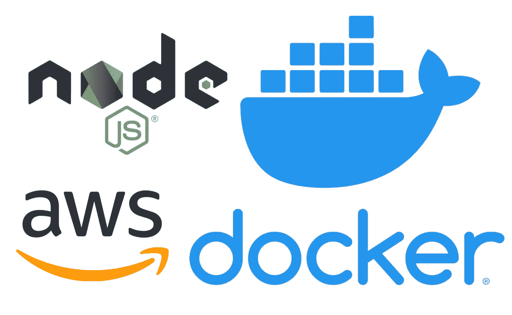
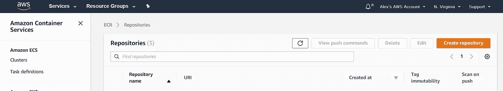
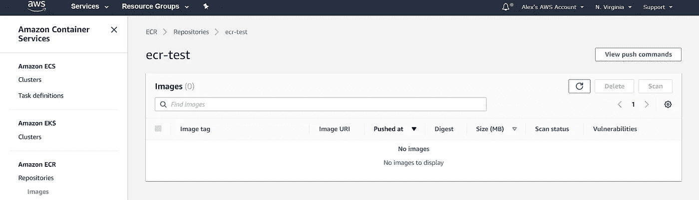
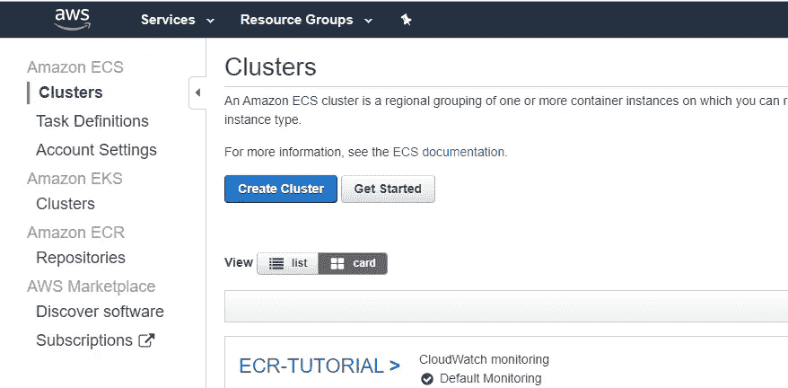
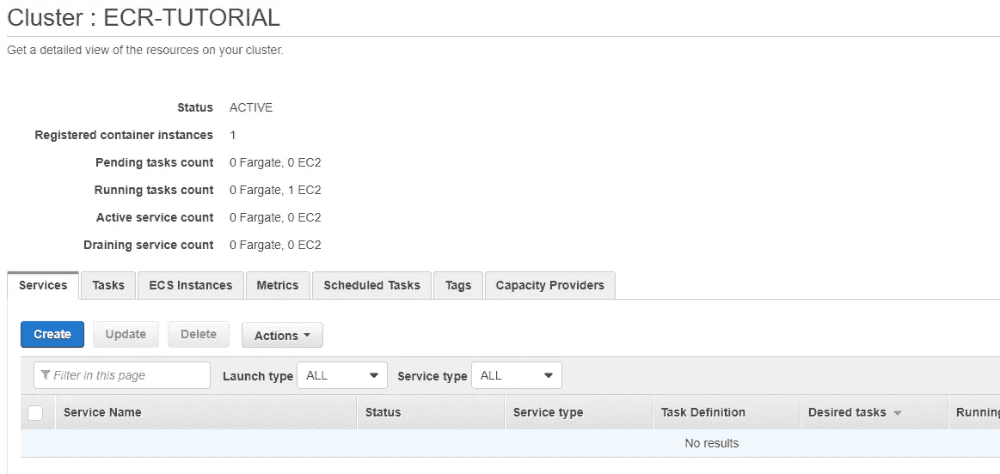
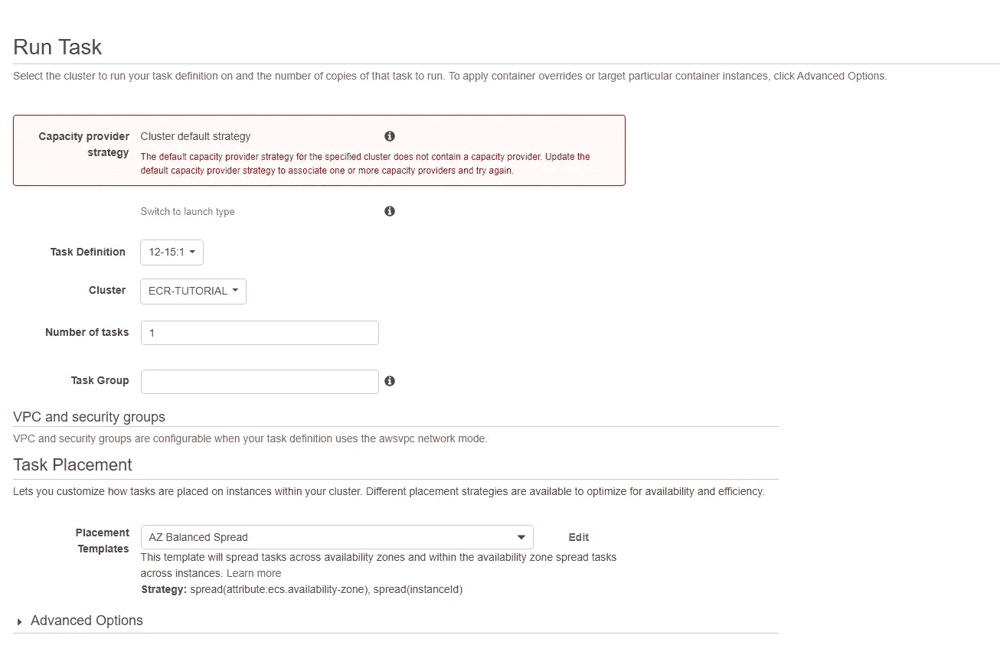

# 将 Docker 映像上传到弹性容器存储库，并使用弹性容器服务进行部署

> 原文：<https://levelup.gitconnected.com/upload-a-docker-image-to-aws-elastic-container-repository-and-deploy-with-aws-elastic-container-5be9ad222413>



本文将演示如何将 docker 映像上传到 AWS 弹性容器库，并使用带有 Fargate 的 AWS 弹性容器服务集群部署该映像。这是两部分教程的第二部分，旨在强调 ECS 和 ECR 的基本功能，以及它们如何帮助简化您的容器 CI/CD 管道。第 1 部分“将一个节点应用程序连接到一个 RDS 实例并用 Docker 进行容器化”可以在 [*这里*](https://medium.com/@alexanderegiannini/connect-a-node-application-to-an-rds-instance-and-containerize-with-docker-4af1911bd998) *找到。*

# 步骤 1:创建 Amazon ECR 实例并上传 Docker 映像

导航到 ECR 控制台并创建新的存储库。由于我们只处理一个图像，因此为存储库指定与图像相同的名称，并单击“创建存储库”。



将存储库命名为与您正在构建的容器相同的名称。对我来说是的，ecr-test。选择默认值，创建存储库，然后进入存储库页面。然后，点击“查看推送命令”(右上角)。



这将为您提供一组四个命令。第一个让您登录到 ECR。第二步是在您的机器上构建映像。第三个标记上传的图像。第四个上传图像。如果已经构建了映像，只需要运行第一个、第三个和第四个。

*注意:为此，您需要使用具有正确权限的用户登录 AWS CLI。如果需要，参见[第 1 部分](https://medium.com/@alexanderegiannini/connect-a-node-application-to-an-rds-instance-and-containerize-with-docker-4af1911bd998)了解如何操作。

检查存储库以确保图像已经上传。现在，任何拥有 IAM 帐户并拥有适当权限的人都可以访问 docker 映像，这意味着团队可以在容器上工作。通过从 ECR 包中获取存储库 URI 并运行以下命令，确保“拉”功能正常工作:

```
docker pull $ECR_URI
```

*注意:您必须“登录”到 ECR。这是在推送过程的第一步中完成的，但是根据已经过去的时间，您可能需要再次执行:

```
$(aws ecr get-login — no-include-email — region us-east-1)
```

# **步骤 2:创建一个 Amazon ECS 集群**

ECS 集群是一个集中的位置，在这里可以部署具有特定设置的容器。集群使用“任务”来部署 docker 容器，并允许内部容器网络自动扩展和负载平衡。下一步是创建集群和任务，然后在集群中运行任务。

要创建集群，请单击右上角的“集群”,然后单击左上角的“创建集群”,并选择 EC2 Linux +网络。



现在给你的集群命名。选择“按需实例”和一个实例类型(我为这个项目推荐 t3a.medium，因为 nano 有时太小，无法运行任务)。选择 1 个实例，并创建或使用 ssh 密钥，以便可以直接访问集群。

现在，选择默认的 VPC 和一个子网(对我来说是 us-east-1a)。最后，选择一个安全组。确保安全组对您的特定 docker 容器(即 20/80/3000 等)。

单击创建。需要几秒钟才能生成。完成后，单击查看集群。



您的群集将有各种选项卡，包括服务任务、ECS 实例、指标、计划任务、标记和容量提供者。

创建后，集群将开始使用“创建集群对话”中提供的详细信息初始化 EC2 实例。这是容器将被部署的地方。通过选择“ECS instance”选项卡，然后单击 ec2 实例 ID，确认这正在发生。

# 步骤 3:创建 ECS 任务

现在已经创建了 EC2 实例，集群需要一个任务来部署容器。任务为 ECS 提供了如何部署容器的详细信息。本教程将创建一个基本任务来运行第 1 部分中构建的容器。您可能希望根据您的使用情况进行修改。

要创建任务定义，请单击最左侧的任务定义选项卡，然后单击创建新任务定义按钮。


接下来，选择 EC2，为任务定义命名，并输入以下内容:

```
task role: NoneNetwork Mode: BridgeTask Execution Role: NoneTask Memory: 1 gbTask CPU: 128
```

现在，单击添加容器。您可以在这里输入将要部署的容器的详细信息。给它一个名字，和存储库 URI(这可以通过点击最左边的 ECR 选项卡找到，并复制应用程序映像的存储库 URI)。接下来，将内存限制设置为硬限制 128，并识别您的端口所开放的容器。如果您的 following 来自 [part1](https://medium.com/@alexanderegiannini/connect-a-node-application-to-an-rds-instance-and-containerize-with-docker-4af1911bd998) ，它应该是 3000，看起来如下:

```
host port: 80container port: 3000protocol: TCP
```

最后，添加实例(使用所有默认值)并创建任务(使用所有默认值)。现在任务已创建，请返回到您的群集并选择“tasks”选项卡，然后选择“run new task”。它将带您进入以下内容:



点击“切换到启动类型”，并选择 ec2。然后，选择新的任务定义并运行任务。过一会儿，刷新您的屏幕，您应该看到容器已经部署完毕，没有任何错误。

最后，检查你的任务是否正常工作。单击任务 ID 链接，然后展开任务 ID 名称旁边的箭头。找到外部链接，并看到您的容器正在指定的端口上运行。

# 结论

本教程旨在强调 ECS 和 ECR 的基本功能。为了进一步增强，我建议探索容器的安全管理，以及如何使用 ECS 的自动伸缩和负载平衡特性来部署可伸缩的容器化应用程序。