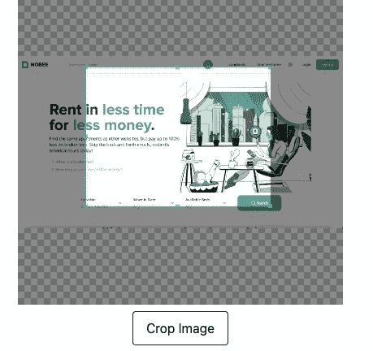

# 在 React 中上传和裁剪您的图像

> 原文：<https://levelup.gitconnected.com/upload-and-crop-your-images-in-react-81ba3bf66523>


在 React 中上传图像

# 介绍

文件上传在网站或应用中非常常见。我们几乎每天都上传图片、视频和文档。

在互联网上，有成千上万的关于如何用多种语言和技术实现图像上传的教程。今天我将写一个简单的指南来演示如何在 React 中处理图片上传

但是上传一张图片是不够的，尤其是头像或封面图片，用户可能想在上传之前或之后裁剪图片

# 图片上传

为了处理图片上传，我们不需要任何插件，库或扩展。我们所需要的只是用`type="file"`输入

```
 <input
     type="file"
     accept="image/png, image/jpeg, image/jpg"
     onChange={getNewAvatarUrl}
 />
```

```
 const getNewAvatarUrl = (e: ChangeEvent<HTMLInputElement>) => {
    if (e.target.files) {
      setNewAvatarUrl(URL.createObjectURL(e.target.files[0]));
    }
  };
```

如您所见，我用`type="file"`创建了一个输入来接收文件，然后只接受图像。

获得图像后，下一步，我们需要为该图像对象创建一个 URL

# 图像裁剪

不幸的是，用 JavaScript 为图像编写裁剪函数需要很大的努力，因为这只是一个简单的指南，我们需要一个库

我选择的图书馆是建在`cropperjs`上的`react-cropper`

```
yarn add react-cropper
```

为了让这个库工作，我们需要导入它和它的 css 文件

```
import Cropper from "react-cropper";
import "cropperjs/dist/cropper.css";
```

使用`Cropper`组件，我们可以传递许多符合我们需求的道具，例如:

```
 <Cropper
        src={avatarUrl}
        style={{ height: 400, width: 400 }}
        initialAspectRatio={4 / 3}
        minCropBoxHeight={100}
        minCropBoxWidth={100}
        guides={false}
        checkOrientation={false}
        onInitialized={(instance) => {
          setCropper(instance);
        }}
      />
      <button onClick={getCropData}>Crop Image</button>
```

```
const getCropData = async () => {
    if (cropper) {
      const file = await fetch(cropper.getCroppedCanvas().toDataURL())
        .then((res) => res.blob())
        .then((blob) => {
          return new File([blob], "newAvatar.png", { type: "image/png" });
        });
      if (file) {
        authService
          .uploadAvatar(userId, file)
          .then(() => {
            refetchUser(userId);
            cancelEdit();
          })
          .catch((e) => alert(e));
      }
    }
  };
```



裁剪时的结果

你可以看到，我传递了图像的网址，我们已经选择了它与输入，定义比例。

设置最小裁剪宽度和高度。然后从裁剪好的画布中，我们可以获得 blob，设置文件名并将其上传到我们的服务中

# 结论

在本文中，我向您展示了如何从您的文件中选择图像，裁剪它，设置文件名和类型，然后将图像上传到您的服务。

如果你发现上面有什么不清楚的地方，你可以在这里查看源代码

# 遗言

虽然我的内容对每个人都是免费的，但是如果你觉得这篇文章有帮助，[你可以在这里给我买杯咖啡](https://www.buymeacoffee.com/kylele19)