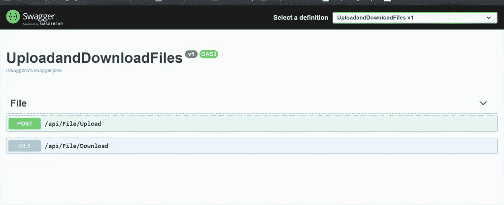
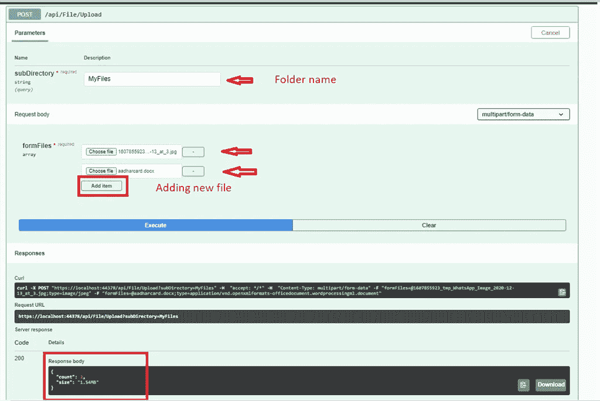
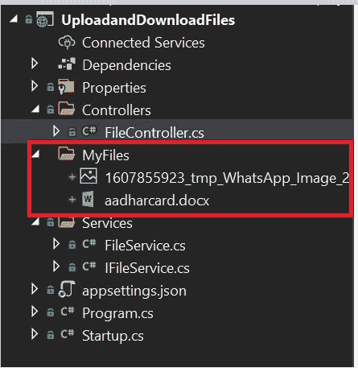
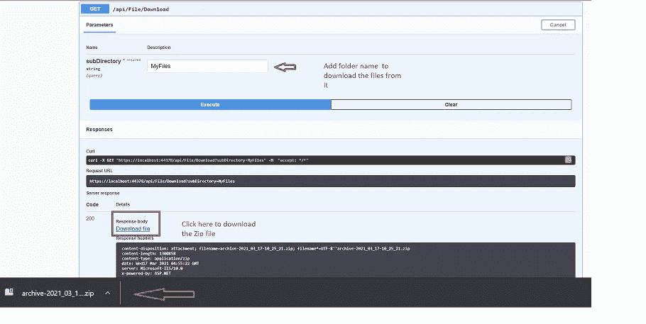

# 使用上传和下载多个文件。Net 5.0 Web API

> 原文：<https://levelup.gitconnected.com/upload-and-download-multiple-files-using-net-5-0-web-api-430f95f34237>

多文件上传-下载

今天，我们将通过一个简单的过程，介绍如何使用 ASP.Net 核心 5.0 web API 上传和下载多个文件。

**注意:**同样的技术也适用于。Net Core 3.1 和。Net Core 2.1 也是如此。

首先在 visual studio 中创建一个空的 web API 项目，对于目标，框架选择**。Net 5.0。**

这个项目中没有使用外部包。

创建一个服务文件夹，并在其中创建一个文件服务类和 IFileService 接口。

我们在这个文件 Service.cs 中使用了三种方法

*   上传文件
*   下载文件
*   尺寸转换器

因为我们需要一个文件夹来存储这些上传的文件，这里我们添加了一个参数来传递文件夹名作为一个字符串，它将在那里存储所有这些文件。

**文件服务. cs**

SizeConverter 函数用于获取上传到服务器的文件的实际大小。

**IFileService.cs**

让我们在 startup.cs 文件中添加这个服务依赖项

**Startup.cs**

创建一个 FileController &现在使用这个 FileController 中的构造函数注入来注入这个 IFileService。

**文件控制器. cs**

我们可以在 swagger 和 postman 中测试我们的 API。

图一

这里我们看到我们创建的两个 API，分别用于上传和下载，所以让我们分别测试这两个 API。

图二

传递子目录中的文件夹名称，并在下面添加文件，以保存在服务器中的文件夹名称下。作为响应，我们会看到文件总数和整个文件的实际大小。

图三

现在，将使用下载 API 进行检查。由于我们的文件夹中有多个文件，它将作为一个 **Zip 文件**下载，我们需要提取它来检查文件。

图 4

***源代码***

 [## JayKrishnareddy/UploadandDownloadFiles

### 此时您不能执行该操作。您已使用另一个标签页或窗口登录。您已在另一个选项卡中注销，或者…

github.com](https://github.com/JayKrishnareddy/UploadandDownloadFiles) 

**结论**

希望这篇文章能让你清楚地理解使用。Net 5.0。

谢谢你坚持到最后，也谢谢你的阅读。请在评论区告诉我你的问题、想法或反馈。感谢您的反馈和鼓励。

….继续学习！！！